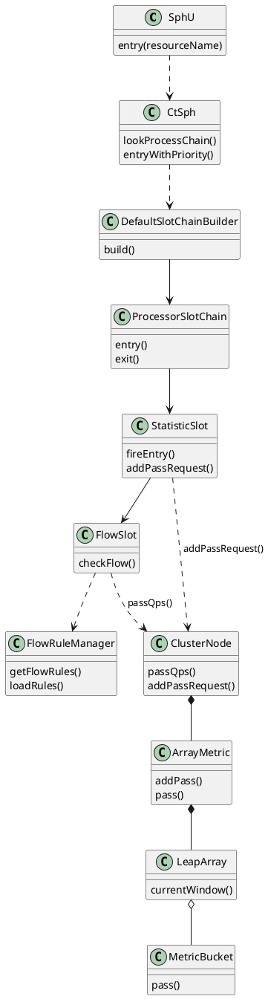
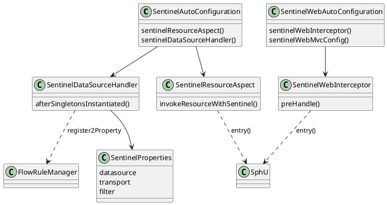

**Sentinel** is Alibaba's flow-control and circuit-breaking library. In Spring Cloud it ships as **`spring-cloud-starter-alibaba-sentinel`**, which registers web filters, annotation AOP, and dynamic rule datasources on top of the core **`SphU.entry`** slot chain. This post traces QPS limiting in the Sentinel core and how the starter wires it into a Spring Boot app.
<!--more-->

Related: [NACOS](../nacos/).

---

## 1. Overview

Sentinel protects a **resource** (URL, method name, remote call) with rules loaded at runtime. For **QPS flow control**, each protected call passes through a fixed **processor slot chain**; **`FlowSlot`** compares rolling QPS against a **`FlowRule`** and throws **`FlowException`** when the threshold is exceeded.

| Layer | Role |
|-------|------|
| **Sentinel core** (`sentinel-core`) | Entry API, slot chain, metrics window, rule managers |
| **Adapters** (WebMVC, Gateway, AspectJ, Feign) | Turn HTTP / annotations / RPC into `SphU.entry(resourceName)` |
| **Spring Cloud starter** | Auto-config, `SentinelProperties`, datasource → `FlowRuleManager` |
| **Dashboard / Nacos** | Push or store JSON rule sets |

The starter does **not** reimplement flow control; every path ends at **`SphU.entry`**.

---

## 2. Architecture

### 2.1 Entry and slot chain

A call begins at **`SphU.entry(name)`**, which delegates to **`CtSph`**. **`lookProcessChain`** returns a cached **`ProcessorSlotChain`** per resource (built once by **`DefaultSlotChainBuilder`** via SPI).

Default slot order (by `@Spi(order)`):

```text
NodeSelectorSlot → ClusterBuilderSlot → LogSlot → StatisticSlot
  → AuthoritySlot → SystemSlot → FlowSlot → DefaultCircuitBreakerSlot → DegradeSlot
```

For QPS limits the important pair is **`StatisticSlot`** then **`FlowSlot`**.



**Design note.** In **`StatisticSlot.entry()`**, the slot calls **`fireEntry()` first** (downstream slots including **`FlowSlot`** run before metrics for *this* request are incremented). QPS checks therefore use statistics from **already-finished** requests in the sliding window, then the current pass is recorded if **`FlowSlot`** allows it.

### 2.2 QPS measurement and check

**`ClusterNode`** holds an **`ArrayMetric`** backed by **`LeapArray<MetricBucket>`** (default: 1 s window, 2 buckets of 500 ms).

- **Write (after pass):** **`StatisticSlot`** → **`node.addPassRequest(count)`** → **`MetricBucket.addPass`**
- **Read (in FlowSlot):** **`DefaultController.canPass()`** → **`node.passQps()`** = sum of bucket **`pass`** counts / window seconds

**`FlowRule`** fields for QPS:

| Field | Meaning |
|-------|---------|
| **`resource`** | Resource name (must match `SphU.entry`) |
| **`grade`** | `RuleConstant.FLOW_GRADE_QPS` (= 1) |
| **`count`** | Max QPS threshold |
| **`controlBehavior`** | `DEFAULT` (fast fail), warm-up, rate limiter, etc. |

**`FlowRuleChecker`** loads rules from **`FlowRuleManager.getFlowRules(resource)`**, picks the node (direct / origin / chain strategy), and calls **`rule.getRater().canPass(node, acquireCount)`**. For default QPS behavior the rater is **`DefaultController`**, which rejects when **`passQps() + acquireCount > count`**.

### 2.3 Spring integration layers

Sentinel core lives in the **Sentinel** repository. **Spring Cloud Alibaba** adds Boot auto-configuration on top of adapter JARs already in Sentinel:

| Integration | Class | Effect |
|-------------|-------|--------|
| Web MVC | **`SentinelWebInterceptor`** | `preHandle` → **`ContextUtil.enter`** + **`SphU.entry(url)`** |
| Annotation | **`SentinelResourceAspect`** | `@Around` on **`@SentinelResource`** → **`SphU.entry`** |
| Starter core | **`SentinelAutoConfiguration`** | Registers aspect, datasource handler, JSON/XML rule converters |
| Web starter | **`SentinelWebAutoConfiguration`** | Registers interceptor + block handler |
| Rules | **`SentinelDataSourceHandler`** | Binds `spring.cloud.sentinel.datasource.*` → **`ReadableDataSource`** → **`FlowRuleManager`** |



**`SentinelAutoConfiguration`** is gated by **`spring.cloud.sentinel.enabled=true`** (default). It always exposes **`SentinelResourceAspect`** and **`SentinelDataSourceHandler`**. **`SentinelWebAutoConfiguration`** (servlet apps) registers **`SentinelWebInterceptor`** when **`spring.cloud.sentinel.filter.enabled`** is true (default).

On each HTTP request, **`AbstractSentinelInterceptor.preHandle`** (conceptually):

1. Resolve **resource name** from URL (optionally prefixed with HTTP method).
2. **`ContextUtil.enter(contextName, origin)`**
3. **`Entry entry = SphU.entry(resourceName, COMMON_WEB, IN)`**
4. On **`BlockException`**, invoke **`BlockExceptionHandler`** (default 429) and abort the handler chain.

---

## 3. Implementation

### 3.1 QPS limit call flow

1. **`SphU.entry("GET:/api/order")`**
2. **`CtSph.lookProcessChain`** → cached chain for that resource
3. **`NodeSelectorSlot` / `ClusterBuilderSlot`** — attach **`ClusterNode`**
4. **`StatisticSlot.entry`** — **`fireEntry()`** downstream
5. **`FlowSlot.entry`** — **`FlowRuleChecker.checkFlow`**
6. For each **`FlowRule`** with **`grade == FLOW_GRADE_QPS`**: **`DefaultController.canPass`** reads **`node.passQps()`** from the sliding window
7. If over **`count`**, throw **`FlowException`** → Spring block handler
8. Otherwise **`fireEntry`** continues; on return, **`StatisticSlot`** calls **`addPassRequest(1)`**
9. Business code runs; **`entry.exit()`** records RT and thread count

### 3.2 How the starter loads rules

At context refresh, **`SentinelDataSourceHandler.afterSingletonsInstantiated()`** walks **`spring.cloud.sentinel.datasource`**. For each entry it builds a **`ReadableDataSource`** bean (file, Nacos, etc.), converts JSON/XML to **`List<FlowRule>`**, and registers a listener on **`FlowRuleManager`**. When Nacos or a local file changes, rules hot-reload without restart.

**`FlowRuleUtil.buildFlowRuleMap`** validates rules and attaches a **`TrafficShapingController`** (`DefaultController` for QPS + fast fail) before rules enter memory.

### 3.3 Complete configuration example

**Maven** (from Spring Cloud Alibaba sentinel-core-example):

```xml
<dependency>
  <groupId>com.alibaba.cloud</groupId>
  <artifactId>spring-cloud-starter-alibaba-sentinel</artifactId>
</dependency>
<dependency>
  <groupId>com.alibaba.cloud</groupId>
  <artifactId>spring-cloud-alibaba-sentinel-datasource</artifactId>
</dependency>
<dependency>
  <groupId>org.springframework.boot</groupId>
  <artifactId>spring-boot-starter-web</artifactId>
</dependency>
```

**`application.yml`** — dashboard, file + Nacos flow rules, block page, eager init:

```yaml
spring:
  application:
    name: order-service
  cloud:
    sentinel:
      enabled: true
      eager: true                    # init transport before first request
      transport:
        dashboard: localhost:8080    # Sentinel Dashboard
        port: 8719                   # client port for dashboard API
      filter:
        enabled: true                # SentinelWebInterceptor
        url-patterns: /**
      http-method-specify: true      # resource = GET:/api/order not /api/order
      block-page: /errorPage         # redirect when blocked (optional)
      datasource:
        ds-file:
          file:
            file: classpath:flowrule.json
            data-type: json
            rule-type: flow
        ds-nacos:
          nacos:
            server-addr: 127.0.0.1:8848
            data-id: order-service-flow-rules
            group-id: SENTINEL_GROUP
            data-type: json
            rule-type: flow

server:
  port: 8080
```

**`flowrule.json`** — QPS = 100 on `/api/order`, fast fail:

```json
[
  {
    "resource": "GET:/api/order",
    "limitApp": "default",
    "grade": 1,
    "count": 100,
    "strategy": 0,
    "controlBehavior": 0
  }
]
```

Field values: **`grade: 1`** = QPS; **`controlBehavior: 0`** = reject immediately; **`strategy: 0`** = direct (limit this resource only). With **`http-method-specify: true`**, the resource name must include the verb prefix to match the interceptor.

**Optional annotation path** (same core entry, explicit resource name):

```java
@RestController
public class OrderController {

    @GetMapping("/api/order")
    @SentinelResource(value = "getOrder", blockHandler = "handleBlock")
    public Order getOrder(@RequestParam Long id) {
        return orderService.find(id);
    }

    public Order handleBlock(Long id, BlockException ex) {
        throw new ResponseStatusException(HttpStatus.TOO_MANY_REQUESTS);
    }
}
```

**`@SentinelResource`** is handled by **`SentinelResourceAspect`** (bean from **`SentinelAutoConfiguration`**). The web filter and the annotation can protect different resource names on the same endpoint; avoid duplicating limits unless intentional.

### 3.4 Verifying QPS limit

1. Start **Sentinel Dashboard** on `8080`, app on `8080`/`8719` as configured.
2. Confirm **`order-service`** appears in Dashboard → cluster machine list.
3. Flow rules from file/Nacos appear under **流控规则**.
4. Load test `GET /api/order`; when QPS > 100, responses hit **`DefaultBlockExceptionHandler`** (HTTP 429) or **`block-page`**.

Runtime metrics for a resource are also exposed on the embedded command port (`curl localhost:8719/cnode?id=<resource>`): **`pass`** / **`block`** columns reflect the same **`LeapArray`** counters **`FlowSlot`** uses.
