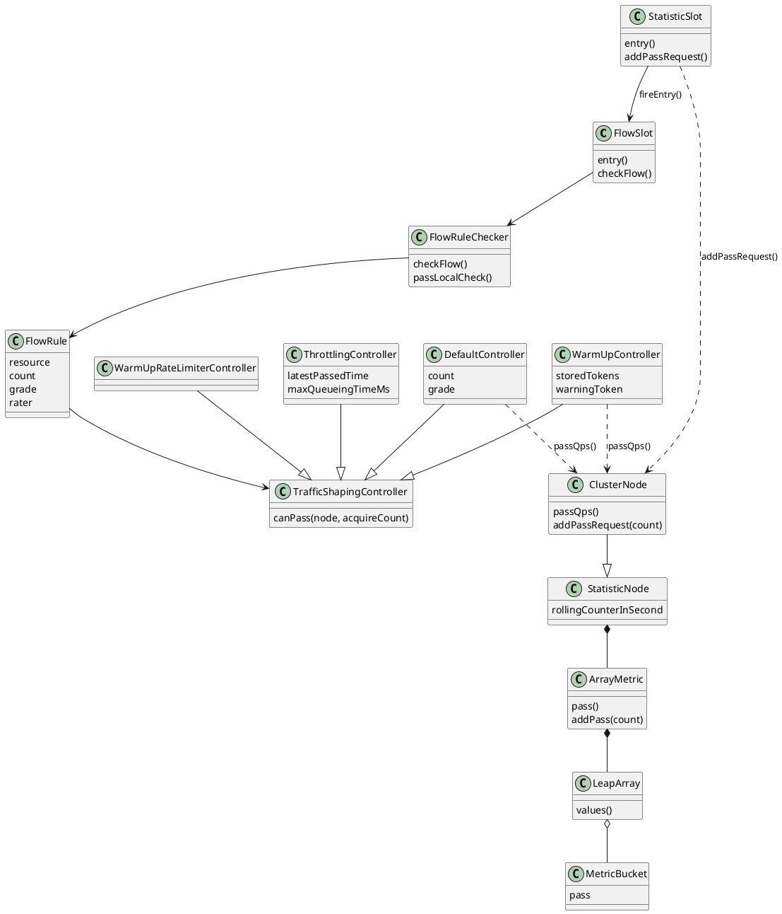
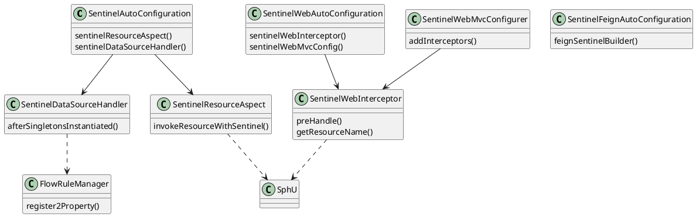
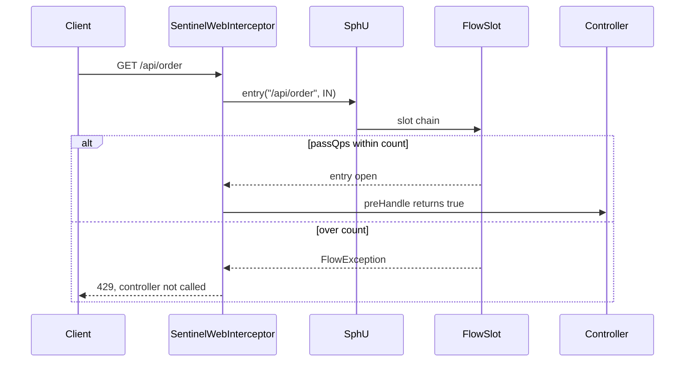

**Sentinel** is Alibaba's library for flow control, concurrency limiting, circuit breaking, and system protection. An application protects a named **resource** by entering it through **`SphU.entry`**. A processor slot chain records statistics for that resource and applies the rules loaded at runtime.
<!--more-->

---

## 1. Overview

A resource is a string chosen by the caller: an HTTP path, a service method, or any other name. **`SphU.entry(resourceName)`** opens the resource and **`entry.exit()`** closes it. Between those two calls, Sentinel runs a **`ProcessorSlotChain`** built once per resource.

Each slot has one job. **`StatisticSlot`** maintains counters. **`FlowSlot`** applies flow rules. Other slots apply authority rules, system rules, and circuit-breaking rules. Rules live in managers such as **`FlowRuleManager`** and can be replaced without restarting the process.


A rejected call never reaches the business method. **`entry.exit()`** still runs on both paths.

In a Spring application the usual entry is **`spring-cloud-starter-alibaba-sentinel`**. The starter registers **`SentinelResourceAspect`**, which wraps methods annotated with **`@SentinelResource`**. The annotation value is the resource name. On **`BlockException`** the aspect calls the **`blockHandler`** method instead of the business method.

```java
@RestController
public class OrderController {

    @GetMapping("/api/order")
    @SentinelResource(value = "getOrder", blockHandler = "handleBlock")
    public Order getOrder(@RequestParam Long id) {
        return orderService.find(id);
    }

    public Order handleBlock(Long id, BlockException ex) {
        throw new ResponseStatusException(HttpStatus.TOO_MANY_REQUESTS);
    }
}
```

**`handleBlock`** must be on the same class and must repeat the business parameters, with **`BlockException`** added at the end. The aspect turns that annotation into the same entry the core API uses:

```java
entry = SphU.entry("getOrder", resourceType, entryType, args);
return pjp.proceed();
```

A rule loaded for the resource **`getOrder`** therefore applies to **`OrderController.getOrder`**. The HTTP path and the resource name are independent: the web interceptor, when enabled, protects the URL under its own resource name.

---

## 2. Flow control

A **`FlowRule`** selects one mode on each of three axes: what is counted, which node is measured, and what happens when the threshold is exceeded. **`FlowSlot`** then runs that choice. The controller attached to the rule performs the comparison.

### 2.1 Modes

**Grade** chooses the metric.

| **`grade`** | Constant | Metric |
|-------------|----------|--------|
| 1 | **`FLOW_GRADE_QPS`** | **`passQps()`** over the recent window |
| 0 | **`FLOW_GRADE_THREAD`** | **`curThreadNum()`**, threads currently inside the resource |

**Strategy** chooses the node those metrics are read from. Sentinel calls this the flow-control mode.

| **`strategy`** | Constant | Node |
|----------------|----------|------|
| 0 | **`STRATEGY_DIRECT`** | This resource. With **`limitApp=default`**, that is **`ClusterNode`**. |
| 1 | **`STRATEGY_RELATE`** | **`ClusterNode`** of **`refResource`**. This resource is limited by the related resource's traffic. |
| 2 | **`STRATEGY_CHAIN`** | This resource's node, and only when the context name equals **`refResource`**. Any other context skips the rule. |

**Control behavior** chooses the effect after a QPS rule is over threshold. It applies only when **`grade`** is QPS. A thread-count rule always uses **`DefaultController`**.

| **`controlBehavior`** | Constant | Controller | Effect |
|-----------------------|----------|------------|--------|
| 0 | **`CONTROL_BEHAVIOR_DEFAULT`** | **`DefaultController`** | Reject at once |
| 1 | **`CONTROL_BEHAVIOR_WARM_UP`** | **`WarmUpController`** | Allow less than **`count`** while the resource is cold |
| 2 | **`CONTROL_BEHAVIOR_RATE_LIMITER`** | **`ThrottlingController`** | Queue until the next even interval, or reject if the wait exceeds **`maxQueueingTimeMs`** |
| 3 | **`CONTROL_BEHAVIOR_WARM_UP_RATE_LIMITER`** | **`WarmUpRateLimiterController`** | Warm-up threshold, then the same queue |

**`FlowRuleUtil.generateRater`** builds that controller when the rule is loaded. **`FlowRuleChecker`** selects the node from **`strategy`**, then calls **`rater.canPass`**.

### 2.2 Implementation

**`StatisticSlot`** stands in front of **`FlowSlot`**, but it counts a pass only after the downstream slots return. Every mode therefore sees calls that have already passed, not the call being judged. A rejected call increments **block** and does not increment **pass**.


```plantuml
@startuml
class FlowSlot {
  entry()
  checkFlow()
}

class FlowRuleChecker {
  checkFlow()
  passLocalCheck()
}

class FlowRule {
  resource
  count
  grade
  rater
}

class TrafficShapingController {
  canPass(node, acquireCount)
}

class DefaultController {
  count
  grade
}

class WarmUpController {
  storedTokens
  warningToken
}

class ThrottlingController {
  latestPassedTime
  maxQueueingTimeMs
}

class WarmUpRateLimiterController {
}

class StatisticSlot {
  entry()
  addPassRequest()
}

class ClusterNode {
  passQps()
  addPassRequest(count)
}

class StatisticNode {
  rollingCounterInSecond
}

class ArrayMetric {
  pass()
  addPass(count)
}

class LeapArray {
  values()
}

class MetricBucket {
  pass
}

FlowSlot --> FlowRuleChecker
FlowRuleChecker --> FlowRule
FlowRule --> TrafficShapingController
DefaultController --|> TrafficShapingController
WarmUpController --|> TrafficShapingController
ThrottlingController --|> TrafficShapingController
WarmUpRateLimiterController --|> TrafficShapingController
StatisticSlot --> FlowSlot : fireEntry()
DefaultController ..> ClusterNode : passQps()
WarmUpController ..> ClusterNode : passQps()
StatisticSlot ..> ClusterNode : addPassRequest()
ClusterNode --|> StatisticNode
StatisticNode *-- ArrayMetric
ArrayMetric *-- LeapArray
LeapArray o-- MetricBucket
@enduml
```

**`StatisticSlot`** stands in front of **`FlowSlot`**, but it counts a pass only after the downstream slots return. The QPS check therefore sees calls that have already passed, not the call being judged.

```java
public void entry(...) throws Throwable {
    try {
        fireEntry(context, resourceWrapper, node, count, prioritized, args);
        node.increaseThreadNum();
        node.addPassRequest(count);
    } catch (BlockException e) {
        context.getCurEntry().setBlockError(e);
        node.increaseBlockQps(count);
        throw e;
    }
}
```

**`FlowSlot`** delegates to **`FlowRuleChecker`**. If any rule refuses the call, the checker throws **`FlowException`**.

```java
public void entry(...) throws Throwable {
    checkFlow(resourceWrapper, context, node, count, prioritized);
    fireEntry(context, resourceWrapper, node, count, prioritized, args);
}

public void checkFlow(...) throws BlockException {
    Collection<FlowRule> rules = ruleProvider.apply(resource.getName());
    if (rules != null) {
        for (FlowRule rule : rules) {
            if (!canPassCheck(rule, context, node, count, prioritized)) {
                throw new FlowException(rule.getLimitApp(), rule);
            }
        }
    }
}
```

For a local rule with **`limitApp = default`** and direct strategy, the selected node is the resource's **`ClusterNode`**. **`DefaultController.canPass`** rejects when the truncated pass rate plus this call's **`acquireCount`** exceeds **`count`**. **`SphU.entry(name)`** uses **`acquireCount = 1`**.

```java
public boolean canPass(Node node, int acquireCount, boolean prioritized) {
    int curCount = avgUsedTokens(node);
    if (curCount + acquireCount > count) {
        return false;
    }
    return true;
}

private int avgUsedTokens(Node node) {
    if (node == null) {
        return 0;
    }
    return grade == RuleConstant.FLOW_GRADE_THREAD
        ? node.curThreadNum()
        : (int) (node.passQps());
}
```

**`passQps()`** is the **`pass`** total of the live one-second window divided by the window length in seconds. The default window is 1000 ms split into two buckets of 500 ms. **`ArrayMetric.pass()`** sums buckets that are still inside that interval.

```java
public double passQps() {
    return rollingCounterInSecond.pass() / rollingCounterInSecond.getWindowIntervalInSec();
}

public void addPassRequest(int count) {
    rollingCounterInSecond.addPass(count);
    rollingCounterInMinute.addPass(count);
}
```

The minute counter is updated together with the second counter, but **`passQps()`** reads only the one-second metric.

A direct fast-fail rule of 20 QPS is loaded as follows. **`FlowRuleUtil.generateRater`** then stores a **`DefaultController(20, FLOW_GRADE_QPS)`** on the rule.

```java
FlowRule rule = new FlowRule();
rule.setResource("getOrder");
rule.setCount(20);
rule.setGrade(RuleConstant.FLOW_GRADE_QPS);
rule.setStrategy(RuleConstant.STRATEGY_DIRECT);
rule.setControlBehavior(RuleConstant.CONTROL_BEHAVIOR_DEFAULT);
rule.setLimitApp(RuleConstant.LIMIT_APP_DEFAULT);
FlowRuleManager.loadRules(Collections.singletonList(rule));
```

Suppose the two live buckets hold 12 and 8 passes. Their sum is 20, the divisor is 1 second, and **`passQps`** is 20. The next call computes `20 + 1 > 20`, throws **`FlowException`**, and **`StatisticSlot`** increments **block** without calling **`addPassRequest`**. After the bucket of 12 falls outside the 1000 ms interval, **`passQps`** drops to 8 and a new call is admitted.

The comparison and **`addPassRequest`** are separate steps. Concurrent callers can both observe a rate under **`count`** and both pass, so the window can briefly exceed the threshold.

Thread-count mode uses the same **`DefaultController`**, but **`avgUsedTokens`** reads **`curThreadNum()`** instead of **`passQps()`**. The call is rejected when the number of threads already inside the resource plus **`acquireCount`** exceeds **`count`**.

**`WarmUpController`** keeps a token balance, **`storedTokens`**. While that balance is at or above **`warningToken`**, the allowed rate is a slope below **`count`**. Once the balance drops under the warning line, the check is the same as fast-fail: **`passQps + acquireCount <= count`**.

```java
long restToken = storedTokens.get();
if (restToken >= warningToken) {
    long aboveToken = restToken - warningToken;
    double warningQps = Math.nextUp(1.0 / (aboveToken * slope + 1.0 / count));
    return passQps + acquireCount <= warningQps;
}
return passQps + acquireCount <= count;
```

**`ThrottlingController`** does not read **`passQps`**. It spaces passes by **`statDurationMs * acquireCount / count`** (the default stat duration is 1000 ms). If the next slot is already due, the call passes. If the wait is longer than **`maxQueueingTimeMs`**, the call is rejected. Otherwise the caller sleeps until that slot.

```java
long costTime = Math.round(1.0d * statDurationMs * acquireCount / count);
long expectedTime = costTime + latestPassedTime.get();
if (expectedTime <= currentTime) {
    latestPassedTime.set(currentTime);
    return true;
}
long waitTime = expectedTime - currentTime;
if (waitTime > maxQueueingTimeMs) {
    return false;
}
```

**`WarmUpRateLimiterController`** applies the warm-up ceiling first and then the same queue. **`FlowRuleChecker`** still selects the node before any of these **`canPass`** methods run, so relate mode and chain mode change which **`ClusterNode`** is passed in, not the arithmetic inside the controller.

---

## 3. Spring and Spring Cloud integration

**`spring-cloud-starter-alibaba-sentinel`** registers the beans that turn Spring calls into **`SphU.entry`**. It does not replace **`FlowSlot`**. A rule still rejects a call by the QPS check in section 2; the starter only chooses the resource name, opens the entry, and maps **`BlockException`** to an HTTP or fallback result.

**`SentinelAutoConfiguration`** is active when **`spring.cloud.sentinel.enabled`** is true or omitted. It exposes **`SentinelResourceAspect`** and **`SentinelDataSourceHandler`**. On a servlet application, **`SentinelWebAutoConfiguration`** adds **`SentinelWebInterceptor`** when **`spring.cloud.sentinel.filter.enabled`** is true or omitted. Feign and Spring Cloud Gateway are separate switches.


```plantuml
@startuml
class SentinelAutoConfiguration {
  sentinelResourceAspect()
  sentinelDataSourceHandler()
}

class SentinelWebAutoConfiguration {
  sentinelWebInterceptor()
  sentinelWebMvcConfig()
}

class SentinelWebMvcConfigurer {
  addInterceptors()
}

class SentinelResourceAspect {
  invokeResourceWithSentinel()
}

class SentinelWebInterceptor {
  preHandle()
  getResourceName()
}

class SentinelDataSourceHandler {
  afterSingletonsInstantiated()
}

class SentinelFeignAutoConfiguration {
  feignSentinelBuilder()
}

class FlowRuleManager {
  register2Property()
}

SentinelAutoConfiguration --> SentinelResourceAspect
SentinelAutoConfiguration --> SentinelDataSourceHandler
SentinelWebAutoConfiguration --> SentinelWebInterceptor
SentinelWebMvcConfigurer --> SentinelWebInterceptor
SentinelDataSourceHandler ..> FlowRuleManager
SentinelResourceAspect ..> SphU
SentinelWebInterceptor ..> SphU
@enduml
```

### 3.1 Inbound HTTP

**`SentinelWebMvcConfigurer`** registers the interceptor for **`spring.cloud.sentinel.filter.url-patterns`**, which defaults to **`/**`**. On each request **`preHandle`** resolves the resource, enters a context, and opens an inbound entry. **`BlockException`** is handled and the interceptor returns false, so the controller method is not called.

```java
String resourceName = getResourceName(request);
String origin = parseOrigin(request);
ContextUtil.enter(contextName, origin);
Entry entry = SphU.entry(resourceName, ResourceTypeConstants.COMMON_WEB, EntryType.IN);
```

The resource name is Spring MVC's best matching pattern, such as **`/api/order`**. **`http-method-specify`** defaults to false. When it is set to true, the name becomes **`GET:/api/order`**. A **`UrlCleaner`** bean, if present, rewrites the pattern before that prefix is added.

If the application defines a **`BlockExceptionHandler`**, that bean is used. Otherwise a configured **`spring.cloud.sentinel.block-page`** sends a redirect. With neither, **`DefaultBlockExceptionHandler`** sets HTTP 429.


```mermaid
sequenceDiagram
    participant Client
    participant SentinelWebInterceptor
    participant SphU
    participant FlowSlot
    participant Controller

    Client->>SentinelWebInterceptor: GET /api/order
    SentinelWebInterceptor->>SphU: entry("/api/order", IN)
    SphU->>FlowSlot: slot chain
    alt passQps within count
        FlowSlot-->>SentinelWebInterceptor: entry open
        SentinelWebInterceptor->>Controller: preHandle returns true
    else over count
        FlowSlot-->>SentinelWebInterceptor: FlowException
        SentinelWebInterceptor-->>Client: 429, controller not called
    end
```

The annotation on **`getOrder`** is a second entry, named **`getOrder`**, opened by **`SentinelResourceAspect`** only if the interceptor let the request through. A flow rule on **`/api/order`** and a flow rule on **`getOrder`** are checked separately.

### 3.2 Outbound calls

**`SentinelFeignAutoConfiguration`** replaces Feign's **`Feign.Builder`** only when **`feign.sentinel.enabled`** is true. **`SentinelInvocationHandler`** then enters an outbound resource before the HTTP client runs. The default resource name is the method, the target URL, and the path:

```java
String resourceName = method + ":" + hardCodedTarget.url() + template.path();
ContextUtil.enter(resourceName);
entry = SphU.entry(resourceName, EntryType.OUT, 1, args);
result = methodHandler.invoke(args);
```

**`EntryType.OUT`** marks the call as outbound. The QPS rule still has to use this resource string. A **`fallbackFactory`** on the Feign client is invoked when the entry is blocked.

**`RestTemplate`** is not wrapped globally. **`SentinelBeanPostProcessor`** adds an interceptor only to beans annotated with **`@SentinelRestTemplate`**, and only when **`resttemplate.sentinel.enabled`** is true or omitted.

When Spring Cloud Gateway is on the classpath, **`SentinelSCGAutoConfiguration`** registers **`SentinelGatewayFilter`** unless **`spring.cloud.sentinel.scg.enabled`** is false. That filter is the gateway entry; route-level limits use gateway rules rather than a **`FlowRule`** on a controller name.

### 3.3 Loading rules

**`SentinelDataSourceHandler.afterSingletonsInstantiated`** walks **`spring.cloud.sentinel.datasource`**. Each entry must select one source, such as **`file`** or **`nacos`**. The handler registers a **`ReadableDataSource`** bean and **`postRegister`** attaches its property to the manager for **`rule-type`**:

```java
switch (this.getRuleType()) {
    case FLOW -> FlowRuleManager.register2Property(dataSource.getProperty());
    case DEGRADE -> DegradeRuleManager.register2Property(dataSource.getProperty());
    case SYSTEM -> SystemRuleManager.register2Property(dataSource.getProperty());
    case AUTHORITY -> AuthorityRuleManager.register2Property(dataSource.getProperty());
}
```

JSON and XML are converted by the **`sentinel-json-flow-converter`** style beans created in **`SentinelAutoConfiguration`**. A file of flow rules for the URL resource, matching the interceptor name when the method prefix is off, is:

```yaml
spring:
  cloud:
    sentinel:
      filter:
        enabled: true
      http-method-specify: false
      datasource:
        ds-file:
          file:
            file: classpath:flowrule.json
            data-type: json
            rule-type: flow
```

```json
[
  {
    "resource": "/api/order",
    "limitApp": "default",
    "grade": 1,
    "count": 20,
    "strategy": 0,
    "controlBehavior": 0
  }
]
```

Loading still passes through **`FlowRuleUtil`**, which sets the rater to **`DefaultController`**. After the property updates, **`GET /api/order`** is judged by **`passQps()`** on the cluster node **`/api/order`**, the same comparison as **`SphU.entry("getOrder")`** in section 2.
