---

title: "Sentinel: flow control internals"
date: 2026-08-24T22:00:00+02:00
categories:

- java
- spring-cloud
tags:
- java
- spring-cloud
- sentinel
- flow-control
keywords:
- sentinel

#thumbnailImage: //example.com/image.jpg

---

**Sentinel** is Alibaba's library for flow control, concurrency limiting, circuit breaking, and system protection. An application protects a named **resource** by entering it through `SphU.entry`. A processor slot chain records statistics for that resource and applies the rules loaded at runtime.


---

## 1. Overview

A resource is a string chosen by the caller: an HTTP path, a service method, or any other name. `SphU.entry(resourceName)` opens the resource and `entry.exit()` closes it. Between those two calls, Sentinel runs a `ProcessorSlotChain` built once per resource.

Each slot has one job. `StatisticSlot` maintains counters. `FlowSlot` applies flow rules. Other slots apply authority rules, system rules, and circuit-breaking rules. Rules live in managers such as `FlowRuleManager` and can be replaced without restarting the process.


A rejected call never reaches the business method. `entry.exit()` still runs on both paths.

In a Spring application the usual entry is `spring-cloud-starter-alibaba-sentinel`. The starter registers `SentinelResourceAspect`, which wraps methods annotated with `@SentinelResource`. The annotation value is the resource name. On `BlockException` the aspect calls the `blockHandler` method instead of the business method.

```java
@RestController
public class OrderController {

    @GetMapping("/api/order")
    @SentinelResource(value = "getOrder", blockHandler = "handleBlock")
    public Order getOrder(@RequestParam Long id) {
        return orderService.find(id);
    }

    public Order handleBlock(Long id, BlockException ex) {
        throw new ResponseStatusException(HttpStatus.TOO_MANY_REQUESTS);
    }
}
```

`handleBlock` must be on the same class and must repeat the business parameters, with `BlockException` added at the end. The aspect turns that annotation into the same entry the core API uses:

```java
entry = SphU.entry("getOrder", resourceType, entryType, args);
return pjp.proceed();
```

A rule loaded for the resource `getOrder` therefore applies to `OrderController.getOrder`. The HTTP path and the resource name are independent: the web interceptor, when enabled, protects the URL under its own resource name.

---


## 2. ProcessorSlotChain

The slot chain applies rules to one open resource call. Before it runs, Sentinel needs a `Context` and an `Entry`.

`Context` marks the entrance of the current thread’s call path. The same resource under two entrances is counted separately, and chain-mode flow rules match the context name. The context may also carry an `origin` so authority rules and origin metrics can distinguish callers. It is stored in a `ThreadLocal`. If the application does not call `ContextUtil.enter`, `CtSph` opens the default context.

`Entry` marks one `SphU.entry` … `exit` pair for a resource. It binds that call to its statistic nodes and to the slot chain used on exit. Nested entries form a stack inside the context; `curEntry` is the innermost open call.

The live flow-control status is not stored on the request object. It lives in process memory on `Node` sliding windows. A thread-local `Context` and the current `Entry` only point into that graph for the open call. The call tree holds per-context **`DefaultNode`**s; all contexts of the same resource share one `ClusterNode`, where `passQps`, `blockQps`, and thread count accumulate. `FlowSlot` compares those metrics to `FlowRule` thresholds from `FlowRuleManager`. When the entry exits, the context stack is unwound; the `ClusterNode` windows remain for later calls.

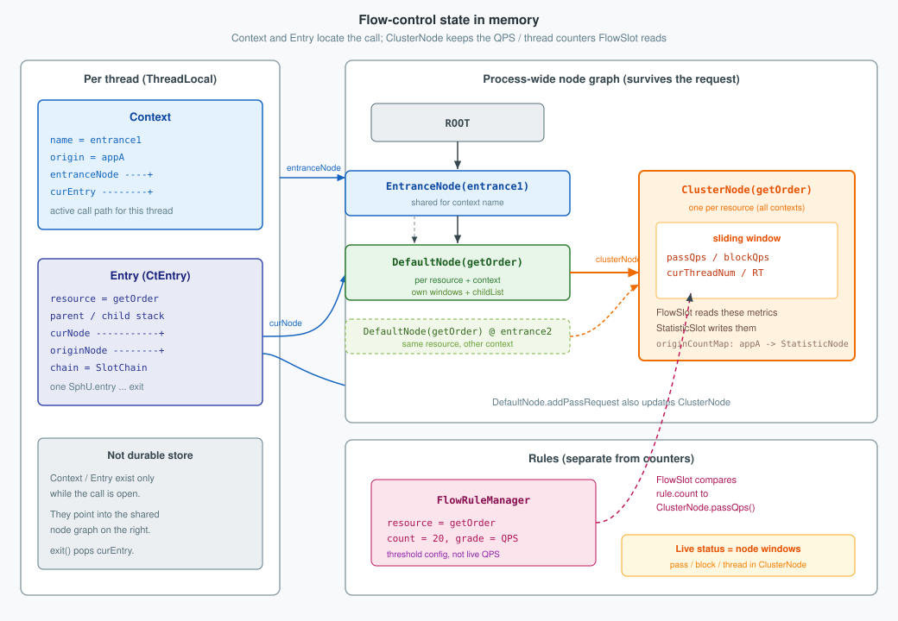

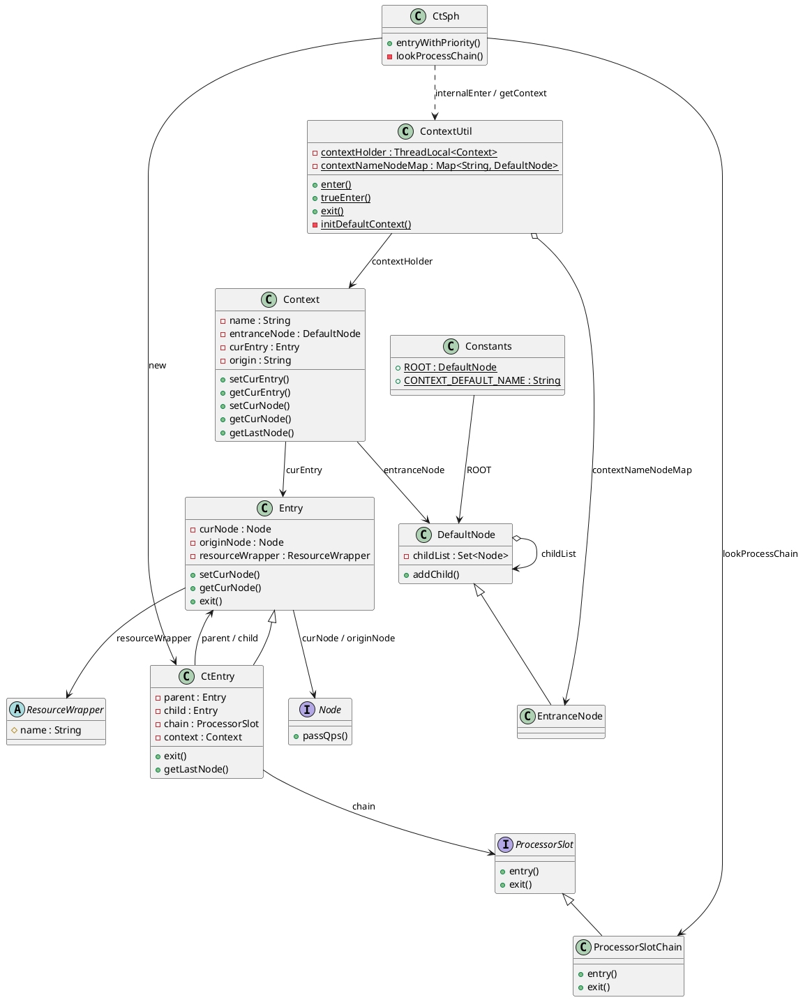
```plantuml
@startuml
class ContextUtil {
  {static} -contextHolder : ThreadLocal<Context>
  {static} -contextNameNodeMap : Map<String, DefaultNode>
  {static} +enter()
  {static} +trueEnter()
  {static} +exit()
  {static} -initDefaultContext()
}

class Context {
  -name : String
  -entranceNode : DefaultNode
  -curEntry : Entry
  -origin : String
  +setCurEntry()
  +getCurEntry()
  +setCurNode()
  +getCurNode()
  +getLastNode()
}

interface Node {
  +passQps()
}

interface ProcessorSlot {
  +entry()
  +exit()
}

class Entry {
  -curNode : Node
  -originNode : Node
  -resourceWrapper : ResourceWrapper
  +setCurNode()
  +getCurNode()
  +exit()
}

class CtEntry {
  -parent : Entry
  -child : Entry
  -chain : ProcessorSlot
  -context : Context
  +exit()
  +getLastNode()
}

class DefaultNode {
  -childList : Set<Node>
  +addChild()
}

class EntranceNode

abstract class ResourceWrapper {
  #name : String
}

class Constants {
  {static} +ROOT : DefaultNode
  {static} +CONTEXT_DEFAULT_NAME : String
}

class CtSph {
  +entryWithPriority()
  -lookProcessChain()
}

class ProcessorSlotChain {
  +entry()
  +exit()
}

Entry <|-- CtEntry
DefaultNode <|-- EntranceNode
ProcessorSlot <|-- ProcessorSlotChain
ContextUtil --> Context : contextHolder
ContextUtil o--> EntranceNode : contextNameNodeMap
Context --> DefaultNode : entranceNode
Context --> Entry : curEntry
CtEntry --> Entry : parent / child
CtEntry --> ProcessorSlot : chain
Entry --> Node : curNode / originNode
Entry --> ResourceWrapper : resourceWrapper
Constants --> DefaultNode : ROOT
DefaultNode o--> DefaultNode : childList
CtSph ..> ContextUtil : internalEnter / getContext
CtSph --> CtEntry : new
CtSph --> ProcessorSlotChain : lookProcessChain
@enduml
```

From class load to an open entry, the process mutates that graph in four steps.

**Step 1 — Default entrance at class load.** `ContextUtil` static init calls `initDefaultContext`: create `EntranceNode(sentinel_default_context)`, attach it under `Constants.ROOT`, register it in `contextNameNodeMap`.

```java
private static void initDefaultContext() {
    String defaultContextName = Constants.CONTEXT_DEFAULT_NAME;
    EntranceNode node = new EntranceNode(
        new StringResourceWrapper(defaultContextName, EntryType.IN), null);
    Constants.ROOT.addChild(node);
    contextNameNodeMap.put(defaultContextName, node);
}
```

State after step 1:

```text
ROOT
 └── EntranceNode(sentinel_default_context)   // also in contextNameNodeMap
ThreadLocal contextHolder: empty
```

**Step 2 — Create the thread** `Context`**.** Explicit `ContextUtil.enter(name, origin)` (custom name) or, on first `SphU.entry` with no context, `InternalContextUtil.internalEnter(CONTEXT_DEFAULT_NAME)`. Both reach `trueEnter`. If `contextHolder` is empty, resolve or create the `EntranceNode` for the name (still under `ROOT`, capped by `MAX_CONTEXT_NAME_SIZE`), then bind a new `Context`:

```java
protected static Context trueEnter(String name, String origin) {
    Context context = contextHolder.get();
    if (context == null) {
        DefaultNode node = contextNameNodeMap.get(name);
        // or create EntranceNode + ROOT.addChild under lock
        context = new Context(node, name);
        context.setOrigin(origin);
        contextHolder.set(context);
    }
    return context;
}
```

State after step 2 (default path, empty origin):

```text
contextHolder → Context {
  name          = sentinel_default_context
  entranceNode  = EntranceNode(sentinel_default_context)
  origin        = ""
  curEntry      = null
}
```

**Step 3 — Resolve the slot chain.** `CtSph.entryWithPriority` loads or builds the `ProcessorSlotChain` for the resource (cached per `ResourceWrapper`, up to `MAX_SLOT_CHAIN_SIZE`):

```java
private Entry entryWithPriority(ResourceWrapper resourceWrapper, int count,
                                boolean prioritized, Object... args)
        throws BlockException {
    Context context = ContextUtil.getContext();
    if (context == null) {
        context = InternalContextUtil.internalEnter(Constants.CONTEXT_DEFAULT_NAME);
    }
    ProcessorSlot<Object> chain = lookProcessChain(resourceWrapper);
    // ...
}
```

State after step 3: context unchanged; `chain` is the linked slot list for this resource (or null if the chain cache is full — then no rule checking).

**Step 4 — Create** `CtEntry` **and push it onto the context.** Construction runs `setUpEntryFor`: link `parent` / `child`, then replace `curEntry`. Only after that does `chain.entry` run (slots then set `curNode` / `originNode`).

```java
CtEntry(ResourceWrapper resourceWrapper, ProcessorSlot<Object> chain,
        Context context, int count, Object[] args) {
    super(resourceWrapper, count, args);
    this.chain = chain;
    this.context = context;
    setUpEntryFor(context);
}

private void setUpEntryFor(Context context) {
    if (context instanceof NullContext) {
        return;
    }
    this.parent = context.getCurEntry();
    if (parent != null) {
        ((CtEntry) parent).child = this;
    }
    context.setCurEntry(this);
}
```

```java
Entry e = new CtEntry(resourceWrapper, chain, context, count, args);
try {
    chain.entry(context, resourceWrapper, null, count, prioritized, args);
} catch (BlockException e1) {
    e.exit(count, args);
    throw e1;
}
```

State after step 4 (first entry in the context, before slots finish):

```text
context.curEntry → CtEntry e1 {
  parent = null
  child  = null
  chain  = ProcessorSlotChain(resource)
  curNode / originNode = null   // set later by NodeSelector / ClusterBuilder
}
```

A second nested `SphU.entry` repeats step 4: `e1.child = e2`, `e2.parent = e1`, `context.curEntry = e2`. On `e2.exit()`, the chain’s `exit` runs, then `curEntry` returns to `e1`.

**Slot chain creation.** The first `SphU.entry` for a resource calls `CtSph.lookProcessChain`, which caches one `ProcessorSlotChain` per `ResourceWrapper` in `chainMap`. Building goes through `SlotChainProvider.newSlotChain` → `DefaultSlotChainBuilder.build` → `SpiLoader.loadInstanceListSorted()` for every `ProcessorSlot`. `NodeSelectorSlot` and `ClusterBuilderSlot` use `@Spi(isSingleton = false)`, so each `build()` allocates a **new** instance (each chain has its own `NodeSelectorSlot.map`). Other default slots are singletons shared across chains.

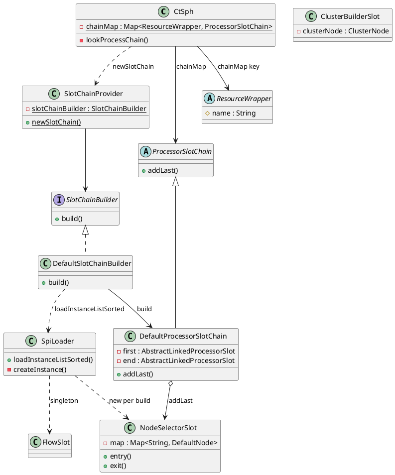
```plantuml
@startuml
class CtSph {
  {static} -chainMap : Map<ResourceWrapper, ProcessorSlotChain>
  -lookProcessChain()
}

interface SlotChainBuilder {
  +build()
}

class SlotChainProvider {
  {static} -slotChainBuilder : SlotChainBuilder
  {static} +newSlotChain()
}

class DefaultSlotChainBuilder {
  +build()
}

class SpiLoader {
  +loadInstanceListSorted()
  -createInstance()
}

abstract class ProcessorSlotChain {
  +addLast()
}

class DefaultProcessorSlotChain {
  -first : AbstractLinkedProcessorSlot
  -end : AbstractLinkedProcessorSlot
  +addLast()
}

class NodeSelectorSlot {
  -map : Map<String, DefaultNode>
  +entry()
  +exit()
}

class ClusterBuilderSlot {
  -clusterNode : ClusterNode
}

class FlowSlot

abstract class ResourceWrapper {
  #name : String
}

ProcessorSlotChain <|-- DefaultProcessorSlotChain
SlotChainBuilder <|.. DefaultSlotChainBuilder
CtSph --> ProcessorSlotChain : chainMap
CtSph --> ResourceWrapper : chainMap key
CtSph ..> SlotChainProvider : newSlotChain
SlotChainProvider --> SlotChainBuilder
DefaultSlotChainBuilder ..> SpiLoader : loadInstanceListSorted
DefaultSlotChainBuilder --> DefaultProcessorSlotChain : build
DefaultProcessorSlotChain o--> NodeSelectorSlot : addLast
SpiLoader ..> NodeSelectorSlot : new per build
SpiLoader ..> FlowSlot : singleton
@enduml
```

```java
ProcessorSlot<Object> lookProcessChain(ResourceWrapper resourceWrapper) {
    ProcessorSlotChain chain = chainMap.get(resourceWrapper);
    if (chain == null) {
        synchronized (LOCK) {
            chain = chainMap.get(resourceWrapper);
            if (chain == null) {
                if (chainMap.size() >= Constants.MAX_SLOT_CHAIN_SIZE) {
                    return null;
                }
                chain = SlotChainProvider.newSlotChain();
                Map<ResourceWrapper, ProcessorSlotChain> newMap =
                    new HashMap<ResourceWrapper, ProcessorSlotChain>(chainMap.size() + 1);
                newMap.putAll(chainMap);
                newMap.put(resourceWrapper, chain);
                chainMap = newMap;
            }
        }
    }
    return chain;
}
```

```java
public static ProcessorSlotChain newSlotChain() {
    if (slotChainBuilder != null) {
        return slotChainBuilder.build();
    }
    slotChainBuilder = SpiLoader.of(SlotChainBuilder.class).loadFirstInstanceOrDefault();
    if (slotChainBuilder == null) {
        slotChainBuilder = new DefaultSlotChainBuilder();
    }
    return slotChainBuilder.build();
}
```

```java
@Override
public ProcessorSlotChain build() {
    ProcessorSlotChain chain = new DefaultProcessorSlotChain();
    List<ProcessorSlot> sortedSlotList =
        SpiLoader.of(ProcessorSlot.class).loadInstanceListSorted();
    for (ProcessorSlot slot : sortedSlotList) {
        if (!(slot instanceof AbstractLinkedProcessorSlot)) {
            continue;
        }
        chain.addLast((AbstractLinkedProcessorSlot<?>) slot);
    }
    return chain;
}
```

```java
private S createInstance(Class<? extends S> clazz, boolean singleton) {
    if (singleton) {
        S instance = singletonMap.get(clazz.getName());
        if (instance == null) {
            synchronized (this) {
                instance = singletonMap.get(clazz.getName());
                if (instance == null) {
                    instance = service.cast(clazz.newInstance());
                    singletonMap.put(clazz.getName(), instance);
                }
            }
        }
        return instance;
    } else {
        return service.cast(clazz.newInstance());
    }
}
```

```java
@Spi(isSingleton = false, order = Constants.ORDER_NODE_SELECTOR_SLOT)
public class NodeSelectorSlot extends AbstractLinkedProcessorSlot<Object> {
    private volatile Map<String, DefaultNode> map = new HashMap<String, DefaultNode>(10);
    // ...
}
```

So `getOrder` and `/api/order` each own a `NodeSelectorSlot` and a `map`. The default context name does not collide across resources. The linked slots in default order:

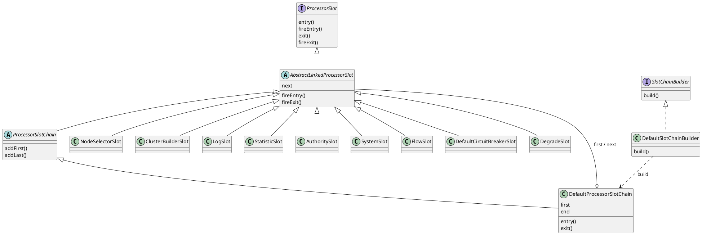
```plantuml
@startuml
interface ProcessorSlot {
  entry()
  fireEntry()
  exit()
  fireExit()
}

abstract class AbstractLinkedProcessorSlot {
  next
  fireEntry()
  fireExit()
}

abstract class ProcessorSlotChain {
  addFirst()
  addLast()
}

class DefaultProcessorSlotChain {
  first
  end
  entry()
  exit()
}

interface SlotChainBuilder {
  build()
}

class DefaultSlotChainBuilder {
  build()
}

class NodeSelectorSlot
class ClusterBuilderSlot
class LogSlot
class StatisticSlot
class AuthoritySlot
class SystemSlot
class FlowSlot
class DefaultCircuitBreakerSlot
class DegradeSlot

ProcessorSlot <|.. AbstractLinkedProcessorSlot
AbstractLinkedProcessorSlot <|-- ProcessorSlotChain
ProcessorSlotChain <|-- DefaultProcessorSlotChain
AbstractLinkedProcessorSlot <|-- NodeSelectorSlot
AbstractLinkedProcessorSlot <|-- ClusterBuilderSlot
AbstractLinkedProcessorSlot <|-- LogSlot
AbstractLinkedProcessorSlot <|-- StatisticSlot
AbstractLinkedProcessorSlot <|-- AuthoritySlot
AbstractLinkedProcessorSlot <|-- SystemSlot
AbstractLinkedProcessorSlot <|-- FlowSlot
AbstractLinkedProcessorSlot <|-- DefaultCircuitBreakerSlot
AbstractLinkedProcessorSlot <|-- DegradeSlot
SlotChainBuilder <|.. DefaultSlotChainBuilder
DefaultSlotChainBuilder ..> DefaultProcessorSlotChain : build
DefaultProcessorSlotChain o-- AbstractLinkedProcessorSlot : first / next
@enduml
```

| Order  | Slot                        | Role                                                                                 |
| ------ | --------------------------- | ------------------------------------------------------------------------------------ |
| −10000 | `NodeSelectorSlot`          | Create or select the per-context `DefaultNode` and set it as the current node.       |
| −9000  | `ClusterBuilderSlot`        | Attach the resource-global `ClusterNode` (and origin node when present).             |
| −8000  | `LogSlot`                   | Log `BlockException` through EagleEye; keep exit cleanup going on unexpected errors. |
| −7000  | `StatisticSlot`             | Record pass / block / RT / thread metrics around the rule slots that follow.         |
| −6000  | `AuthoritySlot`             | Enforce black/white origin (`AuthorityRule`).                                        |
| −5000  | `SystemSlot`                | Enforce process-wide load / QPS / RT / thread / CPU (`SystemRule`).                  |
| −2000  | `FlowSlot`                  | Enforce per-resource QPS or concurrency (`FlowRule`).                                |
| −1500  | `DefaultCircuitBreakerSlot` | Run default circuit breakers when the resource has no degrade rules.                 |
| −1000  | `DegradeSlot`               | Run resource-specific circuit breakers (`DegradeRule`).                              |

### 2.1 NodeSelectorSlot

`NodeSelectorSlot` builds the per-context call-tree `DefaultNode` for this resource and makes it the current node for later slots.

Runtime statistics live on `Node` (`StatisticNode` sliding windows and thread count), not on the slots. This slot creates or selects the `DefaultNode`, stores it on the current `Entry` via `context.setCurNode`, and passes it as the `node` argument of `fireEntry`. Every later slot in the same chain receives that same `DefaultNode`: rule slots read metrics from it (usually through its `clusterNode`), and `StatisticSlot` writes pass/block/RT back onto it. A few checks also touch related nodes hanging off that graph—the origin `StatisticNode`, or `Constants.ENTRY_NODE` for system rules—but the chain’s working handle remains the `DefaultNode` selected here.

A `Node` holds sliding-window metrics (pass, block, RT, thread count). Concrete types split identity and aggregation:

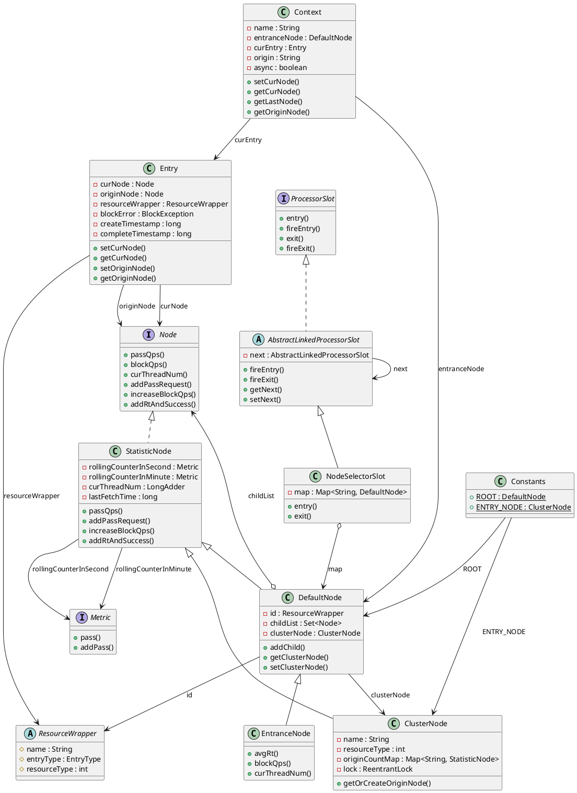
```plantuml
@startuml
interface Node {
  +passQps()
  +blockQps()
  +curThreadNum()
  +addPassRequest()
  +increaseBlockQps()
  +addRtAndSuccess()
}

interface Metric {
  +pass()
  +addPass()
}

abstract class ResourceWrapper {
  #name : String
  #entryType : EntryType
  #resourceType : int
}

class StatisticNode {
  -rollingCounterInSecond : Metric
  -rollingCounterInMinute : Metric
  -curThreadNum : LongAdder
  -lastFetchTime : long
  +passQps()
  +addPassRequest()
  +increaseBlockQps()
  +addRtAndSuccess()
}

class DefaultNode {
  -id : ResourceWrapper
  -childList : Set<Node>
  -clusterNode : ClusterNode
  +addChild()
  +getClusterNode()
  +setClusterNode()
}

class EntranceNode {
  +avgRt()
  +blockQps()
  +curThreadNum()
}

class ClusterNode {
  -name : String
  -resourceType : int
  -originCountMap : Map<String, StatisticNode>
  -lock : ReentrantLock
  +getOrCreateOriginNode()
}

class Context {
  -name : String
  -entranceNode : DefaultNode
  -curEntry : Entry
  -origin : String
  -async : boolean
  +setCurNode()
  +getCurNode()
  +getLastNode()
  +getOriginNode()
}

class Entry {
  -curNode : Node
  -originNode : Node
  -resourceWrapper : ResourceWrapper
  -blockError : BlockException
  -createTimestamp : long
  -completeTimestamp : long
  +setCurNode()
  +getCurNode()
  +setOriginNode()
  +getOriginNode()
}

interface ProcessorSlot {
  +entry()
  +fireEntry()
  +exit()
  +fireExit()
}

abstract class AbstractLinkedProcessorSlot {
  -next : AbstractLinkedProcessorSlot
  +fireEntry()
  +fireExit()
  +getNext()
  +setNext()
}

class NodeSelectorSlot {
  -map : Map<String, DefaultNode>
  +entry()
  +exit()
}

class Constants {
  {static} +ROOT : DefaultNode
  {static} +ENTRY_NODE : ClusterNode
}

Node <|.. StatisticNode
StatisticNode <|-- DefaultNode
DefaultNode <|-- EntranceNode
StatisticNode <|-- ClusterNode
ProcessorSlot <|.. AbstractLinkedProcessorSlot
AbstractLinkedProcessorSlot <|-- NodeSelectorSlot

StatisticNode --> Metric : rollingCounterInSecond
StatisticNode --> Metric : rollingCounterInMinute
DefaultNode --> ResourceWrapper : id
DefaultNode o--> Node : childList
DefaultNode --> ClusterNode : clusterNode
Context --> DefaultNode : entranceNode
Context --> Entry : curEntry
Entry --> Node : curNode
Entry --> Node : originNode
Entry --> ResourceWrapper : resourceWrapper
AbstractLinkedProcessorSlot --> AbstractLinkedProcessorSlot : next
NodeSelectorSlot o--> DefaultNode : map
Constants --> DefaultNode : ROOT
Constants --> ClusterNode : ENTRY_NODE
@enduml
```

As in the opening, each resource chain has its own `NodeSelectorSlot` and `map`. Inside one chain the map key is only `context.getName()` (often the default context). On first entry for that name the slot creates a `DefaultNode`, links it under `context.getLastNode()`, sets `curNode`, and passes that node to later slots:

```java
@Override
public void entry(Context context, ResourceWrapper resourceWrapper, Object obj,
                  int count, boolean prioritized, Object... args) throws Throwable {
    DefaultNode node = map.get(context.getName());
    if (node == null) {
        synchronized (this) {
            node = map.get(context.getName());
            if (node == null) {
                node = new DefaultNode(resourceWrapper, null);
                HashMap<String, DefaultNode> cacheMap =
                    new HashMap<String, DefaultNode>(map.size());
                cacheMap.putAll(map);
                cacheMap.put(context.getName(), node);
                map = cacheMap;
                ((DefaultNode) context.getLastNode()).addChild(node);
            }
        }
    }
    context.setCurNode(node);
    fireEntry(context, resourceWrapper, node, count, prioritized, args);
}
```

```java
@Override
public void exit(Context context, ResourceWrapper resourceWrapper, int count,
                 Object... args) {
    fireExit(context, resourceWrapper, count, args);
}
```

`Context.getLastNode()` is the parent entry’s `curNode`, or the context’s `EntranceNode` when this is the first resource entry:

```java
public Node getLastNode() {
    if (curEntry != null && curEntry.getLastNode() != null) {
        return curEntry.getLastNode();
    } else {
        return entranceNode;
    }
}
```

```java
// CtEntry — parent entry's statistic node
@Override
public Node getLastNode() {
    return parent == null ? null : parent.getCurNode();
}
```

Two contexts entering the same resource therefore get two `DefaultNode`s under different entrances; they later share one `ClusterNode` (bound in `ClusterBuilderSlot`):

```text
ROOT
├── EntranceNode(entrance1)
│   └── DefaultNode(getOrder) ──► ClusterNode(getOrder)
└── EntranceNode(entrance2)
    └── DefaultNode(getOrder) ──► (same) ClusterNode(getOrder)
```

`DefaultNode.addPassRequest` also updates that `clusterNode` once it is set:

```java
@Override
public void addPassRequest(int count) {
    super.addPassRequest(count);
    this.clusterNode.addPassRequest(count);
}
```

### 2.2 ClusterBuilderSlot

`ClusterBuilderSlot` binds the resource-global `ClusterNode` (and the origin node when the context has an origin) so QPS and degrade checks share one cluster-wide metric node.

`NodeSelectorSlot` left the `DefaultNode` with `clusterNode == null`. This slot fills that link. Same resource shares one `ProcessorSlotChain`, and this slot is `@Spi(isSingleton = false)`, so each chain holds its own `ClusterBuilderSlot` instance with an instance field `clusterNode`. A static `clusterNodeMap` (`ResourceWrapper → ClusterNode`) records every resource’s cluster node for `getClusterNode` / dashboard use. When the context origin is non-empty, the slot also attaches a per-origin `StatisticNode` from `ClusterNode.originCountMap` onto the current `Entry`.

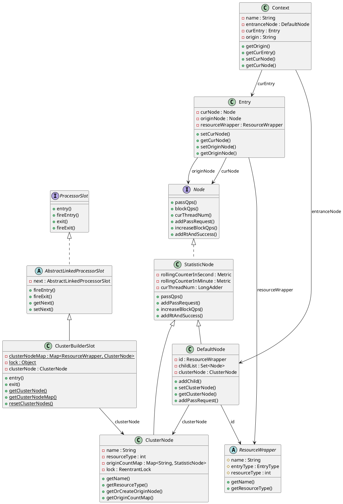
```plantuml
@startuml
interface Node {
  +passQps()
  +blockQps()
  +curThreadNum()
  +addPassRequest()
  +increaseBlockQps()
  +addRtAndSuccess()
}

interface ProcessorSlot {
  +entry()
  +fireEntry()
  +exit()
  +fireExit()
}

abstract class AbstractLinkedProcessorSlot {
  -next : AbstractLinkedProcessorSlot
  +fireEntry()
  +fireExit()
  +getNext()
  +setNext()
}

class ClusterBuilderSlot {
  {static} -clusterNodeMap : Map<ResourceWrapper, ClusterNode>
  {static} -lock : Object
  -clusterNode : ClusterNode
  +entry()
  +exit()
  {static} +getClusterNode()
  {static} +getClusterNodeMap()
  {static} +resetClusterNodes()
}

class DefaultNode {
  -id : ResourceWrapper
  -childList : Set<Node>
  -clusterNode : ClusterNode
  +addChild()
  +setClusterNode()
  +getClusterNode()
  +addPassRequest()
}

class ClusterNode {
  -name : String
  -resourceType : int
  -originCountMap : Map<String, StatisticNode>
  -lock : ReentrantLock
  +getName()
  +getResourceType()
  +getOrCreateOriginNode()
  +getOriginCountMap()
}

class StatisticNode {
  -rollingCounterInSecond : Metric
  -rollingCounterInMinute : Metric
  -curThreadNum : LongAdder
  +passQps()
  +addPassRequest()
  +increaseBlockQps()
  +addRtAndSuccess()
}

class Context {
  -name : String
  -entranceNode : DefaultNode
  -curEntry : Entry
  -origin : String
  +getOrigin()
  +getCurEntry()
  +setCurNode()
  +getCurNode()
}

class Entry {
  -curNode : Node
  -originNode : Node
  -resourceWrapper : ResourceWrapper
  +setCurNode()
  +getCurNode()
  +setOriginNode()
  +getOriginNode()
}

abstract class ResourceWrapper {
  #name : String
  #entryType : EntryType
  #resourceType : int
  +getName()
  +getResourceType()
}

Node <|.. StatisticNode
StatisticNode <|-- DefaultNode
StatisticNode <|-- ClusterNode
ProcessorSlot <|.. AbstractLinkedProcessorSlot
AbstractLinkedProcessorSlot <|-- ClusterBuilderSlot

ClusterBuilderSlot --> ClusterNode : clusterNode
DefaultNode --> ClusterNode : clusterNode
DefaultNode --> ResourceWrapper : id
Context --> Entry : curEntry
Context --> DefaultNode : entranceNode
Entry --> Node : curNode
Entry --> Node : originNode
Entry --> ResourceWrapper : resourceWrapper
@enduml
```

On **entry**, if this slot’s `clusterNode` is still null, it creates one under the static lock, publishes it into `clusterNodeMap`, then binds it onto the `DefaultNode` from `NodeSelectorSlot`. Origin handling runs next; then `fireEntry`.

```java
@Override
public void entry(Context context, ResourceWrapper resourceWrapper, DefaultNode node,
                  int count, boolean prioritized, Object... args) throws Throwable {
    if (clusterNode == null) {
        synchronized (lock) {
            if (clusterNode == null) {
                clusterNode = new ClusterNode(resourceWrapper.getName(),
                    resourceWrapper.getResourceType());
                HashMap<ResourceWrapper, ClusterNode> newMap =
                    new HashMap<>(Math.max(clusterNodeMap.size(), 16));
                newMap.putAll(clusterNodeMap);
                newMap.put(node.getId(), clusterNode);
                clusterNodeMap = newMap;
            }
        }
    }
    node.setClusterNode(clusterNode);

    if (!"".equals(context.getOrigin())) {
        Node originNode = node.getClusterNode()
            .getOrCreateOriginNode(context.getOrigin());
        context.getCurEntry().setOriginNode(originNode);
    }

    fireEntry(context, resourceWrapper, node, count, prioritized, args);
}
```

```java
@Override
public void exit(Context context, ResourceWrapper resourceWrapper, int count,
                 Object... args) {
    fireExit(context, resourceWrapper, count, args);
}
```

`ClusterNode.getOrCreateOriginNode` stores one `StatisticNode` per origin string on the shared `ClusterNode`. Later `StatisticSlot` can write pass/block/RT on that origin node separately from the resource total.

```java
public Node getOrCreateOriginNode(String origin) {
    StatisticNode statisticNode = originCountMap.get(origin);
    if (statisticNode == null) {
        lock.lock();
        try {
            statisticNode = originCountMap.get(origin);
            if (statisticNode == null) {
                statisticNode = new StatisticNode();
                HashMap<String, StatisticNode> newMap =
                    new HashMap<>(originCountMap.size() + 1);
                newMap.putAll(originCountMap);
                newMap.put(origin, statisticNode);
                originCountMap = newMap;
            }
        } finally {
            lock.unlock();
        }
    }
    return statisticNode;
}
```

After this slot returns, flow and degrade checks that need resource-wide QPS read `node.getClusterNode()`. Empty origin leaves `curEntry.originNode` unset. Exit only `fireExit`.

### 2.3 LogSlot

`LogSlot` writes block logs for `BlockException` and keeps exit cleanup running if a later slot throws unexpectedly.

It wraps `fireEntry`. On `BlockException`, logs through EagleEye (block log) using rule metadata, then rethrows. On exit, wraps `fireExit` and swallows unexpected throwables so cleanup continues. It does not change nodes or rules.

### 2.4 StatisticSlot

`StatisticSlot` records pass, block, RT, and thread counts around the rule slots that follow; rule checks see prior passes only.

On **entry** it calls `fireEntry` **first**, so Authority / System / Flow / circuit slots run before any pass counter moves. If they return normally it increments thread count and `addPassRequest` on the `DefaultNode`, the origin node when present, and `Constants.ENTRY_NODE` for inbound entries. If a downstream slot throws `BlockException`, it records **block** QPS, sets `curEntry.setBlockError`, and rethrows—**pass** is not incremented. The QPS check therefore sees prior passes, not the call under judgment.

```java
@Override
public void entry(Context context, ResourceWrapper resourceWrapper, DefaultNode node,
                  int count, boolean prioritized, Object... args) throws Throwable {
    try {
        fireEntry(context, resourceWrapper, node, count, prioritized, args);
        node.increaseThreadNum();
        node.addPassRequest(count);
    } catch (BlockException e) {
        context.getCurEntry().setBlockError(e);
        node.increaseBlockQps(count);
        throw e;
    }
}
```

On **exit**, `recordCompleteFor` writes RT and success (or exception QPS), decreases thread count, sets `completeTimestamp`, then `fireExit`. Circuit-breaker slots that run later on exit therefore see a completed timestamp.

`ClusterNode` (via `StatisticNode`) stores counters in rolling windows; `passQps()` and related reads are implemented in §3. Both the one-second and one-minute metrics are updated on pass:

```java
// StatisticNode
public double passQps() {
    return rollingCounterInSecond.pass() / rollingCounterInSecond.getWindowIntervalInSec();
}

public void addPassRequest(int count) {
    rollingCounterInSecond.addPass(count);
    rollingCounterInMinute.addPass(count);
}
```


### 2.5 AuthoritySlot

`AuthoritySlot` applies black/white origin rules (`AuthorityRule`) and blocks unauthorized callers.

It reads rules from `AuthorityRuleManager`. `AuthorityRuleChecker.passCheck` uses `context.getOrigin()`. Failure throws `AuthorityException`. Exit only `fireExit`.

Origin comes from `ContextUtil.enter(name, origin)`, not from the resource string. Empty origin always passes. The slot does not authenticate the caller: any code that can call `enter` (or set origin from a client header / query arg) can supply a whitelist name such as `appA` and pass. Treat origin as an application-controlled label, not as proof of identity.

**Whitelist example.** Only `appA` and `appE` may enter `getOrder`:

```java
AuthorityRule rule = new AuthorityRule();
rule.setResource("getOrder");
rule.setStrategy(RuleConstant.AUTHORITY_WHITE);
rule.setLimitApp("appA,appE");
AuthorityRuleManager.loadRules(Collections.singletonList(rule));

ContextUtil.enter("orderEntrance", "appA");
Entry entry = null;
try {
    entry = SphU.entry("getOrder");   // passes
} catch (AuthorityException ex) {
    // blocked
} finally {
    if (entry != null) {
        entry.exit();
    }
    ContextUtil.exit();
}

ContextUtil.enter("orderEntrance", "appB");
try {
    SphU.entry("getOrder");           // AuthorityException
} finally {
    ContextUtil.exit();
}
```

**Blacklist example.** `appA` and `appB` are refused; other origins pass:

```java
AuthorityRule rule = new AuthorityRule();
rule.setResource("getOrder");
rule.setStrategy(RuleConstant.AUTHORITY_BLACK);
rule.setLimitApp("appA,appB");
AuthorityRuleManager.loadRules(Collections.singletonList(rule));
```

```java
@Override
public void entry(Context context, ResourceWrapper resourceWrapper, DefaultNode node,
                  int count, boolean prioritized, Object... args) throws Throwable {
    checkBlackWhiteAuthority(resourceWrapper, context);
    fireEntry(context, resourceWrapper, node, count, prioritized, args);
}

void checkBlackWhiteAuthority(ResourceWrapper resource, Context context)
        throws AuthorityException {
    List<AuthorityRule> rules = AuthorityRuleManager.getRules(resource.getName());
    if (rules == null) {
        return;
    }
    for (AuthorityRule rule : rules) {
        if (!AuthorityRuleChecker.passCheck(rule, context)) {
            throw new AuthorityException(context.getOrigin(), rule);
        }
    }
}
```

### 2.6 SystemSlot

`SystemSlot` applies process-wide protection (`SystemRule`: load, inbound QPS, average RT, thread count, CPU).

It calls `SystemRuleManager.checkSystem`. Metrics come from `Constants.ENTRY_NODE`, not from the per-resource `DefaultNode`. Failure throws `SystemBlockException`. Exit only `fireExit`.

`SystemSlot` does not register or sum resources itself. There is one global `ClusterNode` (`Constants.ENTRY_NODE`). On every **inbound** pass, `StatisticSlot` (which calls `fireEntry` first, then writes metrics) adds to that node:

```java
// StatisticSlot — after Authority / System / Flow return
if (resourceWrapper.getEntryType() == EntryType.IN) {
    Constants.ENTRY_NODE.increaseThreadNum();
    Constants.ENTRY_NODE.addPassRequest(count);
}
```

So `getOrder` and `/api/user` both feed the same counters when entered as `EntryType.IN`. `SystemRule` has no `resource` field: one threshold covers all inbound traffic. `SystemSlot` only **reads** `ENTRY_NODE` (plus CPU/load from the status listener) and may block the current inbound entry before this call’s pass is written.

The check runs only for `EntryType.IN`. Outbound entries (`EntryType.OUT`, the default of `SphU.entry(name)`) skip system rules. Inbound HTTP adapters normally use `EntryType.IN`, so URL resources are covered.

**Example.** Cap total inbound QPS at 20 and concurrent inbound threads at 10:

```java
SystemRule rule = new SystemRule();
rule.setQps(20);
rule.setMaxThread(10);
// optional: rule.setAvgRt(50);
// optional: rule.setHighestCpuUsage(0.8);
// optional: rule.setHighestSystemLoad(3.0);  // Linux load average
SystemRuleManager.loadRules(Collections.singletonList(rule));

Entry entry = null;
try {
    entry = SphU.entry("getOrder", EntryType.IN);
    // business
} catch (SystemBlockException ex) {
    // global inbound limit hit (threshold name in ex.getLimitType())
} finally {
    if (entry != null) {
        entry.exit();
    }
}
```

`checkSystem` compares those shared totals to the rule:

```java
@Override
public void entry(Context context, ResourceWrapper resourceWrapper, DefaultNode node,
                  int count, boolean prioritized, Object... args) throws Throwable {
    SystemRuleManager.checkSystem(resourceWrapper, count);
    fireEntry(context, resourceWrapper, node, count, prioritized, args);
}
```

```java
public static void checkSystem(ResourceWrapper resourceWrapper, int count)
        throws BlockException {
    if (resourceWrapper.getEntryType() != EntryType.IN) {
        return;
    }
    double currentQps = Constants.ENTRY_NODE.passQps();
    if (currentQps + count > qps) {
        throw new SystemBlockException(resourceWrapper.getName(), "qps");
    }
    int currentThread = Constants.ENTRY_NODE.curThreadNum();
    if (currentThread > maxThread) {
        throw new SystemBlockException(resourceWrapper.getName(), "thread");
    }
    // avgRt / load / cpu ...
}
```

Unlike `FlowRule`, a `SystemRule` is not bound to one resource name: any inbound entry can be blocked once the process-wide window exceeds the threshold.

### 2.7 FlowSlot

`FlowSlot` applies per-resource flow rules (`FlowRule`: QPS or concurrency, strategy, and control behavior).

`entry` runs `checkFlow` before `fireEntry`. A `FlowRule` selects one mode on each of three axes: what is counted, which node is measured, and what happens when the threshold is exceeded. The controller attached to the rule performs the comparison.

```java
@Override
public void entry(Context context, ResourceWrapper resourceWrapper, DefaultNode node,
                  int count, boolean prioritized, Object... args) throws Throwable {
    checkFlow(resourceWrapper, context, node, count, prioritized);
    fireEntry(context, resourceWrapper, node, count, prioritized, args);
}
```

**Grade** chooses the metric.


| `grade` | Constant            | Metric                                                  |
| ------- | ------------------- | ------------------------------------------------------- |
| 1       | `FLOW_GRADE_QPS`    | `passQps()` over the recent window                      |
| 0       | `FLOW_GRADE_THREAD` | `curThreadNum()`, threads currently inside the resource |


**Strategy** chooses the node those metrics are read from. Sentinel calls this the flow-control mode.


| `strategy` | Constant          | Node                                                                                                         |
| ---------- | ----------------- | ------------------------------------------------------------------------------------------------------------ |
| 0          | `STRATEGY_DIRECT` | This resource. With `limitApp=default`, that is `ClusterNode`.                                               |
| 1          | `STRATEGY_RELATE` | `ClusterNode` of `refResource`. This resource is limited by the related resource's traffic.                  |
| 2          | `STRATEGY_CHAIN`  | This resource's node, and only when the context name equals `refResource`. Any other context skips the rule. |


**Control behavior** chooses the effect after a QPS rule is over threshold. It applies only when `grade` is QPS. A thread-count rule always uses `DefaultController`.


| `controlBehavior` | Constant                                | Controller                    | Effect                                                                                |
| ----------------- | --------------------------------------- | ----------------------------- | ------------------------------------------------------------------------------------- |
| 0                 | `CONTROL_BEHAVIOR_DEFAULT`              | `DefaultController`           | Reject at once                                                                        |
| 1                 | `CONTROL_BEHAVIOR_WARM_UP`              | `WarmUpController`            | Allow less than `count` while the resource is cold                                    |
| 2                 | `CONTROL_BEHAVIOR_RATE_LIMITER`         | `ThrottlingController`        | Queue until the next even interval, or reject if the wait exceeds `maxQueueingTimeMs` |
| 3                 | `CONTROL_BEHAVIOR_WARM_UP_RATE_LIMITER` | `WarmUpRateLimiterController` | Warm-up threshold, then the same queue                                                |


`FlowRuleUtil.generateRater` builds that controller when the rule is loaded. `FlowRuleChecker` selects the node from `strategy`, then calls `rater.canPass`.

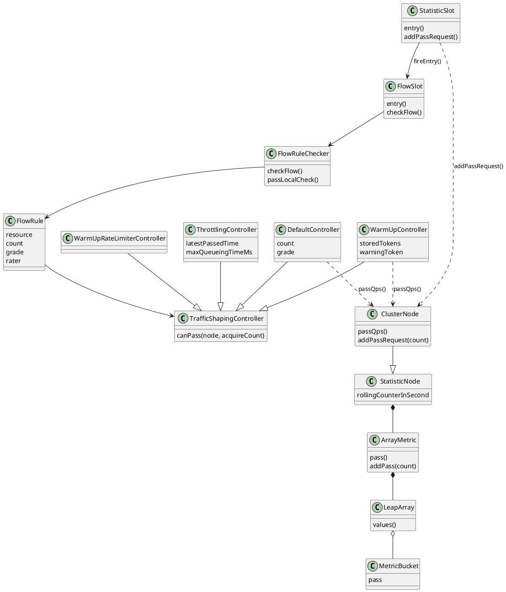
```plantuml
@startuml
class FlowSlot {
  entry()
  checkFlow()
}

class FlowRuleChecker {
  checkFlow()
  passLocalCheck()
}

class FlowRule {
  resource
  count
  grade
  rater
}

class TrafficShapingController {
  canPass(node, acquireCount)
}

class DefaultController {
  count
  grade
}

class WarmUpController {
  storedTokens
  warningToken
}

class ThrottlingController {
  latestPassedTime
  maxQueueingTimeMs
}

class WarmUpRateLimiterController {
}

class StatisticSlot {
  entry()
  addPassRequest()
}

class ClusterNode {
  passQps()
  addPassRequest(count)
}

class StatisticNode {
  rollingCounterInSecond
}

class ArrayMetric {
  pass()
  addPass(count)
}

class LeapArray {
  values()
}

class MetricBucket {
  pass
}

FlowSlot --> FlowRuleChecker
FlowRuleChecker --> FlowRule
FlowRule --> TrafficShapingController
DefaultController --|> TrafficShapingController
WarmUpController --|> TrafficShapingController
ThrottlingController --|> TrafficShapingController
WarmUpRateLimiterController --|> TrafficShapingController
StatisticSlot --> FlowSlot : fireEntry()
DefaultController ..> ClusterNode : passQps()
WarmUpController ..> ClusterNode : passQps()
StatisticSlot ..> ClusterNode : addPassRequest()
ClusterNode --|> StatisticNode
StatisticNode *-- ArrayMetric
ArrayMetric *-- LeapArray
LeapArray o-- MetricBucket
@enduml
```

`FlowSlot` delegates to `FlowRuleChecker`. If any rule refuses the call, the checker throws `FlowException`. Exit only `fireExit`.

```java
public void checkFlow(Function<String, Collection<FlowRule>> ruleProvider,
                      ResourceWrapper resource, Context context, DefaultNode node,
                      int count, boolean prioritized) throws BlockException {
    Collection<FlowRule> rules = ruleProvider.apply(resource.getName());
    if (rules != null) {
        for (FlowRule rule : rules) {
            if (!canPassCheck(rule, context, node, count, prioritized)) {
                throw new FlowException(rule.getLimitApp(), rule);
            }
        }
    }
}
```

For a local rule with `limitApp = default` and direct strategy, the selected node is the resource's `ClusterNode`. `DefaultController.canPass` rejects when the truncated pass rate plus this call's `acquireCount` exceeds `count`. `SphU.entry(name)` uses `acquireCount = 1`.

```java
public boolean canPass(Node node, int acquireCount, boolean prioritized) {
    int curCount = avgUsedTokens(node);
    if (curCount + acquireCount > count) {
        return false;
    }
    return true;
}

private int avgUsedTokens(Node node) {
    if (node == null) {
        return 0;
    }
    return grade == RuleConstant.FLOW_GRADE_THREAD
        ? node.curThreadNum()
        : (int) (node.passQps());
}
```

A direct fast-fail rule of 20 QPS is loaded as follows. `FlowRuleUtil.generateRater` then stores a `DefaultController(20, FLOW_GRADE_QPS)` on the rule.

```java
FlowRule rule = new FlowRule();
rule.setResource("getOrder");
rule.setCount(20);
rule.setGrade(RuleConstant.FLOW_GRADE_QPS);
rule.setStrategy(RuleConstant.STRATEGY_DIRECT);
rule.setControlBehavior(RuleConstant.CONTROL_BEHAVIOR_DEFAULT);
rule.setLimitApp(RuleConstant.LIMIT_APP_DEFAULT);
FlowRuleManager.loadRules(Collections.singletonList(rule));
```

Suppose the two live buckets hold 12 and 8 passes. Their sum is 20, the divisor is 1 second, and `passQps` is 20. The next call computes `20 + 1 > 20`, throws `FlowException`, and `StatisticSlot` increments **block** without calling `addPassRequest`. After the bucket of 12 falls outside the 1000 ms interval, `passQps` drops to 8 and a new call is admitted.

The comparison and `addPassRequest` are separate steps. Concurrent callers can both observe a rate under `count` and both pass, so the window can briefly exceed the threshold.

Thread-count mode uses the same `DefaultController`, but `avgUsedTokens` reads `curThreadNum()` instead of `passQps()`. The call is rejected when the number of threads already inside the resource plus `acquireCount` exceeds `count`.

`WarmUpController` keeps a token balance, `storedTokens`. While that balance is at or above `warningToken`, the allowed rate is a slope below `count`. Once the balance drops under the warning line, the check is the same as fast-fail: `passQps + acquireCount <= count`.

```java
@Override
public boolean canPass(Node node, int acquireCount, boolean prioritized) {
    long restToken = storedTokens.get();
    // sync token ...
    double passQps = node.passQps();
    if (restToken >= warningToken) {
        long aboveToken = restToken - warningToken;
        double warningQps = Math.nextUp(1.0 / (aboveToken * slope + 1.0 / count));
        return passQps + acquireCount <= warningQps;
    }
    return passQps + acquireCount <= count;
}
```

`ThrottlingController` does not read `passQps`. It spaces passes by `statDurationMs * acquireCount / count` (the default stat duration is 1000 ms). If the next slot is already due, the call passes. If the wait is longer than `maxQueueingTimeMs`, the call is rejected. Otherwise the caller sleeps until that slot.

```java
@Override
public boolean canPass(Node node, int acquireCount, boolean prioritized) {
    long currentTime = TimeUtil.currentTimeMillis();
    long costTime = Math.round(1.0d * statDurationMs * acquireCount / count);
    long expectedTime = costTime + latestPassedTime.get();
    if (expectedTime <= currentTime) {
        latestPassedTime.set(currentTime);
        return true;
    }
    long waitTime = expectedTime - currentTime;
    if (waitTime > maxQueueingTimeMs) {
        return false;
    }
    // sleep until expectedTime, then pass
    return true;
}
```

`WarmUpRateLimiterController` applies the warm-up ceiling first and then the same queue. `FlowRuleChecker` still selects the node before any of these `canPass` methods run, so relate mode and chain mode change which `ClusterNode` is passed in, not the arithmetic inside the controller.

### 2.8 DefaultCircuitBreakerSlot

`DefaultCircuitBreakerSlot` runs Sentinel’s default circuit breakers when the resource has no degrade configuration.

It uses breakers from `DefaultCircuitBreakerRuleManager`. On entry, `CircuitBreaker.tryPass`; on exit, `onRequestComplete` if the entry was not blocked. Skipped when `DegradeRuleManager.hasConfig` is true for the resource.

### 2.9 DegradeSlot

`DegradeSlot` runs resource-specific circuit breakers (`DegradeRule`) and samples completed requests on exit.

It loads breakers from `DegradeRuleManager.getCircuitBreakers`. Entry uses `tryPass`; exit calls `onRequestComplete` only when `curEntry.getBlockError()` is null, so a flow/authority/system block does not count as a completed sample for degrade.

---

## 3. Rolling window

`StatisticSlot` writes into a `StatisticNode`. That node does not keep a single counter: it keeps a **leap array** of short buckets. Flow and system checks read the sum of buckets that are still inside the configured interval.

Each `StatisticNode` holds two `ArrayMetric` instances:

| Field | Default | Role |
|-------|---------|------|
| `rollingCounterInSecond` | `sampleCount = 2`, `intervalInMs = 1000` | QPS / RT used by `passQps()` and most rules |
| `rollingCounterInMinute` | 60 buckets × 1000 ms | Minute-level totals / dashboard |

Defaults come from `SampleCountProperty.SAMPLE_COUNT` (2) and `IntervalProperty.INTERVAL` (1000 ms). So the live second window is two buckets of 500 ms. `passQps()` is `pass() / intervalInSecond` on the second metric only.

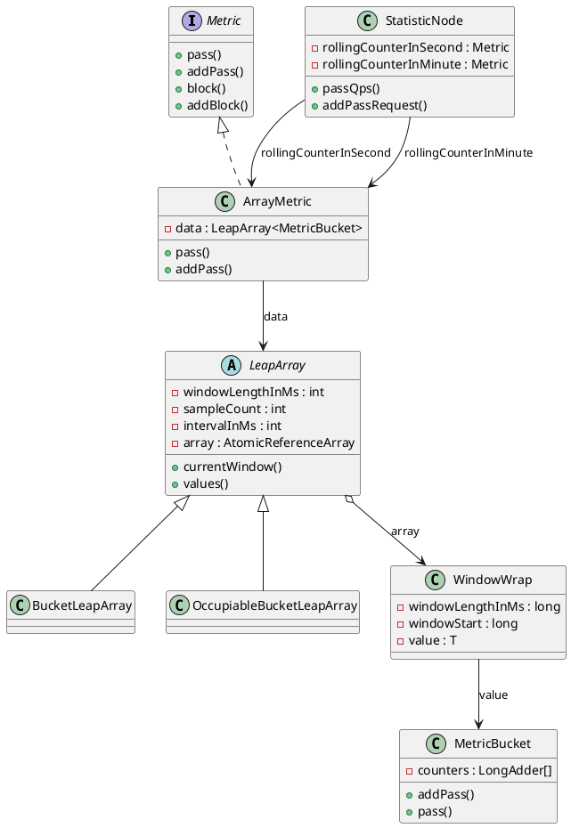
```plantuml
@startuml
interface Metric {
  +pass()
  +addPass()
  +block()
  +addBlock()
}

class ArrayMetric {
  -data : LeapArray<MetricBucket>
  +pass()
  +addPass()
}

abstract class LeapArray {
  -windowLengthInMs : int
  -sampleCount : int
  -intervalInMs : int
  -array : AtomicReferenceArray
  +currentWindow()
  +values()
}

class BucketLeapArray
class OccupiableBucketLeapArray

class WindowWrap {
  -windowLengthInMs : long
  -windowStart : long
  -value : T
}

class MetricBucket {
  -counters : LongAdder[]
  +addPass()
  +pass()
}

class StatisticNode {
  -rollingCounterInSecond : Metric
  -rollingCounterInMinute : Metric
  +passQps()
  +addPassRequest()
}

Metric <|.. ArrayMetric
LeapArray <|-- BucketLeapArray
LeapArray <|-- OccupiableBucketLeapArray
ArrayMetric --> LeapArray : data
LeapArray o--> WindowWrap : array
WindowWrap --> MetricBucket : value
StatisticNode --> ArrayMetric : rollingCounterInSecond
StatisticNode --> ArrayMetric : rollingCounterInMinute
@enduml
```

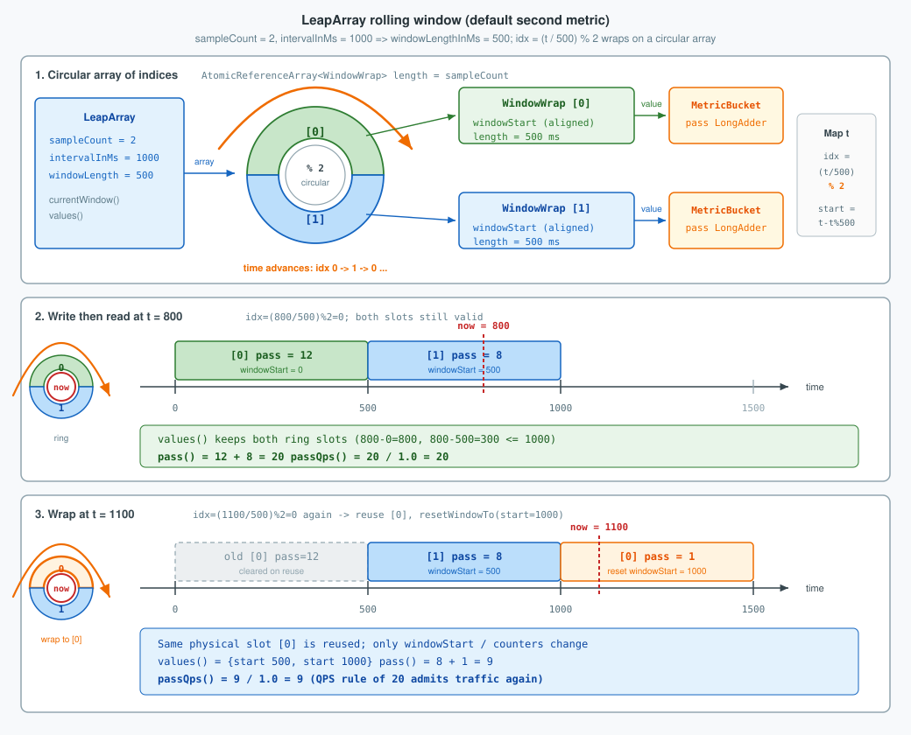

The path from a recorded pass to a QPS read is four steps.

**Step 1 — Record a pass on the node.** After rule slots admit the call, `StatisticSlot` calls `addPassRequest` on the `DefaultNode` (and related nodes). Both second- and minute-level metrics receive the same increment:

```java
// StatisticNode
public void addPassRequest(int count) {
    rollingCounterInSecond.addPass(count);
    rollingCounterInMinute.addPass(count);
}
```

**Step 2 — Resolve the bucket for “now” and increment.** `ArrayMetric.addPass` asks the leap array for the current `WindowWrap`, then adds to that bucket’s `LongAdder`:

```java
// ArrayMetric
@Override
public void addPass(int count) {
    WindowWrap<MetricBucket> wrap = data.currentWindow();
    wrap.value().addPass(count);
}
```

**Step 3 — Map time to a circular slot.** `LeapArray.currentWindow(timeMillis)` computes the index and the bucket’s start, then creates, reuses, or resets that slot:

```java
// LeapArray
private int calculateTimeIdx(long timeMillis) {
    long timeId = timeMillis / windowLengthInMs;
    return (int)(timeId % array.length());
}

protected long calculateWindowStart(long timeMillis) {
    return timeMillis - timeMillis % windowLengthInMs;
}

public WindowWrap<T> currentWindow(long timeMillis) {
    int idx = calculateTimeIdx(timeMillis);
    long windowStart = calculateWindowStart(timeMillis);
    while (true) {
        WindowWrap<T> old = array.get(idx);
        if (old == null) {
            WindowWrap<T> window = new WindowWrap<T>(
                windowLengthInMs, windowStart, newEmptyBucket(timeMillis));
            if (array.compareAndSet(idx, null, window)) {
                return window;                        // empty slot → create
            }
            Thread.yield();
        } else if (windowStart == old.windowStart()) {
            return old;                               // same bucket
        } else if (windowStart > old.windowStart()) {
            if (updateLock.tryLock()) {
                try {
                    return resetWindowTo(old, windowStart);  // deprecated → clear and reuse
                } finally {
                    updateLock.unlock();
                }
            }
            Thread.yield();
        } else {
            return new WindowWrap<T>(windowLengthInMs, windowStart, newEmptyBucket(timeMillis));
        }
    }
}
```

**Step 4 — Sum non-deprecated buckets and divide by the interval.** A later `FlowSlot` / `SystemSlot` read calls `passQps()`. That is `pass()` over `intervalInSecond` (1.0 for the default second metric). `pass()` first touches `currentWindow()` so the live slot exists, then sums only buckets that `values()` still considers valid:

```java
// StatisticNode
public double passQps() {
    return rollingCounterInSecond.pass() / rollingCounterInSecond.getWindowIntervalInSec();
}
```

```java
// ArrayMetric
@Override
public long pass() {
    data.currentWindow();
    long pass = 0;
    List<MetricBucket> list = data.values();
    for (MetricBucket window : list) {
        pass += window.pass();
    }
    return pass;
}
```

```java
// LeapArray
public List<T> values(long timeMillis) {
    List<T> result = new ArrayList<T>(array.length());
    for (int i = 0; i < array.length(); i++) {
        WindowWrap<T> windowWrap = array.get(i);
        if (windowWrap == null || isWindowDeprecated(timeMillis, windowWrap)) {
            continue;
        }
        result.add(windowWrap.value());
    }
    return result;
}

public boolean isWindowDeprecated(long time, WindowWrap<T> windowWrap) {
    return time - windowWrap.windowStart() > intervalInMs;
}
```

A bucket whose `windowStart` is more than `intervalInMs` behind “now” is skipped. As time moves forward the oldest 500 ms drops out of `passQps` without scanning a queue.

`FlowSlot` and `SystemSlot` therefore always see a recent window of prior passes, never a lifetime total. The comparison (step 4) and `addPassRequest` (step 1) are separate, so concurrent callers can briefly exceed the threshold.

---

## 4. Spring and Spring Cloud integration

`spring-cloud-starter-alibaba-sentinel` registers the beans that turn Spring calls into `SphU.entry`. It does not replace `FlowSlot`. A rule still rejects a call by the QPS check in §2.7; the starter only chooses the resource name, opens the entry, and maps `BlockException` to an HTTP or fallback result.

`SentinelAutoConfiguration` is active when `spring.cloud.sentinel.enabled` is true or omitted. It exposes `SentinelResourceAspect` and `SentinelDataSourceHandler`. On a servlet application, `SentinelWebAutoConfiguration` adds `SentinelWebInterceptor` when `spring.cloud.sentinel.filter.enabled` is true or omitted. Feign and Spring Cloud Gateway are separate switches.

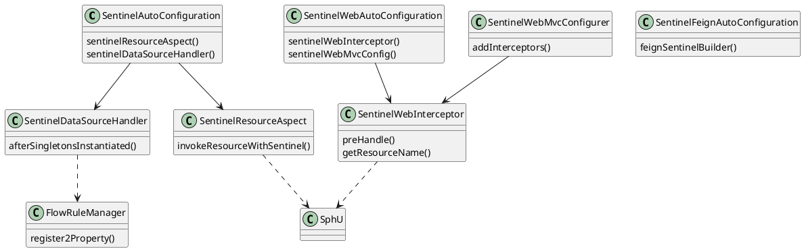
```plantuml
@startuml
class SentinelAutoConfiguration {
  sentinelResourceAspect()
  sentinelDataSourceHandler()
}

class SentinelWebAutoConfiguration {
  sentinelWebInterceptor()
  sentinelWebMvcConfig()
}

class SentinelWebMvcConfigurer {
  addInterceptors()
}

class SentinelResourceAspect {
  invokeResourceWithSentinel()
}

class SentinelWebInterceptor {
  preHandle()
  getResourceName()
}

class SentinelDataSourceHandler {
  afterSingletonsInstantiated()
}

class SentinelFeignAutoConfiguration {
  feignSentinelBuilder()
}

class FlowRuleManager {
  register2Property()
}

SentinelAutoConfiguration --> SentinelResourceAspect
SentinelAutoConfiguration --> SentinelDataSourceHandler
SentinelWebAutoConfiguration --> SentinelWebInterceptor
SentinelWebMvcConfigurer --> SentinelWebInterceptor
SentinelDataSourceHandler ..> FlowRuleManager
SentinelResourceAspect ..> SphU
SentinelWebInterceptor ..> SphU
@enduml
```


### 4.1 Inbound HTTP

`SentinelWebMvcConfigurer` registers the interceptor for `spring.cloud.sentinel.filter.url-patterns`, which defaults to `/**`. On each request `preHandle` resolves the resource, enters a context, and opens an inbound entry. `BlockException` is handled and the interceptor returns false, so the controller method is not called.

```java
String resourceName = getResourceName(request);
String origin = parseOrigin(request);
ContextUtil.enter(contextName, origin);
Entry entry = SphU.entry(resourceName, ResourceTypeConstants.COMMON_WEB, EntryType.IN);
```

The resource name is Spring MVC's best matching pattern, such as `/api/order`. `http-method-specify` defaults to false. When it is set to true, the name becomes `GET:/api/order`. A `UrlCleaner` bean, if present, rewrites the pattern before that prefix is added.

If the application defines a `BlockExceptionHandler`, that bean is used. Otherwise a configured `spring.cloud.sentinel.block-page` sends a redirect. With neither, `DefaultBlockExceptionHandler` sets HTTP 429.

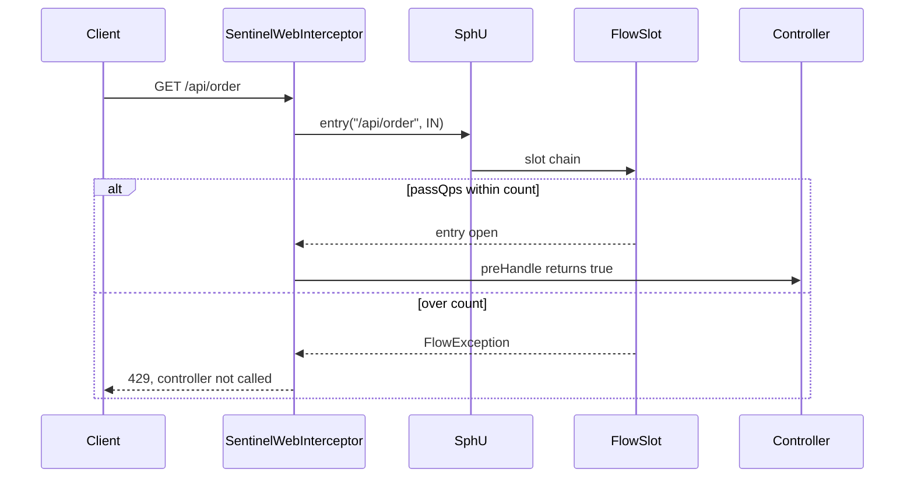
```mermaid
sequenceDiagram
    participant Client
    participant SentinelWebInterceptor
    participant SphU
    participant FlowSlot
    participant Controller

    Client->>SentinelWebInterceptor: GET /api/order
    SentinelWebInterceptor->>SphU: entry("/api/order", IN)
    SphU->>FlowSlot: slot chain
    alt passQps within count
        FlowSlot-->>SentinelWebInterceptor: entry open
        SentinelWebInterceptor->>Controller: preHandle returns true
    else over count
        FlowSlot-->>SentinelWebInterceptor: FlowException
        SentinelWebInterceptor-->>Client: 429, controller not called
    end
```


The annotation on `getOrder` is a second entry, named `getOrder`, opened by `SentinelResourceAspect` only if the interceptor let the request through. A flow rule on `/api/order` and a flow rule on `getOrder` are checked separately.

### 4.2 Outbound calls

`SentinelFeignAutoConfiguration` replaces Feign's `Feign.Builder` only when `feign.sentinel.enabled` is true. `SentinelInvocationHandler` then enters an outbound resource before the HTTP client runs. The default resource name is the method, the target URL, and the path:

```java
String resourceName = method + ":" + hardCodedTarget.url() + template.path();
ContextUtil.enter(resourceName);
entry = SphU.entry(resourceName, EntryType.OUT, 1, args);
result = methodHandler.invoke(args);
```

`EntryType.OUT` marks the call as outbound. The QPS rule still has to use this resource string. A `fallbackFactory` on the Feign client is invoked when the entry is blocked.

`RestTemplate` is not wrapped globally. `SentinelBeanPostProcessor` adds an interceptor only to beans annotated with `@SentinelRestTemplate`, and only when `resttemplate.sentinel.enabled` is true or omitted.

When Spring Cloud Gateway is on the classpath, `SentinelSCGAutoConfiguration` registers `SentinelGatewayFilter` unless `spring.cloud.sentinel.scg.enabled` is false. That filter is the gateway entry; route-level limits use gateway rules rather than a `FlowRule` on a controller name.

### 4.3 Loading rules

`SentinelDataSourceHandler.afterSingletonsInstantiated` walks `spring.cloud.sentinel.datasource`. Each entry must select one source, such as `file` or `nacos`. The handler registers a `ReadableDataSource` bean and `postRegister` attaches its property to the manager for `rule-type`:

```java
switch (this.getRuleType()) {
    case FLOW -> FlowRuleManager.register2Property(dataSource.getProperty());
    case DEGRADE -> DegradeRuleManager.register2Property(dataSource.getProperty());
    case SYSTEM -> SystemRuleManager.register2Property(dataSource.getProperty());
    case AUTHORITY -> AuthorityRuleManager.register2Property(dataSource.getProperty());
}
```

JSON and XML are converted by the `sentinel-json-flow-converter` style beans created in `SentinelAutoConfiguration`. A file of flow rules for the URL resource, matching the interceptor name when the method prefix is off, is:

```yaml
spring:
  cloud:
    sentinel:
      filter:
        enabled: true
      http-method-specify: false
      datasource:
        ds-file:
          file:
            file: classpath:flowrule.json
            data-type: json
            rule-type: flow
```

```json
[
  {
    "resource": "/api/order",
    "limitApp": "default",
    "grade": 1,
    "count": 20,
    "strategy": 0,
    "controlBehavior": 0
  }
]
```

Loading still passes through `FlowRuleUtil`, which sets the rater to `DefaultController`. After the property updates, `GET /api/order` is judged by `passQps()` on the cluster node `/api/order`, the same comparison as `SphU.entry("getOrder")` in §2.7.