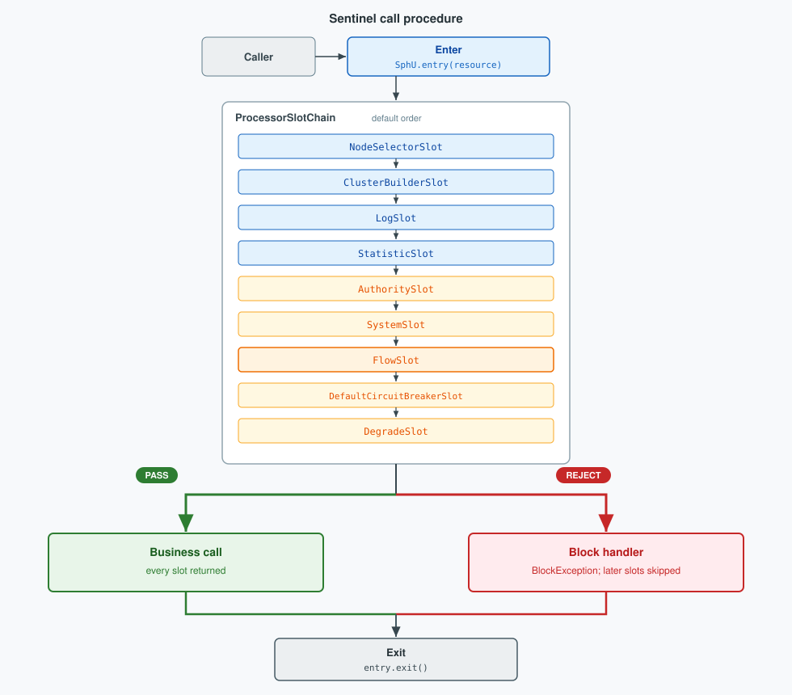
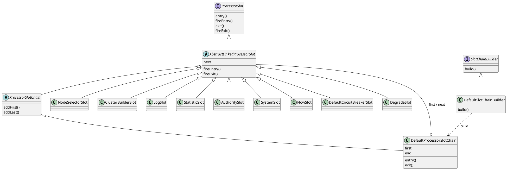
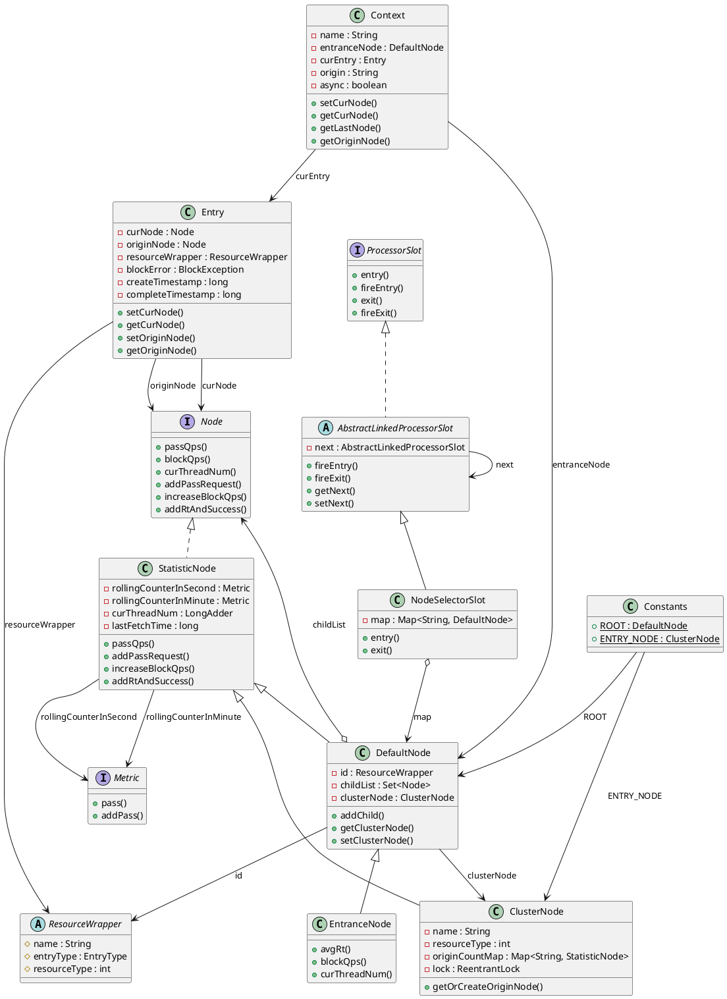
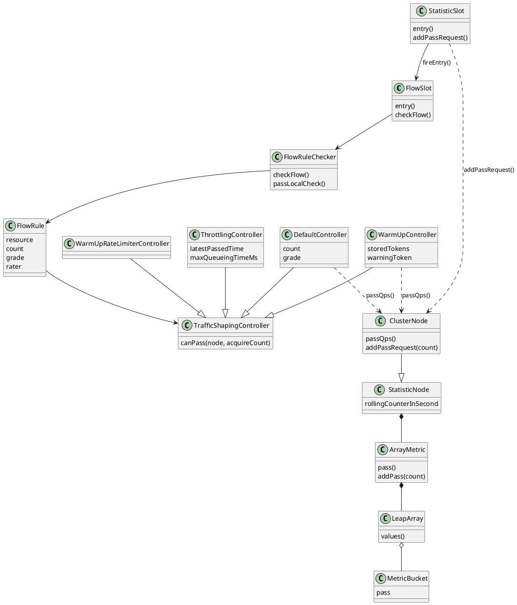
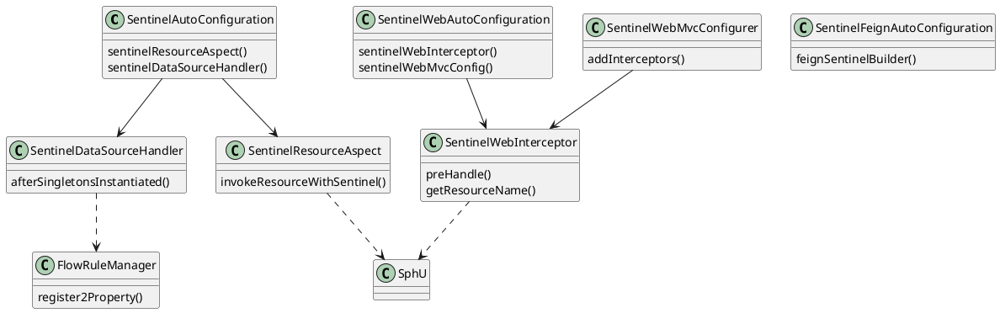
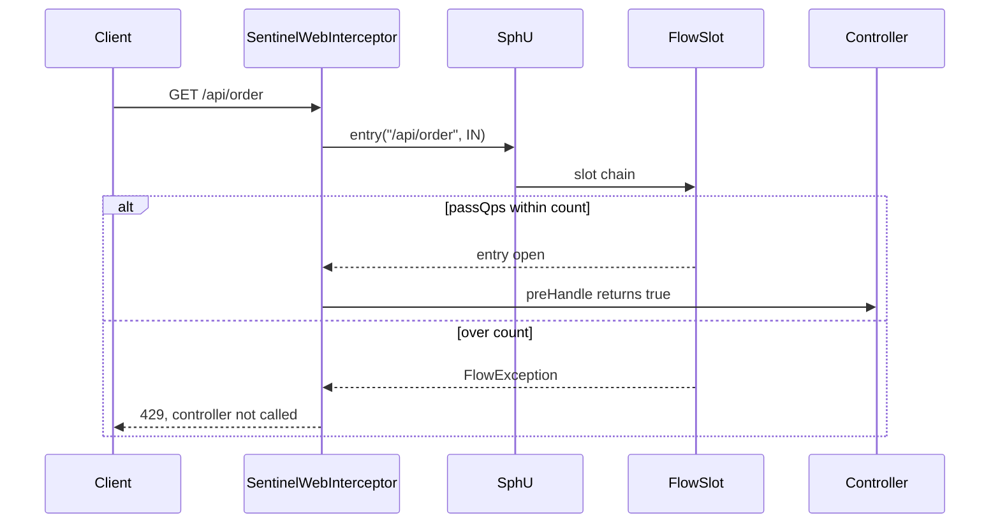

**Sentinel** is Alibaba's library for flow control, concurrency limiting, circuit breaking, and system protection. An application protects a named **resource** by entering it through **`SphU.entry`**. A processor slot chain records statistics for that resource and applies the rules loaded at runtime.
<!--more-->

---

## 1. Overview

A resource is a string chosen by the caller: an HTTP path, a service method, or any other name. **`SphU.entry(resourceName)`** opens the resource and **`entry.exit()`** closes it. Between those two calls, Sentinel runs a **`ProcessorSlotChain`** built once per resource.

Each slot has one job. **`StatisticSlot`** maintains counters. **`FlowSlot`** applies flow rules. Other slots apply authority rules, system rules, and circuit-breaking rules. Rules live in managers such as **`FlowRuleManager`** and can be replaced without restarting the process.



A rejected call never reaches the business method. **`entry.exit()`** still runs on both paths.

In a Spring application the usual entry is **`spring-cloud-starter-alibaba-sentinel`**. The starter registers **`SentinelResourceAspect`**, which wraps methods annotated with **`@SentinelResource`**. The annotation value is the resource name. On **`BlockException`** the aspect calls the **`blockHandler`** method instead of the business method.

```java
@RestController
public class OrderController {

    @GetMapping("/api/order")
    @SentinelResource(value = "getOrder", blockHandler = "handleBlock")
    public Order getOrder(@RequestParam Long id) {
        return orderService.find(id);
    }

    public Order handleBlock(Long id, BlockException ex) {
        throw new ResponseStatusException(HttpStatus.TOO_MANY_REQUESTS);
    }
}
```

**`handleBlock`** must be on the same class and must repeat the business parameters, with **`BlockException`** added at the end. The aspect turns that annotation into the same entry the core API uses:

```java
entry = SphU.entry("getOrder", resourceType, entryType, args);
return pjp.proceed();
```

A rule loaded for the resource **`getOrder`** therefore applies to **`OrderController.getOrder`**. The HTTP path and the resource name are independent: the web interceptor, when enabled, protects the URL under its own resource name.

---

## 2. ProcessorSlotChain


```plantuml
@startuml
interface ProcessorSlot {
  entry()
  fireEntry()
  exit()
  fireExit()
}

abstract class AbstractLinkedProcessorSlot {
  next
  fireEntry()
  fireExit()
}

abstract class ProcessorSlotChain {
  addFirst()
  addLast()
}

class DefaultProcessorSlotChain {
  first
  end
  entry()
  exit()
}

interface SlotChainBuilder {
  build()
}

class DefaultSlotChainBuilder {
  build()
}

class NodeSelectorSlot
class ClusterBuilderSlot
class LogSlot
class StatisticSlot
class AuthoritySlot
class SystemSlot
class FlowSlot
class DefaultCircuitBreakerSlot
class DegradeSlot

ProcessorSlot <|.. AbstractLinkedProcessorSlot
AbstractLinkedProcessorSlot <|-- ProcessorSlotChain
ProcessorSlotChain <|-- DefaultProcessorSlotChain
AbstractLinkedProcessorSlot <|-- NodeSelectorSlot
AbstractLinkedProcessorSlot <|-- ClusterBuilderSlot
AbstractLinkedProcessorSlot <|-- LogSlot
AbstractLinkedProcessorSlot <|-- StatisticSlot
AbstractLinkedProcessorSlot <|-- AuthoritySlot
AbstractLinkedProcessorSlot <|-- SystemSlot
AbstractLinkedProcessorSlot <|-- FlowSlot
AbstractLinkedProcessorSlot <|-- DefaultCircuitBreakerSlot
AbstractLinkedProcessorSlot <|-- DegradeSlot
SlotChainBuilder <|.. DefaultSlotChainBuilder
DefaultSlotChainBuilder ..> DefaultProcessorSlotChain : build
DefaultProcessorSlotChain o-- AbstractLinkedProcessorSlot : first / next
@enduml
```

| Order | Slot | Role |
|------:|------|------|
| −10000 | **`NodeSelectorSlot`** | Create or select the per-context **`DefaultNode`** and set it as the current node. |
| −9000 | **`ClusterBuilderSlot`** | Attach the resource-global **`ClusterNode`** (and origin node when present). |
| −8000 | **`LogSlot`** | Log **`BlockException`** through EagleEye; keep exit cleanup going on unexpected errors. |
| −7000 | **`StatisticSlot`** | Record pass / block / RT / thread metrics around the rule slots that follow. |
| −6000 | **`AuthoritySlot`** | Enforce black/white origin (**`AuthorityRule`**). |
| −5000 | **`SystemSlot`** | Enforce process-wide load / QPS / RT / thread / CPU (**`SystemRule`**). |
| −2000 | **`FlowSlot`** | Enforce per-resource QPS or concurrency (**`FlowRule`**). |
| −1500 | **`DefaultCircuitBreakerSlot`** | Run default circuit breakers when the resource has no degrade rules. |
| −1000 | **`DegradeSlot`** | Run resource-specific circuit breakers (**`DegradeRule`**). |

### 2.1 NodeSelectorSlot

**`NodeSelectorSlot`** builds the per-context call-tree **`DefaultNode`** for this resource and makes it the current node for later slots.

Runtime statistics live on **`Node`** (**`StatisticNode`** sliding windows and thread count), not on the slots. This slot creates or selects the **`DefaultNode`**, stores it on the current **`Entry`** via **`context.setCurNode`**, and passes it as the **`node`** argument of **`fireEntry`**. Every later slot in the same chain receives that same **`DefaultNode`**: rule slots read metrics from it (usually through its **`clusterNode`**), and **`StatisticSlot`** writes pass/block/RT back onto it. A few checks also touch related nodes hanging off that graph—the origin **`StatisticNode`**, or **`Constants.ENTRY_NODE`** for system rules—but the chain’s working handle remains the **`DefaultNode`** selected here.

A **`Node`** holds sliding-window metrics (pass, block, RT, thread count). Concrete types split identity and aggregation:


```plantuml
@startuml
interface Node {
  +passQps()
  +blockQps()
  +curThreadNum()
  +addPassRequest()
  +increaseBlockQps()
  +addRtAndSuccess()
}

interface Metric {
  +pass()
  +addPass()
}

abstract class ResourceWrapper {
  #name : String
  #entryType : EntryType
  #resourceType : int
}

class StatisticNode {
  -rollingCounterInSecond : Metric
  -rollingCounterInMinute : Metric
  -curThreadNum : LongAdder
  -lastFetchTime : long
  +passQps()
  +addPassRequest()
  +increaseBlockQps()
  +addRtAndSuccess()
}

class DefaultNode {
  -id : ResourceWrapper
  -childList : Set<Node>
  -clusterNode : ClusterNode
  +addChild()
  +getClusterNode()
  +setClusterNode()
}

class EntranceNode {
  +avgRt()
  +blockQps()
  +curThreadNum()
}

class ClusterNode {
  -name : String
  -resourceType : int
  -originCountMap : Map<String, StatisticNode>
  -lock : ReentrantLock
  +getOrCreateOriginNode()
}

class Context {
  -name : String
  -entranceNode : DefaultNode
  -curEntry : Entry
  -origin : String
  -async : boolean
  +setCurNode()
  +getCurNode()
  +getLastNode()
  +getOriginNode()
}

class Entry {
  -curNode : Node
  -originNode : Node
  -resourceWrapper : ResourceWrapper
  -blockError : BlockException
  -createTimestamp : long
  -completeTimestamp : long
  +setCurNode()
  +getCurNode()
  +setOriginNode()
  +getOriginNode()
}

interface ProcessorSlot {
  +entry()
  +fireEntry()
  +exit()
  +fireExit()
}

abstract class AbstractLinkedProcessorSlot {
  -next : AbstractLinkedProcessorSlot
  +fireEntry()
  +fireExit()
  +getNext()
  +setNext()
}

class NodeSelectorSlot {
  -map : Map<String, DefaultNode>
  +entry()
  +exit()
}

class Constants {
  {static} +ROOT : DefaultNode
  {static} +ENTRY_NODE : ClusterNode
}

Node <|.. StatisticNode
StatisticNode <|-- DefaultNode
DefaultNode <|-- EntranceNode
StatisticNode <|-- ClusterNode
ProcessorSlot <|.. AbstractLinkedProcessorSlot
AbstractLinkedProcessorSlot <|-- NodeSelectorSlot

StatisticNode --> Metric : rollingCounterInSecond
StatisticNode --> Metric : rollingCounterInMinute
DefaultNode --> ResourceWrapper : id
DefaultNode o--> Node : childList
DefaultNode --> ClusterNode : clusterNode
Context --> DefaultNode : entranceNode
Context --> Entry : curEntry
Entry --> Node : curNode
Entry --> Node : originNode
Entry --> ResourceWrapper : resourceWrapper
AbstractLinkedProcessorSlot --> AbstractLinkedProcessorSlot : next
NodeSelectorSlot o--> DefaultNode : map
Constants --> DefaultNode : ROOT
Constants --> ClusterNode : ENTRY_NODE
@enduml
```

| Type | Identity | Role |
|------|----------|------|
| **`Constants.ROOT`** | fixed **`machine-root`** | Global tree root (**`EntranceNode`**). |
| **`EntranceNode`** | context name | Root of one context’s call tree; created by **`ContextUtil.enter`**. Metrics often sum children. |
| **`DefaultNode`** | resource + context | Per-context resource vertex; call-tree edges; own metrics for that context. |
| **`ClusterNode`** | resource only | One node per resource across all contexts; flow/degrade usually read this. |
| origin **`StatisticNode`** | resource + origin | Under **`ClusterNode.originCountMap`**; traffic from one **`ContextUtil.enter(..., origin)`**. |
| **`Constants.ENTRY_NODE`** | fixed inbound total | Global inbound cluster node used by **`SystemSlot`**. |

One **`ClusterNode`** is enough to hold resource-wide statistics for flow and degrade: every context that enters the same resource name shares that node, and **`DefaultNode.addPassRequest`** (and related updates) also write through to it. The **tree of `DefaultNode`s is not for that global counter**. It records **where** the call sits in an invocation path:

- **Context separation** — the same resource under `entrance1` and `entrance2` gets two **`DefaultNode`**s so per-entrance metrics and chain-mode rules (**`STRATEGY_CHAIN`**, matching **`context.getName()`**) can differ while **`ClusterNode`** still aggregates both.
- **Nested entries** — several **`SphU.entry`** calls in one context form parent/child edges (`getLastNode().addChild`), which the dashboard tree (`/tree`) and call-path analysis use.
- **Entrance rollup** — **`EntranceNode`** often sums child metrics so an entrance shows total traffic of the resources invoked under it.

So: **`ClusterNode`** answers “how busy is this resource?”; the **`DefaultNode` tree** answers “under which entrance and parent call did it run?”

**Usage of the node this slot produces.** Same resource shares one **`ProcessorSlotChain`**, so the slot cannot key its cache by resource name alone. It keeps **`map: contextName → DefaultNode`**. On first entry for a context it allocates **`new DefaultNode(resourceWrapper, null)`**, copies the map, and links the node into the call tree:

```java
DefaultNode node = map.get(context.getName());
if (node == null) {
    // synchronized create...
    node = new DefaultNode(resourceWrapper, null);
    ((DefaultNode) context.getLastNode()).addChild(node);
}
context.setCurNode(node);
fireEntry(context, resourceWrapper, node, count, prioritized, args);
```

**`context.getLastNode()`** is the parent entry’s current node, or the context’s **`EntranceNode`** when this is the first resource entry. Nested **`SphU.entry`** calls therefore grow a tree under that entrance. Two contexts entering the same resource get two **`DefaultNode`**s and later share one **`ClusterNode`** (bound in **`ClusterBuilderSlot`**):

```text
Constants.ROOT (machine-root)
├── EntranceNode(entrance1)
│   └── DefaultNode(nodeA) ──► ClusterNode(nodeA)
└── EntranceNode(entrance2)
    └── DefaultNode(nodeA) ──► (same) ClusterNode(nodeA)
```

After **`setCurNode`**, **`fireEntry`** passes that **`DefaultNode`** as the **`node`** argument to every later slot:

- **`ClusterBuilderSlot`** sets **`node.clusterNode`** and, when origin is non-empty, **`curEntry.originNode`**.
- **`StatisticSlot`** writes pass/block/RT on the **`DefaultNode`**, the origin node, the **`ClusterNode`** (via **`DefaultNode`** overrides that also update the cluster node), and **`ENTRY_NODE`** for inbound entries.
- **`FlowSlot`** / degrade checks typically call **`passQps()`** / **`curThreadNum()`** on the **`ClusterNode`** (or a related/chain-selected node), not on the per-context **`DefaultNode`** alone—so limits apply to the resource as a whole.
- **`SystemSlot`** ignores the per-resource node and reads **`Constants.ENTRY_NODE`**.
- Chain-mode flow rules compare **`context.getName()`** to **`refResource`**, which is why the call-tree context name and the **`DefaultNode`** cache key must match.

Exit only **`fireExit`**; the slot does not tear down nodes. Trees stay for dashboard views such as **`/tree?type=root`**.

### 2.2 ClusterBuilderSlot

**`ClusterBuilderSlot`** binds the resource-global **`ClusterNode`** (and the origin node when the context has an origin) so QPS and degrade checks share one cluster-wide metric node.

It sets **`node.setClusterNode`** on the current **`DefaultNode`**. If the context has a non-empty origin, it also sets **`curEntry.setOriginNode`**. Flow and degrade checks that need cluster-wide QPS read this **`ClusterNode`**. Exit only **`fireExit`**. Instances are not SPI singletons so each new chain gets its own builder slot state.

### 2.3 LogSlot

**`LogSlot`** writes block logs for **`BlockException`** and keeps exit cleanup running if a later slot throws unexpectedly.

It wraps **`fireEntry`**. On **`BlockException`**, logs through EagleEye (block log) using rule metadata, then rethrows. On exit, wraps **`fireExit`** and swallows unexpected throwables so cleanup continues. It does not change nodes or rules.

### 2.4 StatisticSlot

**`StatisticSlot`** records pass, block, RT, and thread counts around the rule slots that follow; rule checks see prior passes only.

On **entry** it calls **`fireEntry` first**, so Authority / System / Flow / circuit slots run before any pass counter moves. If they return normally it increments thread count and **`addPassRequest`** on the **`DefaultNode`**, the origin node when present, and **`Constants.ENTRY_NODE`** for inbound entries. If a downstream slot throws **`BlockException`**, it records **block** QPS, sets **`curEntry.setBlockError`**, and rethrows—**pass** is not incremented. The QPS check therefore sees prior passes, not the call under judgment.
```java
public void entry(...) throws Throwable {
    try {
        fireEntry(context, resourceWrapper, node, count, prioritized, args);
        node.increaseThreadNum();
        node.addPassRequest(count);
    } catch (BlockException e) {
        context.getCurEntry().setBlockError(e);
        node.increaseBlockQps(count);
        throw e;
    }
}
```

On **exit**, **`recordCompleteFor`** writes RT and success (or exception QPS), decreases thread count, sets **`completeTimestamp`**, then **`fireExit`**. Circuit-breaker slots that run later on exit therefore see a completed timestamp.

**`ClusterNode`** (via **`StatisticNode`**) stores pass counts in a sliding window. **`passQps()`** is the **`pass`** total of the live one-second window divided by the window length in seconds. The default window is 1000 ms split into two buckets of 500 ms. **`ArrayMetric.pass()`** sums buckets that are still inside that interval. The minute counter is updated together with the second counter, but **`passQps()`** reads only the one-second metric.

```java
public double passQps() {
    return rollingCounterInSecond.pass() / rollingCounterInSecond.getWindowIntervalInSec();
}

public void addPassRequest(int count) {
    rollingCounterInSecond.addPass(count);
    rollingCounterInMinute.addPass(count);
}
```

### 2.5 AuthoritySlot

**`AuthoritySlot`** applies black/white origin rules (**`AuthorityRule`**) and blocks unauthorized callers.

It reads rules from **`AuthorityRuleManager`**. **`AuthorityRuleChecker.passCheck`** uses **`context.getOrigin()`**. Failure throws **`AuthorityException`**. Exit only **`fireExit`**.

### 2.6 SystemSlot

**`SystemSlot`** applies process-wide protection (**`SystemRule`**: load, inbound QPS, average RT, thread count, CPU).

It calls **`SystemRuleManager.checkSystem`**. Metrics come from **`Constants.ENTRY_NODE`**, not from the per-resource **`DefaultNode`**. Failure throws **`SystemBlockException`**. Exit only **`fireExit`**.

### 2.7 FlowSlot

**`FlowSlot`** applies per-resource flow rules (**`FlowRule`**: QPS or concurrency, strategy, and control behavior).

**`entry`** runs **`checkFlow`** before **`fireEntry`**. A **`FlowRule`** selects one mode on each of three axes: what is counted, which node is measured, and what happens when the threshold is exceeded. The controller attached to the rule performs the comparison.

```java
public void entry(...) throws Throwable {
    checkFlow(resourceWrapper, context, node, count, prioritized);
    fireEntry(context, resourceWrapper, node, count, prioritized, args);
}
```

**Grade** chooses the metric.

| **`grade`** | Constant | Metric |
|-------------|----------|--------|
| 1 | **`FLOW_GRADE_QPS`** | **`passQps()`** over the recent window |
| 0 | **`FLOW_GRADE_THREAD`** | **`curThreadNum()`**, threads currently inside the resource |

**Strategy** chooses the node those metrics are read from. Sentinel calls this the flow-control mode.

| **`strategy`** | Constant | Node |
|----------------|----------|------|
| 0 | **`STRATEGY_DIRECT`** | This resource. With **`limitApp=default`**, that is **`ClusterNode`**. |
| 1 | **`STRATEGY_RELATE`** | **`ClusterNode`** of **`refResource`**. This resource is limited by the related resource's traffic. |
| 2 | **`STRATEGY_CHAIN`** | This resource's node, and only when the context name equals **`refResource`**. Any other context skips the rule. |

**Control behavior** chooses the effect after a QPS rule is over threshold. It applies only when **`grade`** is QPS. A thread-count rule always uses **`DefaultController`**.

| **`controlBehavior`** | Constant | Controller | Effect |
|-----------------------|----------|------------|--------|
| 0 | **`CONTROL_BEHAVIOR_DEFAULT`** | **`DefaultController`** | Reject at once |
| 1 | **`CONTROL_BEHAVIOR_WARM_UP`** | **`WarmUpController`** | Allow less than **`count`** while the resource is cold |
| 2 | **`CONTROL_BEHAVIOR_RATE_LIMITER`** | **`ThrottlingController`** | Queue until the next even interval, or reject if the wait exceeds **`maxQueueingTimeMs`** |
| 3 | **`CONTROL_BEHAVIOR_WARM_UP_RATE_LIMITER`** | **`WarmUpRateLimiterController`** | Warm-up threshold, then the same queue |

**`FlowRuleUtil.generateRater`** builds that controller when the rule is loaded. **`FlowRuleChecker`** selects the node from **`strategy`**, then calls **`rater.canPass`**.


```plantuml
@startuml
class FlowSlot {
  entry()
  checkFlow()
}

class FlowRuleChecker {
  checkFlow()
  passLocalCheck()
}

class FlowRule {
  resource
  count
  grade
  rater
}

class TrafficShapingController {
  canPass(node, acquireCount)
}

class DefaultController {
  count
  grade
}

class WarmUpController {
  storedTokens
  warningToken
}

class ThrottlingController {
  latestPassedTime
  maxQueueingTimeMs
}

class WarmUpRateLimiterController {
}

class StatisticSlot {
  entry()
  addPassRequest()
}

class ClusterNode {
  passQps()
  addPassRequest(count)
}

class StatisticNode {
  rollingCounterInSecond
}

class ArrayMetric {
  pass()
  addPass(count)
}

class LeapArray {
  values()
}

class MetricBucket {
  pass
}

FlowSlot --> FlowRuleChecker
FlowRuleChecker --> FlowRule
FlowRule --> TrafficShapingController
DefaultController --|> TrafficShapingController
WarmUpController --|> TrafficShapingController
ThrottlingController --|> TrafficShapingController
WarmUpRateLimiterController --|> TrafficShapingController
StatisticSlot --> FlowSlot : fireEntry()
DefaultController ..> ClusterNode : passQps()
WarmUpController ..> ClusterNode : passQps()
StatisticSlot ..> ClusterNode : addPassRequest()
ClusterNode --|> StatisticNode
StatisticNode *-- ArrayMetric
ArrayMetric *-- LeapArray
LeapArray o-- MetricBucket
@enduml
```

**`FlowSlot`** delegates to **`FlowRuleChecker`**. If any rule refuses the call, the checker throws **`FlowException`**. Exit only **`fireExit`**.

```java
public void checkFlow(...) throws BlockException {
    Collection<FlowRule> rules = ruleProvider.apply(resource.getName());
    if (rules != null) {
        for (FlowRule rule : rules) {
            if (!canPassCheck(rule, context, node, count, prioritized)) {
                throw new FlowException(rule.getLimitApp(), rule);
            }
        }
    }
}
```

For a local rule with **`limitApp = default`** and direct strategy, the selected node is the resource's **`ClusterNode`**. **`DefaultController.canPass`** rejects when the truncated pass rate plus this call's **`acquireCount`** exceeds **`count`**. **`SphU.entry(name)`** uses **`acquireCount = 1`**.

```java
public boolean canPass(Node node, int acquireCount, boolean prioritized) {
    int curCount = avgUsedTokens(node);
    if (curCount + acquireCount > count) {
        return false;
    }
    return true;
}

private int avgUsedTokens(Node node) {
    if (node == null) {
        return 0;
    }
    return grade == RuleConstant.FLOW_GRADE_THREAD
        ? node.curThreadNum()
        : (int) (node.passQps());
}
```

A direct fast-fail rule of 20 QPS is loaded as follows. **`FlowRuleUtil.generateRater`** then stores a **`DefaultController(20, FLOW_GRADE_QPS)`** on the rule.

```java
FlowRule rule = new FlowRule();
rule.setResource("getOrder");
rule.setCount(20);
rule.setGrade(RuleConstant.FLOW_GRADE_QPS);
rule.setStrategy(RuleConstant.STRATEGY_DIRECT);
rule.setControlBehavior(RuleConstant.CONTROL_BEHAVIOR_DEFAULT);
rule.setLimitApp(RuleConstant.LIMIT_APP_DEFAULT);
FlowRuleManager.loadRules(Collections.singletonList(rule));
```

Suppose the two live buckets hold 12 and 8 passes. Their sum is 20, the divisor is 1 second, and **`passQps`** is 20. The next call computes `20 + 1 > 20`, throws **`FlowException`**, and **`StatisticSlot`** increments **block** without calling **`addPassRequest`**. After the bucket of 12 falls outside the 1000 ms interval, **`passQps`** drops to 8 and a new call is admitted.

The comparison and **`addPassRequest`** are separate steps. Concurrent callers can both observe a rate under **`count`** and both pass, so the window can briefly exceed the threshold.

Thread-count mode uses the same **`DefaultController`**, but **`avgUsedTokens`** reads **`curThreadNum()`** instead of **`passQps()`**. The call is rejected when the number of threads already inside the resource plus **`acquireCount`** exceeds **`count`**.

**`WarmUpController`** keeps a token balance, **`storedTokens`**. While that balance is at or above **`warningToken`**, the allowed rate is a slope below **`count`**. Once the balance drops under the warning line, the check is the same as fast-fail: **`passQps + acquireCount <= count`**.

```java
long restToken = storedTokens.get();
if (restToken >= warningToken) {
    long aboveToken = restToken - warningToken;
    double warningQps = Math.nextUp(1.0 / (aboveToken * slope + 1.0 / count));
    return passQps + acquireCount <= warningQps;
}
return passQps + acquireCount <= count;
```

**`ThrottlingController`** does not read **`passQps`**. It spaces passes by **`statDurationMs * acquireCount / count`** (the default stat duration is 1000 ms). If the next slot is already due, the call passes. If the wait is longer than **`maxQueueingTimeMs`**, the call is rejected. Otherwise the caller sleeps until that slot.

```java
long costTime = Math.round(1.0d * statDurationMs * acquireCount / count);
long expectedTime = costTime + latestPassedTime.get();
if (expectedTime <= currentTime) {
    latestPassedTime.set(currentTime);
    return true;
}
long waitTime = expectedTime - currentTime;
if (waitTime > maxQueueingTimeMs) {
    return false;
}
```

**`WarmUpRateLimiterController`** applies the warm-up ceiling first and then the same queue. **`FlowRuleChecker`** still selects the node before any of these **`canPass`** methods run, so relate mode and chain mode change which **`ClusterNode`** is passed in, not the arithmetic inside the controller.

### 2.8 DefaultCircuitBreakerSlot

**`DefaultCircuitBreakerSlot`** runs Sentinel’s default circuit breakers when the resource has no degrade configuration.

It uses breakers from **`DefaultCircuitBreakerRuleManager`**. On entry, **`CircuitBreaker.tryPass`**; on exit, **`onRequestComplete`** if the entry was not blocked. Skipped when **`DegradeRuleManager.hasConfig`** is true for the resource.

### 2.9 DegradeSlot

**`DegradeSlot`** runs resource-specific circuit breakers (**`DegradeRule`**) and samples completed requests on exit.

It loads breakers from **`DegradeRuleManager.getCircuitBreakers`**. Entry uses **`tryPass`**; exit calls **`onRequestComplete`** only when **`curEntry.getBlockError()`** is null, so a flow/authority/system block does not count as a completed sample for degrade.

---

## 3. Spring and Spring Cloud integration

**`spring-cloud-starter-alibaba-sentinel`** registers the beans that turn Spring calls into **`SphU.entry`**. It does not replace **`FlowSlot`**. A rule still rejects a call by the QPS check in §2.7; the starter only chooses the resource name, opens the entry, and maps **`BlockException`** to an HTTP or fallback result.

**`SentinelAutoConfiguration`** is active when **`spring.cloud.sentinel.enabled`** is true or omitted. It exposes **`SentinelResourceAspect`** and **`SentinelDataSourceHandler`**. On a servlet application, **`SentinelWebAutoConfiguration`** adds **`SentinelWebInterceptor`** when **`spring.cloud.sentinel.filter.enabled`** is true or omitted. Feign and Spring Cloud Gateway are separate switches.


```plantuml
@startuml
class SentinelAutoConfiguration {
  sentinelResourceAspect()
  sentinelDataSourceHandler()
}

class SentinelWebAutoConfiguration {
  sentinelWebInterceptor()
  sentinelWebMvcConfig()
}

class SentinelWebMvcConfigurer {
  addInterceptors()
}

class SentinelResourceAspect {
  invokeResourceWithSentinel()
}

class SentinelWebInterceptor {
  preHandle()
  getResourceName()
}

class SentinelDataSourceHandler {
  afterSingletonsInstantiated()
}

class SentinelFeignAutoConfiguration {
  feignSentinelBuilder()
}

class FlowRuleManager {
  register2Property()
}

SentinelAutoConfiguration --> SentinelResourceAspect
SentinelAutoConfiguration --> SentinelDataSourceHandler
SentinelWebAutoConfiguration --> SentinelWebInterceptor
SentinelWebMvcConfigurer --> SentinelWebInterceptor
SentinelDataSourceHandler ..> FlowRuleManager
SentinelResourceAspect ..> SphU
SentinelWebInterceptor ..> SphU
@enduml
```

### 3.1 Inbound HTTP

**`SentinelWebMvcConfigurer`** registers the interceptor for **`spring.cloud.sentinel.filter.url-patterns`**, which defaults to **`/**`**. On each request **`preHandle`** resolves the resource, enters a context, and opens an inbound entry. **`BlockException`** is handled and the interceptor returns false, so the controller method is not called.

```java
String resourceName = getResourceName(request);
String origin = parseOrigin(request);
ContextUtil.enter(contextName, origin);
Entry entry = SphU.entry(resourceName, ResourceTypeConstants.COMMON_WEB, EntryType.IN);
```

The resource name is Spring MVC's best matching pattern, such as **`/api/order`**. **`http-method-specify`** defaults to false. When it is set to true, the name becomes **`GET:/api/order`**. A **`UrlCleaner`** bean, if present, rewrites the pattern before that prefix is added.

If the application defines a **`BlockExceptionHandler`**, that bean is used. Otherwise a configured **`spring.cloud.sentinel.block-page`** sends a redirect. With neither, **`DefaultBlockExceptionHandler`** sets HTTP 429.


```mermaid
sequenceDiagram
    participant Client
    participant SentinelWebInterceptor
    participant SphU
    participant FlowSlot
    participant Controller

    Client->>SentinelWebInterceptor: GET /api/order
    SentinelWebInterceptor->>SphU: entry("/api/order", IN)
    SphU->>FlowSlot: slot chain
    alt passQps within count
        FlowSlot-->>SentinelWebInterceptor: entry open
        SentinelWebInterceptor->>Controller: preHandle returns true
    else over count
        FlowSlot-->>SentinelWebInterceptor: FlowException
        SentinelWebInterceptor-->>Client: 429, controller not called
    end
```

The annotation on **`getOrder`** is a second entry, named **`getOrder`**, opened by **`SentinelResourceAspect`** only if the interceptor let the request through. A flow rule on **`/api/order`** and a flow rule on **`getOrder`** are checked separately.

### 3.2 Outbound calls

**`SentinelFeignAutoConfiguration`** replaces Feign's **`Feign.Builder`** only when **`feign.sentinel.enabled`** is true. **`SentinelInvocationHandler`** then enters an outbound resource before the HTTP client runs. The default resource name is the method, the target URL, and the path:

```java
String resourceName = method + ":" + hardCodedTarget.url() + template.path();
ContextUtil.enter(resourceName);
entry = SphU.entry(resourceName, EntryType.OUT, 1, args);
result = methodHandler.invoke(args);
```

**`EntryType.OUT`** marks the call as outbound. The QPS rule still has to use this resource string. A **`fallbackFactory`** on the Feign client is invoked when the entry is blocked.

**`RestTemplate`** is not wrapped globally. **`SentinelBeanPostProcessor`** adds an interceptor only to beans annotated with **`@SentinelRestTemplate`**, and only when **`resttemplate.sentinel.enabled`** is true or omitted.

When Spring Cloud Gateway is on the classpath, **`SentinelSCGAutoConfiguration`** registers **`SentinelGatewayFilter`** unless **`spring.cloud.sentinel.scg.enabled`** is false. That filter is the gateway entry; route-level limits use gateway rules rather than a **`FlowRule`** on a controller name.

### 3.3 Loading rules

**`SentinelDataSourceHandler.afterSingletonsInstantiated`** walks **`spring.cloud.sentinel.datasource`**. Each entry must select one source, such as **`file`** or **`nacos`**. The handler registers a **`ReadableDataSource`** bean and **`postRegister`** attaches its property to the manager for **`rule-type`**:

```java
switch (this.getRuleType()) {
    case FLOW -> FlowRuleManager.register2Property(dataSource.getProperty());
    case DEGRADE -> DegradeRuleManager.register2Property(dataSource.getProperty());
    case SYSTEM -> SystemRuleManager.register2Property(dataSource.getProperty());
    case AUTHORITY -> AuthorityRuleManager.register2Property(dataSource.getProperty());
}
```

JSON and XML are converted by the **`sentinel-json-flow-converter`** style beans created in **`SentinelAutoConfiguration`**. A file of flow rules for the URL resource, matching the interceptor name when the method prefix is off, is:

```yaml
spring:
  cloud:
    sentinel:
      filter:
        enabled: true
      http-method-specify: false
      datasource:
        ds-file:
          file:
            file: classpath:flowrule.json
            data-type: json
            rule-type: flow
```

```json
[
  {
    "resource": "/api/order",
    "limitApp": "default",
    "grade": 1,
    "count": 20,
    "strategy": 0,
    "controlBehavior": 0
  }
]
```

Loading still passes through **`FlowRuleUtil`**, which sets the rater to **`DefaultController`**. After the property updates, **`GET /api/order`** is judged by **`passQps()`** on the cluster node **`/api/order`**, the same comparison as **`SphU.entry("getOrder")`** in §2.7.
