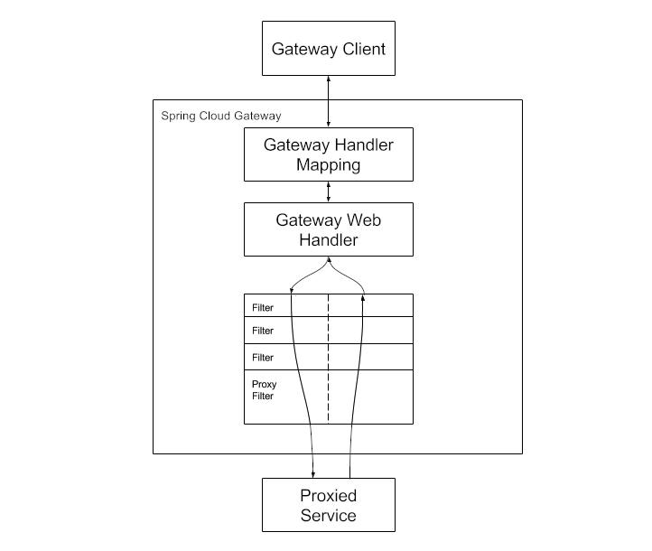
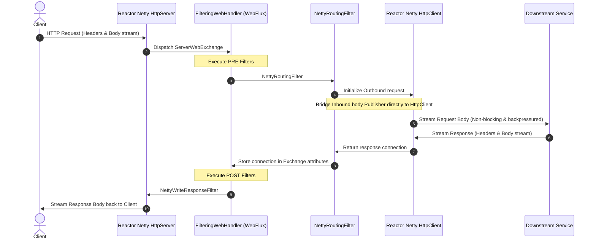

本文介绍 spring cloud gateway的架构与实现

<!--more-->

Spring Cloud Gateway aims to provide a simple, yet effective way to route to APIs and provide cross cutting concerns to them such as : Security, monitoring/metrics, and resiliency.

two flavors of Spring Cloud Gateway: Server and Proxy Exchange.

* Server variant is a full featured api gateway that can be standalone or embedded in a Spring Boot application.
* Proxy Exchange variant is exclusively for use in annotation based WebFlux or MVC applications.


# Reactive Server

Clients make requests to gateway, Gateway Handler Mapping matches request to a route, then request is sent to Gateway Web Handler. Handler runs the request through pre and post filter chains that are specific to the request. 


---

# Reactor Netty Transmission in Spring Cloud Gateway

Spring Cloud Gateway is built on top of Spring WebFlux and utilizes **Reactor Netty** as its default network communication engine. Under the hood, Reactor Netty acts as both the **Inbound HTTP Server** and the **Outbound HTTP Client**, providing fully non-blocking, event-driven, and backpressure-aware request forwarding.

## 1. Transmission Flow Architecture

When a request passes through the gateway, Reactor Netty manages the socket data at two distinct boundaries: the inbound client-facing connection and the outbound downstream-facing connection.



---

## 2. Core Transmission Filters

Spring Cloud Gateway orchestrates this transmission lifecycle using two core global filters:

### A. NettyRoutingFilter (Outbound Request)
The `NettyRoutingFilter` executes during the *PRE* phase of the filter chain. It is responsible for making the outbound proxy request using Reactor Netty's `HttpClient`:

1. **Obtain HttpClient**: It uses the autowired Reactor Netty `HttpClient` instance.
2. **Build Request**: It extracts routing information (URI, headers, HTTP method) from the inbound `ServerWebExchange`.
3. **Bridge Inbound to Outbound**: It reads the inbound request body as a reactive `Flux<DataBuffer>` and pipes it directly into the outbound client:
   ```java
   // Conceptual bridging in NettyRoutingFilter
   HttpClient.ResponseReceiver<?> responseReceiver = client
       .headers(headers -> ...)
       .request(method)
       .uri(routeUri)
       .send((request, outbound) -> {
           // Streams inbound request body directly to outbound socket
           return outbound.send(exchange.getRequest().getBody()
               .map(dataBuffer -> {
                   // Map Spring DataBuffer to Netty ByteBuf
                   return dataBuffer.asByteBuffer();
               }));
       });
   ```
4. **Capture Response**: The resulting downstream response is captured as a Netty `HttpClientResponse` connection and stored as a request attribute (`ServerWebExchangeUtils.CLIENT_RESPONSE_CONN_ATTR`) to be processed by post-filters.

### B. NettyWriteResponseFilter (Inbound Response)
The `NettyWriteResponseFilter` executes during the *POST* phase of the filter chain. It retrieves the downstream connection from the exchange attributes and writes the response body back to the client:

1. **Retrieve Connection**: Retrieves the Reactor Netty outbound connection containing the downstream response.
2. **Write Response Headers**: Copies response status code and headers from the downstream response to the client's `HttpServerResponse`.
3. **Stream Response Body**: Streams the response body publisher (`ByteBufFlux`) directly back to the client socket:
   ```java
   // Conceptual response writing
   Connection connection = exchange.getAttribute(CLIENT_RESPONSE_CONN_ATTR);
   return exchange.getResponse().writeWith(
       connection.inbound().receive().asDataStream()
   );
   ```

---

## 3. Benefits of Using Reactor Netty for Gateway Routing

*   **Zero-Copy Request Forwarding**: By utilizing Netty's direct memory buffers, request/response streams can be routed from the client socket to the downstream server with minimal copying in Java heap memory.
*   **End-to-End Backpressure**: If a downstream service slows down, the `HttpClient` outbound write buffer fills up. This signals backpressure upstream through the filter chain, telling `HttpServer` to toggle `autoRead` to `false` on the client socket. This prevents heap allocation bloat during high-traffic surges.
*   **Shared EventLoop Resources**: By default, Spring Boot configures the inbound `HttpServer` and outbound `HttpClient` to share the same EventLoop thread pool (`ReactorResourceFactory`). This minimizes thread context switching and maximizes CPU cache efficiency.


