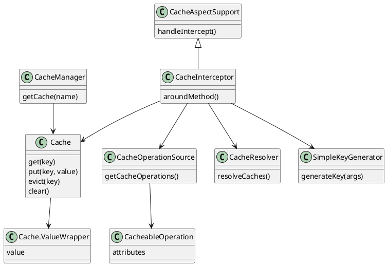

Spring Cache provides a lightweight abstraction over caching implementations and is driven by annotations such as `@Cacheable`, `@CachePut`, and `@CacheEvict`.

<!--more-->

## Spring Cache architecture

The Spring Cache architecture is centered on a few core concepts:

- `CacheManager` provides named `Cache` instances.
- `Cache` exposes basic operations: `get`, `put`, `evict`, and `clear`.
- `CacheInterceptor` (or `CacheAspectSupport`) intercepts method execution and applies caching logic.
- `CacheOperationSource` reads cache-related annotations and builds `CacheableOperation` metadata.
- `CacheResolver` chooses the actual cache(s) to use for an operation.
- `SimpleKeyGenerator` or SpEL-based key evaluation computes the cache key from method arguments.

### Key flow

1. `CacheInterceptor` intercepts the target method.
2. `CacheOperationSource` reads the `@Cacheable`, `@CachePut`, or `@CacheEvict` metadata.
3. `CacheResolver` selects the `Cache` instance(s) from `CacheManager`.
4. `SimpleKeyGenerator` or key expression evaluates the cache key.
5. The `Cache` checks for a cached `Cache.ValueWrapper`.
6. If a value exists, it returns the cached result; otherwise, the method executes and the result is stored.

This structure makes Spring Cache pluggable, letting the same annotation-driven API work with different cache providers.

