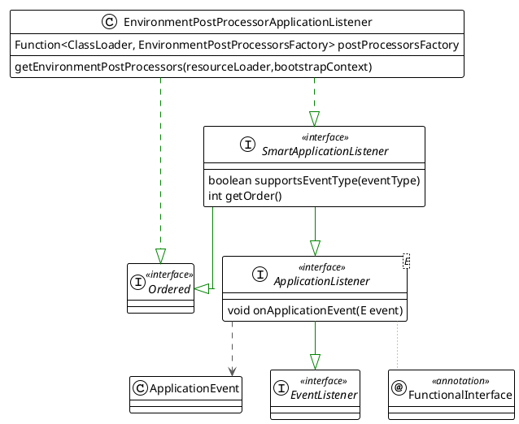

本文记录spring配置和属性的加载过程
<!--more-->


# SpringFactoriesLoader

General purpose factory loading mechanism for internal use within the framework.
`SpringFactoriesLoader` loads and instantiates factories of a given type from "META-INF/spring.factories" files which may be present in multiple JAR files in the class path.


```plantuml

class SpringFactoriesLoader {
    ClassLoader classLoader
    Map<String, List<String>> factories
    loadFactoriesResource(classLoader, location)
    <T> T instantiateFactory(name,type,argumentResolver,failureHandler)
}

```

# SpringBoot Factory

## ApplicationContextFactory
Strategy interface for creating applicationContext and ApplicationEnvironment.

```plantuml
interface ApplicationContextFactory {
    ConfigurableEnvironment createEnvironment(applicationType)
    ConfigurableApplicationContext create(applicationType)
}

class ServletWebServerApplicationContextFactory implements ApplicationContextFactory

ServletWebServerApplicationContextFactory --> ApplicationServletEnvironment: createEnv
ServletWebServerApplicationContextFactory --> ServletWebServerApplicationContext: create Context
```


```plantuml
title: ApplicationServletEnvironment
skinparam linetype ortho


' Declare interfaces
interface PropertyResolver <<interface>>
interface ConfigurablePropertyResolver <<interface>>
interface Environment <<interface>>
interface ConfigurableEnvironment <<interface>>
interface ConfigurableWebEnvironment <<interface>>

' Declare classes
class AbstractEnvironment {
    Set<String> activeProfiles
    Set<String> defaultProfiles
    MutablePropertySources propertySources
    ConfigurablePropertyResolver propertyResolver
    protected void customizePropertySources(propertySources)
}
class StandardEnvironment {
    protected void customizePropertySources(propertySources)
}
note "system properties system envs" as p1
StandardEnvironment .. p1
class StandardServletEnvironment {
    protected void customizePropertySources(propertySources)
}
class ApplicationServletEnvironment

' Define relationships with arrow pointing from class to interface (left to right)
PropertyResolver <|-- ConfigurablePropertyResolver
Environment <|-- ConfigurableEnvironment
PropertyResolver <|-- Environment
ConfigurablePropertyResolver<|-- ConfigurableEnvironment
ConfigurableEnvironment <|-- ConfigurableWebEnvironment
ConfigurableEnvironment <|-- AbstractEnvironment
AbstractEnvironment  <|-- StandardEnvironment
 StandardEnvironment  <-- StandardServletEnvironment
ConfigurableWebEnvironment  <|-- StandardServletEnvironment
StandardServletEnvironment <|-- ApplicationServletEnvironment        
```

### Environment creation and configuration

```plantuml

package SpringBoot {
    class SpringApplication  {
        ConfigurableEnvironment environment
        getOrCreateEnvironment()
        configureEnvironment(env, sourceArgs)
    }
    class ApplicationServletEnvironment
SpringApplication *-- ApplicationServletEnvironment
}
```

reference: [博客](https://cloud.tencent.com/developer/article/2342951)


## EnvironmentPostProcessorApplicationListener




