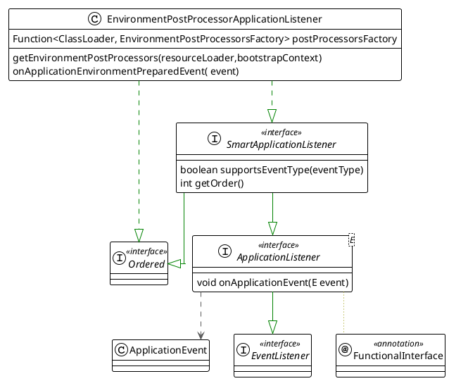

本文记录spring启动过程
<!--more-->


# SpringFactoriesLoader

General purpose factory loading mechanism for internal use within the framework.
`SpringFactoriesLoader` loads and instantiates factories of a given type from "META-INF/spring.factories" files which may be present in multiple JAR files in the class path.


```plantuml

class SpringFactoriesLoader {
    ClassLoader classLoader
    Map<String, List<String>> factories
    loadFactoriesResource(classLoader, location)
    <T> T instantiateFactory(name,type,argumentResolver,failureHandler)
}

```

# SpringBoot Factory

## ApplicationContextFactory
Strategy interface for creating applicationContext and ApplicationEnvironment.

```plantuml
interface ApplicationContextFactory {
    ConfigurableEnvironment createEnvironment(applicationType)
    ConfigurableApplicationContext create(applicationType)
}

class ServletWebServerApplicationContextFactory implements ApplicationContextFactory

ServletWebServerApplicationContextFactory --> ApplicationServletEnvironment: createEnv
ServletWebServerApplicationContextFactory --> ServletWebServerApplicationContext: create Context
```


```plantuml
title: ApplicationServletEnvironment
skinparam linetype ortho


' Declare interfaces
interface PropertyResolver <<interface>> {
    boolean containsProperty(String key)
    String getProperty(String key)
}
interface ConfigurablePropertyResolver <<interface>>
interface Environment <<interface>>
interface ConfigurableEnvironment <<interface>>
interface ConfigurableWebEnvironment <<interface>>

' Declare classes
class AbstractEnvironment {
    Set<String> activeProfiles
    Set<String> defaultProfiles
    MutablePropertySources propertySources
    ConfigurablePropertyResolver propertyResolver
    protected void customizePropertySources(propertySources)
}
class StandardEnvironment {
    protected void customizePropertySources(propertySources)
}
note "system properties system envs" as p1
StandardEnvironment .. p1
class StandardServletEnvironment {
    protected void customizePropertySources(propertySources)
}
class ApplicationServletEnvironment

' Define relationships with arrow pointing from class to interface (left to right)
PropertyResolver <|-- ConfigurablePropertyResolver
Environment <|-- ConfigurableEnvironment
PropertyResolver <|-- Environment
ConfigurablePropertyResolver<|-- ConfigurableEnvironment
ConfigurableEnvironment <|-- ConfigurableWebEnvironment
ConfigurableEnvironment <|-- AbstractEnvironment
AbstractEnvironment  <|-- StandardEnvironment
 StandardEnvironment  <-- StandardServletEnvironment
ConfigurableWebEnvironment  <|-- StandardServletEnvironment
StandardServletEnvironment <|-- ApplicationServletEnvironment        
```

### Environment creation and configuration

```plantuml

package SpringBoot {
    class SpringApplication  {
        ConfigurableEnvironment environment
        getOrCreateEnvironment()
        configureEnvironment(env, sourceArgs)
    }
    class ApplicationServletEnvironment
SpringApplication *-- ApplicationServletEnvironment
}
```

reference: [博客](https://cloud.tencent.com/developer/article/2342951)


## ApplicationListener


### EnvironmentPostProcessorApplicationListener




## EnvironmentPostProcessor


### ConfigDataEnvironmentPostProcessor

```plantuml


!theme plain
top to bottom direction
skinparam linetype ortho

class ConfigDataEnvironmentPostProcessor {
    void postProcessEnvironment( environment,  application)
}
class ConfigDataEnvironment {
    ConfigurableBootstrapContext bootstrapContext
    ConfigurableEnvironment environment
    ConfigDataLocationResolvers resolvers
    Collection<String> additionalProfiles
    ConfigDataEnvironmentUpdateListener environmentUpdateListener
    ConfigDataLoaders loaders
    ConfigDataEnvironmentContributors contributors
    void processAndApply()
}


interface EnvironmentPostProcessor << interface >>

interface Ordered << interface >>

ConfigDataEnvironmentPostProcessor  -[#008200,dashed]-^  EnvironmentPostProcessor           
ConfigDataEnvironmentPostProcessor  -[#008200,dashed]-^  Ordered     

ConfigDataEnvironmentPostProcessor --> ConfigDataEnvironment: process
        

```

#### ConfigData processing

`ConfigDataLocationResolver` strategy interface used to resolve locations into on or more resources.

`ConfigDataLoader` strategy class that can be used to load `ConfigData` for a given `ConfigDataResource`


```plantuml
class EnvironmentPostProcessorApplicationListener{
    onApplicationEnvironmentPreparedEvent(event)
}


class ConfigDataEnvironmentPostProcessor {
    void postProcessEnvironment( environment,  application)
}

class ConfigDataEnvironment {

    ConfigurableEnvironment environment
    ConfigDataLocationResolvers resolvers
    Collection<String> additionalProfiles
    ConfigDataEnvironmentUpdateListener environmentUpdateListener
    ConfigDataLoaders loaders
    ConfigDataEnvironmentContributors contributors
    void processAndApply()
}

class ConfigDataLocationResolvers {
    List<ConfigDataLocationResolver<?>> resolvers
    List<ConfigDataResolutionResult> resolve(context, location,profiles)
}

interface  ConfigDataLocationResolver<R extends ConfigDataResource> {
    boolean isResolvable(context,location)
    List<R> resolve(context,location)
}

class StandardConfigDataLocationResolver implements  ConfigDataLocationResolver<StandardConfigDataResource> {
    String[] configNames
    List<PropertySourceLoader> propertySourceLoaders
}

interface PropertySourceLoader {
    String[] getFileExtensions()
    List<PropertySource<?>> load(String name, Resource resource)
}

class ConfigDataLoaders {
    List<ConfigDataLoader> loaders
}

class ConfigDataEnvironmentContributors {
    ConfigDataEnvironmentContributor root
    ConfigurableBootstrapContext bootstrapContext
    Binder getBinder(activationContext,filter,options)
}

class ConfigDataEnvironmentContributor implements Iterable {
    ConfigDataLocation location
    ConfigDataResource resource
    PropertySource<?> propertySource
    ConfigurationPropertySource configurationPropertySource
    ConfigDataProperties properties
    Map<ImportPhase, List<ConfigDataEnvironmentContributor>> children
    iterator()

}

class Binder {
    Iterable<ConfigurationPropertySource> sources
    ConfigurationProperty findProperty(name, target,context)
}


EnvironmentPostProcessorApplicationListener --> ConfigDataEnvironmentPostProcessor: onEnvironmentPrepared
ConfigDataEnvironmentPostProcessor --> ConfigDataEnvironment: createEnv

ConfigDataEnvironment *-- ConfigDataLocationResolvers
ConfigDataEnvironment *-- ConfigDataLoaders
ConfigDataEnvironment *-- ConfigDataEnvironmentContributors
ConfigDataEnvironmentContributors *-- ConfigDataEnvironmentContributor
ConfigDataEnvironmentContributors --> Binder

ConfigDataLocationResolvers o-- ConfigDataLocationResolver

StandardConfigDataLocationResolver o-- PropertySourceLoader

```


