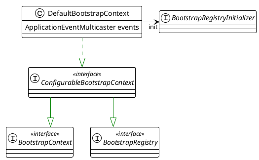
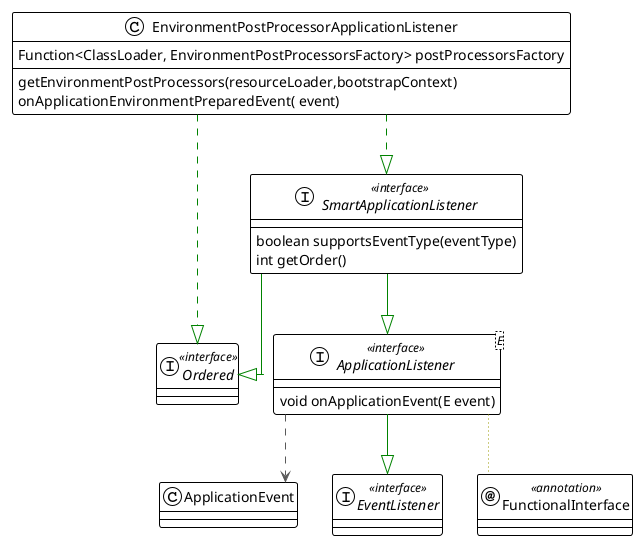

本文介绍springBoot架构与实现
<!--more-->


# 1. Bootstrap 


## SpringApplication

Class that can be used to bootstrap and launch a Spring application from a java main method. 
Typical bootstrap steps:
1. create `ApplicationContext`
2. register `CommandLinePropertySource` to expose command line arguments as Spring properties.
3. refresh the application context, loading all singleton beans
4. trigger any `CommandLineRunner` beans.

```plantuml
class SpringApplication {
    List<BootstrapRegistryInitializer> bootstrapRegistryInitializers
    List<ApplicationContextInitializer<?>> initializers
    List<ApplicationListener<?>> listeners
}
```


```plantuml
title: bootstrap process
:createBootStrapContext;
:SpringApplicationRunListeners.starting(bootstrapContext,mainclass);
:prepareEnvironment(listeners,bootstrapContext,applicationArguments);
:createApplicationContext();
:prepareContext(bootStrapContext,context,environment,listeners,appArgs);
:refreshContext(context);
:afterRefresh(context,appArgs);
:listenner.started(context,time);
:callRunners(context, appArgs);
```


### BootStrapContext
A simple bootstrap context that is available during startup and `Environment` post-processing up to the point that the `ApplicationContext` is prepared.




### SpringApplicationRunListeners

```plantuml
class SpringApplicationRunListeners {
    List<SpringApplicationRunListener> listeners
}
interface SpringApplicationRunListener {
    void starting(bootstrapContext)
    void environmentPrepared( bootstrapContext, environment)
    void contextPrepared(context)
}

class EventPublishingRunListener implements SpringApplicationRunListener {
    SpringApplication application
    SimpleApplicationEventMulticaster initialMulticaster
}

class EnvironmentPostProcessorApplicationListener implements SpringApplicationRunListener {
    Function<ClassLoader, EnvironmentPostProcessorsFactory> postProcessorsFactory
}

SpringApplicationRunListeners o-- SpringApplicationRunListener

```


## SpringBoot Factory

## ApplicationContextFactory
Strategy interface for creating applicationContext and ApplicationEnvironment.

```plantuml
interface ApplicationContextFactory {
    ConfigurableEnvironment createEnvironment(applicationType)
    ConfigurableApplicationContext create(applicationType)
}

class ServletWebServerApplicationContextFactory implements ApplicationContextFactory

ServletWebServerApplicationContextFactory --> ApplicationServletEnvironment: createEnv
ServletWebServerApplicationContextFactory --> ServletWebServerApplicationContext: create Context
```


```plantuml
title: ApplicationServletEnvironment
skinparam linetype ortho


' Declare interfaces
interface PropertyResolver <<interface>> {
    boolean containsProperty(String key)
    String getProperty(String key)
}
interface ConfigurablePropertyResolver <<interface>>
interface Environment <<interface>>
interface ConfigurableEnvironment <<interface>>
interface ConfigurableWebEnvironment <<interface>>

' Declare classes
class AbstractEnvironment {
    Set<String> activeProfiles
    Set<String> defaultProfiles
    MutablePropertySources propertySources
    ConfigurablePropertyResolver propertyResolver
    protected void customizePropertySources(propertySources)
}
class StandardEnvironment {
    protected void customizePropertySources(propertySources)
}
note "system properties system envs" as p1
StandardEnvironment .. p1
class StandardServletEnvironment {
    protected void customizePropertySources(propertySources)
}
class ApplicationServletEnvironment

' Define relationships with arrow pointing from class to interface (left to right)
PropertyResolver <|-- ConfigurablePropertyResolver
Environment <|-- ConfigurableEnvironment
PropertyResolver <|-- Environment
ConfigurablePropertyResolver<|-- ConfigurableEnvironment
ConfigurableEnvironment <|-- ConfigurableWebEnvironment
ConfigurableEnvironment <|-- AbstractEnvironment
AbstractEnvironment  <|-- StandardEnvironment
 StandardEnvironment  <-- StandardServletEnvironment
ConfigurableWebEnvironment  <|-- StandardServletEnvironment
StandardServletEnvironment <|-- ApplicationServletEnvironment        
```

### Environment creation and configuration

```plantuml

package SpringBoot {
    class SpringApplication  {
        ConfigurableEnvironment environment
        getOrCreateEnvironment()
        configureEnvironment(env, sourceArgs)
    }
    class ApplicationServletEnvironment
SpringApplication *-- ApplicationServletEnvironment
}
```

reference: [博客](https://cloud.tencent.com/developer/article/2342951)


## ApplicationListener


### EnvironmentPostProcessorApplicationListener




## EnvironmentPostProcessor


### ConfigDataEnvironmentPostProcessor

```plantuml


!theme plain
top to bottom direction
skinparam linetype ortho

class ConfigDataEnvironmentPostProcessor {
    void postProcessEnvironment( environment,  application)
}
class ConfigDataEnvironment {
    ConfigurableBootstrapContext bootstrapContext
    ConfigurableEnvironment environment
    ConfigDataLocationResolvers resolvers
    Collection<String> additionalProfiles
    ConfigDataEnvironmentUpdateListener environmentUpdateListener
    ConfigDataLoaders loaders
    ConfigDataEnvironmentContributors contributors
    void processAndApply()
}


interface EnvironmentPostProcessor << interface >>

interface Ordered << interface >>

ConfigDataEnvironmentPostProcessor  -[#008200,dashed]-^  EnvironmentPostProcessor           
ConfigDataEnvironmentPostProcessor  -[#008200,dashed]-^  Ordered     

ConfigDataEnvironmentPostProcessor --> ConfigDataEnvironment: process
        

```

#### ConfigData processing

`ConfigDataLocationResolver` strategy interface used to resolve locations into on or more resources.

`ConfigDataLoader` strategy class that can be used to load `ConfigData` for a given `ConfigDataResource`


```plantuml
class EnvironmentPostProcessorApplicationListener{
    onApplicationEnvironmentPreparedEvent(event)
}


class ConfigDataEnvironmentPostProcessor {
    void postProcessEnvironment( environment,  application)
}

class ConfigDataEnvironment {

    ConfigurableEnvironment environment
    ConfigDataLocationResolvers resolvers
    Collection<String> additionalProfiles
    ConfigDataEnvironmentUpdateListener environmentUpdateListener
    ConfigDataLoaders loaders
    ConfigDataEnvironmentContributors contributors
    void processAndApply()
}

class ConfigDataLocationResolvers {
    List<ConfigDataLocationResolver<?>> resolvers
    List<ConfigDataResolutionResult> resolve(context, location,profiles)
}

interface  ConfigDataLocationResolver<R extends ConfigDataResource> {
    boolean isResolvable(context,location)
    List<R> resolve(context,location)
}

class StandardConfigDataLocationResolver implements  ConfigDataLocationResolver<StandardConfigDataResource> {
    String[] configNames
    List<PropertySourceLoader> propertySourceLoaders
}

interface PropertySourceLoader {
    String[] getFileExtensions()
    List<PropertySource<?>> load(String name, Resource resource)
}

class ConfigDataLoaders {
    List<ConfigDataLoader> loaders
}

class ConfigDataEnvironmentContributors {
    ConfigDataEnvironmentContributor root
    ConfigurableBootstrapContext bootstrapContext
    Binder getBinder(activationContext,filter,options)
}

class ConfigDataEnvironmentContributor implements Iterable {
    ConfigDataLocation location
    ConfigDataResource resource
    PropertySource<?> propertySource
    ConfigurationPropertySource configurationPropertySource
    ConfigDataProperties properties
    Map<ImportPhase, List<ConfigDataEnvironmentContributor>> children
    iterator()

}

class Binder {
    Iterable<ConfigurationPropertySource> sources
    ConfigurationProperty findProperty(name, target,context)
}


EnvironmentPostProcessorApplicationListener --> ConfigDataEnvironmentPostProcessor: onEnvironmentPrepared
ConfigDataEnvironmentPostProcessor --> ConfigDataEnvironment: createEnv

ConfigDataEnvironment *-- ConfigDataLocationResolvers
ConfigDataEnvironment *-- ConfigDataLoaders
ConfigDataEnvironment *-- ConfigDataEnvironmentContributors
ConfigDataEnvironmentContributors *-- ConfigDataEnvironmentContributor
ConfigDataEnvironmentContributors --> Binder

ConfigDataLocationResolvers o-- ConfigDataLocationResolver

StandardConfigDataLocationResolver o-- PropertySourceLoader

```


```plantuml

top to bottom direction
package Spring {

    interface BeanFactory {
        + {static} String FACTORY_BEAN_PREFIX
        + T getBean()
        + ObjectProvider<T> getBeanProvider(Class<T>)
        + boolean containsBean(String)
        + boolean isSingleton(String)
        + boolean isPrototype(String)
        + boolean isTypeMatch(String,Class<?>)
        + Class<?> getType(String)
        + String[] getAliases(String)
    }

    interface EnvironmentCapable {
        Environment getEnvironment()
    }
    interface HierarchicalBeanFactory extends BeanFactory
interface ListableBeanFactory extends BeanFactory
interface ApplicationContext extends EnvironmentCapable, ListableBeanFactory, HierarchicalBeanFactory,MessageSource, ApplicationEventPublisher, ResourcePatternResolver {
    ApplicationContext getParent()
}

interface Lifecycle {
    void start()
    void stop()
    boolean isRunning()
}

interface ConfigurableApplicationContext extends Lifecycle {
    void setEnvironment()
    void refresh()
}

interface WebApplicationContext extends ApplicationContext {
    ServletContext getServletContext()
}

interface ConfigurableWebApplicationContext extends WebApplicationContext, ConfigurableApplicationContext {
    String[] getConfigLocations()
    void setConfigLocation()
    void setServletContext()
}

interface BeanDefinitionRegistry {
void registerBeanDefinition()
void removeBeanDefinition() 
BeanDefinition getBeanDefinition()
}

abstract class  AbstractApplicationContext {
    ApplicationContext parent
    ConfigurableEnvironment environment
    LifecycleProcessor lifecycleProcessor
    List<BeanFactoryPostProcessor> beanFactoryPostProcessors
    abstract void refreshBeanFactory()
    abstract void closeBeanFactory()
}

class GenericApplicationContext {
- DefaultListableBeanFactory beanFactory
- ResourceLoader resourceLoader
- boolean customClassLoader
- AtomicBoolean refreshed
+ void setParent(ApplicationContext)
+ void setApplicationStartup(ApplicationStartup)
+ void setAllowBeanDefinitionOverriding(boolean)
+ void setAllowCircularReferences(boolean)
+ void setResourceLoader(ResourceLoader)
+ Resource getResource(String)
+ Resource[] getResources(String)
+ void setClassLoader(ClassLoader)
+ ClassLoader getClassLoader()
# void refreshBeanFactory()
# void cancelRefresh(Throwable)
# void closeBeanFactory()
+ ConfigurableListableBeanFactory getBeanFactory()
+ DefaultListableBeanFactory getDefaultListableBeanFactory()
+ AutowireCapableBeanFactory getAutowireCapableBeanFactory()
+ void registerAlias(String,String)
+ void removeAlias(String)
+ boolean isAlias(String)
+ void refreshForAotProcessing(RuntimeHints)
- void preDetermineBeanTypes(RuntimeHints)
+ void registerBean(Class<T>,Object)
}


class GenericApplicationContext$ClassDerivedBeanDefinition {
+ Constructor<?>[] getPreferredConstructors()
+ RootBeanDefinition cloneBeanDefinition()
}


class GenericWebApplicationContext {
- ServletContext servletContext
- ThemeSource themeSource
+ void setServletContext(ServletContext)
+ ServletContext getServletContext()
+ String getApplicationName()
+ Theme getTheme(String)
+ void setServletConfig(ServletConfig)
+ ServletConfig getServletConfig()
+ void setNamespace(String)
+ String getNamespace()
+ void setConfigLocation(String)
+ void setConfigLocations(String)
+ String[] getConfigLocations()
}


ConfigurableWebApplicationContext <|.. GenericWebApplicationContext
ThemeSource <|.. GenericWebApplicationContext
GenericApplicationContext <|-- GenericWebApplicationContext


ConfigurableApplicationContext <|.. AbstractApplicationContext
DefaultResourceLoader <|-- AbstractApplicationContext


BeanDefinitionRegistry <|.. GenericApplicationContext
AbstractApplicationContext <|-- GenericApplicationContext
GenericApplicationContext +.. GenericApplicationContext$ClassDerivedBeanDefinition
RootBeanDefinition <|-- GenericApplicationContext$ClassDerivedBeanDefinition

ApplicationContext <|-- ConfigurableApplicationContext 
}

package SpringBoot {


class SpringApplication {
    WebApplicationType webApplicationType
    List<ApplicationContextInitializer<?>> initializers
    List<ApplicationListener<?>> listeners
    ApplicationContextFactory applicationContextFactory
    ConfigurableApplicationContext run(String... args)
    void prepareContext()
}


interface ApplicationContextFactory {
    ConfigurableApplicationContext create(webApplicationType)
}


class ServletWebServerApplicationContext {
- {static} Log logger
+ {static} String DISPATCHER_SERVLET_NAME
- WebServer webServer
- ServletConfig servletConfig
- String serverNamespace
+ void refresh()
+ String getServerNamespace()
+ void setServerNamespace(String)
+ void setServletConfig(ServletConfig)
+ ServletConfig getServletConfig()
+ WebServer getWebServer()
}


class ServletWebServerApplicationContext$ExistingWebApplicationScopes {
- {static} Set<String> SCOPES
- ConfigurableListableBeanFactory beanFactory
- Map<String,Scope> scopes
+ void restore()
}


ConfigurableWebServerApplicationContext <|.. ServletWebServerApplicationContext
GenericWebApplicationContext <|----- ServletWebServerApplicationContext
ServletWebServerApplicationContext +.. ServletWebServerApplicationContext$ExistingWebApplicationScopes


class ServletWebServerApplicationContextFactory implements ApplicationContextFactory
SpringApplication *-- ApplicationContextFactory
ServletWebServerApplicationContextFactory -right-> ServletWebServerApplicationContext: create
}


```

# 3. spring boot startup

```plantuml
SpringApplication--> SpringApplication:createBootstrapContext
SpringApplication--> SpringApplication:prepareEnvironment
SpringApplication--> SpringApplication:createApplicationContext
SpringApplication--> SpringApplication:prepareContext
SpringApplication--> SpringApplication:refreshContext
SpringApplication--> SpringApplication:afterRefresh
```