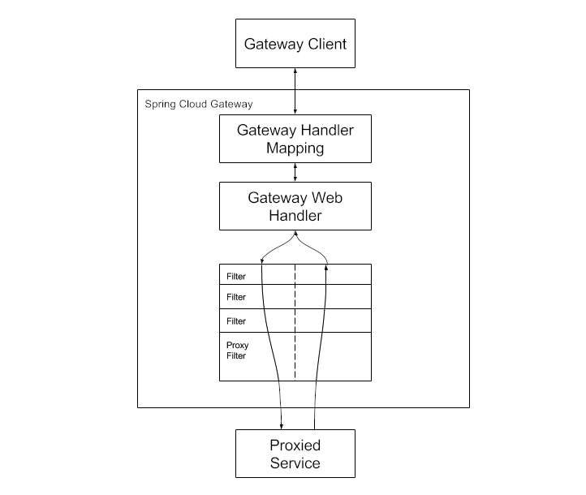

本文介绍 spring cloud gateway的架构与实现

<!--more-->

Spring Cloud Gateway aims to provide a simple, yet effective way to route to APIs and provide cross cutting concerns to them such as : Security, monitoring/metrics, and resiliency.

two flavors of Spring Cloud Gateway: Server and Proxy Exchange.

* Server variant is a full featured api gateway that can be standalone or embedded in a Spring Boot application.
* Proxy Exchange variant is exclusively for use in annotation based WebFlux or MVC applications.

#  Reactive Server

Clients make requests to gateway, Gateway Handler Mapping matches  request to a route, then request is sent to Gateway Web Handler. Handler runs the request through pre and post filter chains that are specific to the request. 

