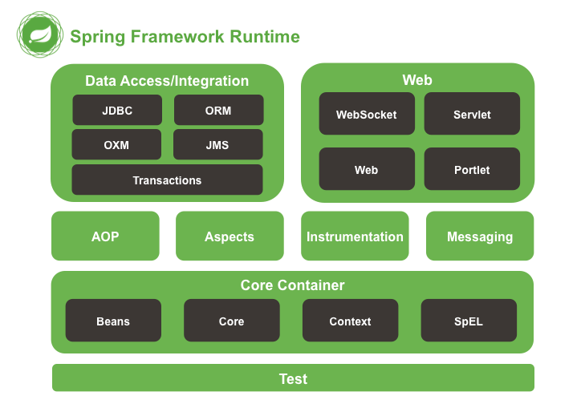
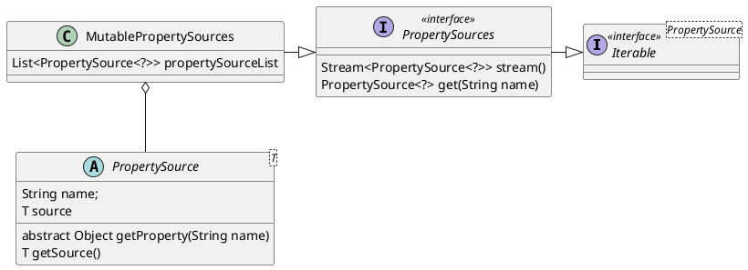
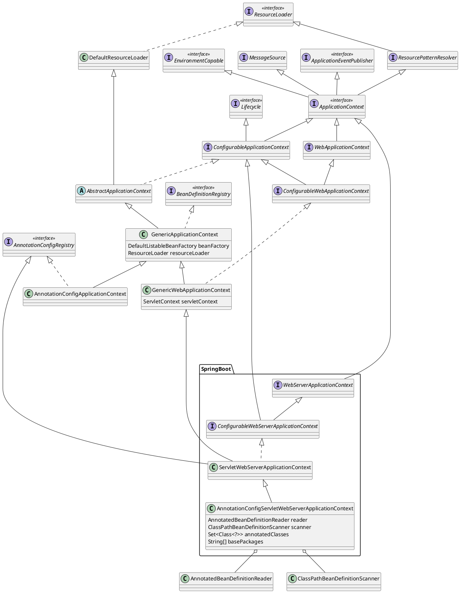
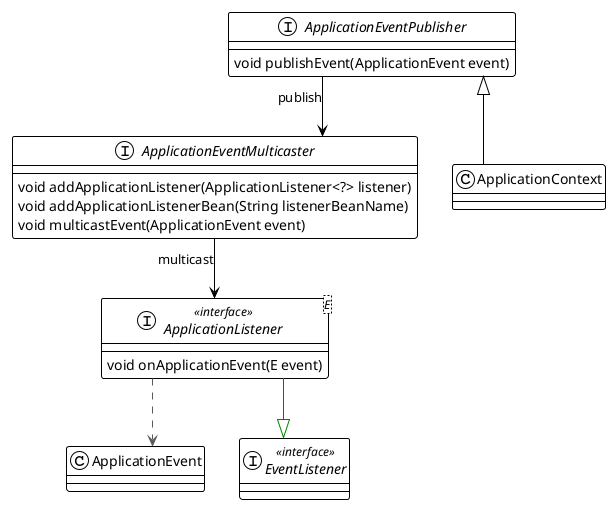
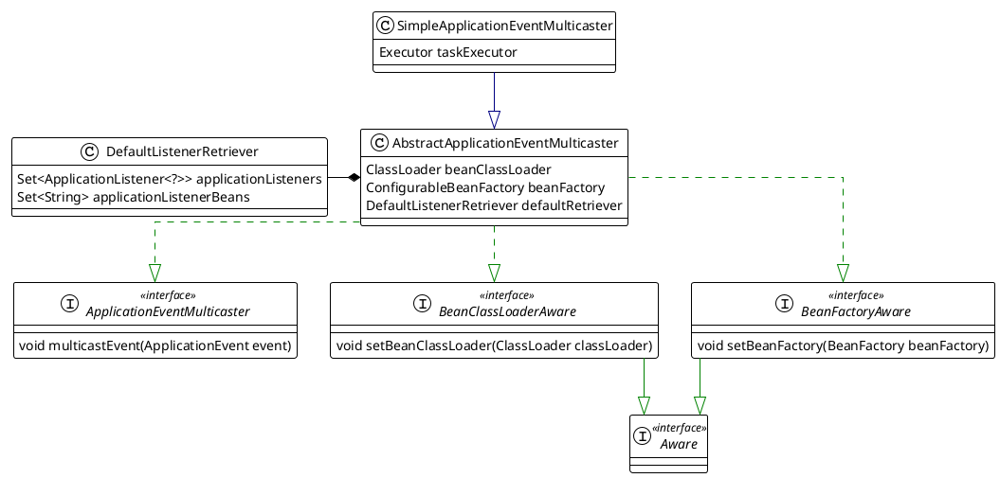

本文介绍spring Core Container
<!--more-->




# 1. Beans

Beans are created with the configuration metadata that you supply to the container.
In the container, the bean definitions are represented as `BeanDefinition` objects, contains:
1. class
2. Name
3. Scope
4. Construct arguments
5. Properties
6. Autowiring mode
7. Initialization method
8. Destruction method

## BeanDefinition

A `BeanDefinition` describes a bean instance, which has property values, constructor argument values. 
This allow a `BeanFactoryPostProcessor` to introspect and modify property values and other bean metadata.

`RootBeanDefinition` represents the merged bean definition at runtime

```plantuml
interface BeanDefinition extends AttributeAccessor,BeanMetadataElement
interface AnnotatedBeanDefinition extends BeanDefinition {
    AnnotationMetadata getMetadata()
    MethodMetadata getFactoryMethodMetadata()
}
abstract class AbstractBeanDefinition implements BeanDefinition {
    Object beanClass
    String[] dependsOn
}
class GenericBeanDefinition extends AbstractBeanDefinition
class RootBeanDefinition extends AbstractBeanDefinition
```


## FactoryBean
Interface to be implemented by objects used within a `BeanFactory` which are themselves factories for individual objects. 
A bean that implements this interface cannot be used as normal bean.

The container stores the `FactoryBean`. A normal lookup does not return that object: `getBean(name)` calls `FactoryBean.getObject()` and returns the product. Prefix the name with `&` to obtain the factory itself (`BeanFactory.FACTORY_BEAN_PREFIX`).

```java
public class Client {
    private final String endpoint;
    public Client(String endpoint) { this.endpoint = endpoint; }
    public String endpoint() { return endpoint; }
}

public class ClientFactoryBean implements FactoryBean<Client> {
    private String endpoint;

    public void setEndpoint(String endpoint) { this.endpoint = endpoint; }

    @Override
    public Client getObject() {
        return new Client(endpoint);
    }

    @Override
    public Class<?> getObjectType() {
        return Client.class;
    }

    @Override
    public boolean isSingleton() {
        return true; // container caches getObject() for this name
    }
}
```

```java
@Configuration
public class AppConfig {
    @Bean
    public ClientFactoryBean client() {
        ClientFactoryBean factory = new ClientFactoryBean();
        factory.setEndpoint("https://api.example.com");
        return factory;
    }
}
```

```java
ApplicationContext ctx = new AnnotationConfigApplicationContext(AppConfig.class);

Client product = ctx.getBean("client", Client.class);
// product.endpoint() == "https://api.example.com"
// type is Client, not ClientFactoryBean

ClientFactoryBean factory = (ClientFactoryBean) ctx.getBean("&client");
// the FactoryBean instance registered under the name "client"
```

`isSingleton() == true` means later `getBean("client")` calls reuse the same `Client`. `isSingleton() == false` makes `getObject()` run on each lookup. Dependents that declare `Client` receive the product; dependents that declare `ClientFactoryBean` receive the factory.


## Scope

Strategy interface used by `ConfigurableBeanFactory` representing a target scope to hold bean instances in. common scope
* singleton 
* prototype
* request
* session

```plantuml

interface Scope {
    Object get(String name, ObjectFactory<?> objectFactory)
    Object remove(String name)
}

```


# 2. BeanFactory

The root interface for accessing a spring bean container.
`BeanFactory` is a central registry of application components, and centralizes configuration components.

Bean Factory implementations should support the standard bean lifecycle interfaces as far as possible. The full ste of initialization methods and their standard order is:

1. BeanNameAware's `setBeanName`
2. BeanClassLoaderAware's `setBeanClassLoader`
3. BeanFactoryAware's `setBeanFactory`
4. EnvironmentAware's `setEnvironment`
5. EmbeddedValueResolverAware's `setEmbeddedValueResolver`
6. ResourceLoaderAware's `setResourceLoader`
7. ApplicationEventPublisherAware's `setApplicationEventPublisher`
8. MessageSourceAware's `setMessageSource`
9. ApplicationContextAware's `setApplicationContext`
10. ServletContextAware's `setServletContext`
11. `postProcessBeforeInitialization` methods of BeanPostProcessors
12. initializingBean's `afterPropertiesSet`
13. a custom `init-method` definition
14. `postProcessAfterInitialization` methods of BeanPostProcessors

On shutdown of a bean factory:

1. `postProcessBeforeDestruction` methods of `DestructionAwareBeanPostProcessors`
2. DisposableBean's `destroy`
3. a custom `destroy-method` definition


```plantuml

interface BeanFactory  {
    Object getBean(...)
}
interface ListableBeanFactory extends BeanFactory
interface HierarchicalBeanFactory extends BeanFactory
interface ConfigurableBeanFactory extends HierarchicalBeanFactory, SingletonBeanRegistry {
    void registerScope(String scopeName, Scope scope)
}
interface ConfigurableListableBeanFactory extends ListableBeanFactory, AutowireCapableBeanFactory, ConfigurableBeanFactory
class DefaultListableBeanFactory extends AbstractAutowireCapableBeanFactory implements ConfigurableListableBeanFactory, BeanDefinitionRegistry {
    Map<String, BeanDefinition> beanDefinitionMap
    Map<Class<?>, String[]> allBeanNamesByType
    Map<Class<?>, String[]> singletonBeanNamesByType
}

abstract class AbstractBeanFactory extends FactoryBeanRegistrySupport implements ConfigurableBeanFactory {
    BeanFactory parentBeanFactory
    List<BeanPostProcessor> beanPostProcessors
    Map<String, RootBeanDefinition> mergedBeanDefinitions
    Set<String> alreadyCreated
    Map<String, Scope> scopes

}

abstract class AbstractAutowireCapableBeanFactory extends AbstractBeanFactory implements AutowireCapableBeanFactory {
    InstantiationStrategy instantiationStrategy
}
```


# 3. Core


## SpringFactoriesLoader

`SpringFactoriesLoader` loads and instantiates factories of a given type from `META-INF/spring.factories` files which may be present in multiple JAR files


## Environment 

Environment Interface is an abstraction in container that models 2 key aspects of application environment. 

A profile is a named, logical group of bean definitions to be registered with the container only if the given profile is active

Properties play an important role in almost all applications and may originate from a variety of sources: properties files, JVM system properties, system environment variables, JNDI, servlet context parameters, ad-hoc Properties objects, Map objects, and so on


```plantuml
title: Environment
skinparam linetype ortho


' Declare interfaces
interface PropertyResolver <<interface>> {
    boolean containsProperty(String key)
    String getProperty(String key)
}
interface ConfigurablePropertyResolver <<interface>>
interface Environment <<interface>>
interface ConfigurableEnvironment <<interface>>
interface ConfigurableWebEnvironment <<interface>>

' Declare classes
class AbstractEnvironment {
    Set<String> activeProfiles
    Set<String> defaultProfiles
    MutablePropertySources propertySources
    ConfigurablePropertyResolver propertyResolver
    protected void customizePropertySources(propertySources)
    protected ConfigurablePropertyResolver createPropertyResolver( propertySources)
}
class StandardEnvironment {
    protected void customizePropertySources(propertySources)
}
note "system properties system envs" as p1
StandardEnvironment .. p1
class StandardServletEnvironment {
    protected void customizePropertySources(propertySources)
}
package SpringBoot {
    class ApplicationServletEnvironment {

    }
}


' Define relationships with arrow pointing from class to interface (left to right)
PropertyResolver <|-- ConfigurablePropertyResolver
Environment <|-- ConfigurableEnvironment
PropertyResolver <|-- Environment
ConfigurablePropertyResolver<|-- ConfigurableEnvironment
ConfigurableEnvironment <|-- ConfigurableWebEnvironment
ConfigurableEnvironment <|-- AbstractEnvironment
AbstractEnvironment  <|-- StandardEnvironment
 StandardEnvironment  <-- StandardServletEnvironment
ConfigurableWebEnvironment  <|-- StandardServletEnvironment
StandardServletEnvironment <|-- ApplicationServletEnvironment        
```

### properties

`PropertySource` Abstract base class representing a source of name/value property pairs. The underlying `source` object may be of any type `T` that encapsulates properties. 
 
Examples include `java.util.Properties` objects,`java.uti.Map` objects,`ServletContext` and `Sevletconfig` objects.





# 4. Context


## ApplicationContext

`ApplicationContext` central interface to provide configuration for an application

* Bean factory methods for accessing application components. Inherited from `ListableBeanFactory`
* The ability to load file resources. Inherited from `ResourceLoader` interface.
* The ability to publish events to registered listeners. Inherited from the `ApplicationEventPublisher`



## Event
 
`ApplicationListener` can generically declare the event type that it is interested in. When registered with a Spring `ApplicationContext`, event will be filtered accordingly, with the listener getting invoked for matching event objects.

`ApplicationListener` can be defined in `spring.factories`, it can also be added by `ClassPathBeanDefinitionScanner` by invoking `AbstractApplicationContext.registerListeners()`

`ApplicationEventMulticaster` Interface to be implemented by objects that can manage a number of `Applicationlistener` objects and publish events to them.

`SimpleApplicationEventMulticaster` is the simple implementation of the `ApplicationEventMulticaster` interface.Multicasts all events to all registered listeners.






## Application context initialization

`AbstractApplicationContext.refresh` builds the factory, runs bean-factory post-processors, then creates singleton beans. The `Environment` is created on first `getEnvironment()` and is already in place before those post-processors run.

### 1. BeanFactoryPostProcessor loading and run

Factory hook that allows for custom modification of an application context'bean definitions.

An `ApplicationContext` auto-detects `BeanFactoryPostProcessor` beans in its bean definitions and applies them before any other beans get created.

`ConfigurationClassPostProcessor` A `BeanFactoryPostProcessor` used for bootstrapping processing of `@Configuration` class. In SpringBoot, `ConfigurationClassPostProcessor` loaded when creating spring context


```plantuml
interface BeanFactoryPostProcessor {
    void postProcessBeanFactory(ConfigurableListableBeanFactory beanFactory)
}
interface BeanDefinitionRegistryPostProcessor extends BeanFactoryPostProcessor {
    void postProcessBeanDefinitionRegistry(BeanDefinitionRegistry registry)
}
class ConfigurationClassPostProcessor implements BeanDefinitionRegistryPostProcessor

```


`PostProcessorRegistrationDelegate.invokeBeanFactoryPostProcessors` loads and runs every `BeanFactoryPostProcessor` before any normal singleton is created.

Registry processors run first. `BeanDefinitionRegistryPostProcessor` beans already passed into `refresh`, then beans of that type found in the factory, are instantiated with `getBean` and called in this order: `PriorityOrdered`, `Ordered`, then the rest. Each call is `postProcessBeanDefinitionRegistry`. The scan repeats until no new registry processor appears, because one processor may register another. `ConfigurationClassPostProcessor` is `PriorityOrdered`. Its `postProcessBeanDefinitionRegistry` parses `@Configuration` classes: `@PropertySource`, `@ComponentScan`, `@Import`, `@ImportResource`, then `@Bean` methods, and registers the resulting `BeanDefinition`s. A full `@Configuration` class is enhanced by `ConfigurationClassEnhancer` so `@Bean` methods go through the container.

After every registry processor has run, the same instances receive `postProcessBeanFactory`. Regular `BeanFactoryPostProcessor`s then run in the same priority order, also via `postProcessBeanFactory`. The delegate instantiates only these post-processor beans. Ordinary singletons stay uncreated until bean init.

`registerBeanPostProcessors` runs next and only registers `BeanPostProcessor` beans. It does not create application singletons.

### 2. Bean init

Factory hook that allows for custom modification of new bean instances

```plantuml
interface BeanPostProcessor {
+ Object postProcessBeforeInitialization(Object,String)
+ Object postProcessAfterInitialization(Object,String)
}

interface MergedBeanDefinitionPostProcessor extends BeanPostProcessor  {
    void postProcessMergedBeanDefinition()
}
interface InstantiationAwareBeanPostProcessor extends BeanPostProcessor {
    default Object postProcessBeforeInstantiation(Class<?> beanClass, String beanName)
    default boolean postProcessAfterInstantiation(Object bean, String beanName)
    default PropertyValues postProcessProperties()
}
interface SmartInstantiationAwareBeanPostProcessor extends InstantiationAwareBeanPostProcessor
class AutowiredAnnotationBeanPostProcessor implements SmartInstantiationAwareBeanPostProcessor ,MergedBeanDefinitionPostProcessor
```

#### AutowiredAnnotationBeanPostProcessor
`BeanPostProcessor` implementation that autowires annotated fields,setter methods, and arbitrary config methods. Members to be injected are detected through annotations `@Autowired` and `@Value`


#### Configuration
`@Configuration` annotation can be used to indicates that a class 's primary purpose as a source of bean definitions,thus allow user to inject property sources, bean definitions in a much flexible way. 
Spring uses `ConfigurationClassPostProcessor` to bootstrap `Configuration` class internally.

##### Annotation

`@Configuration` indicates that a class declares one more `@Bean` methods

`@ComponentScan` configures component scanning directives for use with `@Configuration` classes

`@Import` indicates one or more component classes to import

`@ImportResource` indicates oen or more resources containing bean definitions to import

`@PropertySource` provides a convenient and declarative mechanism for adding a `PropertySource` to Spring's `Environment`. To be used in conjunction with `@Configuration` classes.

`@Scope` indicates the name of a scope to use

`ConfigurationClassParser` parses a `Configuration` class definition, populating a collection of `ConfigurationClass` objects.
Annotations processing sequence: 
1. `@PropertySource`
2. `@ComponentScan`
3. `@Import`
4. `@ImportResource`
5. `@Bean`


`ClassPathBeanDefinitionScanner` detects bean candidates on the classpath, registering corresponding bean definitions with a given registry.
Candidates classes are detected through configurable type filters. The default filters include classes that are annotated with Spring's
* `@Component`
* `@Repository`
* `@Service`
* `@Controller`


`ClassPathBeanDefinitionScanner` is also responsible for creating Scoped Proxy for bean with `@Scope` annotation. 

```plantuml
title component scan


class ConfigurationClassParser {
    BeanDefinitionRegistry registry
    ComponentScanAnnotationParser componentScanParser

    SourceClass doProcessConfigurationClass(configClass,sourceClass,filter)
}


class ConfigurationClassPostProcessor {
    void processConfigBeanDefinitions(BeanDefinitionRegistry registry)
}

class ComponentScanAnnotationParser {
    
}

class ClassPathBeanDefinitionScanner extends ClassPathScanningCandidateComponentProvider {
    BeanDefinitionRegistry registry
    Set<BeanDefinitionHolder> doScan(String... basePackages)
}

ConfigurationClassPostProcessor --> ConfigurationClassParser: process

ConfigurationClassParser --> ComponentScanAnnotationParser: parse

ComponentScanAnnotationParser --> ClassPathBeanDefinitionScanner:scan
```


`finishBeanFactoryInitialization` freezes the definition set and calls `DefaultListableBeanFactory.preInstantiateSingletons`. Each non-lazy singleton is created with `getBean`.

`AbstractAutowireCapableBeanFactory.createBean` resolves the class, then:

1. `resolveBeforeInstantiation` lets an `InstantiationAwareBeanPostProcessor` return a proxy and skip the constructor.
2. `createBeanInstance` uses an instance supplier, a `@Bean` factory method, an autowired constructor (`ConstructorResolver.autowireConstructor`), or the default constructor.
3. `applyMergedBeanDefinitionPostProcessors` records injection metadata (for example `@Autowired` fields).
4. `populateBean` injects properties and collaborators.
5. `initializeBean` runs `Aware` callbacks, `BeanPostProcessor.postProcessBeforeInitialization`, the init method, then `postProcessAfterInitialization`.
6. The instance is stored in the singleton cache. `registerDisposableBeanIfNecessary` records destruction callbacks.

`FactoryBean` products are obtained with `getObject` when something first requests the product name. Lazy beans stay as definitions until that lookup.

### 3. Environment and property source load

`AbstractApplicationContext.getEnvironment` creates the environment on first use. A non-web context uses `createEnvironment()`, which returns a `StandardEnvironment`. The constructor builds a `MutablePropertySources`, wraps it in a `PropertySourcesPropertyResolver`, then calls `customizePropertySources`. `StandardEnvironment` appends two sources, highest precedence first:

| Name | Contents |
|------|----------|
| `systemProperties` | `System.getProperties()` |
| `systemEnvironment` | process environment variables |

A web context overrides `createEnvironment` with `StandardServletEnvironment`. That subclass inserts stub sources `servletConfigInitParams`, `servletContextInitParams`, and optionally `jndiProperties` ahead of the system sources. `prepareRefresh` calls `initPropertySources`, which replaces those stubs with the live `ServletContext` and `ServletConfig`. It then calls `validateRequiredProperties`.

`prepareBeanFactory` registers the same `Environment` as the singleton bean `environment`, plus `systemProperties` and `systemEnvironment`. Placeholder resolution (`${...}`) in bean definitions uses `Environment.resolvePlaceholders`.

`@PropertySource` is not part of that initial set. `ConfigurationClassPostProcessor` adds each declared `PropertySource` to the `Environment` while it parses configuration classes, which is during the bean-factory post-processor phase above. Later sources do not override an earlier source with the same name unless the code explicitly replaces it. Lookup walks `MutablePropertySources` from front to back, so `systemProperties` wins over `systemEnvironment`, and servlet init parameters win over both when they are present.
