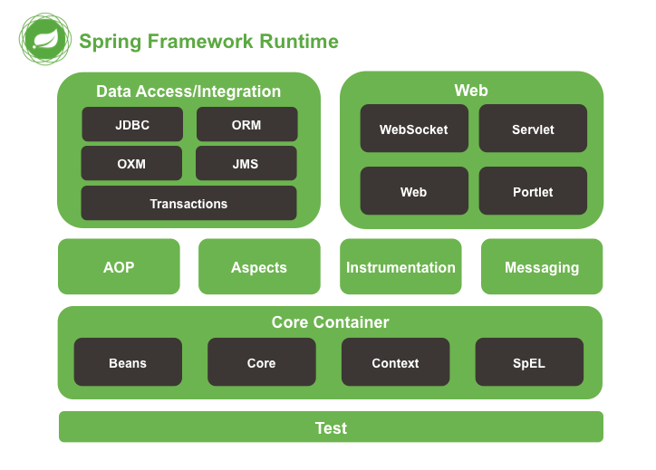
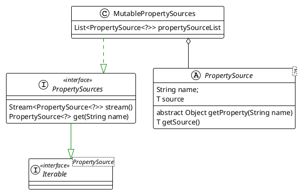
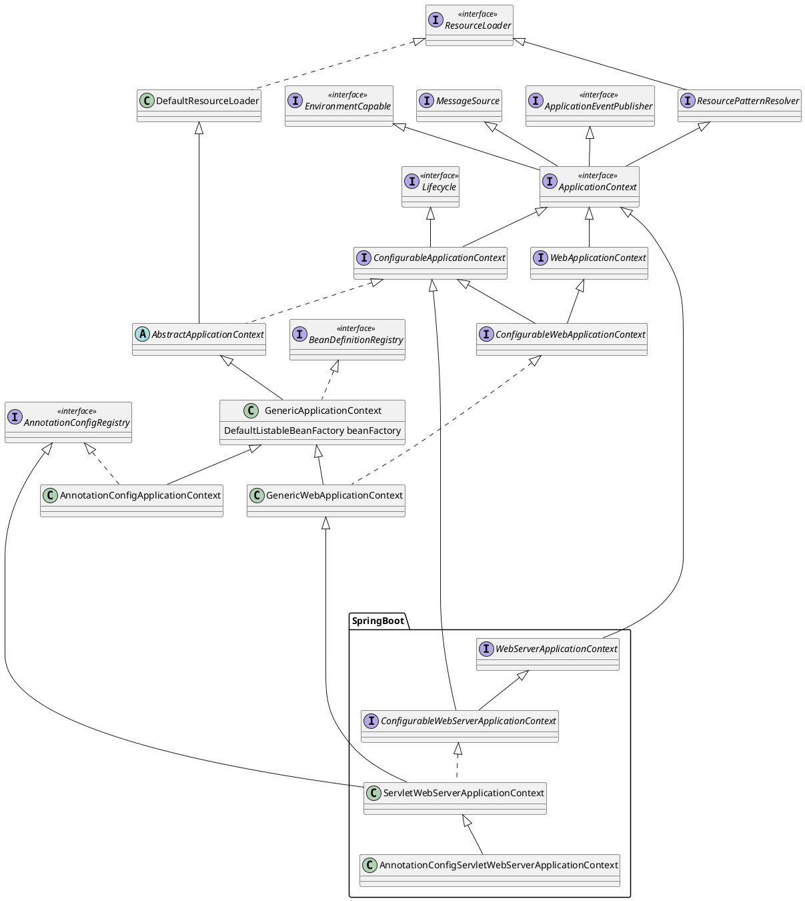
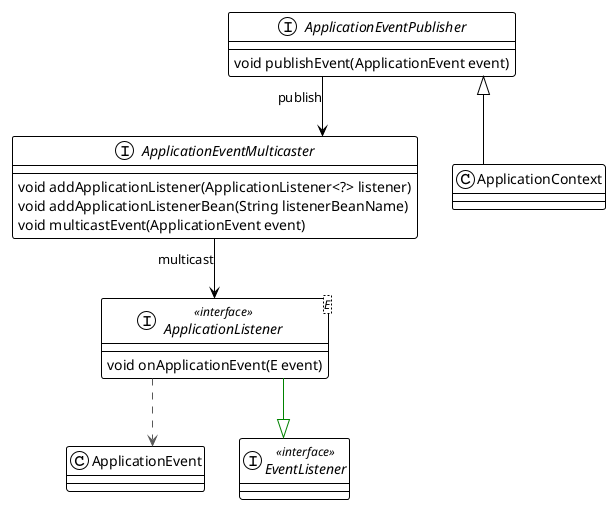
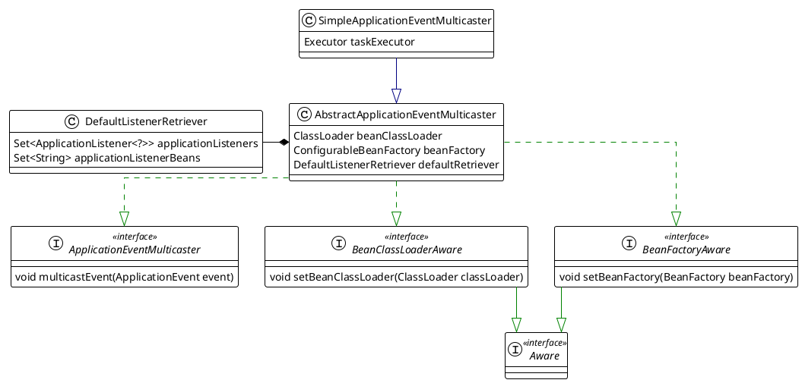

本文介绍spring架构
<!--more-->




# Beans

Beans are created with the configuration metadata that you supply to the container.
In the container, the bean definitions are represented as `BeanDefinition` objects, contains:
1. class
2. Name
3. Scope
4. Construct arguments
5. Properties
6. Autowiring mode
7. Initialization method
8. Destruction method

## BeanDefinition

A `BeanDefinition` describes a bean instance, which has property values, constructor argument values. 
This allow a `BeanFactoryPostProcessor` to introspect and modify property values and other bean metadata.

`RootBeanDefinition` represents the merged bean definition at runtime

```plantuml
interface BeanDefinition extends AttributeAccessor,BeanMetadataElement
interface AnnotatedBeanDefinition extends BeanDefinition {
    AnnotationMetadata getMetadata()
    MethodMetadata getFactoryMethodMetadata()
}
abstract class AbstractBeanDefinition implements BeanDefinition {
 
}
class GenericBeanDefinition extends AbstractBeanDefinition
class RootBeanDefinition extends AbstractBeanDefinition
```


## BeanFactory
The root interface for accessing a spring bean container.
`BeanFactory` is a central registry of application components, and centralizes configuration components.

Bean Factory implementations should support the standard bean lifecycle interfaces as far as possible. The full ste of initialization methods and their standard order is:

1. BeanNameAware's `setBeanName`
2. BeanClassLoaderAware's `setBeanClassLoader`
3. BeanFactoryAware's `setBeanFactory`
4. EnvironmentAware's `setEnvironment`
5. EmbeddedValueResolverAware's `setEmbeddedValueResolver`
6. ResourceLoaderAware's `setResourceLoader`
7. ApplicationEventPublisherAware's `setApplicationEventPublisher`
8. MessageSourceAware's `setMessageSource`
9. ApplicationContextAware's `setApplicationContext`
10. ServletContextAware's `setServletContext`
11. `postProcessBeforeInitialization` methods of BeanPostProcessors
12. initializingBean's `afterPropertiesSet`
13. a custom `init-method` definition
14. `postProcessAfterInitialization` methods of BeanPostProcessors

On shutdown of a bean factory:

1. `postProcessBeforeDestruction` methods of `DestructionAwareBeanPostProcessors`
2. DisposableBean's `destroy`
3. a custom `destroy-method` definition


```plantuml

interface BeanFactory 
interface ListableBeanFactory extends BeanFactory
interface HierarchicalBeanFactory extends BeanFactory
interface ConfigurableBeanFactory extends HierarchicalBeanFactory, SingletonBeanRegistry {
    void registerScope(String scopeName, Scope scope)
}
interface ConfigurableListableBeanFactory extends ListableBeanFactory, AutowireCapableBeanFactory, ConfigurableBeanFactory
class DefaultListableBeanFactory extends AbstractAutowireCapableBeanFactory implements ConfigurableListableBeanFactory, BeanDefinitionRegistry

abstract class AbstractBeanFactory extends FactoryBeanRegistrySupport implements ConfigurableBeanFactory {
    Map<String, Scope> scopes
}

abstract class AbstractAutowireCapableBeanFactory extends AbstractBeanFactory implements AutowireCapableBeanFactory
```


## BeanFactoryPostProcessor

Factory hook that allows for custom modification of an application context'bean definitions.

An `ApplicationContext` auto-detects `BeanFactoryPostProcessor` beans in its bean definitions and applies them before any other beans get created.

`ConfigurationClassPostProcessor` A `BeanFactoryPostProcessor` used for bootstrapping processing of `@Configuration` class


```plantuml
interface BeanFactoryPostProcessor {
    void postProcessBeanFactory(ConfigurableListableBeanFactory beanFactory)
}
interface BeanDefinitionRegistryPostProcessor extends BeanFactoryPostProcessor {
    void postProcessBeanDefinitionRegistry(BeanDefinitionRegistry registry)
}
class ConfigurationClassPostProcessor implements BeanDefinitionRegistryPostProcessor

```


## BeanPostProcessor
Factory hook that allows for custom modification of new bean instances

```plantuml
interface BeanPostProcessor {
+ Object postProcessBeforeInitialization(Object,String)
+ Object postProcessAfterInitialization(Object,String)
}

interface MergedBeanDefinitionPostProcessor extends BeanPostProcessor  {
    void postProcessMergedBeanDefinition()
}
interface InstantiationAwareBeanPostProcessor extends BeanPostProcessor {
    default Object postProcessBeforeInstantiation()
    default boolean postProcessAfterInstantiation()
    default PropertyValues postProcessProperties()
}
interface SmartInstantiationAwareBeanPostProcessor extends InstantiationAwareBeanPostProcessor
class AutowiredAnnotationBeanPostProcessor implements SmartInstantiationAwareBeanPostProcessor ,MergedBeanDefinitionPostProcessor
```

### AutowiredAnnotationBeanPostProcessor
`BeanPostProcessor` implementation that autowires annotated fields,setter methods, and arbitrary config methods. Members to be injected are detected through annotations `@Autowired` and `@Value`


## Scope

Strategy interface used by `ConfigurableBeanFactory` representing a target scope to hold bean instances in.

```plantuml

interface Scope {
    Object get(String name, ObjectFactory<?> objectFactory)
    Object remove(String name)
}

```


# Core

## SpringFactoriesLoader

`SpringFactoriesLoader` loads and instantiates factories of a given type from `META-INF/spring.factories` files which may be present in multiple JAR files


## Environment 

Environment Interface is an abstraction in container that models 2 key aspects of application environment. 

A profile is a named, logical group of bean definitions to be registered with the container only if the given profile is active

Properties play an important role in almost all applications and may originate from a variety of sources: properties files, JVM system properties, system environment variables, JNDI, servlet context parameters, ad-hoc Properties objects, Map objects, and so on


```plantuml
title: Environment
skinparam linetype ortho


' Declare interfaces
interface PropertyResolver <<interface>> {
    boolean containsProperty(String key)
    String getProperty(String key)
}
interface ConfigurablePropertyResolver <<interface>>
interface Environment <<interface>>
interface ConfigurableEnvironment <<interface>>
interface ConfigurableWebEnvironment <<interface>>

' Declare classes
class AbstractEnvironment {
    Set<String> activeProfiles
    Set<String> defaultProfiles
    MutablePropertySources propertySources
    ConfigurablePropertyResolver propertyResolver
    protected void customizePropertySources(propertySources)
    protected ConfigurablePropertyResolver createPropertyResolver( propertySources)
}
class StandardEnvironment {
    protected void customizePropertySources(propertySources)
}
note "system properties system envs" as p1
StandardEnvironment .. p1
class StandardServletEnvironment {
    protected void customizePropertySources(propertySources)
}
package SpringBoot {
    class ApplicationServletEnvironment {

    }
}


' Define relationships with arrow pointing from class to interface (left to right)
PropertyResolver <|-- ConfigurablePropertyResolver
Environment <|-- ConfigurableEnvironment
PropertyResolver <|-- Environment
ConfigurablePropertyResolver<|-- ConfigurableEnvironment
ConfigurableEnvironment <|-- ConfigurableWebEnvironment
ConfigurableEnvironment <|-- AbstractEnvironment
AbstractEnvironment  <|-- StandardEnvironment
 StandardEnvironment  <-- StandardServletEnvironment
ConfigurableWebEnvironment  <|-- StandardServletEnvironment
StandardServletEnvironment <|-- ApplicationServletEnvironment        
```

### properties

`PropertySource` Abstract base class representing a source of name/value property pairs. The underlying `source` object may be of any type `T` that encapsulates properties. 
 
Examples include `java.util.Properties` objects,`java.uti.Map` objects,`ServletContext` and `Sevletconfig` objects.





# Context


## ApplicationContext

`ApplicationContext` central interface to provide configuration for an application

* Bean factory methods for accessing application components. Inherited from `ListableBeanFactory`
* The ability to load file resources. Inherited from `ResourceLoader` interface.
* The ability to publish events to registered listeners. Inherited from the `ApplicationEventPublisher`



## Event
 
`ApplicationListener` can generically declare the event type that it is interested in. When registered with a Spring `ApplicationContext`, event will be filtered accordingly, with the listener getting invoked for matching event objects.

`ApplicationEventMulticaster` Interface to be implemented by objects that can manage a number of `Applicationlistener` objects and publish events to them.

`SimpleApplicationEventMulticaster` is the simple implementation of the `ApplicationEventMulticaster` interface.Multicasts all events to all registered listeners.






## Annotation

`@Configuration` indicates that a class declares one more `@Bean` methods

`@ComponentScan` configures component scanning directives for use with `@Configuration` classes

`@Import` indicates one or more component classes to import

`@ImportResource` indicates oen or more resources containing bean definitions to import

`@PropertySource` provides a convenient and declarative mechanism for adding a `PropertySource` to Spring's `Environment`. To be used in conjunction with `@Configuration` classes.

`@Scope` indicates the name of a scope to use

`ConfigurationClassParser` parses a `Configuration` class definition, populating a collection of `ConfigurationClass` objects.
Annotations processing sequence: 
1. `@PropertySource`
2. `@ComponentScan`
3. `@Import`
4. `@ImportResource`
5. `@Bean`


`ClassPathBeanDefinitionScanner` detects bean candidates on the classpath, registering corresponding bean definitions with a given registry.
Candidates classes are detected through configurable type filters. The default filters include classes that are annotated with Spring's
* `@Component`
* `@Repository`
* `@Service`
* `@Controller`


`ClassPathBeanDefinitionScanner` is also responsible for creating Scoped Proxy for bean with `@Scope` annotation. 

```plantuml
title component scan


class ConfigurationClassParser {
    BeanDefinitionRegistry registry
    ComponentScanAnnotationParser componentScanParser

    SourceClass doProcessConfigurationClass(configClass,sourceClass,filter)
}


class ConfigurationClassPostProcessor {
    void processConfigBeanDefinitions(BeanDefinitionRegistry registry)
}

class ComponentScanAnnotationParser {
    
}

class ClassPathBeanDefinitionScanner extends ClassPathScanningCandidateComponentProvider {
    BeanDefinitionRegistry registry
    Set<BeanDefinitionHolder> doScan(String... basePackages)
}

ConfigurationClassPostProcessor --> ConfigurationClassParser: process

ConfigurationClassParser --> ComponentScanAnnotationParser: parse

ComponentScanAnnotationParser --> ClassPathBeanDefinitionScanner:scan
```

## Application context initialization
1. `ApplicationContext` refresh will create `BeanFactory`
2. `BeanFactory` will load all beanDefinitions
3. BeanFactorypostprocess
   1. BeanDefinitionRegistryPostProcessor
      1. spring boot config bean
      2. mybatis mapperscanner
   2. BeanFactoryPostProcessor
      1. configClassEnhancer - proxy to generate bean
4. init all Singleton Beans

```plantuml
title : application context initialization
AbstractApplicationContext--> AbstractApplicationContext:refresh
AbstractApplicationContext --> BeanFactory: create
BeanFactory --> BeanFactory:loadBeanDefinitions
AbstractApplicationContext --> AbstractApplicationContext:prepareBeanFactory
AbstractApplicationContext --> AbstractApplicationContext:postProcessBeanFactory
AbstractApplicationContext --> PostProcessorRegistrationDelegate:invokeBeanFactoryPostProcessors
PostProcessorRegistrationDelegate --> BeanDefinitionRegistryPostProcessor:postProcessBeanDefinitionRegistry
AbstractApplicationContext--> AbstractApplicationContext:registerBeanPostProcessors
AbstractApplicationContext --> AbstractApplicationContext:finishBeanFactoryInitialization
AbstractApplicationContext --> BeanFactory:preInstantiateSingletons
```


## bean Initialization

```plantuml
DefaultListableBeanFactory --> DefaultListableBeanFactory:preInstantiateSingletons

DefaultListableBeanFactory --> DefaultListableBeanFactory:getBean

DefaultListableBeanFactory --> DefaultListableBeanFactory: createBean
DefaultListableBeanFactory --> DefaultListableBeanFactory: resolveBeanClass
alt proxy
DefaultListableBeanFactory --> DefaultListableBeanFactory: resolveBeforeInstantiation
end

DefaultListableBeanFactory --> DefaultListableBeanFactory: createBeanInstance
alt instanceSupplier
DefaultListableBeanFactory --> DefaultListableBeanFactory: obtainFromSupplier
end
DefaultListableBeanFactory --> BeanDefinition: getFactoryMethodName
alt factoryMethod
DefaultListableBeanFactory --> DefaultListableBeanFactory: instantiateUsingFactoryMethod
end

alt autowireNecesary
DefaultListableBeanFactory --> DefaultListableBeanFactory: autowireConstructor
else 
DefaultListableBeanFactory --> DefaultListableBeanFactory: instantiateBean
end

DefaultListableBeanFactory --> DefaultListableBeanFactory: determineConstructorsFromBeanPostProcessors
alt autowiremode
DefaultListableBeanFactory --> ConstructorResolver: new
ConstructorResolver --> ConstructorResolver: autowireConstructor
ConstructorResolver --> ConstructorResolver: instantiate
ConstructorResolver --> DefaultListableBeanFactory:beanWrapper
else 
DefaultListableBeanFactory --> DefaultListableBeanFactory:instantiateBean
end
DefaultListableBeanFactory --> DefaultListableBeanFactory:applyMergedBeanDefinitionPostProcessors
DefaultListableBeanFactory --> DefaultListableBeanFactory:populateBean : properties
DefaultListableBeanFactory --> DefaultListableBeanFactory:initializeBean

DefaultListableBeanFactory --> DefaultListableBeanFactory: getSingleton
```


