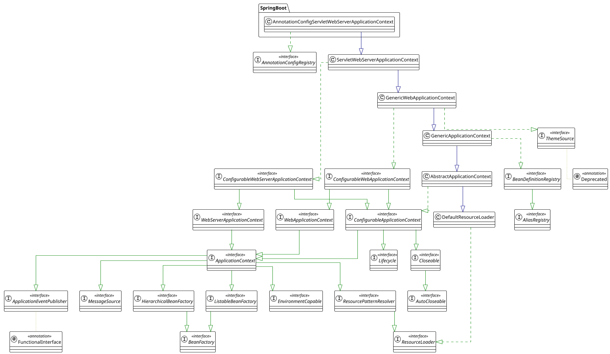
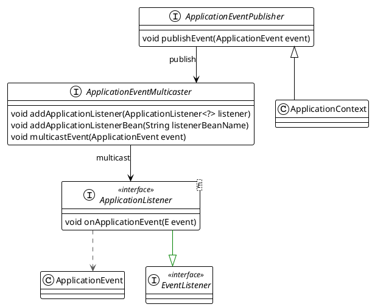
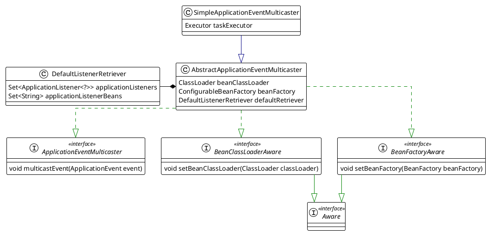

本文介绍spring架构
<!--more-->


# 1. Core


## 1.1 Environment 

Environment Interface is an abstraction in container that models 2 key aspects of application environment.

### profile
A profile is a named, logical group of bean definitions to be registered with the container only if the given profile is active

### properties
Properties play an important role in almost all applications and may originate from a variety of sources: properties files, JVM system properties, system environment variables, JNDI, servlet context parameters, ad-hoc Properties objects, Map objects, and so on


```plantuml
title: Environment
skinparam linetype ortho


' Declare interfaces
interface PropertyResolver <<interface>> {
    boolean containsProperty(String key)
    String getProperty(String key)
}
interface ConfigurablePropertyResolver <<interface>>
interface Environment <<interface>>
interface ConfigurableEnvironment <<interface>>
interface ConfigurableWebEnvironment <<interface>>

' Declare classes
class AbstractEnvironment {
    Set<String> activeProfiles
    Set<String> defaultProfiles
    MutablePropertySources propertySources
    ConfigurablePropertyResolver propertyResolver
    protected void customizePropertySources(propertySources)
    protected ConfigurablePropertyResolver createPropertyResolver( propertySources)
}
class StandardEnvironment {
    protected void customizePropertySources(propertySources)
}
note "system properties system envs" as p1
StandardEnvironment .. p1
class StandardServletEnvironment {
    protected void customizePropertySources(propertySources)
}
package SpringBoot {
    class ApplicationServletEnvironment {

    }
}


' Define relationships with arrow pointing from class to interface (left to right)
PropertyResolver <|-- ConfigurablePropertyResolver
Environment <|-- ConfigurableEnvironment
PropertyResolver <|-- Environment
ConfigurablePropertyResolver<|-- ConfigurableEnvironment
ConfigurableEnvironment <|-- ConfigurableWebEnvironment
ConfigurableEnvironment <|-- AbstractEnvironment
AbstractEnvironment  <|-- StandardEnvironment
 StandardEnvironment  <-- StandardServletEnvironment
ConfigurableWebEnvironment  <|-- StandardServletEnvironment
StandardServletEnvironment <|-- ApplicationServletEnvironment        
```

# 2. Context



## 2.1 Event
 
`ApplicationEventMulticaster` Interface to be implemented by objects that can manage a number of `Applicationlistener` objects and publish events to them.

`SimpleApplicationEventMulticaster` is the simple implementation of the `ApplicationEventMulticaster` interface.Multicasts all events to all registered listeners.






