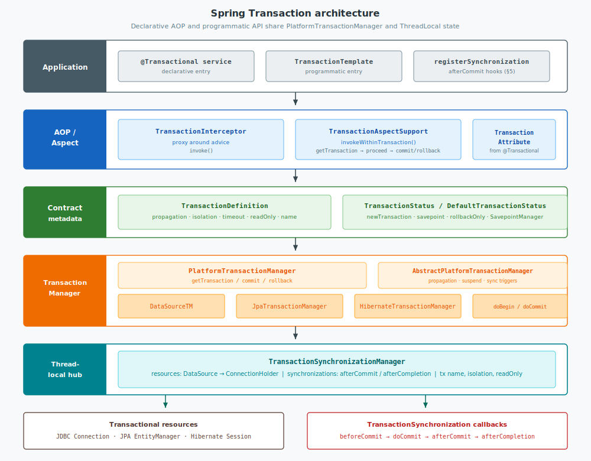
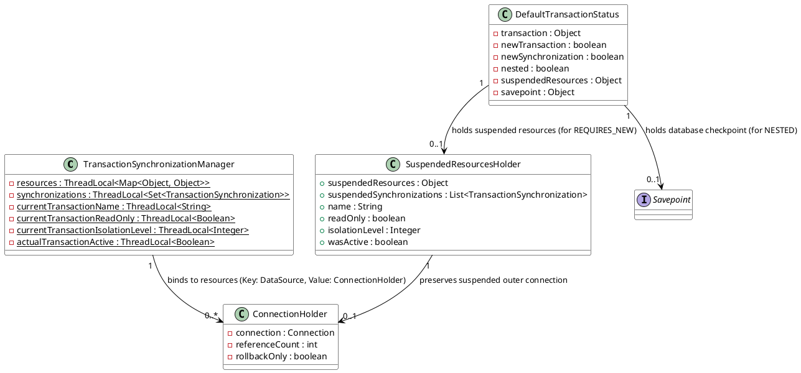
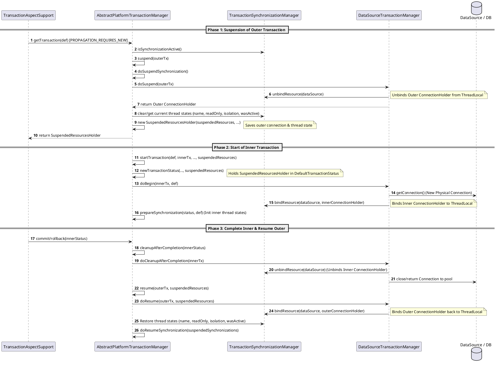
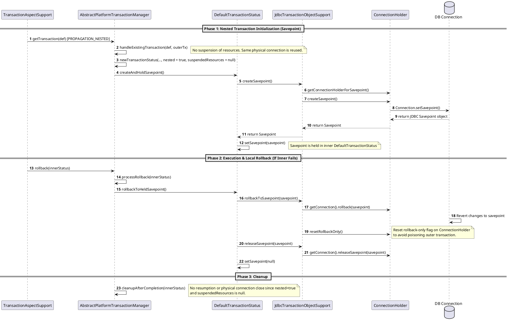

Spring Transaction is one of the most critical modules in the Spring Framework. Whether using the declarative `@Transactional` or the programmatic `TransactionTemplate`, the underlying system is built on a highly abstract and elegantly designed transaction management infrastructure.

This post dissects the inner workings of Spring transactions across **architectural design**, **core components**, **transaction execution lifecycle**, **nested transaction mechanics**, and **transaction synchronizations** (`afterCommit` and related callbacks).

<!--more-->

---

## 1. Architectural Design & Core Components

Spring's transaction management is built on the philosophy of **decoupling transaction definitions from specific transactional resources** (such as JDBC `Connection`, Hibernate `Session`, or JPA `EntityManager`). Regardless of the underlying data access technology, developers interact with a unified transaction abstraction.

### 1.1 Layered runtime architecture

A class diagram alone does not show how a call moves through Spring TX. At runtime the stack is layered: the application enters via `@Transactional` or `TransactionTemplate`; AOP advice drives `getTransaction` / `commit` / `rollback` on `PlatformTransactionManager`; the abstract manager applies propagation and triggers synchronizations; a concrete manager binds a physical resource into `TransactionSynchronizationManager`’s ThreadLocal maps.



| Layer | Responsibility |
|-------|----------------|
| Application | Business methods; optional `registerSynchronization` for post-commit work |
| AOP / Aspect | `TransactionInterceptor` → `TransactionAspectSupport.invokeWithinTransaction` |
| Contract metadata | `TransactionDefinition` (attributes) and `TransactionStatus` (runtime state, savepoints) |
| Transaction Manager | Template method propagation + `doBegin` / `doCommit` / `doRollback` on a concrete manager |
| Thread-local hub | `TransactionSynchronizationManager`: bound resources and synchronization callbacks |
| Resources & callbacks | JDBC/JPA/Hibernate handles; `afterCommit` / `afterCompletion` after physical commit |

Declarative and programmatic APIs converge on the same manager and ThreadLocal hub; only the entry path differs.

### 1.2 Core Components Class Diagram

The following class diagram shows the collaboration and inheritance structure of the key classes and interfaces in Spring Transactions:

```plantuml
@startuml
!option handwritten true
skinparam monochrome false
skinparam class {
    BackgroundColor White
    ArrowColor Black
    BorderColor Black
}

interface TransactionManager

interface PlatformTransactionManager {
    +getTransaction(TransactionDefinition) : TransactionStatus
    +commit(TransactionStatus)
    +rollback(TransactionStatus)
}

abstract class AbstractPlatformTransactionManager {
    +getTransaction(TransactionDefinition)
    +commit(TransactionStatus)
    +rollback(TransactionStatus)
    #doGetTransaction() : Object
    #doBegin(Object, TransactionDefinition)
    #doCommit(DefaultTransactionStatus)
    #doRollback(DefaultTransactionStatus)
    #doSuspend(Object) : Object
    #doResume(Object, Object)
}

class DataSourceTransactionManager {
    #doBegin(Object, TransactionDefinition)
    #doCommit(DefaultTransactionStatus)
    #doRollback(DefaultTransactionStatus)
}

interface TransactionStatus {
    +isNewTransaction() : boolean
    +hasSavepoint() : boolean
    +setRollbackOnly()
    +isRollbackOnly() : boolean
}

interface SavepointManager {
    +createSavepoint() : Object
    +rollbackToSavepoint(Object)
    +releaseSavepoint(Object)
}

abstract class AbstractTransactionStatus
class DefaultTransactionStatus

abstract class TransactionAspectSupport {
    +invokeWithinTransaction(Method, Class, InvocationCallback) : Object
}

class TransactionInterceptor {
    +invoke(MethodInvocation) : Object
}

class TransactionSynchronizationManager {
    -resources : ThreadLocal
    -synchronizations : ThreadLocal
    +bindResource(Object, Object)
    +unbindResource(Object) : Object
    +getResource(Object) : Object
    +registerSynchronization(TransactionSynchronization)
    +getSynchronizations() : List
}

interface TransactionSynchronization {
    +beforeCommit(boolean)
    +beforeCompletion()
    +afterCommit()
    +afterCompletion(int)
    +suspend()
    +resume()
}

TransactionManager <|-- PlatformTransactionManager
PlatformTransactionManager <|.. AbstractPlatformTransactionManager
AbstractPlatformTransactionManager <|-- DataSourceTransactionManager
SavepointManager <|-- TransactionStatus
TransactionStatus <|.. AbstractTransactionStatus
AbstractTransactionStatus <|-- DefaultTransactionStatus

TransactionInterceptor --|> TransactionAspectSupport
TransactionAspectSupport ..> PlatformTransactionManager : delegates to
TransactionAspectSupport ..> TransactionSynchronizationManager : accesses
DataSourceTransactionManager ..> TransactionSynchronizationManager : binds connections
TransactionSynchronizationManager "1" o-- "0..*" TransactionSynchronization : registers
AbstractPlatformTransactionManager ..> TransactionSynchronization : triggers
@enduml
```

### 1.3 Core Component Responsibilities

1. **`PlatformTransactionManager`**:
   The core strategy interface of Spring's imperative transaction infrastructure. It defines the central contracts to fetch transaction status (`getTransaction`), commit (`commit`), and roll back (`rollback`).
2. **`AbstractPlatformTransactionManager`**:
   An abstract base class that implements the **Template Method Pattern**. It handles propagation behavior, transaction suspension/resumption, and synchronization management, while delegating actual resource operations (e.g., opening a connection, setting `autoCommit` to false, committing the connection) to concrete subclasses.
3. **`DataSourceTransactionManager`**:
   The classic implementation for single data sources (JDBC/MyBatis). It manages a single JDBC `Connection` bound to the current thread.
4. **`TransactionDefinition`**:
   An interface describing transaction attributes, including propagation behavior, isolation level, timeout, read-only status, and the transaction name.
5. **`TransactionStatus` & `SavepointManager`**:
   `TransactionStatus` represents the state of the current transaction (such as whether it is new, has a savepoint, or is rollback-only). It extends `SavepointManager`, which exposes savepoint operations to the transaction manager to support nested transactions.
6. **`TransactionSynchronizationManager`**:
   A central delegate managing thread-bound resources (like `DataSource` -> `ConnectionHolder` mapping stored via `ThreadLocal`) and a thread-local set of `TransactionSynchronization` callbacks.
7. **`TransactionSynchronization`**:
   Callback interface for work around commit/rollback (`beforeCommit`, `afterCommit`, `afterCompletion`, and so on). Application code registers implementations via `TransactionSynchronizationManager.registerSynchronization`—most commonly to run logic in `afterCommit` only after a successful commit (see §5). `AbstractPlatformTransactionManager` invokes these callbacks during `commit` / `rollback`.

---

## 2. Declarative Transaction Execution Lifecycle (Sequence Flow)

When a method annotated with `@Transactional` is invoked, Spring uses AOP proxies to intercept the invocation. The sequential flow of execution is shown below:

```plantuml
@startuml
!option handwritten true
autonumber
actor Client
participant TransactionInterceptor
participant TransactionAspectSupport
participant PlatformTransactionManager
participant TransactionSynchronizationManager
database Connection as "DB Connection"
participant TargetService as "Target Service Method"

Client -> TransactionInterceptor : Invoke transactional method
TransactionInterceptor -> TransactionAspectSupport : invokeWithinTransaction()
TransactionAspectSupport -> PlatformTransactionManager : 1. getTransaction(def)

group Start physical transaction (e.g. PROPAGATION_REQUIRED)
    PlatformTransactionManager -> Connection : Open connection, setAutoCommit(false)
    PlatformTransactionManager -> TransactionSynchronizationManager : bindResource(DataSource, ConnectionHolder)
end

TransactionAspectSupport -> TargetService : 2. Execute target method proceedWithInvocation()

alt Method returns successfully
    TargetService --> TransactionAspectSupport : Return result
    TransactionAspectSupport -> PlatformTransactionManager : 3. commit(status)
    PlatformTransactionManager -> Connection : Commit physically connection.commit()
    PlatformTransactionManager -> TransactionSynchronizationManager : Clean ThreadLocal unbindResource()
    PlatformTransactionManager -> Connection : Reset connection & close / return to pool
else Method throws exception
    TargetService --> TransactionAspectSupport : Throw Throwable (e.g. RuntimeException)
    TransactionAspectSupport -> PlatformTransactionManager : 3. rollback(status)
    PlatformTransactionManager -> Connection : Roll back physically connection.rollback()
    PlatformTransactionManager -> TransactionSynchronizationManager : Clean ThreadLocal unbindResource()
    PlatformTransactionManager -> Connection : Reset connection & close / return to pool
    TransactionAspectSupport --> Client : Propagate exception
end
@enduml
```

### 2.1 The Entry Point: `TransactionAspectSupport`

The core entry point of declarative transaction execution is `TransactionInterceptor.invoke()`, which delegates to its parent method `TransactionAspectSupport.invokeWithinTransaction(...)`. 

Here is the simplified skeleton code of this method:

```java
// From TransactionAspectSupport.java
protected Object invokeWithinTransaction(Method method, @Nullable Class<?> targetClass,
        final InvocationCallback invocation) throws Throwable {

    // 1. Fetch transaction attributes and determine the transaction manager
    TransactionAttributeSource tas = getTransactionAttributeSource();
    final TransactionAttribute txAttr = (tas != null ? tas.getTransactionAttribute(method, targetClass) : null);
    final TransactionManager tm = determineTransactionManager(txAttr, targetClass);
    PlatformTransactionManager ptm = asPlatformTransactionManager(tm);
    final String joinpointIdentification = methodIdentification(method, targetClass, txAttr);

    if (txAttr == null || !(ptm instanceof CallbackPreferringPlatformTransactionManager)) {
        // 2. Create the transaction if necessary (calls ptm.getTransaction())
        TransactionInfo txInfo = createTransactionIfNecessary(ptm, txAttr, joinpointIdentification);

        Object retVal;
        try {
            // 3. Invoke the target business method (next interceptor in the chain)
            retVal = invocation.proceedWithInvocation();
        }
        catch (Throwable ex) {
            // 4. Exception caught: complete the transaction (rollback or commit depending on rules)
            completeTransactionAfterThrowing(txInfo, invocation, ex);
            throw ex;
        }
        finally {
            // 5. Restore the previous TransactionInfo thread-local
            cleanupTransactionInfo(txInfo);
        }
        
        // 6. Normal return: commit the transaction
        commitTransactionAfterReturning(txInfo);
        return retVal;
    }
    // ... handling for CallbackPreferringPlatformTransactionManager is omitted
}
```

---

## 3. Comparison of Core Transaction Propagation Behaviors

When transactional methods invoke other transactional methods, the **propagation behavior** determines how they share or isolate physical database connections. We focus on comparing `REQUIRED`, `REQUIRES_NEW`, and `NESTED`.

### 3.1 Propagation Matrix

| Propagation | Physical Connections | Independent Commit / Rollback | Exception Impact & Rollback Scope | Underlying Technical Mechanism |
| :--- | :--- | :--- | :--- | :--- |
| **`REQUIRED`** (Default) | `1` (Shared connection) | **No** | If the inner transaction fails, it marks the global transaction as `rollback-only`. Even if the outer method catches the exception, the final commit fails, throwing an `UnexpectedRollbackException` and rolling back everything. | `ThreadLocal` resource sharing |
| **`REQUIRES_NEW`** | `2` (Outer suspended, inner uses new connection) | **Yes** | The inner transaction commits or rolls back independently. If the outer method catches the inner method's exception, the outer transaction can still commit successfully. | Suspension and resumption of Connection Holders |
| **`NESTED`** | `1` (Shared connection) | **Yes (Inner rollback only)** | The inner transaction rolls back to a savepoint without affecting the outer transaction's progress. However, if the outer transaction rolls back, all changes (including the nested transaction) are rolled back. | **JDBC Savepoint** |

---

## 4. Nested Transactions (`PROPAGATION_NESTED`) Internal Mechanics

`PROPAGATION_NESTED` allows you to create isolated "sub-transactions" inside **a single physical database connection**. If a sub-transaction fails, it rolls back only to the savepoint created at its start, leaving the outer transaction active.

### 4.1 Nested Transaction Code Example

Consider two transactional services:

```java
@Service
public class OuterService {
    @Autowired
    private InnerService innerService;
    
    @Transactional(propagation = Propagation.REQUIRED)
    public void executeOuter() {
        // 1. Write operation in outer scope
        jdbcTemplate.update("INSERT INTO outer_table (name) VALUES ('outer')");
        
        try {
            // 2. Nested transaction call
            innerService.executeNested();
        } catch (RuntimeException e) {
            // 3. Catch the exception and continue outer logic
            System.out.println("Inner transaction failed, but Outer can proceed!");
        }
        
        // 4. Final write operation in outer scope
        jdbcTemplate.update("INSERT INTO outer_table (name) VALUES ('outer-final')");
    }
}

@Service
public class InnerService {
    @Transactional(propagation = Propagation.NESTED)
    public void executeNested() {
        jdbcTemplate.update("INSERT INTO inner_table (name) VALUES ('nested')");
        throw new RuntimeException("Force nested rollback!");
    }
}
```

**Execution Result:**
* The insert statement in `InnerService` is rolled back (no records in `inner_table`).
* The outer writes (`'outer'` and `'outer-final'`) in `OuterService` are **successfully committed** to `outer_table`.

**What if `InnerService` used `REQUIRED` instead of `NESTED`?**
Even though `OuterService` wraps the inner call in a try-catch block, Spring marks the global connection holder as `rollback-only`. At the end of `executeOuter()`, Spring throws an `UnexpectedRollbackException: Transaction silently rolled back because it has been marked as rollback-only`, rolling back all inserts in both tables.

---

### 4.2 Step-by-Step Source Code Trace of Nested Transactions

How does Spring manage these savepoints using a single JDBC connection? Let's trace the source code of `AbstractPlatformTransactionManager` and `JdbcTransactionObjectSupport`.

#### Step 1: Starting the Nested Transaction (Creating a Savepoint)

When `getTransaction` detects an existing transaction and the propagation behavior is `NESTED`, it executes the following path:

```java
// From AbstractPlatformTransactionManager.java (handleExistingTransaction method)
if (definition.getPropagationBehavior() == TransactionDefinition.PROPAGATION_NESTED) {
    if (!isNestedTransactionAllowed()) {
        throw new NestedTransactionNotSupportedException(
                "Transaction manager does not allow nested transactions by default - " +
                "specify 'nestedTransactionAllowed' property with value 'true'");
    }
    if (debugEnabled) {
        logger.debug("Creating nested transaction with name [" + definition.getName() + "]");
    }
    
    // useSavepointForNestedTransaction() returns true for DataSourceTransactionManager
    if (useSavepointForNestedTransaction()) {
        // Create a DefaultTransactionStatus instance
        // Arguments: newTransaction = false, newSynchronization = false, nested = true
        DefaultTransactionStatus status = newTransactionStatus(
                definition, transaction, false, false, true, debugEnabled, null);
        
        this.transactionExecutionListeners.forEach(listener -> listener.beforeBegin(status));
        try {
            // Core: Create and hold a savepoint in this transaction status object
            status.createAndHoldSavepoint();
        }
        catch (RuntimeException | Error ex) {
            this.transactionExecutionListeners.forEach(listener -> listener.afterBegin(status, ex));
            throw ex;
        }
        this.transactionExecutionListeners.forEach(listener -> listener.afterBegin(status, null));
        return status;
    }
    else {
        // Fall back to nested begin/commit calls (typically JTA environments)
        return startTransaction(definition, transaction, true, debugEnabled, null);
    }
}
```

Digging into `status.createAndHoldSavepoint()`:

```java
// From AbstractTransactionStatus.java 
public void createAndHoldSavepoint() throws TransactionException {
    // 1. Fetch the SavepointManager (which is the DataSourceTransactionObject)
    // 2. Delegate to the savepoint manager to create a savepoint
    Object savepoint = getSavepointManager().createSavepoint();
    
    // 3. Trigger synchronizations
    TransactionSynchronizationUtils.triggerSavepoint(savepoint);
    
    // 4. Save the savepoint reference locally
    setSavepoint(savepoint);
}
```

In `JdbcTransactionObjectSupport.java`, `createSavepoint` translates this to a raw JDBC call:

```java
// From JdbcTransactionObjectSupport.java
@Override
public Object createSavepoint() throws TransactionException {
    ConnectionHolder conHolder = getConnectionHolderForSavepoint();
    try {
        if (!conHolder.supportsSavepoints()) {
            throw new NestedTransactionNotSupportedException(
                    "Cannot create a nested transaction because savepoints are not supported by your JDBC driver");
        }
        if (conHolder.isRollbackOnly()) {
            throw new CannotCreateTransactionException(
                    "Cannot create savepoint for transaction which is already marked as rollback-only");
        }
        // Physical JDBC Call: connection.setSavepoint()
        return conHolder.createSavepoint();
    }
    catch (SQLException ex) {
        throw new CannotCreateTransactionException("Could not create JDBC savepoint", ex);
    }
}
```

#### Step 2: Rolling Back the Nested Transaction (Rolling Back to the Savepoint)

If the nested method throws an exception, the AOP interceptor catches it and calls `processRollback`.

```java
// From AbstractPlatformTransactionManager.java
private void processRollback(DefaultTransactionStatus status, boolean unexpected) {
    try {
        boolean unexpectedRollback = unexpected;
        boolean rollbackListenerInvoked = false;

        try {
            triggerBeforeCompletion(status);

            // If the transaction status holds a savepoint
            if (status.hasSavepoint()) {
                if (status.isDebug()) {
                    logger.debug("Rolling back transaction to savepoint");
                }
                this.transactionExecutionListeners.forEach(listener -> listener.beforeRollback(status));
                rollbackListenerInvoked = true;
                
                // Core: Roll back to the savepoint and release it
                status.rollbackToHeldSavepoint();
            }
            // If it is a root transaction, perform a physical rollback
            else if (status.isNewTransaction()) {
                logger.debug("Initiating transaction rollback");
                this.transactionExecutionListeners.forEach(listener -> listener.beforeRollback(status));
                rollbackListenerInvoked = true;
                doRollback(status);
            }
            // Participating in a larger transaction (like PROPAGATION_REQUIRED)
            else {
                if (status.hasTransaction()) {
                    // Mark the global connection holder as rollback-only!
                    if (status.isLocalRollbackOnly() || isGlobalRollbackOnParticipationFailure()) {
                        doSetRollbackOnly(status);
                    }
                }
                // ...
            }
        }
        // ... cleanup logic omitted
    }
}
```

Digging into `status.rollbackToHeldSavepoint()`:

```java
// From AbstractTransactionStatus.java
public void rollbackToHeldSavepoint() throws TransactionException {
    Object savepoint = getSavepoint();
    if (savepoint == null) {
        throw new TransactionUsageException("Cannot roll back to savepoint - no savepoint associated with current transaction");
    }
    TransactionSynchronizationUtils.triggerSavepointRollback(savepoint);
    
    // 1. Delegate rollback to SavepointManager
    getSavepointManager().rollbackToSavepoint(savepoint);
    // 2. Delegate release to SavepointManager
    getSavepointManager().releaseSavepoint(savepoint);
    // 3. Clear local savepoint state
    setSavepoint(null);
}
```

In `JdbcTransactionObjectSupport.java`, the physical rollback to savepoint occurs:

```java
// From JdbcTransactionObjectSupport.java
@Override
public void rollbackToSavepoint(Object savepoint) throws TransactionException {
    ConnectionHolder conHolder = getConnectionHolderForSavepoint();
    try {
        // Physical JDBC Call: connection.rollback(Savepoint)
        conHolder.getConnection().rollback((Savepoint) savepoint);
        
        // Critical: Reset the ConnectionHolder's rollback-only flag.
        // This ensures the failure of the nested transaction does not poison 
        // the outer transaction's physical connection state!
        conHolder.resetRollbackOnly();
    }
    catch (Throwable ex) {
        throw new TransactionSystemException("Could not roll back to JDBC savepoint", ex);
    }
}
```

#### Step 3: Committing the Nested Transaction (Releasing the Savepoint)

If the nested method completes successfully, the execution flow leads to `processCommit`.

```java
// From AbstractPlatformTransactionManager.java (processCommit method)
if (status.hasSavepoint()) {
    if (status.isDebug()) {
        logger.debug("Releasing transaction savepoint");
    }
    unexpectedRollback = status.isGlobalRollbackOnly();
    this.transactionExecutionListeners.forEach(listener -> listener.beforeCommit(status));
    commitListenerInvoked = true;
    
    // Core: Release the savepoint. Note that no physical Connection.commit() is executed here!
    status.releaseHeldSavepoint();
}
```

In `JdbcTransactionObjectSupport.java`, the savepoint is released:

```java
// From JdbcTransactionObjectSupport.java
@Override
public void releaseSavepoint(Object savepoint) throws TransactionException {
    ConnectionHolder conHolder = getConnectionHolderForSavepoint();
    try {
        // Physical JDBC Call: connection.releaseSavepoint(Savepoint)
        // Some databases (like Oracle) do not support releasing savepoints explicitly;
        // this exception is caught and safely ignored.
        conHolder.getConnection().releaseSavepoint((Savepoint) savepoint);
    }
    catch (SQLFeatureNotSupportedException ex) {
        // Ignore (typically on Oracle)
    }
    catch (SQLException ex) {
        // Additional cleanups ...
    }
}
```

**Why is there no physical `commit()` call?**
Because the nested transaction shares the same physical database connection with the outer transaction. A physical commit can only occur at the boundary of the root transaction. Releasing the savepoint simply means that the nested transaction has completed successfully and its changes are buffered in the connection. If the outer transaction commits later, the nested transaction's changes commit as well. If the outer transaction rolls back, all changes (including the nested transaction's changes) are rolled back.

---

### 4.3 Transaction Context Switching & Restoration: REQUIRES_NEW vs NESTED

To support transaction state changes (such as suspending an active transaction to start a new one, or checkpointing inside a transaction) and subsequently restoring the original state, Spring relies on specific core data structures. Understanding these structures explains how Spring manages ThreadLocals and connection boundaries without leaking or losing transaction states.

#### 4.3.1 Core Data Structures for Context Management

The class structure below illustrates how Spring keeps track of active connections, suspended states, and savepoints:



* **`TransactionSynchronizationManager`**: Acts as the ThreadLocal registry. It holds the active database connection (inside `ConnectionHolder`) keyed by the `DataSource`.
* **`SuspendedResourcesHolder`**: Acts as a backup snapshot. When `PROPAGATION_REQUIRES_NEW` suspends the current transaction, all ThreadLocal states (the current connection holder, transaction name, isolation level, read-only flag) are extracted from `TransactionSynchronizationManager` and wrapped into this holder.
* **`DefaultTransactionStatus`**: Tracks transaction execution state. It holds the reference to the `SuspendedResourcesHolder` (for suspended parent transactions) or the `Savepoint` (for nested sub-transactions).

---

#### 4.3.2 Propagation Mechanism Comparison

##### 1. `PROPAGATION_REQUIRES_NEW` (Context Suspension & Resumption)

Under `REQUIRES_NEW`, the current transaction is suspended, and a new physical connection is opened. The lifecycle of context switching and restoration is depicted below:



* **Suspension (`suspend()`)**: Unbinds the parent connection from ThreadLocal, clears transaction metadata, and packages them into `SuspendedResourcesHolder`.
* **Resumption (`resume()`)**: Re-binds the parent connection to ThreadLocal and restores the transaction properties and synchronizations after the inner transaction completes.

##### 2. `PROPAGATION_NESTED` (Savepoint Creation & Restore)

Under `NESTED`, the existing transaction connection is reused, but a checkpoint (Savepoint) is established. The context is restored simply by rolling back database operations to the savepoint:



* **Savepoint Creation**: Instead of suspending resources, it requests the database connection to mark a `Savepoint` object and registers it within `DefaultTransactionStatus`.
* **State Recovery & Protection**: If the nested method fails, it rolls back physically to the savepoint (`connection.rollback(savepoint)`). Critically, it calls `conHolder.resetRollbackOnly()`. This resets the connection's rollback-only flag so the outer transaction can proceed and commit normally.

---

## 5. Transaction Synchronizations (`afterCommit` and related callbacks)

Business code often needs side effects that must run **only after the database transaction has successfully committed**—for example publishing a domain event, sending a message, or invalidating a cache. Doing that work inside the transactional method (before `commit`) risks observers seeing data that later rolls back. Spring’s answer is **`TransactionSynchronization`**: callbacks registered on the current thread and invoked by `AbstractPlatformTransactionManager` around commit and rollback.

### 5.1 `TransactionSynchronization` contract

```java
// spring-tx — org.springframework.transaction.support.TransactionSynchronization
public interface TransactionSynchronization extends Ordered, Flushable {

  int STATUS_COMMITTED = 0;
  int STATUS_ROLLED_BACK = 1;
  int STATUS_UNKNOWN = 2;

  default void beforeCommit(boolean readOnly) { }
  default void beforeCompletion() { }
  default void afterCommit() { }
  default void afterCompletion(int status) { }
  // also: suspend / resume / flush / savepoint / savepointRollback (6.2+)
}
```

| Callback | When it runs | Typical use |
|----------|--------------|-------------|
| `beforeCommit` | Before the resource `commit`, while rollback is still possible | Flush ORM sessions / pending SQL |
| `beforeCompletion` | Before commit or rollback completes (always attempted after `beforeCommit`) | Pre-completion resource cleanup |
| **`afterCommit`** | **Only after a successful physical commit** | Events, messaging, cache updates that must not fire on rollback |
| `afterCompletion` | After commit **or** rollback (`STATUS_*`) | Unconditional cleanup; branch on `status` |

Callbacks may implement `Ordered` (or override `getOrder()`); Spring sorts them when reading the registration list. System synchronizations (for example connection holders) use reserved order values so application callbacks can interleave predictably.

### 5.2 Registration on the current transaction

Synchronizations are stored in a `ThreadLocal` set owned by `TransactionSynchronizationManager`. Registration is valid only while synchronization is active for the thread (i.e. an active Spring-managed transaction with synchronizations enabled—the default for `AbstractPlatformTransactionManager`):

```java
// TransactionSynchronizationManager.registerSynchronization
public static void registerSynchronization(TransactionSynchronization synchronization) {
  Assert.notNull(synchronization, "TransactionSynchronization must not be null");
  Set<TransactionSynchronization> synchs = synchronizations.get();
  if (synchs == null) {
    throw new IllegalStateException("Transaction synchronization is not active");
  }
  synchs.add(synchronization);
}
```

Application usage inside a `@Transactional` method (or any code running under an active transaction):

```java
@Service
public class OrderService {

  @Transactional
  public void placeOrder(Order order) {
    orderRepository.save(order);

    TransactionSynchronizationManager.registerSynchronization(
        new TransactionSynchronization() {
          @Override
          public void afterCommit() {
            // Runs only if the surrounding transaction commits successfully
            eventPublisher.publishEvent(new OrderPlacedEvent(order.getId()));
          }

          @Override
          public void afterCompletion(int status) {
            if (status == STATUS_ROLLED_BACK) {
              // optional: metrics / compensation that must run on rollback too
            }
          }
        });
  }
}
```

Lambda-friendly form (Java 8+ default methods on the interface):

```java
TransactionSynchronizationManager.registerSynchronization(new TransactionSynchronization() {
  @Override
  public void afterCommit() {
    messageSender.send("order-placed", orderId);
  }
});
```

If no transaction is active, `registerSynchronization` throws `IllegalStateException`. Guard with `TransactionSynchronizationManager.isSynchronizationActive()` when the call path may be non-transactional.

### 5.3 When `afterCommit` is triggered (manager lifecycle)

On the successful commit path, `AbstractPlatformTransactionManager.processCommit` commits the resource first, then triggers synchronizations. Exceptions from `afterCommit` propagate to the caller, but the transaction is **already committed**:

```java
// AbstractPlatformTransactionManager.processCommit (structure)
// … beforeCommit / beforeCompletion …
// … doCommit(status) — physical connection.commit() …

// Trigger afterCommit callbacks, with an exception thrown there
// propagated to callers but the transaction still considered as committed.
try {
  triggerAfterCommit(status);
}
finally {
  triggerAfterCompletion(status, TransactionSynchronization.STATUS_COMMITTED);
}

private void triggerAfterCommit(DefaultTransactionStatus status) {
  if (status.isNewSynchronization()) {
    TransactionSynchronizationUtils.triggerAfterCommit();
  }
}
```

```java
// TransactionSynchronizationUtils
public static void triggerAfterCommit() {
  invokeAfterCommit(TransactionSynchronizationManager.getSynchronizations());
}

public static void invokeAfterCommit(@Nullable List<TransactionSynchronization> synchronizations) {
  if (synchronizations != null) {
    for (TransactionSynchronization synchronization : synchronizations) {
      synchronization.afterCommit();
    }
  }
}
```

On rollback, `afterCommit` is **not** invoked; `afterCompletion(STATUS_ROLLED_BACK)` (or `STATUS_UNKNOWN`) runs instead. That asymmetry is exactly what makes `afterCommit` suitable for “publish only if persisted.”

```text
@Transactional method body
        │  registerSynchronization(afterCommit → …)
        ▼
processCommit
  beforeCommit → beforeCompletion
  doCommit (JDBC / JPA commit)
  afterCommit          ← success-only side effects
  afterCompletion(STATUS_COMMITTED)
  cleanup / unbind ThreadLocal
```

### 5.4 Participating resources and `PROPAGATION_REQUIRES_NEW`

Javadoc on `afterCommit` / `afterCompletion` warns that transactional resources may still be bound when the callback runs. Data-access code invoked from `afterCommit` therefore still **participates in the just-committed transaction context** unless it starts a new one. For any further transactional work from a synchronization, use **`PROPAGATION_REQUIRES_NEW`** (or an equivalent programmatic new transaction):

```java
@Override
public void afterCommit() {
  // Wrong if auditService is @Transactional(REQUIRED): may see a closed/finished tx oddly
  // Correct: REQUIRES_NEW so audit commits independently
  auditService.writeAuditEntryRequiresNew(orderId);
}
```

### 5.5 Higher-level alternative: transactional application events

For application code that only needs “run after commit,” Spring’s event model wraps the same mechanism:

```java
@TransactionalEventListener(phase = TransactionPhase.AFTER_COMMIT)
public void onOrderPlaced(OrderPlacedEvent event) {
  notificationClient.notify(event.orderId());
}
```

`@TransactionalEventListener` registers a synchronization (or equivalent) so the listener method runs according to `TransactionPhase` (`BEFORE_COMMIT`, `AFTER_COMMIT`, `AFTER_ROLLBACK`, `AFTER_COMPLETION`). Prefer this when the side effect is naturally modeled as an event; use explicit `TransactionSynchronization` when you need custom ordering, `beforeCommit` flushing, or non-event callbacks.

### 5.6 Relation to the lifecycle in §2

The sequence diagram in §2 shows `commit` → physical `connection.commit()` → ThreadLocal cleanup. Synchronizations slot into that path as:

1. Target method returns (synchronizations already registered during the method).
2. `beforeCommit` / `beforeCompletion`.
3. Physical commit.
4. **`afterCommit`** (success path only).
5. `afterCompletion`.
6. `cleanupAfterCompletion` (unbind resources).

Thus “execute after the transaction succeeds” is not a separate transaction API: it is a registered `TransactionSynchronization#afterCommit` (or an `AFTER_COMMIT` transactional event listener) driven by `AbstractPlatformTransactionManager`.

---

## 6. Summary

1. **Unified Interface**: Spring's `PlatformTransactionManager` decouples transaction logic from resource details, using `TransactionSynchronizationManager` and `ThreadLocal` variables to manage active connection sessions.
2. **Lifecycle Control**: `TransactionInterceptor` coordinates method execution using `TransactionInfo` to preserve state context during nested execution chains.
3. **Isolation Levels & Propagation**:
   * `REQUIRED` shares transaction state. A failure anywhere poisons the entire execution path, making it rollback-only.
   * `REQUIRES_NEW` suspends active connections and spawns a new physical connection for absolute transaction isolation.
   * `NESTED` utilizes database savepoints on a single shared connection, allowing localized rollbacks while leaving the outer transaction control intact.
4. **Post-commit callbacks**: `TransactionSynchronizationManager.registerSynchronization` registers `TransactionSynchronization` instances; `afterCommit` runs only after a successful `doCommit`, which is the supported hook for success-only side effects (events, messaging). `@TransactionalEventListener(phase = AFTER_COMMIT)` is the declarative counterpart.
