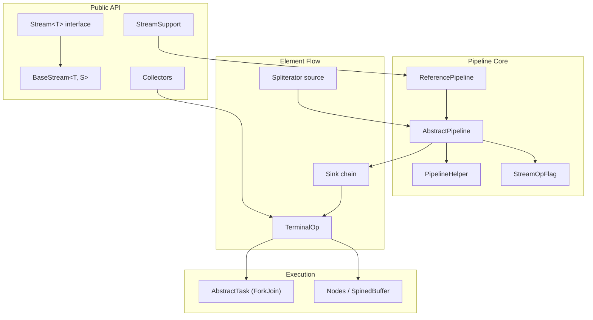
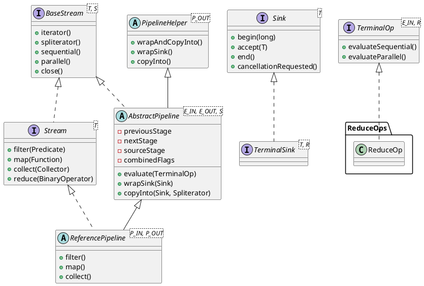
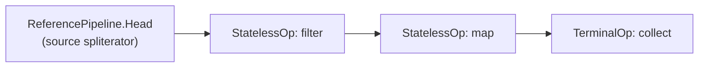
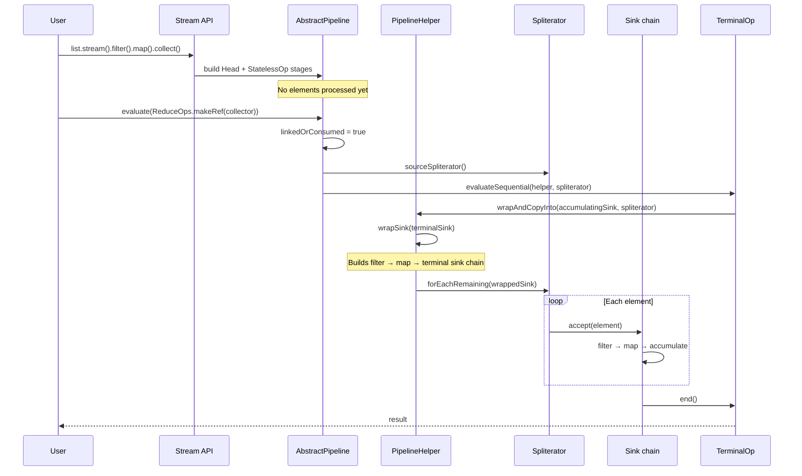

<!--more-->

`java.util.stream.Stream` is the public face of Java 8's functional-style aggregate operations. Under the hood it is not a data structure — it is a **lazy pipeline** of linked stages backed by a `Spliterator` source. Intermediate operations such as `filter` and `map` only extend the pipeline; computation begins when a terminal operation such as `collect` or `forEach` triggers evaluation. This document traces the OpenJDK implementation centered on `Stream`, its pipeline machinery, and how elements flow from source to result.

---

## 1. Overview

The `java.util.stream` package (40 source files under `src/java.base/share/classes/java/util/stream/`) implements four public stream types:

| Type | Implementation base |
|------|---------------------|
| `Stream<T>` | `ReferencePipeline` |
| `IntStream` | `IntPipeline` |
| `LongStream` | `LongPipeline` |
| `DoubleStream` | `DoublePipeline` |

All share the same architectural skeleton:

- **`BaseStream`** — common lifecycle API (`sequential`, `parallel`, `spliterator`, `close`)
- **`AbstractPipeline`** — linked list of pipeline stages; owns evaluation logic
- **`PipelineHelper`** — abstract view of a pipeline segment used during terminal evaluation
- **`Sink`** — per-stage consumer chain that pushes elements through operations
- **`TerminalOp`** — encapsulates a terminal operation's sequential/parallel execution
- **`Spliterator`** — external iterator/splitter abstraction for the data source

A typical call like `list.stream().filter(p).map(f).collect(toList())` builds a four-stage pipeline (source → filter → map → terminal) without touching any elements until `collect` runs.

---

## 2. Architecture

The design separates **declaration** (building the pipeline) from **execution** (traversing the source). Public methods on `Stream` delegate to package-private pipeline classes and operation factories.



### 2.1 Pipeline lifecycle

1. **Creation** — `StreamSupport.stream(spliterator, parallel)` constructs a `ReferencePipeline.Head` (the source stage).
2. **Chaining** — Each intermediate operation appends a new `AbstractPipeline` stage via the `previousStage` / `nextStage` links and marks the upstream stage as `linkedOrConsumed`.
3. **Terminal trigger** — A terminal method calls `AbstractPipeline.evaluate(TerminalOp)`, which obtains the source `Spliterator`, then dispatches to `evaluateSequential` or `evaluateParallel`.
4. **Traversal** — `PipelineHelper.wrapSink` builds a chained `Sink` from the terminal sink back to the source; `wrapAndCopyInto` drives the spliterator to push elements through every stage.

For sequential pipelines without stateful intermediate operations, the framework **fuses** all stages into a single pass — filter, map, and reduce can run with minimal intermediate buffering.

For parallel pipelines with **stateful** operations (`sorted`, `distinct`, `limit` in some cases), the pipeline is split into **segments** at each stateful stage; each segment is evaluated separately and its output becomes the next segment's input.

---

## 3. Structure

### 3.1 Class hierarchy



### 3.2 Pipeline stage linking

Each `AbstractPipeline` instance is one **stage**. Stages form a doubly-linked list from source to terminal:



Key fields in `AbstractPipeline`:

| Field | Role |
|-------|------|
| `sourceStage` | Back-link to the head stage (always the source) |
| `previousStage` / `nextStage` | Doubly-linked pipeline chain |
| `sourceSpliterator` / `sourceSupplier` | Lazy source, consumed once at evaluation |
| `combinedFlags` | Bitmask of `StreamOpFlag` values from source + all ops |
| `parallel` | Stored on source stage; toggled by `parallel()` / `sequential()` |
| `linkedOrConsumed` | Guards against reuse after chaining or terminal execution |

### 3.3 Operation factories

Individual stream operations are not monolithic — each lives in a dedicated factory class:

| Factory | Operations |
|---------|------------|
| `ReduceOps` | `reduce`, `collect` (via `Collector`) |
| `ForEachOps` | `forEach`, `forEachOrdered` |
| `FindOps` | `findFirst`, `findAny` |
| `MatchOps` | `anyMatch`, `allMatch`, `noneMatch` |
| `SortedOps` | `sorted` |
| `DistinctOps` | `distinct` |
| `SliceOps` | `skip`, `limit` |
| `WhileOps` | `takeWhile`, `dropWhile` |
| `GathererOp` | `gather` (Java 22+) |

---

## 4. Implementation Details

### 4.1 Stream creation

End-user entry points ultimately delegate to `StreamSupport`, which wraps a `Spliterator` in a `ReferencePipeline.Head`:

```java
// StreamSupport.java
public static <T> Stream<T> stream(Spliterator<T> spliterator, boolean parallel) {
    Objects.requireNonNull(spliterator);
    return new ReferencePipeline.Head<>(
            spliterator,
            StreamOpFlag.fromCharacteristics(spliterator),
            parallel);
}
```

`Collection.stream()` is a thin wrapper:

```java
// Collection.java
default Stream<E> stream() {
    return StreamSupport.stream(spliterator(), false);
}
```

`ReferencePipeline.Head` is the source stage. It holds the spliterator (or a `Supplier` of one) and records source characteristics as op flags. For a sequential pipeline with no intermediate ops, `forEach` bypasses the full pipeline machinery and calls `sourceStageSpliterator().forEachRemaining(action)` directly — a fast path for the common case.

### 4.2 Intermediate operations — lazy pipeline extension

Intermediate methods do **not** process elements. They return a new pipeline stage. Consider `filter`:

```java
// ReferencePipeline.java
@Override
public final Stream<P_OUT> filter(Predicate<? super P_OUT> predicate) {
    Objects.requireNonNull(predicate);
    return new StatelessOp<>(this, StreamShape.REFERENCE, StreamOpFlag.NOT_SIZED) {
        @Override
        Sink<P_OUT> opWrapSink(int flags, Sink<P_OUT> sink) {
            return new Sink.ChainedReference<>(sink) {
                @Override
                public void begin(long size) {
                    downstream.begin(-1);  // output size unknown after filter
                }

                @Override
                public void accept(P_OUT u) {
                    if (predicate.test(u))
                        downstream.accept(u);
                }
            };
        }
    };
}
```

Design points:

- **`StatelessOp`** — marks the stage as stateless (`opIsStateful() == false`), enabling single-pass fusion.
- **`opWrapSink`** — returns a `Sink.ChainedReference` that wraps the downstream sink; this is how operations compose at evaluation time.
- **`StreamOpFlag.NOT_SIZED`** — tells the framework the output size is no longer known, affecting buffer allocation and optimization.

Chaining a new stage links it to the upstream pipeline and marks upstream as consumed:

```java
// AbstractPipeline.java (intermediate-stage constructor)
AbstractPipeline(AbstractPipeline<?, E_IN, ?> previousStage, int opFlags) {
    if (previousStage.linkedOrConsumed)
        throw new IllegalStateException(MSG_STREAM_LINKED);
    previousStage.linkedOrConsumed = true;
    previousStage.nextStage = this;
    this.previousStage = previousStage;
    this.sourceStage = previousStage.sourceStage;
    this.depth = previousStage.depth + 1;
    // ...
}
```

### 4.3 The Sink protocol

`Sink<T>` extends `Consumer<T>` with a lifecycle protocol: `begin(size)` → repeated `accept(element)` → `end()`. Short-circuiting operations poll `cancellationRequested()` to stop early.

Each pipeline stage implements `opWrapSink(flags, downstreamSink)` to produce a sink that transforms elements before forwarding to `downstream`. At evaluation time, `wrapSink` walks from the terminal stage back to the source:

```java
// AbstractPipeline.java
final <P_IN> Sink<P_IN> wrapSink(Sink<E_OUT> sink) {
    for (AbstractPipeline p = AbstractPipeline.this; p.depth > 0; p = p.previousStage) {
        sink = p.opWrapSink(p.previousStage.combinedFlags, sink);
    }
    return (Sink<P_IN>) sink;
}
```

The result is a **sink chain** mirroring the pipeline in reverse — the filter sink wraps the map sink, which wraps the terminal sink. This is the internal realization of "fusion": one spliterator traversal drives the entire chain.

### 4.4 Terminal evaluation

Every terminal method on `ReferencePipeline` follows the same pattern — create a `TerminalOp` and call `evaluate`:

```java
// ReferencePipeline.java
@Override
public void forEach(Consumer<? super P_OUT> action) {
    evaluate(ForEachOps.makeRef(action, false));
}

@Override
public final P_OUT reduce(final P_OUT identity, final BinaryOperator<P_OUT> accumulator) {
    return evaluate(ReduceOps.makeRef(identity, accumulator, accumulator));
}

@Override
public <R, A> R collect(Collector<? super P_OUT, A, R> collector) {
    // ... concurrent fast path for parallel + CONCURRENT collectors ...
    A container = evaluate(ReduceOps.makeRef(collector));
    return collector.characteristics().contains(Collector.Characteristics.IDENTITY_FINISH)
           ? (R) container
           : collector.finisher().apply(container);
}
```

`evaluate` is the single entry point for pipeline consumption:

```java
// AbstractPipeline.java
final <R> R evaluate(TerminalOp<E_OUT, R> terminalOp) {
    if (linkedOrConsumed)
        throw new IllegalStateException(MSG_STREAM_LINKED);
    linkedOrConsumed = true;

    return isParallel()
           ? terminalOp.evaluateParallel(this, sourceSpliterator(terminalOp.getOpFlags()))
           : terminalOp.evaluateSequential(this, sourceSpliterator(terminalOp.getOpFlags()));
}
```

Once `evaluate` runs, the stream is **consumed** — further operations throw `IllegalStateException`.

### 4.5 Driving the spliterator

After sinks are wrapped, traversal is straightforward:

```java
// AbstractPipeline.java
final <P_IN, S extends Sink<E_OUT>> S wrapAndCopyInto(S sink, Spliterator<P_IN> spliterator) {
    copyInto(wrapSink(Objects.requireNonNull(sink)), spliterator);
    return sink;
}

final <P_IN> void copyInto(Sink<P_IN> wrappedSink, Spliterator<P_IN> spliterator) {
    if (!StreamOpFlag.SHORT_CIRCUIT.isKnown(getStreamAndOpFlags())) {
        wrappedSink.begin(spliterator.getExactSizeIfKnown());
        spliterator.forEachRemaining(wrappedSink);
        wrappedSink.end();
    } else {
        copyIntoWithCancel(wrappedSink, spliterator);
    }
}
```

For non-short-circuit pipelines, the spliterator pushes every element into the wrapped sink in one fused pass. Short-circuit pipelines (`findFirst`, `anyMatch`, etc.) use `copyIntoWithCancel`, which checks `cancellationRequested()` after each element.

### 4.6 Reduction and collection

`ReduceOps` factory builds anonymous `TerminalOp` instances backed by `AccumulatingSink` objects. A reducing sink holds mutable state, accepts elements, and supports `combine` for parallel merging:

```java
// ReduceOps.java (simplified)
class ReducingSink extends Box<U> implements AccumulatingSink<T, U, ReducingSink> {
    @Override
    public void begin(long size) { state = seed; }

    @Override
    public void accept(T t) { state = reducer.apply(state, t); }

    @Override
    public void combine(ReducingSink other) { state = combiner.apply(state, other.state); }
}
```

In parallel mode, `AbstractTask` (a `CountedCompleter` subclass) splits the spliterator recursively via `ForkJoinPool`, each leaf task runs `doLeaf()` on its chunk, and `onCompletion()` merges sibling results using `combine`.

### 4.7 StreamOpFlag — optimization metadata

`StreamOpFlag` is an enum encoding stream characteristics as bit flags: `DISTINCT`, `SORTED`, `ORDERED`, `SIZED`, `SHORT_CIRCUIT`, etc. Flags from the source spliterator and each operation are **combined** as stages are linked (`StreamOpFlag.combineOpFlags`).

The framework uses these flags to:

- Skip unnecessary sorting or deduplication when already known
- Choose between `forEachRemaining` and element-by-element cancellation
- Enable the concurrent-collector fast path in parallel unordered streams
- Split parallel pipelines at stateful operation boundaries

### 4.8 Stateful vs stateless operations

| Category | Examples | Behavior |
|----------|----------|----------|
| Stateless | `filter`, `map`, `peek`, `flatMap` | No memory of prior elements; fusible in one pass |
| Stateful | `distinct`, `sorted`, `limit`, `skip` | May buffer or require full input; splits parallel segments |

Stateful parallel stages call `opEvaluateParallel`, materialize results into a `Node` (tree or array-backed buffer via `Nodes` / `SpinedBuffer`), then feed the next segment.

### 4.9 End-to-end sequence



---

## 5. Key Files

| File | Role | Notable types |
|------|------|---------------|
| `Stream.java` | Public `Stream<T>` interface + static factories (`of`, `iterate`, `generate`, `concat`) | `Stream`, `Builder` |
| `BaseStream.java` | Shared stream lifecycle interface | `BaseStream` |
| `AbstractPipeline.java` | Pipeline linked list, evaluation, sink wrapping | `AbstractPipeline` |
| `ReferencePipeline.java` | Object-reference stream implementation; `Head`, `StatelessOp`, `StatefulOp` | `ReferencePipeline` |
| `StreamSupport.java` | Low-level stream construction from `Spliterator` | `stream()`, `intStream()`, … |
| `Sink.java` | Element protocol + chained sink adapters | `Sink`, `ChainedReference`, `OfInt` |
| `PipelineHelper.java` | Pipeline segment helper for terminal ops | `PipelineHelper` |
| `TerminalOp.java` | Terminal operation contract | `TerminalOp` |
| `ReduceOps.java` | Reduction/collection terminal ops | `makeRef`, `ReduceOp` |
| `StreamOpFlag.java` | Stream characteristic flags | `StreamOpFlag` |
| `AbstractTask.java` | ForkJoin task base for parallel ops | `AbstractTask` |
| `Nodes.java` | Tree/array node structures for materialization | `Node`, `Builder` |
| `Collectors.java` | Built-in `Collector` implementations | `toList`, `groupingBy`, … |
| `IntPipeline.java` / `LongPipeline.java` / `DoublePipeline.java` | Primitive stream pipelines | Same pattern as `ReferencePipeline` |

---

## 6. Dependencies

| Dependency | Usage |
|------------|-------|
| `java.util.Spliterator` | Source abstraction; splitting for parallelism |
| `java.util.function.*` | Behavioral parameters (predicates, mappers, reducers) |
| `java.util.concurrent.ForkJoinPool` | Parallel stream execution |
| `java.util.concurrent.CountedCompleter` | Base for `AbstractTask` work stealing |
| `Collection.spliterator()` | Default stream source for collections |

---

## 7. Design Takeaways

1. **Streams are pipelines, not collections.** The `Stream` interface is a fluent DSL; `ReferencePipeline` + `AbstractPipeline` are the real objects users hold.
2. **Laziness is structural.** Intermediate ops append stages; the source spliterator is untouched until a terminal op fires `evaluate`.
3. **Sinks enable fusion.** By chaining `Sink` wrappers at evaluation time, multiple operations collapse into one traversal — the key performance trick behind sequential streams.
4. **Spliterator is the extension point.** Any data source that can split and traverse itself can become a stream via `StreamSupport`.
5. **Flags drive optimization.** `StreamOpFlag` propagates knowledge about ordering, sizing, and distinctness so the engine can skip redundant work.
6. **Parallelism adds segmentation.** Stateful ops are the main complication — they force materialization and break the single-pass model.
