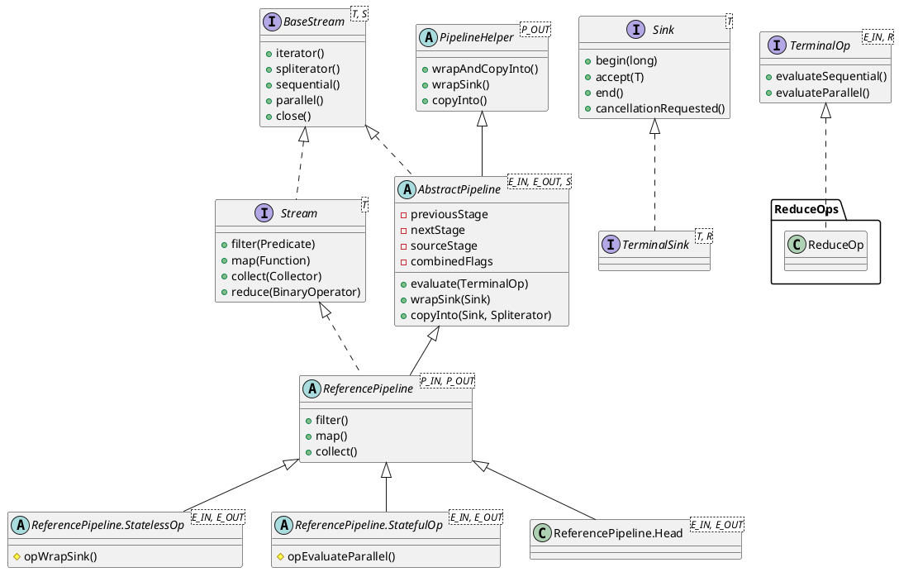
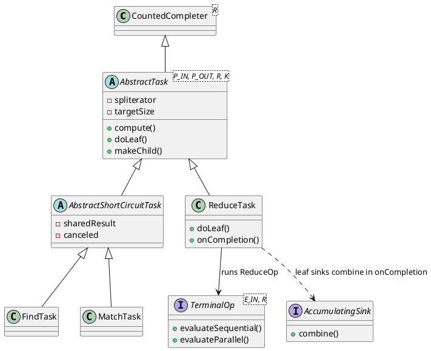
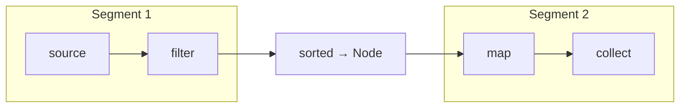

`java.util.stream.Stream` is the public face of Java 8's functional-style aggregate operations. Under the hood it is not a data structure — it is a **lazy pipeline** of linked stages backed by a `Spliterator` source. Intermediate operations such as `filter` and `map` only extend the pipeline; computation begins when a terminal operation such as `collect` or `forEach` triggers evaluation. This document traces the OpenJDK implementation centered on `Stream`, its pipeline machinery, and how elements flow from source to result.
<!--more-->

---

## 1. Overview

The `java.util.stream` package implements `Stream`, `IntStream`, `LongStream`, and `DoubleStream` — all backed by the same pipeline skeleton (`ReferencePipeline` / `*Pipeline`):

- **`BaseStream`** — common lifecycle API (`sequential`, `parallel`, `spliterator`, `close`)
- **`AbstractPipeline`** — linked list of pipeline stages; owns evaluation logic
- **`PipelineHelper`** — abstract view of a pipeline segment used during terminal evaluation
- **`Sink`** — per-stage consumer chain that pushes elements through operations
- **`TerminalOp`** — encapsulates a terminal operation's sequential/parallel execution
- **`Spliterator`** — external iterator/splitter abstraction for the data source

A typical call like `list.stream().filter(p).map(f).collect(toList())` builds a four-stage pipeline (source → filter → map → terminal) without touching any elements until `collect` runs.

---

## 2. Architecture

The design separates **declaration** (building the pipeline) from **execution** (traversing the source). Public methods on `Stream` delegate to package-private pipeline classes and operation factories.


### 2.1 Pipeline lifecycle

1. **Creation** — `StreamSupport.stream(spliterator, parallel)` constructs a `ReferencePipeline.Head` (the source stage).
2. **Chaining** — Each intermediate operation appends a new `AbstractPipeline` stage via the `previousStage` / `nextStage` links and marks the upstream stage as `linkedOrConsumed`.
3. **Terminal trigger** — A terminal method calls `AbstractPipeline.evaluate(TerminalOp)`, which obtains the source `Spliterator`, then dispatches to `evaluateSequential` or `evaluateParallel`.
4. **Traversal** — `PipelineHelper.wrapSink` builds a chained `Sink` from the terminal sink back to the source; `wrapAndCopyInto` drives the spliterator to push elements through every stage.

For sequential pipelines without stateful intermediate operations, the framework **fuses** all stages into a single pass — filter, map, and reduce can run with minimal intermediate buffering.

For parallel pipelines with **stateful** operations (`sorted`, `distinct`, `limit` in some cases), the pipeline is split into **segments** at each stateful stage; each segment is evaluated separately and its output becomes the next segment's input.

---

## 3. Structure

### 3.1 Class hierarchy



### 3.2 Pipeline stage linking

Each `AbstractPipeline` instance is one **stage**. Stages form a doubly-linked list from source to terminal:


### 3.3 Parallel execution runtime

Parallel terminal evaluation submits `AbstractTask` instances to the common `ForkJoinPool`. Tasks split the source `Spliterator`, run fused sink chains on leaf chunks, and merge partial results via `AccumulatingSink.combine()`:



---

## 4. Implementation Details

### 4.1 Stream creation and intermediate ops

`StreamSupport.stream` wraps a spliterator in `ReferencePipeline.Head` and records source flags. Intermediate methods such as `filter` append a `StatelessOp` stage — they do not process elements:

```java
// StreamSupport.java
public static <T> Stream<T> stream(Spliterator<T> spliterator, boolean parallel) {
    return new ReferencePipeline.Head<>(spliterator,
            StreamOpFlag.fromCharacteristics(spliterator), parallel);
}

// ReferencePipeline.java — filter (representative intermediate op)
return new StatelessOp<>(this, StreamShape.REFERENCE, StreamOpFlag.NOT_SIZED) {
    Sink<P_OUT> opWrapSink(int flags, Sink<P_OUT> sink) {
        return new Sink.ChainedReference<>(sink) {
            public void accept(P_OUT u) {
                if (predicate.test(u)) downstream.accept(u);
            }
        };
    }
};
```

Each new stage links via `previousStage` / `nextStage` and marks upstream `linkedOrConsumed = true`.

### 4.2 The Sink protocol and short-circuit

`Sink<T>` extends `Consumer<T>` with `begin` → `accept` → `end`. At evaluation time `wrapSink` builds a fused chain terminal-inward:

```java
final <P_IN> Sink<P_IN> wrapSink(Sink<E_OUT> sink) {
    for (AbstractPipeline p = AbstractPipeline.this; p.depth > 0; p = p.previousStage)
        sink = p.opWrapSink(p.previousStage.combinedFlags, sink);
    return (Sink<P_IN>) sink;
}
```

Pipeline stages are static **declaration**; sinks drive **execution** in one pass ($O(1)$ intermediate memory).

**Short-circuit.** Ops like `findFirst`, `anyMatch`, `limit` inject `StreamOpFlag.IS_SHORT_CIRCUIT`. Then `copyInto` uses `forEachWithCancel` — polling `cancellationRequested()` before each `tryAdvance` instead of bulk `forEachRemaining`:

```java
do { } while (!(cancelled = sink.cancellationRequested()) && spliterator.tryAdvance(sink));
```

`Sink.ChainedReference` delegates `cancellationRequested()` downstream. Terminal sinks set cancel state in `accept`:

```java
// FindOps — findFirst
public void accept(T value) { if (!hasValue) { hasValue = true; this.value = value; } }
public boolean cancellationRequested() { return hasValue; }

// SliceOps — limit(n)
public boolean cancellationRequested() { return m == 0 || downstream.cancellationRequested(); }
```

Non-short-circuit pipelines never pay the per-element poll. Parallel short-circuit ops use `AbstractShortCircuitTask` to cancel sibling ForkJoin workers once any leaf finds a result.

### 4.3 Terminal evaluation

Every terminal method creates a `TerminalOp` and calls `evaluate`, which consumes the stream and dispatches sequential or parallel:

```java
final <R> R evaluate(TerminalOp<E_OUT, R> terminalOp) {
    linkedOrConsumed = true;
    return isParallel()
           ? terminalOp.evaluateParallel(this, sourceSpliterator(terminalOp.getOpFlags()))
           : terminalOp.evaluateSequential(this, sourceSpliterator(terminalOp.getOpFlags()));
}

final <P_IN> void copyInto(Sink<P_IN> wrappedSink, Spliterator<P_IN> spliterator) {
    if (!StreamOpFlag.SHORT_CIRCUIT.isKnown(getStreamAndOpFlags())) {
        wrappedSink.begin(spliterator.getExactSizeIfKnown());
        spliterator.forEachRemaining(wrappedSink);
        wrappedSink.end();
    } else {
        copyIntoWithCancel(wrappedSink, spliterator);
    }
}
```

Parallel `reduce` / `collect` submit a `ReduceTask` that splits the spliterator, runs `wrapAndCopyInto(makeSink(), chunk)` per leaf, and merges via `AccumulatingSink.combine()` in `onCompletion`.

### 4.4 Parallel execution

`.parallel()` sets `sourceStage.parallel = true` — no threads until a terminal op runs. `AbstractTask` (a `CountedCompleter`) recursively `trySplit`s the spliterator until chunks reach target size ≈ `N / (4 × parallelism)`, then each leaf runs the fused sink chain:

```java
while (sizeEstimate > sizeThreshold && (ls = rs.trySplit()) != null) {
    leftChild = makeChild(ls);
    rightChild = makeChild(rs);
    taskToFork.fork();
}
setLocalResult(doLeaf());  // helper.wrapAndCopyInto(op.makeSink(), spliterator)
```

`ReduceTask.onCompletion` merges sibling partial results via `AccumulatingSink.combine()`. Parallel `collect` with a `CONCURRENT` collector on an unordered stream skips tree merge — workers write into one shared concurrent map.

When **stateful** ops appear (`sorted`, `distinct`, `limit`, …), the pipeline splits into segments (§4.5) instead of one fused split tree.

### 4.5 Parallel segmentation at stateful boundaries

Stateful ops need global input knowledge, so parallel evaluation **materializes barriers** between segments. This runs inside `sourceSpliterator()`, called before the terminal op:

```java
if (isParallel() && hasAnyStateful()) {
    int depth = 1;
    for (AbstractPipeline u = sourceStage, p = sourceStage.nextStage, e = this; u != e; u = p, p = p.nextStage) {
        if (p.opIsStateful()) {
            depth = 0;
            spliterator = p.opEvaluateParallelLazy(u, spliterator);  // u = upstream segment helper
        }
        p.depth = depth++;
        p.combinedFlags = StreamOpFlag.combineOpFlags(p.sourceOrOpFlags, u.combinedFlags);
    }
}
```

**`depth` rewiring.** After preparation, `wrapSink` only includes stages with `depth > 0`. For `parallel().filter().sorted().map().collect()`:

| Stage | `depth` | Role |
|-------|---------|------|
| filter | 1 | consumed inside `sorted.opEvaluateParallel` |
| sorted | 0 | barrier — excluded from terminal `wrapSink` |
| map | 1 | only op in terminal segment |

**Per-op strategies** (all call parallel collect on upstream segment first when materializing):

- **`sorted`** — `helper.evaluate()` → `Node` → `Arrays.parallelSort`
- **`distinct` (ordered)** — parallel collect into `LinkedHashSet`; unordered may use lazy `DistinctSpliterator`
- **`limit/skip`** — cheap `SliceSpliterator` if unordered+subsized; else `SliceTask` full materialization

Example `parallel().filter().sorted().map().collect()`: `sorted` parallel-collects+filters into a `Node`, sorts it, returns a spliterator; terminal `ReduceTask` splits that sorted output and runs only the `map` sink per leaf.



---
