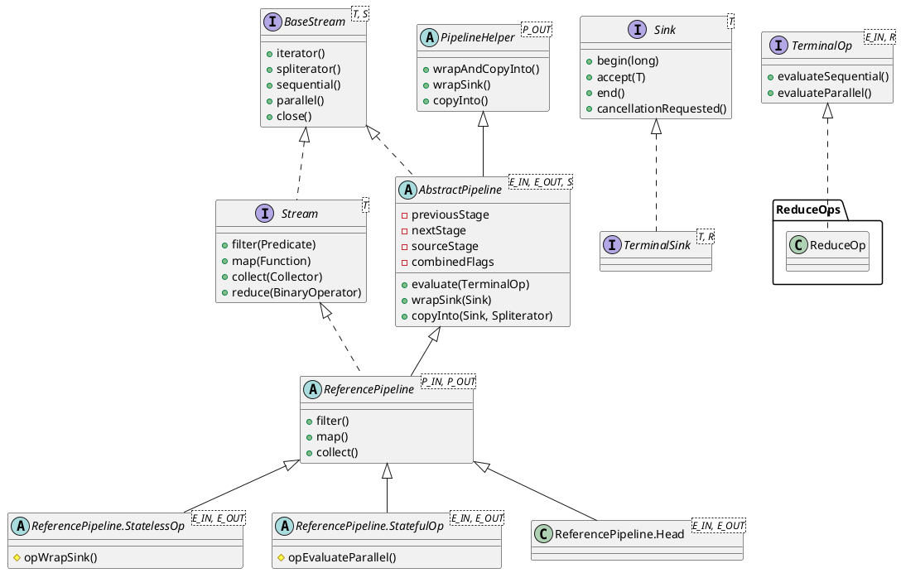
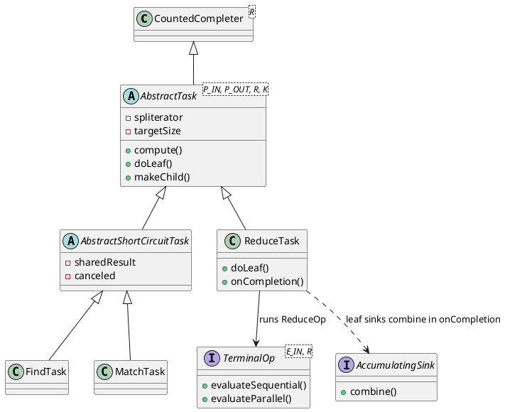
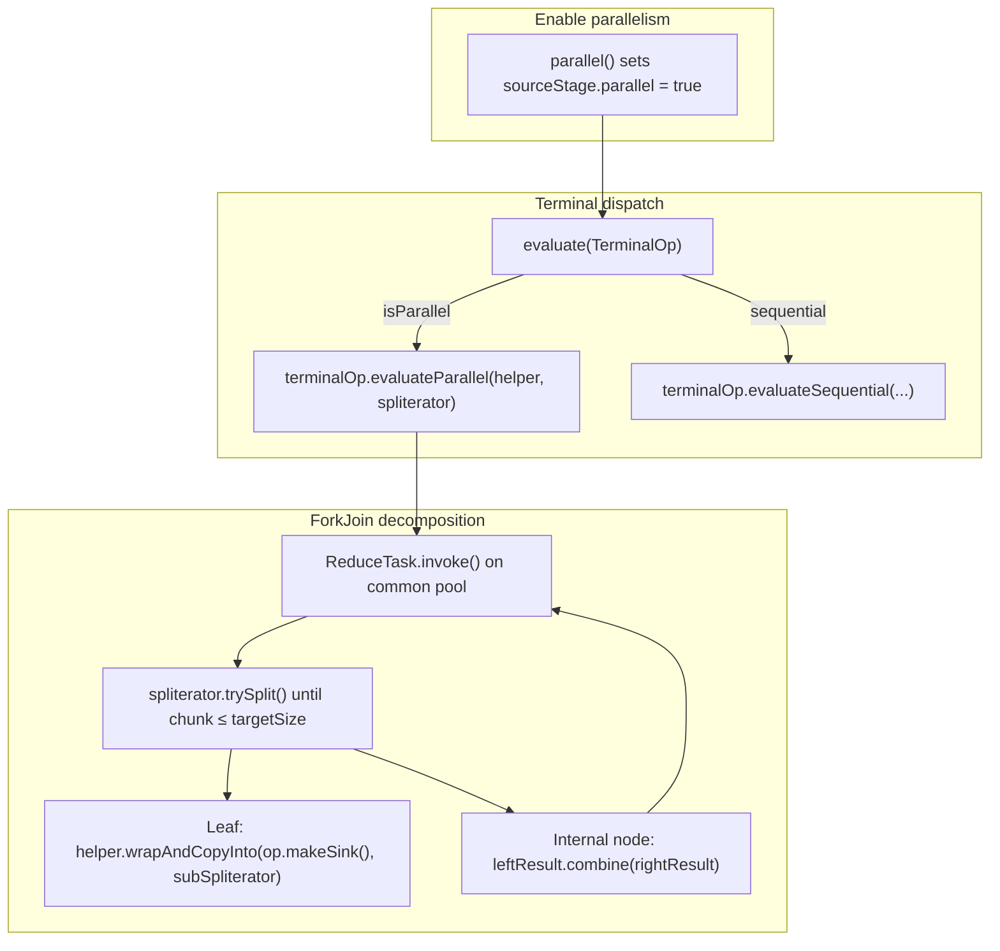
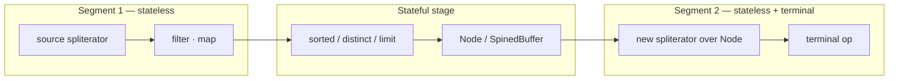
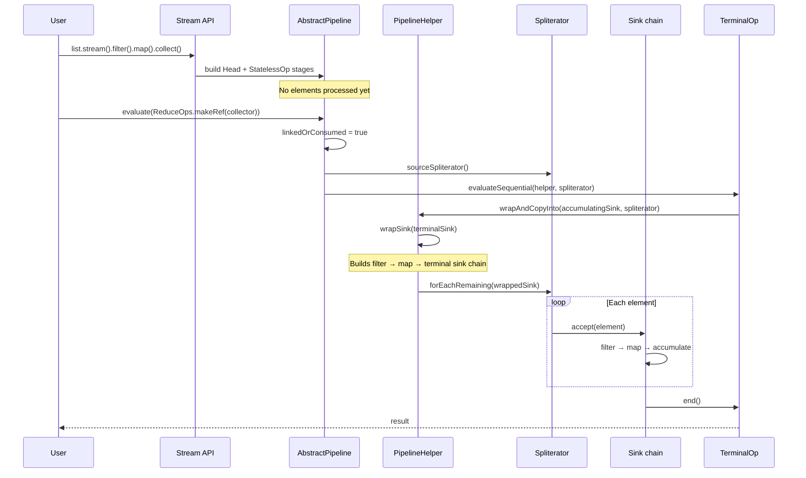
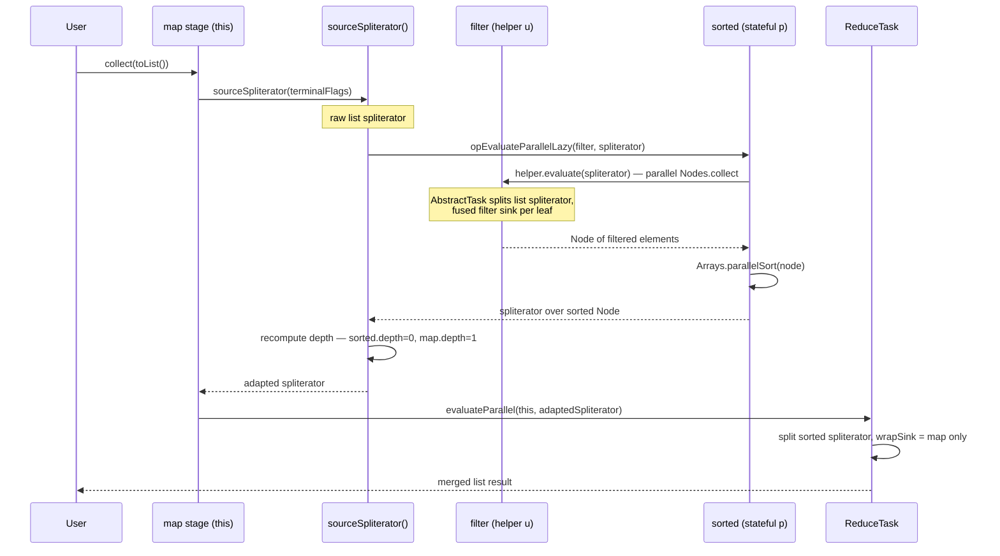

`java.util.stream.Stream` is the public face of Java 8's functional-style aggregate operations. Under the hood it is not a data structure — it is a **lazy pipeline** of linked stages backed by a `Spliterator` source. Intermediate operations such as `filter` and `map` only extend the pipeline; computation begins when a terminal operation such as `collect` or `forEach` triggers evaluation. This document traces the OpenJDK implementation centered on `Stream`, its pipeline machinery, and how elements flow from source to result.
<!--more-->

---

## 1. Overview

The `java.util.stream` package (40 source files under `src/java.base/share/classes/java/util/stream/`) implements four public stream types:

| Type | Implementation base |
|------|---------------------|
| `Stream<T>` | `ReferencePipeline` |
| `IntStream` | `IntPipeline` |
| `LongStream` | `LongPipeline` |
| `DoubleStream` | `DoublePipeline` |

All share the same architectural skeleton:

- **`BaseStream`** — common lifecycle API (`sequential`, `parallel`, `spliterator`, `close`)
- **`AbstractPipeline`** — linked list of pipeline stages; owns evaluation logic
- **`PipelineHelper`** — abstract view of a pipeline segment used during terminal evaluation
- **`Sink`** — per-stage consumer chain that pushes elements through operations
- **`TerminalOp`** — encapsulates a terminal operation's sequential/parallel execution
- **`Spliterator`** — external iterator/splitter abstraction for the data source

A typical call like `list.stream().filter(p).map(f).collect(toList())` builds a four-stage pipeline (source → filter → map → terminal) without touching any elements until `collect` runs.

---

## 2. Architecture

The design separates **declaration** (building the pipeline) from **execution** (traversing the source). Public methods on `Stream` delegate to package-private pipeline classes and operation factories.


### 2.1 Pipeline lifecycle

1. **Creation** — `StreamSupport.stream(spliterator, parallel)` constructs a `ReferencePipeline.Head` (the source stage).
2. **Chaining** — Each intermediate operation appends a new `AbstractPipeline` stage via the `previousStage` / `nextStage` links and marks the upstream stage as `linkedOrConsumed`.
3. **Terminal trigger** — A terminal method calls `AbstractPipeline.evaluate(TerminalOp)`, which obtains the source `Spliterator`, then dispatches to `evaluateSequential` or `evaluateParallel`.
4. **Traversal** — `PipelineHelper.wrapSink` builds a chained `Sink` from the terminal sink back to the source; `wrapAndCopyInto` drives the spliterator to push elements through every stage.

For sequential pipelines without stateful intermediate operations, the framework **fuses** all stages into a single pass — filter, map, and reduce can run with minimal intermediate buffering.

For parallel pipelines with **stateful** operations (`sorted`, `distinct`, `limit` in some cases), the pipeline is split into **segments** at each stateful stage; each segment is evaluated separately and its output becomes the next segment's input.

---

## 3. Structure

### 3.1 Class hierarchy



### 3.2 Pipeline stage linking

Each `AbstractPipeline` instance is one **stage**. Stages form a doubly-linked list from source to terminal:


Key fields in `AbstractPipeline`:

| Field | Role |
|-------|------|
| `sourceStage` | Back-link to the head stage (always the source) |
| `previousStage` / `nextStage` | Doubly-linked pipeline chain |
| `sourceSpliterator` / `sourceSupplier` | Lazy source, consumed once at evaluation |
| `combinedFlags` | Bitmask of `StreamOpFlag` values from source + all ops |
| `parallel` | Stored on source stage; toggled by `parallel()` / `sequential()` |
| `linkedOrConsumed` | Guards against reuse after chaining or terminal execution |

### 3.3 Operation factories

Individual stream operations are not monolithic — each lives in a dedicated factory class:

| Factory | Operations |
|---------|------------|
| `ReduceOps` | `reduce`, `collect` (via `Collector`) |
| `ForEachOps` | `forEach`, `forEachOrdered` |
| `FindOps` | `findFirst`, `findAny` |
| `MatchOps` | `anyMatch`, `allMatch`, `noneMatch` |
| `SortedOps` | `sorted` |
| `DistinctOps` | `distinct` |
| `SliceOps` | `skip`, `limit` |
| `WhileOps` | `takeWhile`, `dropWhile` |
| `GathererOp` | `gather` (Java 22+) |

### 3.4 Parallel execution structure

Parallelism is a **property of the whole pipeline**, stored on the source (`Head`) stage. It does not change how intermediate stages are linked — it changes how the terminal op traverses the source spliterator and merges partial results.



Runtime flow for a stateless parallel reduction (`parallel().filter().map().reduce()`):



When the pipeline contains **stateful** intermediate ops (`sorted`, `distinct`, `limit`, …), parallel evaluation **splits into segments**. Each stateful stage materializes a `Node` from its upstream segment before the next segment runs:



Key parallel components:

| Component | Role |
|-----------|------|
| `sourceStage.parallel` | Single boolean toggled by `parallel()` / `sequential()` |
| `Spliterator.trySplit()` | Divides source into sub-ranges for worker tasks |
| `AbstractTask` | Recursive split/compute; target chunk ≈ `N / (4 × parallelism)` |
| `AccumulatingSink.combine()` | Merges partial reduce/collect results from sibling tasks |
| `AbstractShortCircuitTask` | Coordinates early exit across parallel workers (`findFirst`, `anyMatch`) |
| `Node` | Materialized output of a stateful parallel stage, becomes next segment's source |

---

## 4. Implementation Details

### 4.1 Stream creation

End-user entry points ultimately delegate to `StreamSupport`, which wraps a `Spliterator` in a `ReferencePipeline.Head`:

```java
// StreamSupport.java
public static <T> Stream<T> stream(Spliterator<T> spliterator, boolean parallel) {
    Objects.requireNonNull(spliterator);
    return new ReferencePipeline.Head<>(
            spliterator,
            StreamOpFlag.fromCharacteristics(spliterator),
            parallel);
}
```

`Collection.stream()` is a thin wrapper:

```java
// Collection.java
default Stream<E> stream() {
    return StreamSupport.stream(spliterator(), false);
}
```

`ReferencePipeline.Head` is the source stage. It holds the spliterator (or a `Supplier` of one) and records source characteristics as op flags. For a sequential pipeline with no intermediate ops, `forEach` bypasses the full pipeline machinery and calls `sourceStageSpliterator().forEachRemaining(action)` directly — a fast path for the common case.

### 4.2 Intermediate operations — lazy pipeline extension

Intermediate methods do **not** process elements. They return a new pipeline stage. Consider `filter`:

```java
// ReferencePipeline.java
@Override
public final Stream<P_OUT> filter(Predicate<? super P_OUT> predicate) {
    Objects.requireNonNull(predicate);
    return new StatelessOp<>(this, StreamShape.REFERENCE, StreamOpFlag.NOT_SIZED) {
        @Override
        Sink<P_OUT> opWrapSink(int flags, Sink<P_OUT> sink) {
            return new Sink.ChainedReference<>(sink) {
                @Override
                public void begin(long size) {
                    downstream.begin(-1);  // output size unknown after filter
                }

                @Override
                public void accept(P_OUT u) {
                    if (predicate.test(u))
                        downstream.accept(u);
                }
            };
        }
    };
}
```

Design points:

- **`StatelessOp`** — marks the stage as stateless (`opIsStateful() == false`), enabling single-pass fusion.
- **`opWrapSink`** — returns a `Sink.ChainedReference` that wraps the downstream sink; this is how operations compose at evaluation time.
- **`StreamOpFlag.NOT_SIZED`** — tells the framework the output size is no longer known, affecting buffer allocation and optimization.

Chaining a new stage links it to the upstream pipeline and marks upstream as consumed:

```java
// AbstractPipeline.java (intermediate-stage constructor)
AbstractPipeline(AbstractPipeline<?, E_IN, ?> previousStage, int opFlags) {
    if (previousStage.linkedOrConsumed)
        throw new IllegalStateException(MSG_STREAM_LINKED);
    previousStage.linkedOrConsumed = true;
    previousStage.nextStage = this;
    this.previousStage = previousStage;
    this.sourceStage = previousStage.sourceStage;
    this.depth = previousStage.depth + 1;
    // ...
}
```

### 4.3 The Sink protocol

`Sink<T>` extends `Consumer<T>` with a lifecycle protocol: `begin(size)` → repeated `accept(element)` → `end()`. Short-circuiting operations poll `cancellationRequested()` to stop early.

Each pipeline stage implements `opWrapSink(flags, downstreamSink)` to produce a sink that transforms elements before forwarding to `downstream`. At evaluation time, `wrapSink` walks from the terminal stage back to the source:

```java
// AbstractPipeline.java
final <P_IN> Sink<P_IN> wrapSink(Sink<E_OUT> sink) {
    for (AbstractPipeline p = AbstractPipeline.this; p.depth > 0; p = p.previousStage) {
        sink = p.opWrapSink(p.previousStage.combinedFlags, sink);
    }
    return (Sink<P_IN>) sink;
}
```

The result is a **sink chain** mirroring the pipeline in reverse — the filter sink wraps the map sink, which wraps the terminal sink. This is the internal realization of "fusion": one spliterator traversal drives the entire chain.

#### Why pipeline stages and sinks are separate

Pipeline stages represent static **declaration**; sinks drive dynamic **execution**. Without fusion, `.filter().map()` would materialize the full filtered output before mapping begins ($O(N)$ intermediate memory). A sink chain processes each element through every stage before the spliterator advances, keeping intermediate memory at $O(1)$.

#### Short-circuit implementation

Short-circuiting operations (`findFirst`, `anyMatch`, `limit`, `takeWhile`, …) must stop pulling from the spliterator once their work is done. The mechanism is **cooperative cancellation** via `Sink.cancellationRequested()` — not thread interruption or exceptions.

**Flagging short-circuit pipelines.** When a short-circuiting operation is linked, it injects `StreamOpFlag.IS_SHORT_CIRCUIT` into the combined flag bitmask. Later, `copyInto` branches on `StreamOpFlag.SHORT_CIRCUIT.isKnown(getStreamAndOpFlags())`:

| Operation | Who injects `IS_SHORT_CIRCUIT` |
|-----------|-------------------------------|
| `findFirst` / `findAny` | `FindOps` terminal op |
| `anyMatch` / `allMatch` / `noneMatch` | `MatchOps` terminal op |
| `limit(n)` | `SliceOps` intermediate op (when limit ≥ 0) |
| `takeWhile` | `WhileOps` intermediate op |

**Two traversal modes.** Non-short-circuit pipelines use `spliterator.forEachRemaining(wrappedSink)` — a bulk push with no per-element cancel check. Short-circuit pipelines call `copyIntoWithCancel`, which walks back to the source stage and runs `forEachWithCancel`:

```java
// AbstractPipeline.java
final <P_IN> boolean copyIntoWithCancel(Sink<P_IN> wrappedSink, Spliterator<P_IN> spliterator) {
    AbstractPipeline p = AbstractPipeline.this;
    while (p.depth > 0) {
        p = p.previousStage;
    }
    wrappedSink.begin(spliterator.getExactSizeIfKnown());
    boolean cancelled = p.forEachWithCancel(spliterator, wrappedSink);
    wrappedSink.end();
    return cancelled;
}

// ReferencePipeline.java
final boolean forEachWithCancel(Spliterator<P_OUT> spliterator, Sink<P_OUT> sink) {
    boolean cancelled;
    do { } while (!(cancelled = sink.cancellationRequested()) && spliterator.tryAdvance(sink));
    return cancelled;
}
```

The loop checks **`cancellationRequested()` before `tryAdvance`**. Once a sink sets its cancel flag, the next iteration exits without pulling another element. Element-at-a-time `tryAdvance` (instead of `forEachRemaining`) is what makes early exit possible.

**Default: no cancellation.** On `Sink` itself, cancellation is opt-in — stateless ops like `filter` and `map` never override it:

```java
default boolean cancellationRequested() {
    return false;
}
```

**Upstream propagation.** Intermediate sinks extend `Sink.ChainedReference`, which delegates the cancel query inward toward the terminal sink:

```java
@Override
public boolean cancellationRequested() {
    return downstream.cancellationRequested();
}
```

Because `wrapSink` builds the chain terminal-inward, a call on the head sink walks downstream until it reaches the sink that owns the cancel state.

**Three patterns for raising cancellation**

*Terminal sink — set state in `accept`, report in `cancellationRequested`:*

`findFirst` stores the first element, then refuses more:

```java
// FindOps.FindSink
public void accept(T value) {
    if (!hasValue) {
        hasValue = true;
        this.value = value;
    }
}

@Override
public boolean cancellationRequested() {
    return hasValue;
}
```

`anyMatch` sets a `stop` flag when the predicate matches:

```java
// MatchOps
public void accept(T t) {
    if (!stop && predicate.test(t) == matchKind.stopOnPredicateMatches) {
        stop = true;
        value = matchKind.shortCircuitResult;
    }
}

@Override
public boolean cancellationRequested() {
    return stop;
}
```

*Intermediate sink — count down and self-cancel:*

`limit(n)` decrements a counter `m` as elements pass through; once `m == 0`, the sink reports cancellation even if the terminal would accept more:

```java
// SliceOps (limit stage)
@Override
public boolean cancellationRequested() {
    return m == 0 || downstream.cancellationRequested();
}
```

The `|| downstream` clause composes with any downstream cancel (e.g. `limit` followed by `findFirst`).

*Nested sub-stream — latch outer cancellation:*

`flatMap` on a short-circuiting pipeline cannot drain inner streams with a blind `forEach`. The flat-map sink caches a local `cancel` flag and polls downstream on every inner element:

```java
// ReferencePipeline.java (flatMap sink, simplified)
@Override
public boolean cancellationRequested() {
    return cancel || (cancel |= sink.cancellationRequested());
}

@Override
public boolean test(R output) {   // inner stream drained via allMatch(this)
    if (!cancel) {
        sink.accept(output);
        return !(cancel |= sink.cancellationRequested());
    }
    return false;
}
```

**End-to-end example.** For `stream.filter(p).findFirst()`:

1. `FindOps` injects `IS_SHORT_CIRCUIT`; `copyInto` selects `copyIntoWithCancel`.
2. `wrapSink` builds: `filterSink → findSink` (terminal inward).
3. `forEachWithCancel` loop iteration *n*: head calls `filterSink.cancellationRequested()` → delegates to `findSink.cancellationRequested()` → `false` until first match.
4. `tryAdvance` pushes one element through `filterSink.accept` → `findSink.accept` stores it.
5. Iteration *n+1*: `findSink.cancellationRequested()` returns `true` → loop exits; remaining source elements are never read.

**Performance tradeoff.** Yes — on a short-circuit pipeline, every loop iteration polls `cancellationRequested()` on the head sink, and each `ChainedReference` hop delegates to its downstream neighbor. For a pipeline of depth *d*, that is *O(d)* boolean checks per element. This looks expensive compared to a single flag read, but:

- **Non-short-circuit pipelines never pay it.** `collect`, `forEach`, and `reduce` on a stream without `limit` / `findFirst` / `anyMatch` etc. take the `forEachRemaining` path — zero cancel polls.
- **The checks are cheap relative to user work.** Each hop is a virtual call returning a field (e.g. `hasValue`, `stop`, `m == 0`). A typical `filter` predicate or `map` function costs orders of magnitude more. HotSpot often inlines shallow delegation chains.
- **The benefit dominates when short-circuit actually fires.** `findFirst` on a million-element source that matches at element 1 avoids ~999,999 predicate evaluations; a few delegate calls per element until stop is negligible.
- **Worst case: short-circuit op that never fires.** `allMatch` over a stream where every element passes still polls every iteration and never exits early — you pay the polling overhead on top of full traversal. That is the deliberate cost of a uniform, composable protocol.

Some sinks **cache** cancellation locally once latched (`flatMap`'s `cancel |= …`) so repeated polls on hot inner loops do not re-query the full downstream chain after stop is known.

**Parallel note.** In parallel mode, short-circuit terminal ops use `AbstractShortCircuitTask` (a `CountedCompleter` subclass) to cancel sibling ForkJoin tasks once any leaf finds a result. The same `cancellationRequested()` contract applies inside each leaf task's sink chain.

#### Primitive specialization

Generic erasure would force boxing on numeric streams. `Sink.OfInt`, `Sink.OfLong`, and `Sink.OfDouble` override `accept(primitive)` so int/long/double values flow through the chain without boxing. Short-circuit sinks for primitive streams (`FindSink.OfInt`, `MatchSink` implementing `Sink.OfInt`, etc.) follow the same cancellation patterns.

### 4.4 Terminal evaluation

Every terminal method on `ReferencePipeline` follows the same pattern — create a `TerminalOp` and call `evaluate`:

```java
// ReferencePipeline.java
@Override
public void forEach(Consumer<? super P_OUT> action) {
    evaluate(ForEachOps.makeRef(action, false));
}

@Override
public final P_OUT reduce(final P_OUT identity, final BinaryOperator<P_OUT> accumulator) {
    return evaluate(ReduceOps.makeRef(identity, accumulator, accumulator));
}

@Override
public <R, A> R collect(Collector<? super P_OUT, A, R> collector) {
    // ... concurrent fast path for parallel + CONCURRENT collectors ...
    A container = evaluate(ReduceOps.makeRef(collector));
    return collector.characteristics().contains(Collector.Characteristics.IDENTITY_FINISH)
           ? (R) container
           : collector.finisher().apply(container);
}
```

`evaluate` is the single entry point for pipeline consumption:

```java
// AbstractPipeline.java
final <R> R evaluate(TerminalOp<E_OUT, R> terminalOp) {
    if (linkedOrConsumed)
        throw new IllegalStateException(MSG_STREAM_LINKED);
    linkedOrConsumed = true;

    return isParallel()
           ? terminalOp.evaluateParallel(this, sourceSpliterator(terminalOp.getOpFlags()))
           : terminalOp.evaluateSequential(this, sourceSpliterator(terminalOp.getOpFlags()));
}
```

Once `evaluate` runs, the stream is **consumed** — further operations throw `IllegalStateException`.

### 4.5 Driving the spliterator

After sinks are wrapped, traversal is straightforward:

```java
// AbstractPipeline.java
final <P_IN, S extends Sink<E_OUT>> S wrapAndCopyInto(S sink, Spliterator<P_IN> spliterator) {
    copyInto(wrapSink(Objects.requireNonNull(sink)), spliterator);
    return sink;
}

final <P_IN> void copyInto(Sink<P_IN> wrappedSink, Spliterator<P_IN> spliterator) {
    if (!StreamOpFlag.SHORT_CIRCUIT.isKnown(getStreamAndOpFlags())) {
        wrappedSink.begin(spliterator.getExactSizeIfKnown());
        spliterator.forEachRemaining(wrappedSink);
        wrappedSink.end();
    } else {
        copyIntoWithCancel(wrappedSink, spliterator);
    }
}
```

For non-short-circuit pipelines, the spliterator pushes every element into the wrapped sink in one fused pass. When the `SHORT_CIRCUIT` flag is set (see §4.3), `copyInto` delegates to `copyIntoWithCancel`, which drives the spliterator one element at a time and polls `cancellationRequested()` before each `tryAdvance`.

### 4.6 Reduction and collection

`ReduceOps` factory builds anonymous `TerminalOp` instances backed by `AccumulatingSink` objects. A reducing sink holds mutable state, accepts elements, and supports `combine` for parallel merging:

```java
// ReduceOps.java (simplified)
class ReducingSink extends Box<U> implements AccumulatingSink<T, U, ReducingSink> {
    @Override
    public void begin(long size) { state = seed; }

    @Override
    public void accept(T t) { state = reducer.apply(state, t); }

    @Override
    public void combine(ReducingSink other) { state = combiner.apply(state, other.state); }
}
```

In parallel mode, `AbstractTask` (a `CountedCompleter` subclass) splits the spliterator recursively via `ForkJoinPool`, each leaf task runs `doLeaf()` on its chunk, and `onCompletion()` merges sibling results using `combine`.

### 4.7 StreamOpFlag — optimization metadata

`StreamOpFlag` is an enum encoding stream characteristics as bit flags: `DISTINCT`, `SORTED`, `ORDERED`, `SIZED`, `SHORT_CIRCUIT`, etc. Flags from the source spliterator and each operation are **combined** as stages are linked (`StreamOpFlag.combineOpFlags`).

The framework uses these flags to:

- Skip unnecessary sorting or deduplication when already known
- Choose between `forEachRemaining` and element-by-element cancellation
- Enable the concurrent-collector fast path in parallel unordered streams
- Split parallel pipelines at stateful operation boundaries

### 4.8 Stateful vs stateless operations

| Category | Examples | Behavior |
|----------|----------|----------|
| Stateless | `filter`, `map`, `peek`, `flatMap` | No memory of prior elements; fusible in one pass |
| Stateful | `distinct`, `sorted`, `limit`, `skip` | May buffer or require full input; splits parallel segments |

Stateful parallel stages call `opEvaluateParallel`, materialize results into a `Node` (tree or array-backed buffer via `Nodes` / `SpinedBuffer`), then feed the next segment.

### 4.9 End-to-end sequence



### 4.10 Parallel execution

Calling `.parallel()` does **not** fork threads immediately. It only flips a flag on the source stage; work begins when a terminal operation runs and `evaluate` chooses the parallel path.

#### Enabling and dispatching

```java
// AbstractPipeline.java
public final S parallel() {
    sourceStage.parallel = true;
    return (S) this;
}

public final boolean isParallel() {
    return sourceStage.parallel;
}

final <R> R evaluate(TerminalOp<E_OUT, R> terminalOp) {
    // ...
    return isParallel()
           ? terminalOp.evaluateParallel(this, sourceSpliterator(terminalOp.getOpFlags()))
           : terminalOp.evaluateSequential(this, sourceSpliterator(terminalOp.getOpFlags()));
}
```

Every downstream stage reads the same flag via `sourceStage`. `Collection.parallelStream()` is equivalent to `stream().parallel()` — both construct a `Head` with `parallel = true` through `StreamSupport.stream(spliterator, true)`.

#### Spliterator splitting

Parallel speedup depends on the source `Spliterator` supporting **`SIZED`** and **`SUBSIZED`** so `trySplit()` produces balanced chunks. `ArrayList`, arrays, and most JDK collections provide this; poorly splittable sources (e.g. `Iterator`-backed streams) may see little or no benefit.

When `evaluateParallel` runs, the terminal op submits an `AbstractTask` that recursively splits:

```java
// AbstractTask.java — compute()
while (sizeEstimate > sizeThreshold && (ls = rs.trySplit()) != null) {
    task.leftChild  = leftChild  = task.makeChild(ls);
    task.rightChild = rightChild = task.makeChild(rs);
    // fork one child, continue with the other (work-stealing friendly)
    taskToFork.fork();
    sizeEstimate = rs.estimateSize();
}
task.setLocalResult(task.doLeaf());
task.tryComplete();
```

Target leaf size is derived from `spliterator.estimateSize() / (parallelism × 4)` — deliberately **over-partitioned** so idle workers can steal tasks when chunks are uneven.

#### Parallel reduce / collect — `ReduceTask`

Most terminal ops (`reduce`, `collect`, `count`) delegate to `ReduceOps`, whose parallel path submits a `ReduceTask`:

```java
// ReduceOps.java
public <P_IN> R evaluateParallel(PipelineHelper<T> helper, Spliterator<P_IN> spliterator) {
    return new ReduceTask<>(this, helper, spliterator).invoke().get();
}

@Override
protected S doLeaf() {
    return helper.wrapAndCopyInto(op.makeSink(), spliterator);
}

@Override
public void onCompletion(CountedCompleter<?> caller) {
    if (!isLeaf()) {
        S leftResult = leftChild.getLocalResult();
        leftResult.combine(rightChild.getLocalResult());
        setLocalResult(leftResult);
    }
    super.onCompletion(caller);
}
```

Each leaf runs the **same fused sink chain** as sequential mode, but on a sub-spliterator. Partial accumulators merge upward through `AccumulatingSink.combine()` — the same associative combiner the user supplied (or the `Collector`'s combiner).

`ReduceTask.invoke()` runs on the **`ForkJoinPool.commonPool()`** (via `CountedCompleter`), which is shared JVM-wide.

#### CONCURRENT collector fast path

Parallel `collect` with a `CONCURRENT` collector on an **unordered** stream skips tree reduction entirely — each worker accumulates into a shared concurrent container:

```java
// ReferencePipeline.java
if (isParallel()
        && collector.characteristics().contains(Collector.Characteristics.CONCURRENT)
        && (!isOrdered() || collector.characteristics().contains(Collector.Characteristics.UNORDERED))) {
    container = collector.supplier().get();
    forEach(u -> accumulator.accept(container, u));  // parallel forEach into shared map
}
```

This is why `Collectors.toConcurrentMap` scales well on parallel streams while `toMap` must merge per-thread maps.

#### Stateful stages break the pipeline into segments

Stateless parallel pipelines fuse from source to terminal in one `AbstractTask` tree. **Stateful** ops (`sorted`, `distinct`, `limit`, `skip`, `takeWhile`, …) cannot — they need either the full upstream output or coordinated cross-chunk knowledge. The framework therefore **splits the pipeline into segments** at each stateful boundary before the terminal op runs. See **§4.11** for the full implementation.

#### Parallel short-circuit

Short-circuit terminal ops (`findFirst`, `anyMatch`, …) extend `AbstractShortCircuitTask` instead of plain `AbstractTask`. Workers share an `AtomicReference` result and a `canceled` flag; when one leaf finds an answer, it cancels tasks that are later in encounter order. The per-element `cancellationRequested()` protocol from §4.3 still applies inside each leaf's sink chain.

#### Practical summary

| Scenario | What happens |
|----------|--------------|
| `parallel().filter().map().reduce()` | Single `ReduceTask` tree; fused sink per leaf; `combine` merges |
| `parallel().collect(toList())` | Same via `ReduceOps` + list builder sink |
| `parallel().collect(concurrentMap)` | Shared concurrent map, no tree combine |
| `parallel().sorted().forEach()` | Sort materializes full upstream `Node` first, then traverses |
| `parallel().findFirst()` | `FindTask` + `AbstractShortCircuitTask` cancels trailing workers |

Parallel streams trade **splitting overhead and combiner cost** for throughput on large, well-splittable sources and CPU-heavy per-element work. They are not faster for small collections, trivial lambdas, or pipelines dominated by stateful materialization.

### 4.11 Parallel segmentation at stateful boundaries

This section explains **how** the JDK implements the segmentation described in §2.1 and §3.4 — the code path from terminal `evaluate()` through `sourceSpliterator`, `opEvaluateParallelLazy`, `depth` rewiring, and per-operation materialization.

#### Why stateful ops force a barrier

A stateless segment can run as: split source spliterator → each worker runs fused `wrapSink` chain → merge results. A **`sorted()`** stage needs every element before it can emit anything in order. **`distinct()`** on an ordered stream must preserve encounter order while deduplicating. **`limit(n)`** on an ordered stream may need elements from arbitrary splits before it knows which *n* to keep globally.

`ReferencePipeline.StatefulOp` marks these stages (`opIsStateful() == true`) and requires each to implement `opEvaluateParallel` — parallel evaluation of everything upstream of that stage, producing a `Node` or a specialized spliterator for downstream consumption.

#### When segmentation runs

Segmentation is **not** done at intermediate-op link time. It happens lazily inside `sourceSpliterator(terminalFlags)`, which `evaluate()` calls before dispatching to the terminal op:

```java
// AbstractPipeline.java — evaluate()
return isParallel()
       ? terminalOp.evaluateParallel(this, sourceSpliterator(terminalOp.getOpFlags()))
       : terminalOp.evaluateSequential(this, sourceSpliterator(terminalOp.getOpFlags()));
```

If the pipeline is parallel **and** contains any stateful stage (`hasAnyStateful()`), `sourceSpliterator` walks the linked list from `Head` to the **current** stage (`this`, i.e. the last intermediate before the terminal) and executes each stateful op in order:

```java
// AbstractPipeline.java — sourceSpliterator() core loop
if (isParallel() && hasAnyStateful()) {
    int depth = 1;
    for (AbstractPipeline u = sourceStage, p = sourceStage.nextStage, e = this;
         u != e;
         u = p, p = p.nextStage) {

        int thisOpFlags = p.sourceOrOpFlags;
        if (p.opIsStateful()) {
            depth = 0;

            if (StreamOpFlag.SHORT_CIRCUIT.isKnown(thisOpFlags)) {
                // Short-circuiting is encapsulated in this stage; downstream
                // segment may use bulk forEachRemaining again
                thisOpFlags = thisOpFlags & ~StreamOpFlag.IS_SHORT_CIRCUIT;
            }

            spliterator = p.opEvaluateParallelLazy(u, spliterator);

            thisOpFlags = spliterator.hasCharacteristics(Spliterator.SIZED)
                    ? (thisOpFlags & ~StreamOpFlag.NOT_SIZED) | StreamOpFlag.IS_SIZED
                    : (thisOpFlags & ~StreamOpFlag.IS_SIZED) | StreamOpFlag.NOT_SIZED;
        }
        p.depth = depth++;
        p.combinedFlags = StreamOpFlag.combineOpFlags(thisOpFlags, u.combinedFlags);
    }
}
return spliterator;
```

Important parameters:

- **`u`** — the pipeline stage **immediately upstream** of the stateful op, used as `PipelineHelper` for evaluating that upstream **segment only**.
- **`p`** — the stateful stage itself.
- **`spliterator`** — input to this segment; raw source for the first stateful op, output of the previous stateful op for later ones.

Each call to `opEvaluateParallelLazy` replaces `spliterator` with the **output** of that stateful op. The terminal op eventually receives a spliterator describing the result of all stateful stages up to `this`.

#### The `depth` field — segment boundaries for `wrapSink`

Each `AbstractPipeline` stage carries a `depth` field:

> *The number of intermediate operations between this pipeline object and the stream source if sequential, or **the previous stateful** if parallel.*

During `sourceSpliterator` preparation, every stateful op resets a running counter to `0` and assigns depths for the downstream chain. **`wrapSink` only wraps stages with `depth > 0`:**

```java
final <P_IN> Sink<P_IN> wrapSink(Sink<E_OUT> sink) {
    for (AbstractPipeline p = AbstractPipeline.this; p.depth > 0; p = p.previousStage) {
        sink = p.opWrapSink(p.previousStage.combinedFlags, sink);
    }
    return (Sink<P_IN>) sink;
}
```

After preparation, a pipeline `parallel().filter().sorted().map().collect()` has roughly:

| Stage | `depth` after prep | Included in wrapSink when `this` = … |
|-------|-------------------|--------------------------------------|
| Head | 1 | upstream of filter |
| filter | 1 | map's wrapSink (segment before sorted) |
| sorted | **0** | excluded — handled by `opEvaluateParallel` |
| map | 1 | terminal's wrapSink (segment after sorted) |

So the terminal `ReduceTask` leaf runs **only** the stateless ops in the current segment (`map` here) over a spliterator that already reflects sorted output. The `filter` stage was consumed earlier inside `sorted.opEvaluateParallel`.

Similarly, `wrapSpliterator` uses `depth == 0` to pass a spliterator through unchanged vs wrapping it with upstream ops:

```java
final <P_IN> Spliterator<E_OUT> wrapSpliterator(Spliterator<P_IN> sourceSpliterator) {
    if (depth == 0) {
        return (Spliterator<E_OUT>) sourceSpliterator;
    } else {
        return wrap(this, () -> sourceSpliterator, isParallel());
    }
}
```

#### `opEvaluateParallel` vs `opEvaluateParallelLazy`

Every stateful op must implement **`opEvaluateParallel(helper, spliterator, generator)`**, which fully evaluates the upstream segment and returns a `Node`:

```java
// AbstractPipeline.java — default lazy wrapper
<P_IN> Spliterator<E_OUT> opEvaluateParallelLazy(PipelineHelper<E_OUT> helper,
                                                 Spliterator<P_IN> spliterator) {
    return opEvaluateParallel(helper, spliterator, Nodes.castingArray()).spliterator();
}
```

`opEvaluateParallelLazy` may override this to defer work. The choice determines whether the barrier **fully materializes** before the terminal op or **streams lazily** from a wrapping spliterator.

#### Per-operation parallel strategies

**`sorted()`** — always materializes upstream, then sorts:

```java
// SortedOps.OfRef.opEvaluateParallel()
T[] flattenedData = helper.evaluate(spliterator, true, generator).asArray(generator);
Arrays.parallelSort(flattenedData, comparator);
return Nodes.node(flattenedData);
```

`helper.evaluate` here runs `Nodes.collect` — an `AbstractTask` tree over the upstream segment — then `Arrays.parallelSort` runs on the full array. There is no way to sort in true streaming fashion.

**`distinct()`** — three cases:

```java
// DistinctOps — parallel evaluation
if (StreamOpFlag.DISTINCT.isKnown(helper.getStreamAndOpFlags())) {
    return helper.evaluate(spliterator, false, generator);   // already distinct: passthrough collect
} else if (StreamOpFlag.ORDERED.isKnown(helper.getStreamAndOpFlags())) {
    return reduce(helper, spliterator);   // parallel collect into LinkedHashSet — order barrier
} else {
    // unordered: parallel forEach into ConcurrentHashMap, then keySet as Node
    forEachOp.evaluateParallel(helper, spliterator);
    return Nodes.node(keys);
}
```

Lazy variant: ordered streams **cannot** lazy-distinct (must call `reduce` first); unordered streams may use `DistinctSpliterator` wrapping the upstream spliterator without an upfront `Node`.

**`limit` / `skip` (`SliceOps`)** — depends on `ORDERED` and `SUBSIZED`:

```java
// SliceOps — opEvaluateParallelLazy (reference streams)
if (size > 0 && spliterator.hasCharacteristics(Spliterator.SUBSIZED)) {
    return new SliceSpliterator.OfRef<>(helper.wrapSpliterator(spliterator), skip, fence);
} else if (!StreamOpFlag.ORDERED.isKnown(helper.getStreamAndOpFlags())) {
    return new UnorderedSliceSpliterator.OfRef<>(helper.wrapSpliterator(spliterator), skip, limit);
} else {
    return new SliceTask<>(this, helper, spliterator, generator, skip, limit).invoke().spliterator();
}
```

- **Unordered + subsized** — slice spliterator without full buffer; cheap.
- **Ordered + unknown size** — `SliceTask` (extends `AbstractTask`) materializes via parallel split/collect; expensive barrier.

#### End-to-end walkthrough

Pipeline: `list.parallelStream().filter(p).sorted().map(f).collect(toList())`



Steps in prose:

1. **`collect`** calls `evaluate` on the **map** stage.
2. **`sourceSpliterator`** starts with the list's spliterator.
3. At **`sorted`**: `opEvaluateParallelLazy(filter, …)` runs. **`filter`** as helper drives parallel collection of `Head → filter` into a `Node`. Then **`Arrays.parallelSort`** runs on that node.
4. Returned spliterator traverses the sorted `Node`. **`sorted.depth` is set to 0**; **`map.depth` is 1**.
5. **`ReduceTask`** splits the sorted spliterator across workers. Each leaf calls `wrapSink` on the **map** stage only (one `opWrapSink`), accumulating into a partial list. Combiners merge lists.

#### Multiple stateful ops

For `parallel().distinct().sorted().collect()`:

1. First barrier: `distinct.opEvaluateParallelLazy` → spliterator/`Node` of distinct elements.
2. Second barrier: `sorted.opEvaluateParallelLazy` → sorts that output.
3. Terminal collects from sorted spliterator.

Each stateful op completes entirely before the next segment begins. Memory use is the maximum of intermediate `Node` sizes, not fused into one pass.

#### `evaluateToArrayNode` — alternate entry

When the **last** pipeline stage itself is stateful (e.g. calling `toArray()` after `sorted()`), `evaluateToArrayNode` avoids double collection:

```java
if (isParallel() && previousStage != null && opIsStateful()) {
    depth = 0;
    return opEvaluateParallel(previousStage, previousStage.sourceSpliterator(0), generator);
}
```

It sets `depth = 0` on the stateful stage and invokes `opEvaluateParallel` directly with the upstream segment's prepared spliterator.

#### Summary

| Mechanism | Purpose |
|-----------|---------|
| `hasAnyStateful()` + loop in `sourceSpliterator` | Eagerly evaluate each stateful op before terminal |
| `u` as upstream `PipelineHelper` | Limits parallel collect to one segment |
| `depth` reset at stateful boundaries | `wrapSink` / `wrapSpliterator` see only current segment |
| `opEvaluateParallel` | Parallel upstream collect → `Node` → stateful transform |
| `opEvaluateParallelLazy` | Same or deferred via custom spliterator (`DistinctSpliterator`, `SliceSpliterator`) |
| Flag rewrite (`SIZED`, clear `SHORT_CIRCUIT`) | Downstream segment sees correct metadata |

The design trades **multiple parallel passes and intermediate `Node` storage** for correctness of global operations. That is why `parallel().sorted()` on a large stream often shows a full-GC pause: the entire upstream segment is collected and sorted before any downstream op runs.

---

## 5. Key Files

| File | Role | Notable types |
|------|------|---------------|
| `Stream.java` | Public `Stream<T>` interface + static factories (`of`, `iterate`, `generate`, `concat`) | `Stream`, `Builder` |
| `BaseStream.java` | Shared stream lifecycle interface | `BaseStream` |
| `AbstractPipeline.java` | Pipeline linked list, evaluation, sink wrapping | `AbstractPipeline` |
| `ReferencePipeline.java` | Object-reference stream implementation; `Head`, `StatelessOp`, `StatefulOp` | `ReferencePipeline` |
| `StreamSupport.java` | Low-level stream construction from `Spliterator` | `stream()`, `intStream()`, … |
| `Sink.java` | Element protocol + chained sink adapters | `Sink`, `ChainedReference`, `OfInt` |
| `PipelineHelper.java` | Pipeline segment helper for terminal ops | `PipelineHelper` |
| `TerminalOp.java` | Terminal operation contract | `TerminalOp` |
| `ReduceOps.java` | Reduction/collection terminal ops | `makeRef`, `ReduceOp` |
| `StreamOpFlag.java` | Stream characteristic flags | `StreamOpFlag` |
| `AbstractTask.java` | ForkJoin task base for parallel ops | `AbstractTask`, `ReduceTask` |
| `AbstractShortCircuitTask.java` | Parallel early-exit coordination | `FindTask`, `MatchTask` |
| `Nodes.java` | Tree/array node structures for materialization | `Node`, `Builder`, `CollectorTask` |
| `SortedOps.java` / `DistinctOps.java` / `SliceOps.java` | Stateful parallel barriers | `opEvaluateParallel`, `opEvaluateParallelLazy` |
| `Collectors.java` | Built-in `Collector` implementations | `toList`, `groupingBy`, … |
| `IntPipeline.java` / `LongPipeline.java` / `DoublePipeline.java` | Primitive stream pipelines | Same pattern as `ReferencePipeline` |

---

## 6. Dependencies

| Dependency | Usage |
|------------|-------|
| `java.util.Spliterator` | Source abstraction; splitting for parallelism |
| `java.util.function.*` | Behavioral parameters (predicates, mappers, reducers) |
| `java.util.concurrent.ForkJoinPool` | Parallel stream execution |
| `java.util.concurrent.CountedCompleter` | Base for `AbstractTask` work stealing |
| `Collection.spliterator()` | Default stream source for collections |

---

## 7. Design Takeaways

1. **Streams are pipelines, not collections.** The `Stream` interface is a fluent DSL; `ReferencePipeline` + `AbstractPipeline` are the real objects users hold.
2. **Laziness is structural.** Intermediate ops append stages; the source spliterator is untouched until a terminal op fires `evaluate`.
3. **Sinks enable fusion.** By chaining `Sink` wrappers at evaluation time, multiple operations collapse into one traversal — the key performance trick behind sequential streams.
4. **Spliterator is the extension point.** Any data source that can split and traverse itself can become a stream via `StreamSupport`.
5. **Flags drive optimization.** `StreamOpFlag` propagates knowledge about ordering, sizing, and distinctness so the engine can skip redundant work.
6. **Parallelism adds segmentation.** Stateful ops are the main complication — they force materialization and break the single-pass model. Stateless parallel pipelines split the source spliterator via `AbstractTask` and merge through `AccumulatingSink.combine()` on the common ForkJoin pool.
