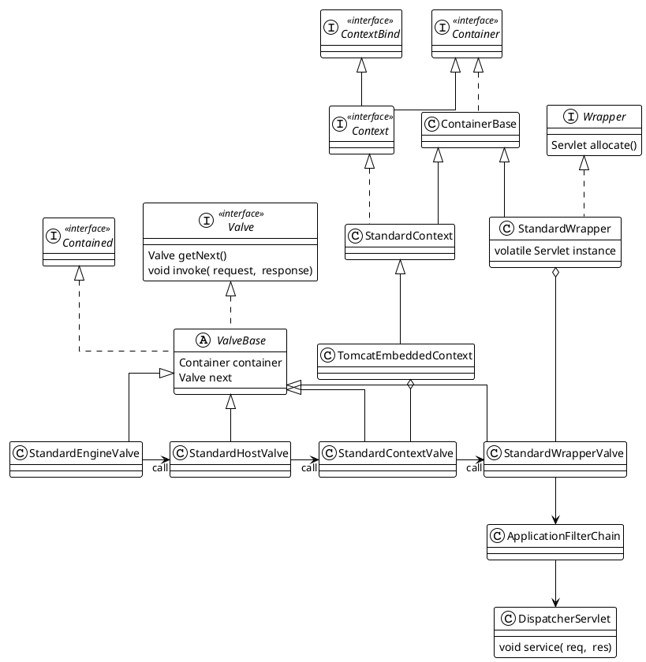

本文记录tomcat 架构与实现
<!--more-->

tomcat works as a servlet/jsp container.

# Tomcat Architecture


`Server` represents the whole container


A `service` is an intermediate component which lives inside a server and ties one or more Connectors to exactly one Engine


A `Connector` handles communications with the client. 


`LifeCycle` common interface for Catalina components to implement in order to provide a consistent mechanism to start and stop the component

The `LifecycleEvent`s fired during state changes are defined in the methods that trigger the change


```plantuml

title: Tomcat Architecture
cloud http
    package Tomcat {
    
        
        component c  [ 
            listener
            globl naming resouce
            jndi
        ] 
        component services {
            component connector
            component Engine {
                component Host {
                    Component Context {
                        Component Servlet
                    }
                }
            }
        }
        
        c -right-> services
    }

http -right-> Tomcat
```

```plantuml

skinparam linetype ortho

interface Lifecycle {

+ void addLifecycleListener(LifecycleListener)
+ LifecycleListener[] findLifecycleListeners()
+ void removeLifecycleListener(LifecycleListener)
+ void init()
+ void start()
+ void stop()
+ void destroy()
+ LifecycleState getState()
}

interface Server extends Lifecycle {
+ String getAddress()
+ ClassLoader getParentClassLoader()
+ void setParentClassLoader(ClassLoader)
+ Catalina getCatalina()
+ void setCatalina(Catalina)
+ File getCatalinaBase()
+ File getCatalinaHome()
+ int getUtilityThreads()
+ void setUtilityThreads(int)
+ void addService(Service)
+ void await()
}

interface Service extends Lifecycle {
+ Engine getContainer()
+ void setContainer(Engine)
+ String getName()
+ Server getServer()
+ ClassLoader getParentClassLoader()
+ void setParentClassLoader(ClassLoader)
+ String getDomain()
+ Connector[] findConnectors()
+ Executor getExecutor(String)
+ Mapper getMapper()
}

abstract class LifecycleBase implements Lifecycle {

- List<LifecycleListener> lifecycleListeners
- LifecycleState state
+ void init()
# {abstract}void initInternal()
+ void start()
# {abstract}void startInternal()
+ void stop()
# {abstract}void stopInternal()
+ void destroy()
# {abstract}void destroyInternal()

}


abstract class LifecycleMBeanBase extends LifecycleBase  {
}

interface Container extends Lifecycle {
    Pipeline getPipeline()
}

interface Engine extends Container {
+ String getDefaultHost()
+ void setDefaultHost(String)
+ String getJvmRoute()
+ void setJvmRoute(String)
+ Service getService()
+ void setService(Service)
}

interface Host extends Container {
}


class Connector extends LifecycleMBeanBase {
# Service service
# String scheme
# ProtocolHandler protocolHandler
# Adapter adapter
+ EncodedSolidusHandling getEncodedSolidusHandlingInternal()
+ Request createRequest(org.apache.coyote.Request)
+ Response createResponse(org.apache.coyote.Response)
}

Server o-- Service
Service o-- Connector
Service o-- Engine
Engine --> Host: invoke

```

## Container
container is an object that can execute requests received from a client, and return responses based on those requests
A container may optionally support a pipeline of Valves that processes the request in an order configured at runtime, by implementing the pipeline interface as well.
Containers will exist at several levels within catalina:
1. engine
2. host
3. context
4. wrapper

A container may also be associated with a number of support components that provide functionality which may be shared (by attaching it to a parent container) or individually customized. the following support components are currently recognized.
1. loader
2. logger
3. manager  manager for the pool of sessions
4. realm read-only interface to a security domain, for authenticating user identities and their corresponding roles.
5. resources JNDI directory context enabling access to static resources.


```plantuml
title: Tomcat Container Architecture
skinparam linetype ortho


interface Container  {

+ Pipeline getPipeline()
+ Container getParent()
+ Realm getRealm()
+ {static} String getConfigPath(Container,String)
+ {static} Service getService(Container)
+ void addChild(Container)
+ void addContainerListener(ContainerListener)
+ void fireContainerEvent(String,Object)
+ void logAccess(Request,Response,long,boolean)
+ File getCatalinaBase()
+ File getCatalinaHome()
}

interface Engine extends Container {
+ String getDefaultHost()
+ void setDefaultHost(String)
+ String getJvmRoute()
+ void setJvmRoute(String)
+ Service getService()
+ void setService(Service)
}

class StandardEngine extends ContainerBase implements Engine {
    Service service

}

interface Host extends Container {

+ String getXmlBase()
+ void setXmlBase(String)
+ File getConfigBaseFile()
+ String getAppBase()
+ File getAppBaseFile()
+ void setAppBase(String)
}

abstract class ContainerBase implements Container {
# Pipeline pipeline
# HashMap<String,Container> children
# Container parent
# List<ContainerListener> listeners
# String name
# ClassLoader parentClassLoader
- Realm realm
# ExecutorService startStopExecutor
}
class StandardHost extends ContainerBase implements Host {
- String appBase
- File appBaseFile
- String xmlBase
- File hostConfigBase
- String configClass
- String contextClass
- String workDir
- boolean createDirs
- Map<ClassLoader,String> childClassLoaders
}


interface Contained {
    Container getContainer()
    void setContainer(Container container)
}

interface Pipeline extends Contained {
    Valve getBasic()
    void setBasic(Valve valve)
    void addValve(Valve valve)
    Valve[] getValves()
    Valve getFirst()
}

class StandardPipeline implements Pipeline {
    Valve basic
    Container container
    Valve first
}

interface Valve {
    Valve getNext()
    void setNext(Valve valve)
    void backgroundProcess()
    void invoke(Request request, Response response)
}

abstract class ValveBase  implements Contained, Valve {
    Container container
    Log containerLog
    Valve next

}
class StandardEngineValve extends ValveBase

class StandardHostValve extends ValveBase

StandardEngine *-- StandardEngineValve

StandardHost *-- StandardHostValve
Engine o-- Host
Container *-- Pipeline
Pipeline o-- Valve


```


### Engine
Engine represents request processing pipeline for a specific service. As a Service may have multiple Connectors, the Engine receives and processes all requests from these connectors, handling the response back to the appropriate connector for transmission to the client.

### Host
A Host is a Container that represents a virtual host in the catalina servlet engine. 
Multiple host can be configured in catalina, each has its own request processing logic 

### Context
A context is a container that represents a servlet context, and therefore an individual web application, in the catalina servlet engine. A host may contain multiple contexts,each with a unique path.

### wrapper
A wrapper is a container that represents an individual sevlet definition from the deployment descriptor of the web application. 
It provides mechanism to use interceptors that see every single request to the servlet represented by this definition.
Implementations are responsible for managing the sevlet life circle.

### Valve
A valve is a request processing component associated with a Container. A series of Valves are associated with each other into a pipeline.

`StandardWrapperValve` in tomcat call FilterChain to filter request before invoke servlet.


# Request handling pipeline

In `Container` section, we see that `Container` contains `Pipeline`,`Pipeline` contains `Valves` in order. the request handling is actually invoke the `Valves` in the `Pipeline` of the specified container one by one. 




## Connector Internals

`Adapter` represents the entry point in a coyote-based servlet container.

`ProtocolHandler` abstract the protocol implementation, including threading.

`EndPoint` handles the low level interactions with network socket.

`Poller` 

```plantuml

interface Handler<S> {
    SocketState process(socket,SocketEvent status)
}

class ConnectionHandler<S> implements Handler<S> {
    AbstractProtocol<S> proto
    RecycledProcessors recycledProcessors
}
abstract class AbstractEndpoint<S,U> {
    SynchronizedStack<SocketProcessorBase<S>> processorCache
    Map<U, SocketWrapperBase<S>> connections
    int port
    InetAddress address
    Acceptor<U> acceptor
    Executor executor
    Handler<S> handler
    HashMap<String, Object> attributes
    abstract void bind()
    boolean processSocket(SocketWrapperBase<S> socketWrapper,
            SocketEvent event, boolean dispatch)
    abstract SocketProcessorBase<S> createSocketProcessor(
            SocketWrapperBase<S> socketWrapper, SocketEvent event)
}


class Acceptor<U> implements Runnable{
    AbstractEndpoint<?,U> endpoint

}
abstract class AbstractNetworkChannelEndpoint<S extends Channel, U extends NetworkChannel> extends AbstractEndpoint {
    abstract NetworkChannel getServerSocket()
    abstract S createChannel(SocketBufferHandler buffer)
}
class NioEndpoint extends AbstractNetworkChannelEndpoint {
    ServerSocketChannel serverSock
    CountDownLatch stopLatch
    SynchronizedStack<PollerEvent> eventCache
    Poller poller
    SocketProcessorBase<NioChannel> createSocketProcessor(
            SocketWrapperBase<NioChannel> socketWrapper, SocketEvent event)
}

abstract class SocketProcessorBase<S> implements Runnable {
    SocketWrapperBase<S> socketWrapper
    SocketEvent event
    AtomicReference<Object> currentProcessor
    abstract void doRun()
}

class Http11Processor extends AbstractProcessor {
    AbstractHttp11Protocol<?> protocol
    Http11InputBuffer inputBuffer
    Http11OutputBuffer outputBuffer
    HttpParser httpParser
    SendfileDataBase sendfileData
}

class SocketProcessor extends SocketProcessorBase<NioChannel> {

}

interface Adapter {
    void service(Request req,Response res)
    boolean prepare(Request req, Response res)
}
interface ProtocolHandler {
    Adaptor getAdaptor()
    void setAdaptor(Adaptor adaptor)
    Executor getExecutor()
    void init()
    void start()
    void stop()
    void destroy()
}

abstract class AbstractProtocol<S> implements ProtocolHandler {
    AbstractEndpoint<S, ?> endpoint
    Handler<S> handler
    Adapter adapter
    Set<Processor> waitingProcessors
    ScheduledFuture<?> timeoutFuture
    Processor createProcessor()
}

abstract class AbstractHttp11Protocol<S> extends AbstractProtocol

class Http11NioProtocol extends AbstractHttp11Protocol {
    Processor createProcessor()
}

interface Processor {
    SocketState process(SocketWrapperBase<?> socketWrapper, SocketEvent status)
}

abstract class AbstractProcessorLight implements Processor {
    Set<DispatchType> dispatches
}

abstract class AbstractProcessor extends AbstractProcessorLight implements ActionHook {
    Adapter adapter
    AsyncStateMachine asyncStateMachine
    Request request
    Response response
    SocketWrapperBase<?> socketWrapper
}


class Connector {
    ProtocolHandler protocolHandler
    Service service
    Adapter adapter
}

class CoyoteAdapter implements Adapter {
    Connector connector
}

class Poller implements Runnable {
    Selector selector
    SynchronizedQueue<PollerEvent> events
    register(NioSocketWrapper socketWrapper)
    boolean events()
    void processKey(SelectionKey key, NioSocketWrapper socketWrapper)
}

class PollerEvent {
    NioSocketWrapper socketWrapper
    int interestOps
}

abstract class NioSocketWrapper extends SocketWrapperBase<NioChannel> {
    SynchronizedStack<NioChannel> nioChannels
    Poller poller
    int interestOps
    SendfileData sendfileData
    long lastRead
    long lastWrite
    Object readLock
    volatile boolean readBlocking
    Object writeLock
    volatile boolean writeBlocking
}

abstract class SocketWrapperBase<E> {
    E socket
    AbstractEndpoint<E,?> endpoint
    ReentrantLock lock
    ServletConnection servletConnection
    SocketBufferHandler socketBufferHandler
    WriteBuffer nonBlockingWriteBuffer
    Semaphore readPending
    OperationState<?> readOperation
    Semaphore writePending
    OperationState<?> writeOperation
}


AbstractEndpoint *-left- ConnectionHandler
AbstractProtocol *-down- AbstractEndpoint

Connector *-down- ProtocolHandler
Connector *-left- Adapter
NioEndpoint -right-> SocketProcessor: createSocketProcessor
NioEndpoint *-- Poller
NioEndpoint *-- Acceptor
Poller o-- PollerEvent
PollerEvent *-- NioSocketWrapper
Http11NioProtocol -right-> Http11Processor
```


## EndPoint Internals

```plantuml


!theme plain
top to bottom direction
skinparam linetype ortho

class AbstractEndpoint<S, U>
class AbstractJsseEndpoint<S, U>
class NioEndpoint {
    ServerSocketChannel serverSock
    CountDownLatch stopLatch
    SynchronizedStack<PollerEvent> eventCache
    SynchronizedStack<NioChannel> nioChannels
    Poller poller
    initServerSocket()
}

AbstractJsseEndpoint  -[#000082,plain]-^  AbstractEndpoint     
NioEndpoint           -[#000082,plain]-^  AbstractJsseEndpoint 


```


# Servlet

Tomcat use Jakarta servlet API.
Jakarta servlet defines a server-side  API for handling HTTP requests and responses.

`servlet` is a small Java program that runs within a Web server. Servlets receive and respond to requests from Web clients, usually across HTTP, the HyperText Transfer Protocol.

`ServletRequest` is an object to provide client request information to a servlet. The servlet container creates a `ServletRequest` object and passes it as an argument to the servlet's `service` method.
`ServletRequest` object provides data including parameter name and values, attributes, and an inputstream.


```plantuml
package Tomcat {
    interface Servlet {
    + void init(ServletConfig)
    + ServletConfig getServletConfig()
    + void service(ServletRequest,ServletResponse)
    + String getServletInfo()
    + void destroy()
    }

    interface ServletConfig {
    + String getServletName()
    + ServletContext getServletContext()
    + String getInitParameter(String)
    + Enumeration<String> getInitParameterNames()
    }

    abstract class GenericServlet {
    - ServletConfig config
    }

    abstract class HttpServlet {
    # void service(HttpServletRequest,HttpServletResponse)
    + void service(ServletRequest,ServletResponse)
    }

    interface ServletRequest {
        Object getAttribute(String name)
        int getContentLength()
        String getContentType()
        ServletInputStream getInputStream()
        String getParameter(String name)
        String getRemoteAddr()
        RequestDispatcher getRequestDispatcher(String path)
    }
    interface HttpServletRequest extends ServletRequest

    interface ServletResponse {
        ServletOutputStream getOutputStream()

    }
    interface HttpServletResponse extends ServletResponse

    class Request implements HttpServletRequest {
        byte[] postData
        ParameterMap<String,String[]> parameterMap
        Collection<Part> parts
        HttpServletRequest applicationRequest
        Connector connector
        RequestFacade facade
    }
}
Servlet <|.. GenericServlet
ServletConfig <|.. GenericServlet
GenericServlet <|-- HttpServlet
HttpServletRequest -right-> HttpServlet
HttpServlet -right-> HttpServletResponse

```

## servlet processing 
```plantuml
interface Context extends Container, ContextBind{

}

class StandardContext extends ContainerBase implements Context {
    
    Loader loader
    NamingResourcesImpl namingResources
    Map<String,String> mimeMappings
    Map<String,String> parameters
    Map<String,String> roleMappings
    Map<String,String> servletMappings
    Class<?> wrapperClass
    Set<Servlet> createdServlets
}


interface Wrapper extends Container  {

+ long getAvailable()
+ void setAvailable(long)
+ Servlet getServlet()
+ void setServlet(Servlet)
+ void addInitParameter(String,String)
+ void addMapping(String)
+ void addSecurityReference(String,String)
+ Servlet allocate()
+ void deallocate(Servlet)
+ void load()
+ void unload()
}


class StandardWrapper extends ContainerBase implements  Wrapper {
# StandardWrapperFacade facade
# Servlet instance
# StandardWrapperValve swValve
}

class StandardWrapperValve extends ValveBase {
    invoke(request,response)
}
StandardWrapper *-right- StandardWrapperValve


```