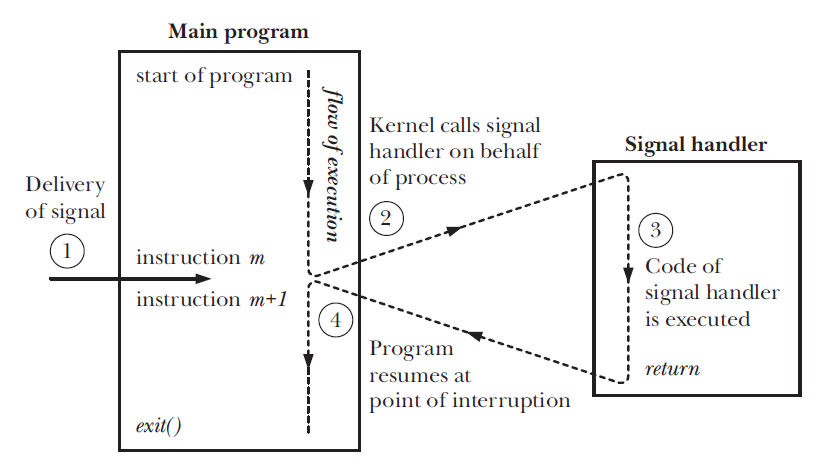

This article introduces Linux Signal Handling
<!--more-->

Signal is a software interrupt delivered to a process.

Operating System uses Signals to report exceptional situations or asynchronous events to an executing program. Register a handler function of certain type of signal to tell the operating system to run it when that particular signal arrives.

One process can send signal to another process to communicate and synchronize.

# Signal Handling - software interruption

Kernel performs necessary preparatory steps for the execution of signal handlers.

1. special frame created on the stack to save the current program execution info.
2. frame for the signal handler created on the stack
3. kernel passes controls back to user-space, execution of signal handler begins.
4. when signal handler returns, kernel restores the thread to its state before the signal handling using the stack frame created in step 1.

# Common Signal Types

| Signal  | Description                           | Number |
| ------- | ------------------------------------- | ------ |
| SIGINT  | Interrupt from keyboard               | 2      |
| SIGKILL | Kill signal, terminate immediately    | 9      |
| SIGSEGV | Segmentation fault                    | 11     |
| SIGTERM | Terminate gracefully,allowing cleanup | 15     |
| SIGSTOP | Stop process                          | 19     |

The signals `SIGKILL` and `SIGSTOP` cannot be caught, blocked, or ignored.