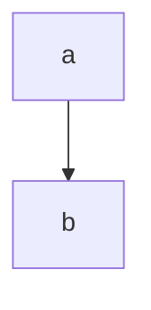

# 1. 概述

```plantuml
class SpringApplication {
    WebApplicationType webApplicationType
    List<ApplicationContextInitializer<?>> initializers
    List<ApplicationListener<?>> listeners
    ApplicationContextFactory applicationContextFactory
    ConfigurableApplicationContext run(String... args)
    void prepareContext()
}

interface ConfigurableApplicationContext {
    void refresh()
}

SpringApplication --> ConfigurableApplicationContext:create

```

