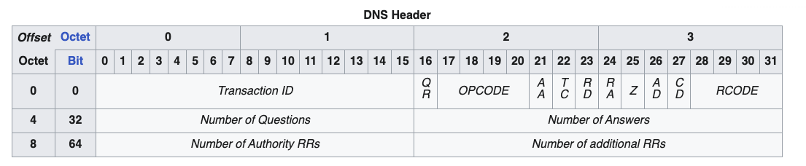
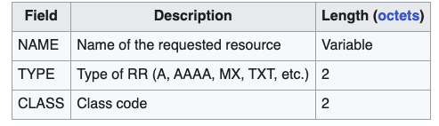
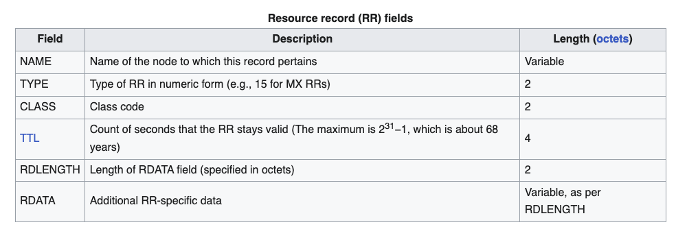

Domain Name System(DNS) is a hierarchical and distributed name service that provides a naming system for computers, resources and other resources on the IP network.
<!--more-->

DNS delegates the responsibility of assigning domain names and mapping those names to Internet Resources by designating authoritative name servers for each Domain.

## Domain Names
Domain Name consists of one or more parts Technically called `Labels` delimited by dots.
The right most label conveys the top-level domain.
The hierarchy of domain descends from right to left.
A `Label` may contain 0 to 63 characters as the length is only allowed to 6 bits.
The full domain name may not exceed the length of 253 characters 

## DNS Protocol
DNS Protocol uses 2 types of DNS messages , queries and responses, both have the same format.

Each message consists of a header and 4 sections: question,answer,authority and additional spaces. A header field controls the content of the these 4 sections.

### header



The header section consists of the following fields: Identification, Flags, Number of answers, Number of authority resource records(RR) , and Number of additional RRs. Each field is 16 bits long.

### Question section


### Resource Record

DNS specifies a database of information elements for network resources. The types of information elements are categorized and organized with a list of DNS record types.



The record Types:
* A Address record
* AAAA ipv6 address record
* TXT Text record readable by human

### Command line 
`dig` (Domain Information Groper) a flexible tool to interrogate DSN name servers. It performs DNS lookup and displays the answers returned from the name servers.
```
dig www.google.com

; <<>> DiG 9.10.6 <<>> www.google.com
;; global options: +cmd
;; Got answer:
;; ->>HEADER<<- opcode: QUERY, status: NOERROR, id: 43900
;; flags: qr rd ra; QUERY: 1, ANSWER: 1, AUTHORITY: 0, ADDITIONAL: 1

;; OPT PSEUDOSECTION:
; EDNS: version: 0, flags:; udp: 4096
;; QUESTION SECTION:
;www.google.com.			IN	A

;; ANSWER SECTION:
www.google.com.		69	IN	A	172.217.25.196

;; Query time: 1 msec
;; SERVER: 192.168.1.1#53(192.168.1.1)
;; WHEN: Tue Jan 28 15:16:56 +07 2025
;; MSG SIZE  rcvd: 59

```


