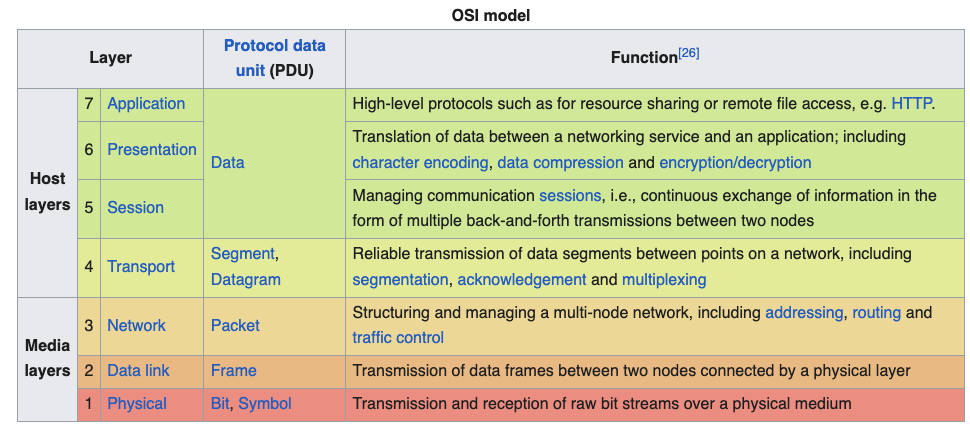
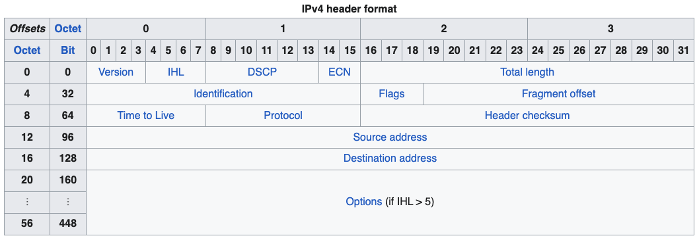
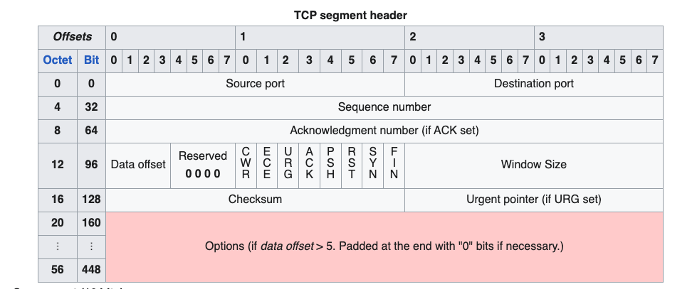
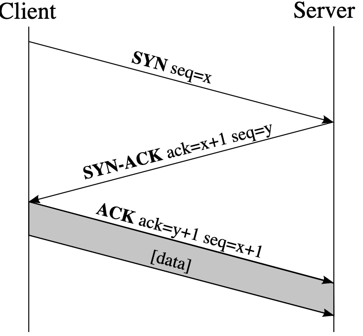
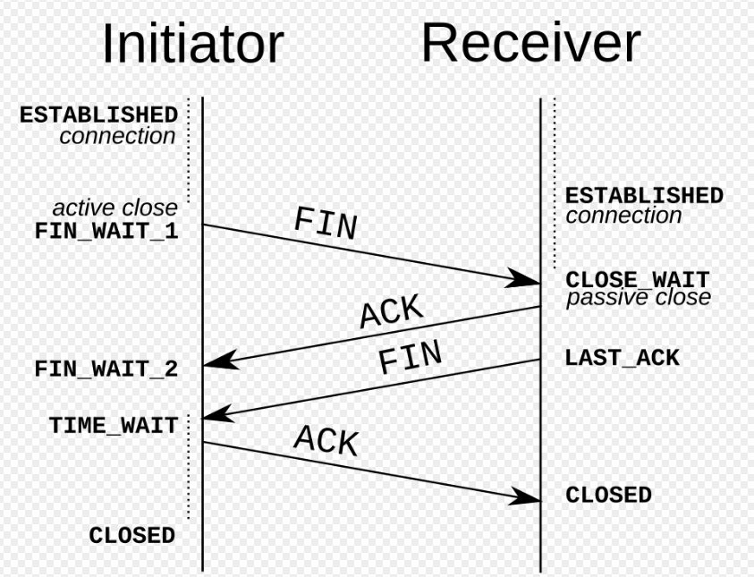
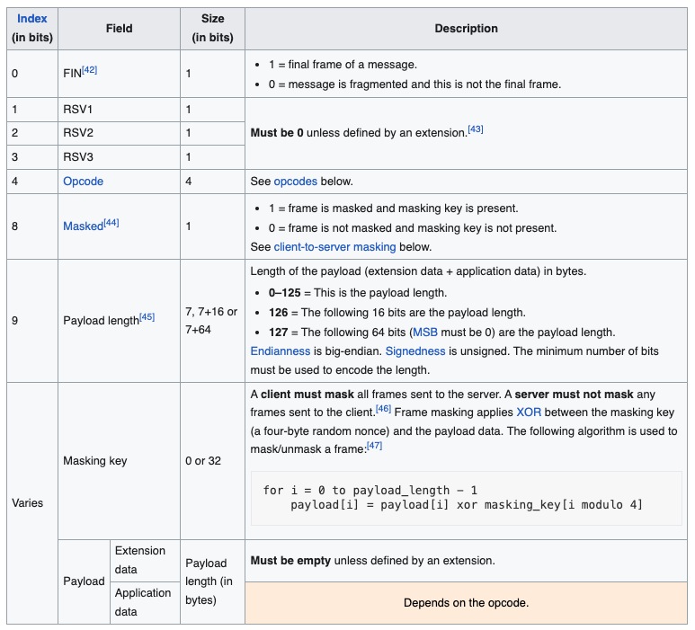
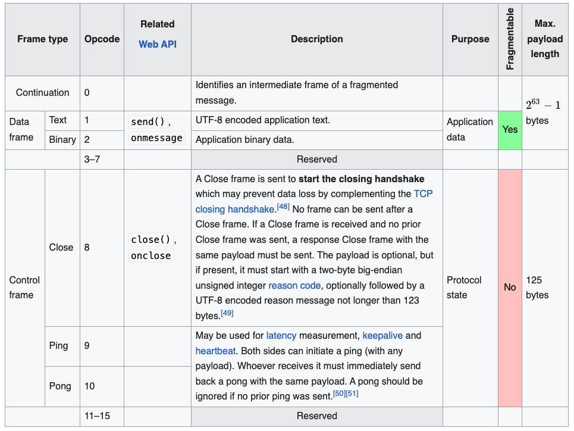

本文介绍常见网络协议的报文
<!--more-->

# OSI model


The open System interconnection model is a conceptual framework that divides network communication functions into seven layers.



## IP 

Internet Protocol packet structure is used for data transmission in computer networks




IP packet fields:

* Version(4 bits) 
* IHL internet header length (4 bits) HE-LEN-bytes = number * 4
* type of service (8 bits) 
* total length (16 bits) total length of ip packet from minimum 20 bytes to maximum 65535 bytes
* identification if the ip package is fragmented then each fragmented packet will use the same 16 bit identification number to identify to which IP packet they belong to
* IP flags(3 bits)
  1. always 0
  2. don't fragment bit
  3. more fragment bit set on all fragmented packets except for the last one.
* fragment offset (13 bits)  specify the position of the fragment in the original fragmented ip packet. all fragment length must be multiply of 8
* time-to0live(8 bits) everytime an ip packet passes through a router, this field is decremented by 1. once it hits 0 , the router will drop the packet and sends an icmp exceeded message to sender.
* protocol(8 bits) which protocol is encapsulated in the IP packet tcp 6 udp 17
* header checksum (16 bits) header checksum
* source address(32 bits)
* destination address (32 bits)
* ip option variable length

## TCP

Transmission Control Protocol is a communications standard that enables application programs and computing devices to exchange message over a network. It is designed to send packets across the internet and ensure the successful delivery of data and messages over networks.


* Source Port (16 bits)
* Destination Port (16 bits)
* Sequence Number (32 bits) ensures the data is received in proper order by ordered segmenting and reassembling them at the receiving end.
* Acknowledgement Number (32 bits) if ACK flag is set then the value of this field is the next sequence number that the sander of ACK is expecting. 
* Data offset (4 bits) specify the size of TCP header in 32-bit words.
* reserved(4 bits)
* flag(8 bits)
  1. congestion window reduced (CWR)
  2. ECN-Echo
  3. URG urgent pointer field 
  4. ACK Acknowledgement field
  5. PSH Push function. Asks to push the buffered data to the receiving application.
  6. RST reset the connection.
  7. SYN Synchronize sequence numbers.
  8. FIN last packet from sender
* Window Size (16 bits) the size of the receive window, which specifies the number of window size units that the sender of this segment is currently willing to receive
* CheckSum(16 bits) error checking of tcp header
* Urgent pointer(16 bits) if the URG is set, then this field is an offset from the sequence number indicating the last urgent data byte.
* Options (Variable 0-320 bits, in units of 32 bits)
  1. maximum segment size (4 bytes) 
  2. window scale (3 bytes)

### TCP connection



## WebSocket

WebSocket provides simultaneous two-way communication channel over a single TCP connection. 
WebSocket handshake uses the HTTP Upgrade header to change from the HTTP protocol to the WebSocket protocol.


### Opening handshake

Example Request
```
GET /chat HTTP/1.1
Host: server.example.com
Upgrade: websocket
Connection: Upgrade
Sec-WebSocket-Key: x3JJHMbDL1EzLkh9GBhXDw==
Sec-WebSocket-Protocol: chat, superchat
Sec-WebSocket-Version: 13
Origin: http://example.com
```

Example Response

```

HTTP/1.1 101 Switching Protocols
Upgrade: websocket
Connection: Upgrade
Sec-WebSocket-Accept: HSmrc0sMlYUkAGmm5OPpG2HaGWk=
Sec-WebSocket-Protocol: chat

```

### Frame-based message

Client and Server can send data messages(text or binary) and control messages(close, ping, pong) to each other. A message is composed of one or more frames.

Fragmentation allows a message to be split into two or more frames. It enables sending messages with initial data available but complete length unknown. Without fragmentation, the whole message must be sent in one frame, so the complete length is needed before the first byte can be sent, which requires a buffer.


#### Frame Structure
Unfragmented message `FIN = 1` and `opcode` $\neq$ `0`
fragmented message 
1. first frame `FIN = 0` and `opcode` $\neq$ `0`
2. zero or more frames `FIN = 0` and `opcode = 0`
3. final frame `FIN = 1` and `opcode = 0`



#### Opcodes




## TLS
Transport Layer Security is a cryptographic protocol designed to provide communications security over a computer network.
TLS works as upgrade and substitution of SSL.


## MQTT

MQTT is a lightweight, publish-subscribe, machine to machine network protocol. originally developed by IBM to monitor oil pipelines.


### Data representation
* Bits 
* Two Byte Integer
