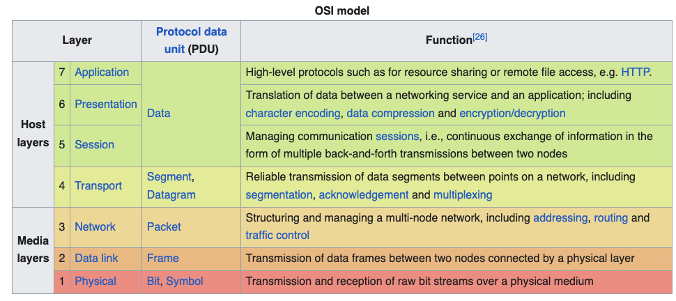
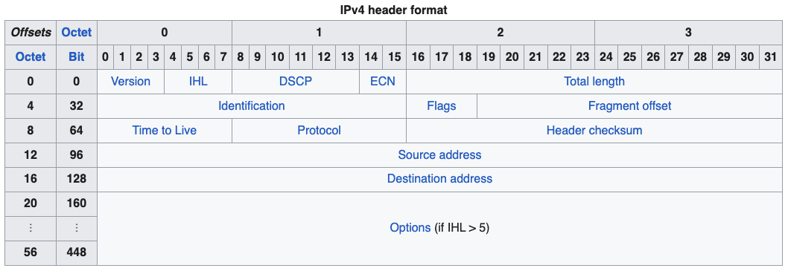
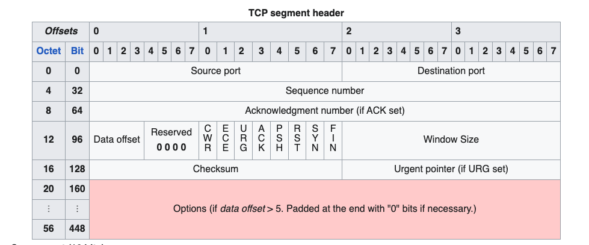
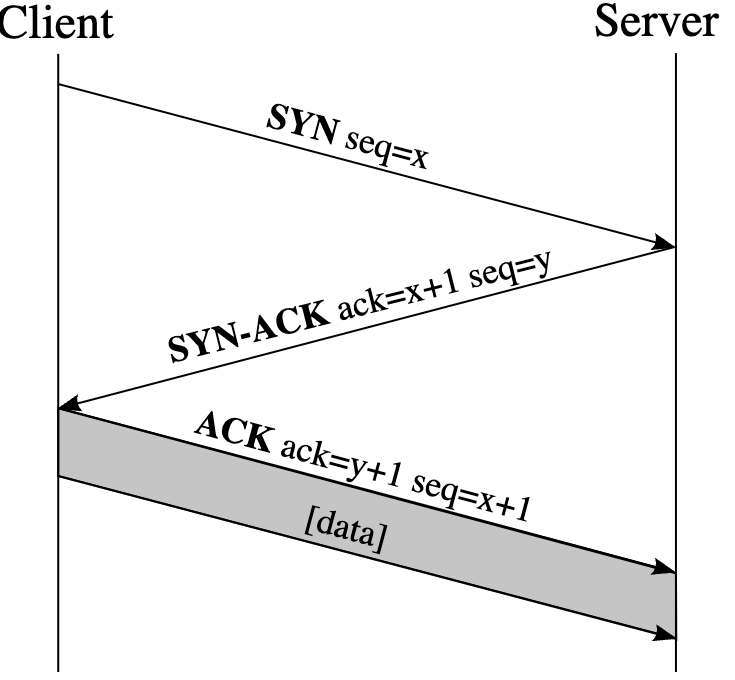
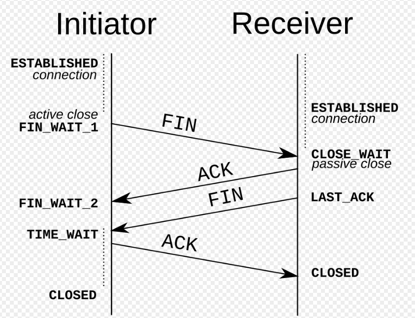
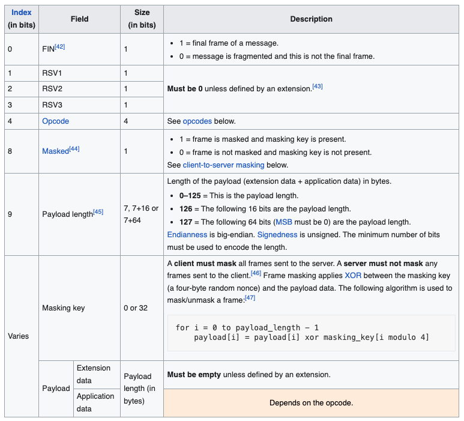
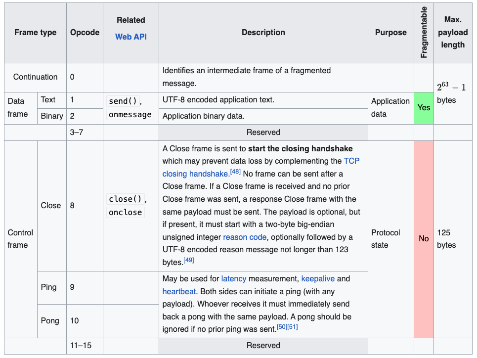

本文介绍常见网络协议的报文
<!--more-->

# OSI model


The open System interconnection model is a conceptual framework that divides network communication functions into seven layers.



## IP 

Internet Protocol packet structure is used for data transmission in computer networks




IP packet fields:

* Version(4 bits) 
* IHL internet header length (4 bits) HE-LEN-bytes = number * 4
* type of service (8 bits) 
* total length (16 bits) total length of ip packet from minimum 20 bytes to maximum 65535 bytes
* identification if the ip package is fragmented then each fragmented packet will use the same 16 bit identification number to identify to which IP packet they belong to
* IP flags(3 bits)
  1. always 0
  2. don't fragment bit
  3. more fragment bit set on all fragmented packets except for the last one.
* fragment offset (13 bits)  specify the position of the fragment in the original fragmented ip packet. all fragment length must be multiply of 8
* time-to0live(8 bits) everytime an ip packet passes through a router, this field is decremented by 1. once it hits 0 , the router will drop the packet and sends an icmp exceeded message to sender.
* protocol(8 bits) which protocol is encapsulated in the IP packet tcp 6 udp 17
* header checksum (16 bits) header checksum
* source address(32 bits)
* destination address (32 bits)
* ip option variable length

## TCP

Transmission Control Protocol is a communications standard that enables application programs and computing devices to exchange message over a network. It is designed to send packets across the internet and ensure the successful delivery of data and messages over networks.


* Source Port (16 bits)
* Destination Port (16 bits)
* Sequence Number (32 bits) ensures the data is received in proper order by ordered segmenting and reassembling them at the receiving end.
* Acknowledgement Number (32 bits) if ACK flag is set then the value of this field is the next sequence number that the sander of ACK is expecting. 
* Data offset (4 bits) specify the size of TCP header in 32-bit words.
* reserved(4 bits)
* flag(8 bits)
  1. congestion window reduced (CWR)
  2. ECN-Echo
  3. URG urgent pointer field 
  4. ACK Acknowledgement field
  5. PSH Push function. Asks to push the buffered data to the receiving application.
  6. RST reset the connection.
  7. SYN Synchronize sequence numbers.
  8. FIN last packet from sender
* Window Size (16 bits) the size of the receive window, which specifies the number of window size units that the sender of this segment is currently willing to receive
* CheckSum(16 bits) error checking of tcp header
* Urgent pointer(16 bits) if the URG is set, then this field is an offset from the sequence number indicating the last urgent data byte.
* Options (Variable 0-320 bits, in units of 32 bits)
  1. maximum segment size (4 bytes) 
  2. window scale (3 bytes)

### TCP connection



### Conditions under which a TCP connection is terminated

TCP recovers from transient segment loss by retransmission while the connection remains in `ESTABLISHED`. Termination occurs only when (1) either endpoint completes an orderly or abortive close, or (2) the local TCP implementation determines that the peer is no longer reachable within its retransmission or keepalive policy.

A single discarded IP datagram is therefore not equivalent to connection failure. Connection failure is a transport-layer decision based on sustained non-acknowledgement, an explicit control segment (`FIN` / `RST`), or local/remote policy.

#### Recovery that preserves the connection

| Condition | TCP behavior |
|-----------|--------------|
| Isolated loss or reordering | Retransmission and reassembly; connection remains `ESTABLISHED` |
| Transient congestion within retransmission limits | Retransmission with RTO backoff; congestion window may decrease |
| Short path interruption if acknowledgements resume before give-up | Connection may remain `ESTABLISHED` |

#### Explicit termination

| Mechanism | Semantics |
|-----------|-----------|
| `FIN` | Orderly close: each side ceases sending after delivering remaining data according to the closing handshake |
| `RST` | Abortive close: the connection control block is discarded; unacknowledged data is not guaranteed to be delivered |
| Application `close()` or process termination | The local stack emits `FIN` or `RST` according to connection state and whether unread data remains |
| Middlebox-generated `RST` | Observed by the endpoint as a peer reset; the connection is aborted |

#### Path failure elevated to connection abort

The following conditions convert prolonged network disruption into connection termination:

| Cause | Outcome |
|-------|---------|
| Exhaustion of retransmission attempts | After unanswered retransmissions under RTO backoff, the implementation aborts the connection; the application typically observes a timeout or write error (e.g. `ETIMEDOUT`, `EPIPE`) |
| Keepalive failure | With `SO_KEEPALIVE` (or an equivalent probe), unanswered keepalive probes cause the connection to be closed as dead |
| Persistent unreachability (link or routing loss) | Retransmissions fail until the same give-up threshold; some implementations abort earlier on hard ICMP errors |
| Half-open connection after peer crash | The surviving endpoint may remain `ESTABLISHED` until it transmits data or a keepalive and receives no acknowledgement (or receives `RST` if the peer port is closed) |
| Local or intermediary policy | Local limits (e.g. retry caps comparable to Linux `tcp_retries2`), firewall rules, or idle timeouts on NAT or load balancers remove state; subsequent segments fail or elicit `RST` |

```text
IP datagram loss          -> retransmission; connection usually retained
Sustained non-ACK         -> RTO give-up or keepalive failure -> abort
Peer FIN / RST            -> orderly close or abort
```

#### Application-visible consequences

After abort or close completes, further I/O on the socket fails. Data that was buffered locally and never acknowledged is not reliable delivery. A subsequent `connect()` establishes a **new** TCP connection with new sequence-number state; it does not resume the prior session. Application protocols layered on TCP (HTTP, WebSocket, MQTT, Redis RESP, and others) must reconnect and re-establish their own session semantics.

```text
Endpoint A  <--- TCP connection --->  Endpoint B
                      |
            path unusable beyond retry/keepalive budget
                      |
            local abort (or RST received)
                      |
            application I/O error; new handshake required for recovery
```

#### Parameters that govern detection latency

Defaults below are the common **Linux** values (`sysctl` / `tcp(7)`). Other operating systems use different names and defaults.

| Parameter | Linux default | Approximate effect on detection |
|-----------|---------------|----------------------------------|
| `net.ipv4.tcp_retries2` | `15` | Unanswered retransmissions on an established connection before abort. With exponential RTO backoff this is typically on the order of **~13–30 minutes** (depends on the current RTO), not seconds. |
| `net.ipv4.tcp_keepalive_time` | `7200` s (2 h) | **System default** idle time before the first keepalive probe, used when `SO_KEEPALIVE` is on and the application has **not** set `TCP_KEEPIDLE`. Applications may override this per socket (Redis does; see below). |
| `net.ipv4.tcp_keepalive_intvl` | `75` s | System default interval between subsequent keepalive probes (also overridable per socket via `TCP_KEEPINTVL`). |
| `net.ipv4.tcp_keepalive_probes` | `9` | System default probe count before abort (overridable via `TCP_KEEPCNT`). With untouched defaults, worst-case idle detection ≈ `7200 + 75 × 9` = **7875 s (~2 h 11 min)**. |

**Per-socket override (example: Redis).** Redis `tcp-keepalive` (default **300** in `redis.conf`) calls `anetKeepAlive`, which enables `SO_KEEPALIVE` and sets `TCP_KEEPIDLE = 300`, `TCP_KEEPINTVL = 100` (interval/3), `TCP_KEEPCNT = 3` on that fd—explicitly replacing the 7200 s system idle default for Redis client connections. Detection on those sockets is therefore on the order of a few minutes, not two hours. The `anet.c` comment notes that the OS defaults are otherwise too long to be useful.

| NAT / load-balancer idle timeout | Implementation-defined (often **30 s–5 min** for TCP; highly variable) | Mapping removed while the application is idle; the next send fails or receives `RST`. Frequently **shorter** than Linux keepalive defaults, so middleboxes often fail the path before kernel keepalive does. |
| Application-level heartbeat | None in TCP; set by the protocol or client library | Detects failure on the order of the heartbeat interval (seconds to tens of seconds is common), independent of kernel keepalive. |

Keepalive probes are sent only when the socket option is enabled; many applications never enable `SO_KEEPALIVE` and instead rely on their own heartbeat or on the next write hitting retransmission give-up (`tcp_retries2`).

**Conclusion.** Transient network errors are absorbed by retransmission. Connection drop results from sustained non-acknowledgement, explicit `FIN`/`RST`, or operating-system and middlebox policy—not from an individual lost packet.

## WebSocket

WebSocket provides simultaneous two-way communication channel over a single TCP connection. 
WebSocket handshake uses the HTTP Upgrade header to change from the HTTP protocol to the WebSocket protocol.


### Opening handshake

Example Request
```
GET /chat HTTP/1.1
Host: server.example.com
Upgrade: websocket
Connection: Upgrade
Sec-WebSocket-Key: x3JJHMbDL1EzLkh9GBhXDw==
Sec-WebSocket-Protocol: chat, superchat
Sec-WebSocket-Version: 13
Origin: http://example.com
```

Example Response

```

HTTP/1.1 101 Switching Protocols
Upgrade: websocket
Connection: Upgrade
Sec-WebSocket-Accept: HSmrc0sMlYUkAGmm5OPpG2HaGWk=
Sec-WebSocket-Protocol: chat

```

### Frame-based message

Client and Server can send data messages(text or binary) and control messages(close, ping, pong) to each other. A message is composed of one or more frames.

Fragmentation allows a message to be split into two or more frames. It enables sending messages with initial data available but complete length unknown. Without fragmentation, the whole message must be sent in one frame, so the complete length is needed before the first byte can be sent, which requires a buffer.


#### Frame Structure
Unfragmented message `FIN = 1` and `opcode` $\neq$ `0`
fragmented message 
1. first frame `FIN = 0` and `opcode` $\neq$ `0`
2. zero or more frames `FIN = 0` and `opcode = 0`
3. final frame `FIN = 1` and `opcode = 0`



#### Opcodes




## TLS
Transport Layer Security is a cryptographic protocol designed to provide communications security over a computer network.
TLS works as upgrade and substitution of SSL.


## MQTT

MQTT is a lightweight, publish-subscribe, machine to machine network protocol. originally developed by IBM to monitor oil pipelines.


### Data representation
* Bits 
* Two Byte Integer
