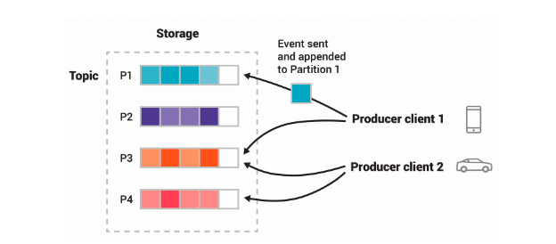

Kafka is an open-source distributed event streaming platform 

<!--more-->
# Concept

`Servers`     Kafka is run as a cluster of one or more services that can span multiple data centers or cloud regions.

`Brokers`     one type of server, form the storage layer, store partitions 

`Clients`     allow one to read, write and process streams of events

`Event`       records the fact that something happened

`Producer`    Client application that publish(write) events to kafka

`Consumer`    client applications that subscribe to (read and process) these events.

`Topics`      Events are organized and durably stored in topics.

`Partition`   Topics are partitioned, spread over a number of buckets located on different kafka brokers



# Network

Kafka Uses a binary protocol over TCP. The protocol defines all API as request response message pairs. All messages are size delimited and are made up of the following primitive types

```
Boolean
int8...int64
varint
string
array
bytes
records
```

* Common Request and Response Structure
```
RequestOrResponse => Size (RequestMessage | ResponseMessage)
Size => int32
```
* Request Message Headers
```
Request Header v0 => request_api_key request_api_version correlation_id 
request_api_key => INT16
request_api_version => INT16
correlation_id => INT32


Request Header v1 => request_api_key request_api_version correlation_id client_id 
request_api_key => INT16
request_api_version => INT16
correlation_id => INT32
client_id => NULLABLE_STRING


Request Header v2 => request_api_key request_api_version correlation_id client_id TAG_BUFFER 
request_api_key => INT16
request_api_version => INT16
correlation_id => INT32
client_id => NULLABLE_STRING

Api_key defines api type
```
* Response Message Headers
```
Response Header v0 => correlation_id 
correlation_id => INT32

Response Header v1 => correlation_id TAG_BUFFER 
correlation_id => INT32


```
Other protocol formats can be found in [official doc](https://kafka.apache.org/protocol)


# Producer

`KafkaProducer` A Kafka client that publishes records to the kafka cluster.
  The Producer is thread safe and sharing a single producer instance across threads will generally be faster than having multiple instances
  The `send()` method is asynchronous. When called, it adds the record to a buffer of pending record sends and immediately return.

`RecordAccumulator` acts as a queue that accumulates records into `MemoryRecords`


```plantuml
interface Producer<K, V> extends Closeable {
  Future<RecordMetadata> send(ProducerRecord<K, V> record)
  void flush()
}
class KafkaProducer<K, V> implements Producer {
    ProducerConfig producerConfig
    ProducerMetadata metadata
    RecordAccumulator accumulator
    Sender sender
    Thread ioThread
    Serializer<K> keySerializer
    Serializer<V> valueSerializer
    ProducerInterceptors<K, V> interceptors
}

class RecordAccumulator {
}

class Sender implements Runnable {
  KafkaClient client
  RecordAccumulator accumulator
  ProducerMetadata metadata
  TransactionManager transactionManager
}

class KafkaThread extends Thread 

class BufferPool

interface KafkaClient {
  boolean isReady(Node node, long now)
  boolean ready(Node node, long now)
  void send(ClientRequest request, long now)
  List<ClientResponse> poll(long timeout, long now)
  void wakeup()
  void disconnect(String nodeId)
  void close(String nodeId)
}

class NetworkClient implements KafkaClient {
  Selectable selector
  MetadataUpdater metadataUpdater
  ClusterConnectionStates connectionStates
  InFlightRequests inFlightRequests
}

interface Selectable {
  void send(NetworkSend send)
  void wakeup()
  void poll(long timeout)
}

class Selector implements Selectable {
  Selector nioSelector
  Map<String, KafkaChannel> channels
}

class ProducerMetadata {
  Map<String, Long> topics
  Set<String> newTopics
}

KafkaProducer o-- RecordAccumulator
KafkaProducer o-right- KafkaThread: ioThread
KafkaThread o-- Sender
RecordAccumulator o-- BufferPool
Sender o-- KafkaClient
NetworkClient o-- Selectable
KafkaProducer *-- ProducerMetadata
```

## Metadata

`Metadata` A class encapsulating some of the logic around metadata.
This class is shared by the client thread(for partitioning) and the background sender thread.

`Metadata` is maintained for only a subset of topics, which can be added to over time. 

`MetadataSnapshot` An internal immutable snapshot of nodes, topics, and partitions in the kafka cluster. 

```plantuml
class Metadata implements Closeable {
  MetadataSnapshot metadataSnapshot
  List<InetSocketAddress> bootstrapAddresses
  int updateVersion
  int requestVersion
  long lastRefreshMs
}

class MetadataSnapshot {
  - unauthorizedTopics: Set<String>
  - clusterInstance: Cluster
  - metadataByPartition: Map<TopicPartition, PartitionMetadata>
  - invalidTopics: Set<String>
  - topicNames: Map<Uuid, String>
  - nodes: Map<Integer, Node>
  - clusterId: String
  - topicIds: Map<String, Uuid>
  - controller: Node
  - internalTopics: Set<String>
}

class Cluster {
  List<Node> nodes
  Node controller
  Map<TopicPartition, PartitionInfo> partitionsByTopicPartition
  Map<String, List<PartitionInfo>> partitionsByTopic
  Map<Integer, List<PartitionInfo>> partitionsByNode
  Map<Integer, Node> nodesById
  ClusterResource clusterResource
  Map<String, Uuid> topicIds
  Map<Uuid, String> topicNames
}

class ProducerMetadata {
  Map<String, Long> topics
  Set<String> newTopics
}

Metadata o-- MetadataSnapshot
MetadataSnapshot o-- Cluster
Metadata <|-right-  ProducerMetadata
```


## Producer Configs
* `batch.size`
  Producer will attempt to batch records together into fewer requests whenever multiple records are being sent to the same partition. This setting gives the upper bound of the batch size to be sent.
* `linger.ms`
  The producer groups together any records that arrive in between request transmissions into a single batched request. This setting gives the upper bound on the delay for batching.
* `retry.backoff.ms`
  the amount of time to wait before attempting to retry a failed request to a given topic
* `retry.backoff.max.ms`
  The maximum amount of time in milliseconds to wait when retrying a request to the broker that has repeatedly failed
* `reconnect.backoff.ms`
* `reconnect.backoff.max.ms`


# Server


```plantuml
class KafaRaftServer {
  SharedServer sharedServer
  Option[BrokerServer] broker
  Option[ControllerServer] controller
  startup()
  shutdown()
}


class BrokerServer {
  SharedServer sharedServer
  KafkaRaftManager[ApiMessageAndVersion] raftManager
  BrokerLifecycleManager lifecycleManager
  AssignmentsManager assignmentsManager
  KafkaApis dataPlaneRequestProcessor
  SocketServer socketServer
  KafkaRequestHandlerPool dataPlaneRequestHandlerPool
  Option[RemoteLogManager] remoteLogManagerOpt
  ReplicaManager _replicaManager
  GroupCoordinator groupCoordinator
  TransactionCoordinator transactionCoordinator
  NodeToControllerChannelManager clientToControllerChannelManager
  AutoTopicCreationManager autoTopicCreationManager
  KafkaScheduler kafkaScheduler
  KRaftMetadataCache metadataCache
}

class SharedServer {
  KafkaConfig brokerConfig
  KafkaConfig controllerConfig
  MetadataLoader loader
  SnapshotEmitter snapshotEmitter
  SnapshotGenerator snapshotGenerator
}

class ControllerServer {
  SharedServer
  KafkaConfigSchema
  BootstrapMetadata
  

}

class SocketServer {
  dataPlaneAcceptors
  dataPlaneRequestChannel
  memoryPool
  controlPlaneAcceptorOpt
  connectionQuotas
} 


KafaRaftServer *-- BrokerServer
KafaRaftServer *-- SharedServer
KafaRaftServer *-- ControllerServer
BrokerServer *-- SocketServer


```

## SharedServer
`SharedServer` manages the components which are shared between the BrokerServer and ControllerServer. 
The shared components include the Raft manager, snapshot generator, and metadata loader.
A KRaft server running in combined mode as both a broker and a controller will still contain only a single SharedServer instance. 

## BrokerServer
A broker is responsible for
* Storing message data
* serving producer and consumer requests
* managing partitions and replicas

### SocketServer
Handles new connections, requests and responses to and from broker.

* data-plane
  * handles requests from clients and other brokers in the cluster
  * thread model
    * 1 Acceptor thread per listener, multiple listeners can be configured in kafkaConfig
    * Acceptor has N processor threads that each have their own selector and read requests from sockets. M handler threads that handle requests and produce responses back to the processor threads for writing.
* control-plane
  * handles requests from controller. This is optional and can be configured by specifying `controller.listener.name` 
  * thread model
    * 1 Acceptor thread handles new connection
    * Acceptor has 1 processor thread that has its own selector and read requests from the socket
    * 1 Handler thread that handles requests and produces responses back to the processor thread for writing.

```plantuml
abstract class Acceptor extends Runnable {
  socketServer
  nioSelector
  serverChannel
  thread
  processors
  run()
}

class SocketServer {
  dataPlaneAcceptors
  controlPlaneAcceptorOpt
}


class DataPlaneAcceptor extends Acceptor {

}
class controlPlaneAcceptorOpt extends Acceptor

class Processor {
  thread
  selector
  requestChannel
  newConnections
  responseQueue
  accept(socketChannel)

}

class Selector {
  nioSelector
  completedReceives
  completedSends
  channels
}

class  KafkaChannel {
  NetworkReceive receive
  NetworkSend send
  TransportLayer transportLayer
}

class RequestChannel {
  requestQueue
  processors
  callbackQueue
}

class BrokerServer {
  dataPlaneRequestHandlerPool
  groupCoordinator
  socketServer
  KafkaApis dataPlaneRequestProcessor
}

class KafkaRequestHandlerPool {
  requestChannel
}

class KafkaRequestHandler extends Runnable {
  requestChannel
  ApiRequestHandler apis
  void run()
}

class KafkaApis extends ApiRequestHandler {

}

SocketServer o-- DataPlaneAcceptor
SocketServer *-- controlPlaneAcceptorOpt
Acceptor *-- Processor
Processor *-- Selector
Selector *-- KafkaChannel
SocketServer *-- RequestChannel
BrokerServer *-- SocketServer
BrokerServer *-- KafkaRequestHandlerPool
KafkaRequestHandlerPool o-- KafkaRequestHandler
KafkaRequestHandler *-- RequestChannel
Processor *-- RequestChannel
KafkaRequestHandler *-- ApiRequestHandler
```


## ControllerServer
Controller server is responsible for:
* Managing the overall state of the kafka cluster
* Electing partition leaders
* Handling administrative operations


# security

## SASL

Simple Authentication and Security Layer(SASL) is a framework for authentication and data security in internet protocols. It decouple authentication mechanisms from application protocols.

### 