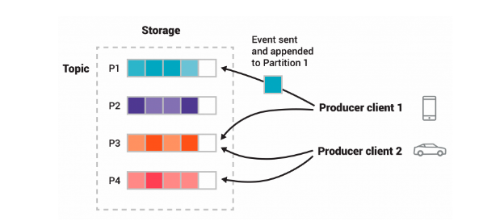

Kafka is an open-source distributed event streaming platform 
<!--more-->

# Concept

Servers     Kafka is run as a cluster of one or more services that can span multiple data centers or cloud regions.

Brokers     one type of server, form the storage layer, store partitions 

Clients     allow one to read, write and process streams of events

Event       records the fact that something happened

Producer    Client application that publish(write) events to kafka

Consumer    client applications that subscribe to (read and process) these events.

Topics      Events are organized and durably stored in topics.

Partition   Topics are partitioned, spread over a number of buckets located on different kafka brokers

