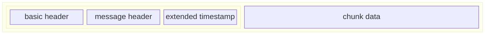

Real time messaging Protocol was a communication protocol for streaming audio, video and data over the internet with low-latency.
<!--more-->


# RTMP Chunk Stream

RTMP Chunk Stream  provides multiplexing and packetizing services for a higher-level multimedia


## HandShake

C0    version  
C1    time as epoch
C2    nearly same as C1

```plantuml

Client --> Server:C0
Server --> Client:S0
Client --> Server:C1
Server --> Client:S1
Client --> Server:C2
Server --> Client:S2

```

## Chunking

Basic header     1 to 3 bytes depends on the chunk stream Id , which is a variable -length field
Message Header   

1. timestamp        3 bytes
2. message length   3 bytes
3. message type id  1 byte
4. msg stream id    4 bytes

Message header format:
1. 11 bytes complete
2. 7 bytes  stream id not included, which is same with preceding chunk
3. 3 bytes  only timestamp delta, others same with preceding chunk
4. 0 byte   message header same with preceding chunk


Protocol Control Messages:
1. Set Chunk Size       1
2. Abort message        2
3. Acknowledgement      3
4. window ack size      5
5. set bandwidth        6



# RTMP Message

RTMP messages transferred between entities on a network using a lower level transport layer, such as RTMP Chunk stream.

While RTMP was designed to work with RTMP Chunk Stream, it can send the message using any other transport protocol.


