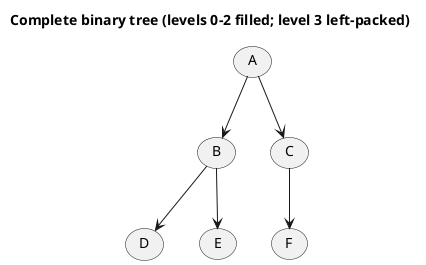
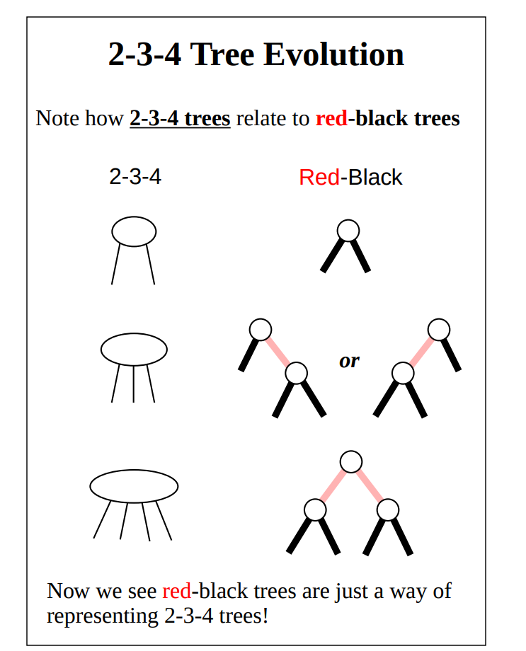
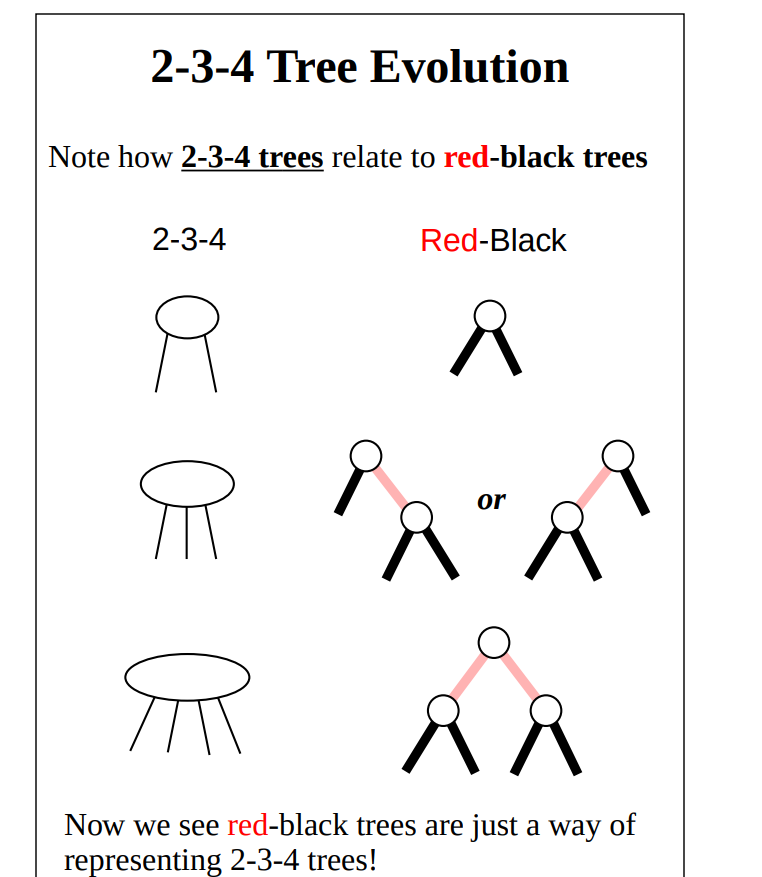
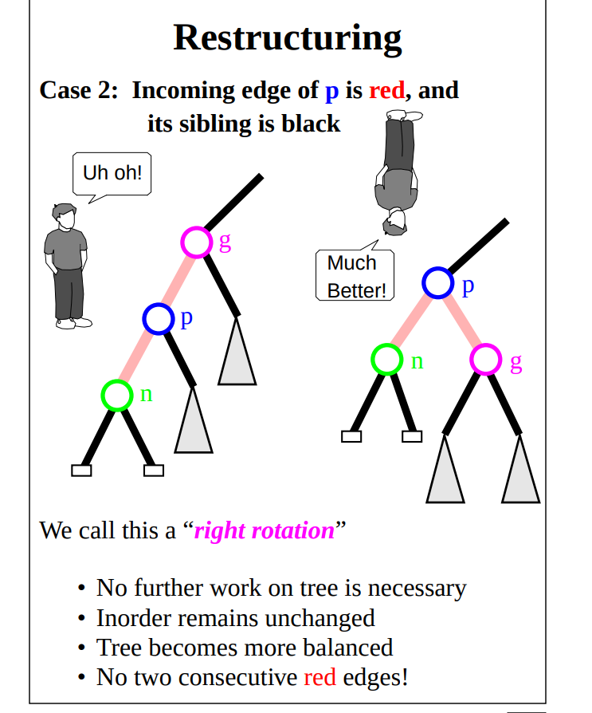
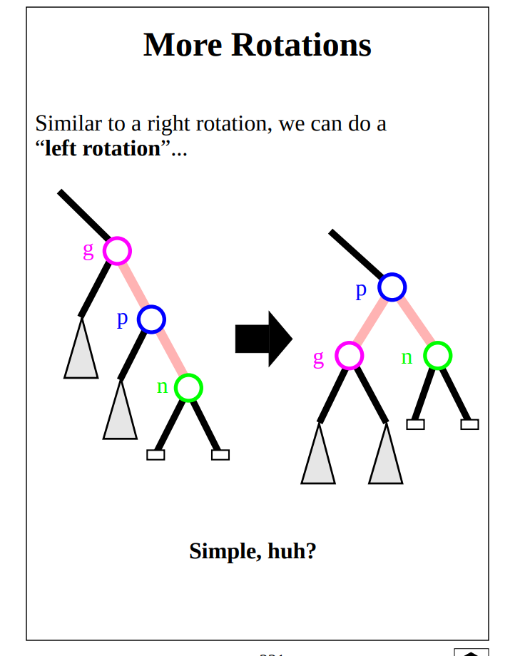
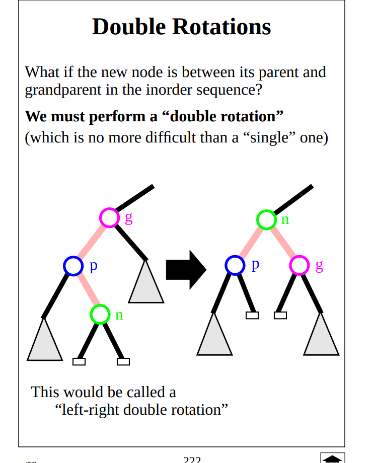

Trees are hierarchical structures in which each node has a parent (except the root) and zero or more children. This article records the principal binary-tree variants, their defining properties, array-based layouts, and typical applications — including the complete binary tree backing a binary heap and the red-black tree used in `TreeMap`, `TreeSet`, and `HashMap` tree bins.
<!--more-->

---

## 1. Binary tree

A **binary tree** is a tree in which every node has at most two children, designated **left** and **right**. The **root** has no parent; **leaves** have no children. The **height** of a node is the number of edges on the longest downward path to a leaf; the **depth** of a node is its distance from the root.

```plantuml
@startuml
title Complete binary tree (levels 0–2 filled; level 3 left-packed)

usecase A
usecase B
usecase C
usecase D
usecase E
usecase F

A --> B
A --> C
B --> D
B --> E
C --> F
@enduml
```

### 1.1 Complete binary tree

A **complete binary tree** satisfies:

1. It is a binary tree.
2. Every level except possibly the last is completely filled.
3. All nodes in the last level occupy the leftmost positions — there are no gaps to the left of any node on that level.

A complete binary tree with $n$ nodes admits a **compact array representation** with no pointers: level-order (breadth-first) indexing starting at index $0$.

| Relation | Index formula (0-based, root at $0$) |
|----------|--------------------------------------|
| Parent of node $i$ | $\lfloor (i - 1) / 2 \rfloor$ |
| Left child of node $i$ | $2i + 1$ |
| Right child of node $i$ | $2i + 2$ |

The array length is typically sized to the next power of two minus one, or grown dynamically as in `ArrayList`-backed heaps. Empty slots may appear only at the end of the array when the tree is not a perfect power-of-two size.

#### Binary heap

A **binary heap** is a complete binary tree stored in an array, subject to a **heap-order property**:

| Heap type | Property |
|-----------|----------|
| **Min-heap** | Each node's key $\leq$ keys of its children; minimum at root |
| **Max-heap** | Each node's key $\geq$ keys of its children; maximum at root |

Index arithmetic in implementations such as `PriorityQueue` and `PriorityBlockingQueue` uses unsigned shifts for the parent index:

| Relation | Expression |
|----------|------------|
| Parent of $k$ | `(k - 1) >>> 1` |
| Left child of $k$ | `(k << 1) + 1` |
| Right child of $k$ | Left index $+ 1$ |

Insertion appends at the end of the array (next leaf position in the complete tree), then **sifts up**; removal of the extremum swaps the root with the last element and **sifts down**. Both operations are $O(\log n)$ in the number of elements.

### 1.2 Binary search tree

A **binary search tree (BST)** — also called an **ordered binary tree** — satisfies:

1. It is a binary tree.
2. For every node $x$, all keys in the left subtree are strictly less than $\text{key}(x)$ (or less than or equal, depending on convention).
3. For every node $x$, all keys in the right subtree are strictly greater than $\text{key}(x)$.

Search, insert, and delete follow a single root-to-leaf path when comparisons are $O(1)$. In the **average** case over random insertions, height is $O(\log n)$. In the **worst** case (e.g. sorted insertion into an unbalanced BST), height degrades to $O(n)$.

#### Balanced search trees

A **balanced BST** maintains the BST ordering invariant while bounding height. For $n$ keys, height is guaranteed $O(\log n)$, so search, insert, and delete remain $O(\log n)$ worst-case. Common implementations include AVL trees, red-black trees, and B-trees (the latter for disk-oriented storage).

### 1.3 Red-black tree

A **red-black tree** is a BST augmented with one bit of color per node. It satisfies the following **invariants** (CLRS formulation):

1. Every node is either **red** or **black**.
2. The root is black.
3. Every leaf (NIL sentinel) is black.
4. If a node is red, both its children are black — no two consecutive red edges on a root-to-leaf path.
5. For each node, all simple paths from that node to descendant leaves contain the same number of black nodes — **black-height** is well-defined.

**Consequence of (4) and (5).** A node with exactly one non-NIL child cannot attach a black child: the child's NIL descendants would have a different black count than the missing child's NIL, violating (5). The sole child must therefore be red (and the parent black).

Height is at most $2 \log_2(n + 1)$, yielding $O(\log n)$ search, insert, and delete. Red-black trees perform fewer rotations on average than AVL trees while still maintaining logarithmic height; JDK `TreeMap`, `TreeSet`, and `HashMap` tree bins use this structure.

A red-black tree can be viewed as the binary-tree encoding of a **2-3-4 tree**: red links group nodes into logical 3-nodes and 4-nodes.

#### Insertion fix-up

Insertion places a new leaf as **red**, then restores invariants by recoloring and/or rotating on the path to the root. Let $z$ be the inserted node, $p$ its parent, $g$ its grandparent, and $u$ its uncle ($p$'s sibling). Three cases cover all configurations (Purdue CS 251, [lecture slides](https://www.cs.purdue.edu/homes/ayg/CS251/slides/chap13b.pdf)):

| Case | Condition | Action |
|------|-----------|--------|
| **1 — Recolor** | $u$ is red | Recolor $p$ and $u$ black, $g$ red; continue fix-up from $g$ |
| **2 — Single rotation** | $u$ is black; $z$ and $p$ are both left children or both right children of $g$ | Rotate at $g$; recolor; root black |
| **3 — Double rotation** | $u$ is black; $z$ is an inner child (left-right or right-left) | Rotate at $p$, then rotate at $g$; recolor; root black |

**Case 1 — no rotation**

**Case 2 — single rotation** ($z$ and $p$ on the same side of $g$; uncle black)

**Case 3 — double rotation** ($z$ between $p$ and $g$)

Deletion fix-up mirrors insertion with additional cases when the removed node was black; the JDK `TreeMap` implementation encodes both insert and delete rebalance in `balanceInsertion` and `balanceDeletion`.

---

## Summary

| Structure | Defining constraint | Storage | Typical use |
|-----------|---------------------|---------|-------------|
| Complete binary tree | Left-packed last level | Array, index formulas | Heap layout |
| Binary heap | Complete tree + heap order | Array | `PriorityQueue`, schedulers |
| BST | Left $<$ node $<$ right | Pointers or array | Ordered map (unbalanced) |
| Red-black tree | BST + five color invariants | Pointers | `TreeMap`, `TreeSet`, `HashMap` bins |
