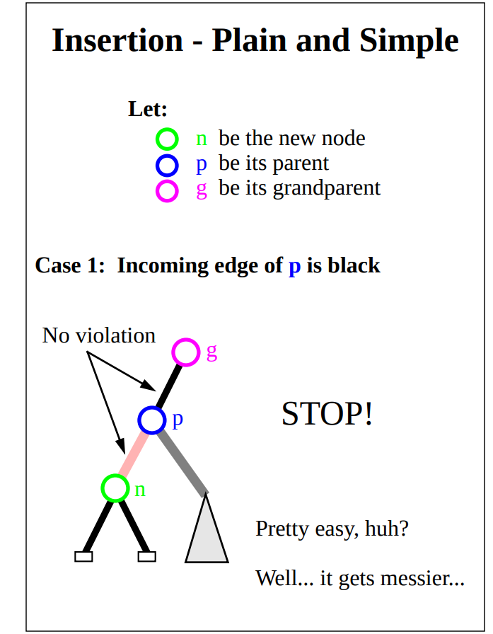

# 1. Binary tree 
each node has at most 2 child nodes called left node and right node.

## 1.1 Complete Binary Tree
definitions:
   1. binary tree
   2. every level is completely filled except the last level
   3. all nodes in the last level are as far left as possible
   
Complete Binary tree can be stored in array 
1. root node is arr[0]
2. for the ith node
   1. parent node arr[(i-1)/2]
   2. left child node arr[(2*i)+1]
   3. right child node arr[(2*i)+2]


```plantuml
title complete binary tree
usecase A
usecase B
usecase C
usecase D
usecase E
usecase F

A --> B
A --> C
B --> D
B --> E
C --> F

```

### 1.1.1 Balanced Binary Heap
Based on completed binary tree, usually backed by array, used in PriorityBlockingQueue
for index K 
1. parent index `(k-1)>>>1`
2. left child `(k<<<1)+1`
3. right child `left+1`

## 1.2 Binary Search Tree
BST, or binary sorted tree
1. binary tree
2. key of each node is greater than the keys of left subtree
3. key of each node is smaller than the keys of right subtree

### 1.2.1 Balanced Search Tree
1. Binary Search Tree
2. for height balanced tree the height of n items is guaranteed to be `o(logn)`


## 1.2.2 Red Black Tree
1. binary search tree
2. every node is either red or black
3. all NIL nodes are considered black
4. A red node does not have a red child
5. Every path from a given node to any of its descendant NIL nodes goes through same number of black nodes
6. if a node N has exactly one child, it must be a red child, because if it were black, its NIL descendants would sit at a different black depth than N's NIL child. violation 5
   
red black tree can be seen as the binary representation of 2-3-4 tree


Insertion types：
1. no rotation
   
2. left or right rotation, grandpa and parent is red,uncle is black. new node same direction with parent.
   
   
3. double rotation new node is between grandpa and parent
   


