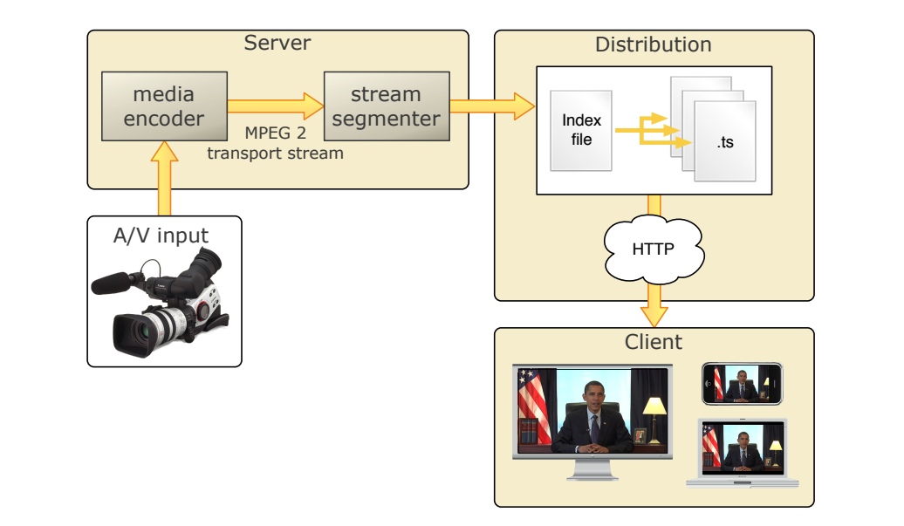

Http live Streaming was originally developed by Apple, now become a international standard.
<!--more-->

# HTTP Streaming Architecture



In typical configuration, videos are encoded and then broke into a series of short media files by segmenter.
The segmenter also creates and maintains an index file containing a list of media files.

## Segmenter

### index file 
index file saved as `.M3U8` files, an extension of the `.m3u` format used for MP3 playlists.
example:
```
#EXTM3U
#EXT-X-MEDIA-SEQUENCE:0
#EXT-X-TARGETDURATION:10
#EXTINF:10,
http://media.example.com/segment1.ts
#EXTINF:10,
http://media.example.com/segment2.ts
#EXTINF:10,
http://media.example.com/segment3.ts
#EXT-X-ENDLIST
```

### media segment
media segment saved as `.ts` files containing segments of an MPEG-2 Transport Stream.

## distribution 

The distribution system is a web server or a web caching system that delivers the media files and index files to the client over HTTP. Typically configuration is limited to specifying MIME-type association for `.M3U8` files and `.ts` files.

| File extension |       MIME type       |
| :------------: | :-------------------: |
|     .M3U8      | application/x-mpegURL |
|      .ts       |      video/MP2T       |


## client
Client begins by fetching the index file, based on a URL identifying the stream. The index file in turn specifies the location of the available media files, decryption keys, and any alternate streams available. For the selected stream, the client downloads each available media file in sequence.

# Usage

## Session Types
HLS supports live broadcast sessions and video on demand (VOD) sessions.

For live sessions, as new media files are created and made available the index file is updated. The index file contains X latest segments.

For VOD sessions, the index file is static and contains a complete list of all files created since the beginning of the presentation.

## Content protection

Media files containing stream segments may be individually encrypted.When encryption is employed , references to the corresponding key files appear in the index file so that the client can retrieve the keys for decryption.

## stream alternatives
Index files may reference alternate streams of content. References can be used to support delivery of multiple streams of the same content with varying quality levels for different bandwidths or devices.

```
#EXTM3U
#EXT-X-STREAM-INF:PROGRAM-ID=1, BANDWIDTH=200000
http://ALPHA.mycompany.com/lo/prog_index.m3u8
#EXT-X-STREAM-INF:PROGRAM-ID=1, BANDWIDTH=200000
http://BETA.mycompany.com/lo/prog_index.m3u8
#EXT-X-STREAM-INF:PROGRAM-ID=1, BANDWIDTH=500000
http://ALPHA.mycompany.com/md/prog_index.m3u8
#EXT-X-STREAM-INF:PROGRAM-ID=1, BANDWIDTH=500000
http://BETA.mycompany.com/md/prog_index.m3u8
```


