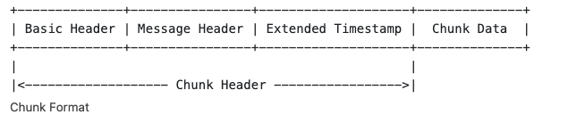
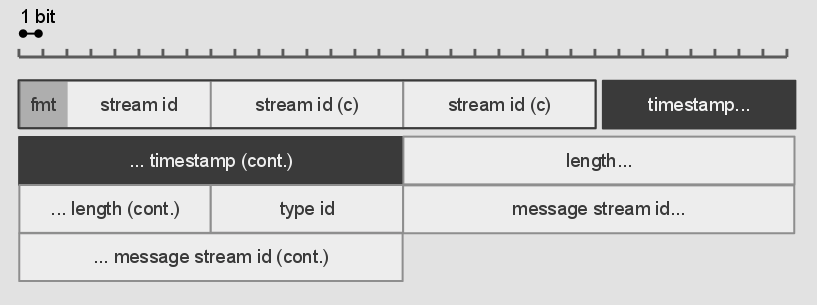
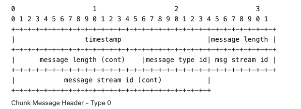
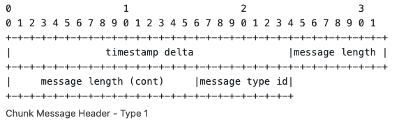
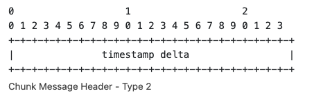
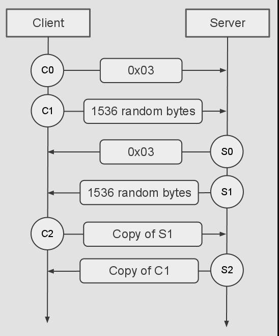

Real time messaging Protocol was a communication protocol for streaming audio, video and data over the internet with low-latency.
<!--more-->

# RTMP Chunk Stream

## Chunk Format
Each chunk consists of a header and data. The header itself has three parts:

Basic Header:
    1. fmt (2 bits) chunk type 4 types
    2. Chunk stream ID (1 -3 bytes) support up to 65535+64 streams

Chunk Message Header depends on the fmt of basic header.

    * timestamp delta (3 bytes) difference between the previous chunk's timestamp and the current trunk's timestamp
    * message length (3 bytes) length of the message
    * message type id (1 byte) type of the message
    * message stream id (4 bytes) chunk stream reuse to send new message stream.
    * extended timestamp (4 bytes) only used when timestamp can not fit into the 24 bits field.

type 0 chunk headers are 11 bytes long. This type MUST be used at the start of a chunk stream, and whenever the stream timestamp goes backward.

type 1 chunk headers are 7 bytes long. The message stream ID is not included; this chunk takes the same stream ID as the preceding chunk.

type 2 chunk headers are 3 byte long. Neither the stream id nor the message length is included. this chunk has the same stream ID and message length as the preceding chunk.

type 3 chunks has no message header. chunks of this type take values from preceding chunk for the same Chunk Stream ID.

## Protocol Control Messages
protocol control messages must have message stream ID 0 (control stream) and be sent in the chunk stream id 2. 
The message Type ID byte defines whether the packet contains audio/video data, a remote object or a command.

1. Set Chunk Size       1
2. Abort message        2
3. Acknowledgement      3
4. window ack size      5
5. set bandwidth        6

## User Control Messages

## HandShake

C0    version  
C1    time as epoch
C2    nearly same as C1

# RTMP Message

RTMP messages transferred between entities on a network using a lower level transport layer, such as RTMP Chunk stream.

While RTMP was designed to work with RTMP Chunk Stream, it can send the message using any other transport protocol.

